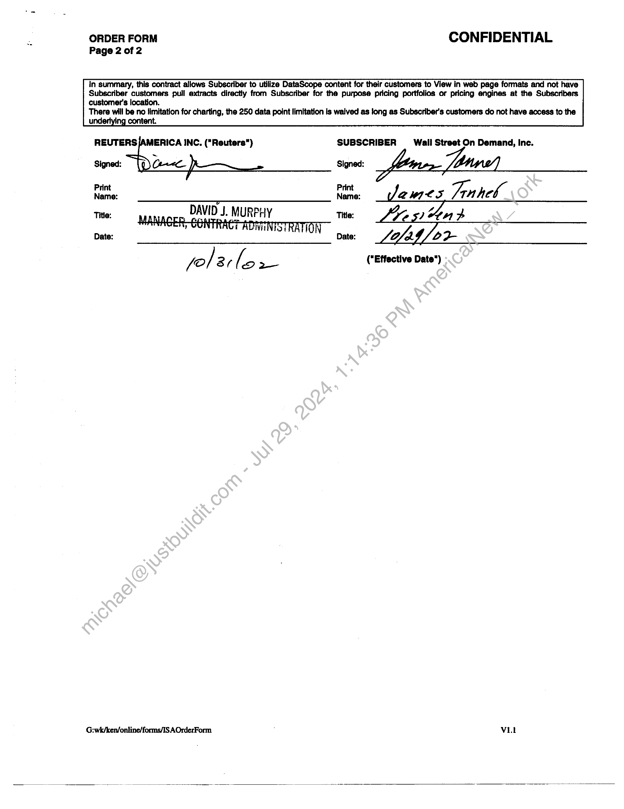

##### Master Services Agreement Initial Order Form]

  
````col
```col-md
flexGrow=.5
===
> [!info] [Page 1](_attachments/images_3.6.4.1.6.1WSOD_Reuters_Datascope_MasterAddendumandOF_20021031.pdf_155428/page_1.png)
> 
```  
```col-md
REUTERS : CONFIDENTIAL
Subscriber Wall Street On Demand  
Subscriber - -  
No. ——— REUTERS AMERICA INC.
MASTER SERVICES AGREEEMENT
INITIAL ORDER FORM  
By signing below, Subscriber agrees to subscribe to the Services subject to all of the terms and conditions set forth on this
Master Services Agreement initial order form, the attached Master Services Agreement Terms and Conditions ("Terms and
Conditions"), and all addenda, supplemental order forms (the initial order form and any supplemental order form being
known as the "Order Form") and schedules thereto (collectively, the “Agreement"). The Agreement shall form the entire
agreement between the parties regarding the Services, and supercedes all prior agreements, proposals or other
communications between the parties, oral or in writing, regarding the Services. .  
Name of Legal Entity Subscribing to Services ("Subscriber") State of Incorporation  
Wall Street On Demand :  
Subscriber's Principal Street Address City State Zip Code  
3005 Center Green Drive Boulder co 80301  
Subscriber's Contact Person for Notices Address Phone: 303-583-4334 E-mail  
Sofia Rossato 3005 Center Green Dr, Fax: 303-440-2982 Sofia.rossato @ wall
Boulder, CO, 80301 st.com  
Reuters Contact Person for Notices Address Phone: we
same : Fax: - e  
Subscriber's Billing Contact Name & Address
Heather Carter, 3005 Center Green Dr, Boulder, CO, 80301  
Premises
3005 Center Green Drive  
Commencement Date November 1, 2002  
Subscriber subscribes to the following services (each 2"Service"):  
Global History and Equity Day End Prices (inc, 9,000 75% $2,250
Indices, Exchange Warrants, Eq Opts) SMALL  
BUSINESS GROUP  
Global History and End of Day Corporate‘Actions — $1,500
inc. Changes  
Global End of Day Money Day End-Prices included
US End of Day Futures Day End Prices (inc. Options included  
on Futures)
Total Fees
Installation Charges: $:0  
Communication Charges: $ 0, none anticipated, if need , Subscriber pays cost  
Security Deposit: A-sacurity deposit ("Security Deposit") in the amount of zero will be paid by Subscriber upon the execution hereof.
This Security Deposit may be used, applied or retained by Reuters, in whole or in part, to the extent required for the payment of any Fees
or charges payable hereunder as to which Subscriber ts in default, or for any sum Reuters may expand or may be required to
expend by reason of the Subscriber's default hereunder. The balance of the Security Deposit, if any, will be retumed to Subscriber upon
the terminaiion of this Agreement after the retum of the Equipment and Software, if any to Reuters.  
All Fees sat out on this Order Form and any additional charges are exclusive of taxes, and are invoiced monthly or quarterly.  
“Qniine Application” means interfaces, reports and tools built and hosted by Subscriber and accessed by customers of Subscriber.  
“Limited Extract" means a discrete piece of data that is quantitatively and qualitatively substantially less than an entire article of RD
Information.  
Subscriber may permit access to RD Information at the Premises and use it to: (a) conduct automated or manual checking of reference or
pricing data to be used in Online Applications. (b) build an in-house database in order to access time-series data needed for Online
Applications. (c) conduct cross-checking against data from non-Reuters sources to be used in Online Applications. (d) use Limited
Extracts of RD Information on an ad-hoc basis In response to specific inquiries of customers of Subscriber made via Online Applications,
provided that (i) Limited Extracts are attributed to Reuters or, where applicable, the relevant Information Provider, (ii) DataScope/EJV
cannot be accessed via such Limited Extracts and (ili) further redistribution of Limited Extracts is prohibited.  
G:/wi/Forms/RSC&MSA Forms/US/msa-OrderForm(April01) V1.0  
```
````
Notes:    
````col
```col-md
flexGrow=.5
===
> [!info] [Page 2](_attachments/images_3.6.4.1.6.1WSOD_Reuters_Datascope_MasterAddendumandOF_20021031.pdf_155428/page_2.png)
> 
```  
```col-md
ORDER FORM CONFIDENTIAL
Page 2 of 2  
in summary, this contract allows Subscriber to utilize DataScope content for their customers to View in web page formats and not have
Subscriber customers pull extracts directly from Subscriber for the purpose pricing portfolios or pricing engines at the Subscribers  
customer's location.
There will be no fimitation for charting, the 250 data point limitation is waived as long as Subscriber's customers do not have access to the
content.  
REUTERS /AMERICA INC. ("Reuters") SUBSCRIBER Wall Street On Demand, Inc.  
Signed: Signed: loinc. - lone!)
Name: Name: BwWICS Tinheb
Tite: DAVID J. MURPHY Title: IZED y ap
Date: INTSTRATION Date: AAG / 2 2-  
yo/ ar [5 2 ("Effective Date")  
G:wk/ken/online/forms/IS AOrderForm ViL  
```
````
Notes:    
````col
```col-md
flexGrow=.5
===
> [!info] [Page 3](_attachments/images_3.6.4.1.6.1WSOD_Reuters_Datascope_MasterAddendumandOF_20021031.pdf_155428/page_3.png)
> 
```  
```col-md
REUTERS ‘3B "CONFIDENTIAL  
Subscriber Wall Street On  
Demand  
Subscriber No.  
Reuters DataScope/EJV Addendum  
This is an Addendum to the Master Services Agreement between Reuters America Inc. and Wall Street On Demand,
Inc.("Subscriber") dated the 1" day of. November {as amended, the "Agreement"). Capitalized terms used but not
defined in this Addendum have the same meanings as in the Agreement.  
1.  
3.2  
3.3  
SCOPE OF ADDENDUM  
This Addendum is in addition to and supplements the Agreement and will apply whenever Subscriber subscribes to the Reuters DataScope
Service or the Reuters EJV Service ("DataScope/EJV"). For the avoidance of doubt, DataScope/EJV shall be considered ai“Service” as such
term A cating’ under the Agreement. If there are any inconsistencies between this Addendum and the Agreement, this Addendum will prevail.
DEFINITIO!  
In this Addendum, the following terms have the following meanings:  
“Business Function” means one of the functions described in Section 3.3 of this Addendum.  
“Limited Extract" means a discrete piece of data that Is quantitatively and qualitatively substantially less than an.enire article of RD Information.
“Order Form” means the Reuters DataScope/EJV Order Form executed by the parties.  
“RIC(s)" mean the set of codes (also known as Reuters Instrument Codes) developed and maintained by the Reuters Group pic for defining a
unique identifier for financia! instruments.  
"RD Information" means the Content included in DataScope/EJV.  
USE OF DATASCOPE/EJV  
Use of DataScope/EJV. Except as outlined in the Order Form, Subscriber may permit access to RD.Information at the Premises and use it to: (a)
perform caiculations and produce reports for its intemal business purposes; (b) access specilic-items of RD Information upon which business
decisions are made in the ordinary course of business; (c) conduct automated or manual checking of reference or pricing data as part of an order
processing capability or portfolio management service; or (d) build an in-house databasa in ‘order to conduct the activities described in Section
3.1 (a)-(c) provided that (ij) RD Information may not be used for the purposes of conducting cross-checking against data from non-Reuters
sources if the non-Reuters supplied data is to be used in a saleable product and distributed outside Subscriber's organization, (li) except as
provided In Section 3.2, redistribution of RD Information is prohibited and (ili) support for DataScopeyEJV will be availabie only at one location of  
Subscriber as agreed with Reuters,  
e : g ense. If Subscriber subscribes to the “Enterprise” data license as indicated on the Order Form:  
a) Subscriber may use Limited Extracts of RD Information on an ad-hoc basis in response to specific inquiries of customers of Subscriber,
provided that (i) Limited Extracts are attributed to Reuters or, where applicable, the relevant Information Provider, (il) DataScope/EJV cannot
be accessed via such Limited Extracts and (iii) further redistribution of Limited Extracts is prohibited; and  
b) Subscriber may use RD Information by inclusion in resultant form in unlimited reports to third parties, provided that (i) DataScope/EJV cannot
be accessed via such RD Information, (ii) further redistributiori, of RD Information is prohibited and (iii) RD Information may not be used or
redistributed in any manner which would cause such AD Information to be a source of or substitute for Datascope/EJV.  
2 ata \f Subscrioer subscribes to the “Business Function” data license and one of the following  
Functions as indicated on 1 the Order Form, Subscriber may-use RD Information solely by inclusion in resultant form in the manner specified below  
for such Function or use, provided that the conditions set forth in Section 3.2(b) will apply.  
a) Risk Function. In addition to intemal use for.tisk management control, Subscriber may use the RD Information in unlimited reports,
containing derived values Generated through risk-calculations, to (|) regulatory bodies and (ii) extemal auditors.  
lanage’ ction. In addition to intemal use for portfolio management and valuations, Subscriber may use the  
RD Information in system generated reports, " containing historical, teference and corporate actions data that relates to instruments in  
portfolios under management and their benchmarks and/or portfolio valuation calculations, for compliance or marketing purposes only, to (i)  
third party performance measurers, (il) trustees, (iti) investors, (iv) custodians, (v) regulatory authorities and (vi) the media through which  
portfolio statistics are reported for marketing purposes.  
¢) Global Custody Function. In:addition to intemal use for the purposes of global custody, Subscriber may use the RD Information in unlimited
reports, containing reference and corporate action information that relates to instruments held In a portfolio under custody, to (|) clients of the
custodian service and (Ii) rgulatory authorities.  
d) Back Office Function. tn addition to intemal use for the purposes of back office functions, Subscriber may use the AD Information in
unlimited reports containing reference information and single price per instrument data for the purposes of confirming transactions and
tesolving any problerns related to transaction confirmation and settlement, to (i) clearing houses, (il) counterparties, (iii) custodians and (iv)
clients.  
e) Research. and Analysis Function. In addition to intemal use for the purposes of research and analysis, Subscriber may use the RD
Information in unlimited reports, containing a series of data points equivalent to no more than one year's daily history of data points, for the
Purpoze.ct investment strategy, trading strategy or corporate finance recommendations, new instrument design or marketing, to (I) current or
potenial Investors and (ii) third party distributors with whom Reuters has an agreement allowing such redistribution.  
f} Trading and Sales Function. In addition to intemal use for the purposes of trading and sales, Subscriber may, for the purposes of supporting
‘Subscriber's clients’ trading activities, use RD Information in unlimited reports to Subscriber's clients. Further, Subscriber may use the RD
{information in “raw form” in Irregular and infrequent reports for the purposes of supplying recommendations that inform or support trading
decisions to clients. In this Section 3.3(f), “infrequent” means no more than once per week and “irregular* means a number of redistribution
instances over a period not exceeding one month required to respond to one specific client request.  
REUTERS INSTRUMENT CODES.  
RICs are protected by copyrights, database rights and trademarks owned by the Reuters Group pic. Reuters grants Subscriber a non-exclusive,  
non-transferable ticense to use RICs for term of the Agreement solely for the purposes of accessing the Information and publishing in any item of  
Subscriber's research or client recommendations, the RIC or RiCs relevant to that item for the purpose of Identifying limited extracts of  
Information under Sections 3.1 to and 3.3 provided that (I) the inclusion of a RIC is only for reference purposes and not the main method of  
identifying the Information and (ii) the RICs are attributed to Reuters. Attribution must take the form of a reference to “Reuters” before or after the  
RCs and/or the Inclusion of a prominent statement in the research material or client recommendation that “RiCs are ©, database right and ™  
Reuters. [Subscriber] uses RIC codes under license from Reuters”. Subscriber will not use, publish or redistribute RICs save as expressly  
b)  
I:/wk/Forms/MSA (and RSC) and Addenda/US /msa-DtaScope.EJV Addendum,7.2002 v1.0  
```
````
Notes:    
````col
```col-md
flexGrow=.5
===
> [!info] [Page 4](_attachments/images_3.6.4.1.6.1WSOD_Reuters_Datascope_MasterAddendumandOF_20021031.pdf_155428/page_4.png)
> 
```  
```col-md
REUTERS 4D CONFIDENTIAL  
permitted by the Agreement. Subscriber's rights to use RiCs will terminate automatically upon the expiry or termination of the Agreement upon
which Subscriber will cease all use of RiCs and delete or destroy any records of RiCs which Subscriber has in its possession (in whatever form
stored or held).  
5. GENERAL  
5.1 if Reuters is required to store persona! data on Subscriber's employees in order to provide DataScope/EJV, Subscriber agrees that it will
complete, or have its employees complete, any forms Reuters reasonably requires in order for Reuters to comply with any statutory obligations
relating to the storage of such personal data.  
5.2 In addition to the conditions set forth in Section 6.2 of the Agreement, Subscriber will obtain and maintain all necessary licenses and consents  
: required by any Information Provider for use of the RD Information. Subscriber will provide Reuters with evidence of such authorizations prior to  
use of the RD Information for which such license or consent is required.  
REUTERS AMERICA INC. SUBSCRIBER
Signed: Signed:
Name: Name: James Janne  
Title: . Title: WAG 30h (ia  
pete, MANAGER, GONTRACT ADMINISTRATION Q. - “wg /po=  
(A 3oo—  
I:/wk/Forms/MSA (and RSC) and Addenda/US /msa-DtaScope.EJV Addendum.7.2002 vio  
```
````
Notes:    
````col
```col-md
flexGrow=.5
===
> [!info] [Page 5](_attachments/images_3.6.4.1.6.1WSOD_Reuters_Datascope_MasterAddendumandOF_20021031.pdf_155428/page_5.png)
> 
```  
```col-md
REUTERS ‘BD  
Subscriber Wall Street
On Demand
Subscriber No.  
All capitalized terms not defined herein shall have the meanings set
forth in the Order Form.  
Subject to Section 11, this Agreement will take effect on the
Effective Date and will continue for a term of 24 months from the
Commencement Date. This Agreement will automatically renew
for additional 24 month terms unless either party gives the other
written notice of termination at least 90 days prior to the
expiration of the then current term.  
Provision of Services. Reuters will provide Subscriber with
access to the Services at the Subscriber's location(s) set out In
the Order Form ("Premises"). Reuters will not be obliged to
provide any Service until it has countersigned the Order Form.
Cancellation of Services. Subject to Section 11, Subscriber may
cancel a Service at any time, such cancellation to take effect at
the expiration of the then current term, by providing Reuters 90
days’ prior written notice.
wi  
. Reuters may cancel or  
withdraw all or part of any Service at any time on 6 months’ prior  
written notice to Subscriber, and on less notice if: (a) Reuters
determines that the provision of the Service has become
unlawtul; (b) an agreement between any member of the Reuters  
Group and a third party on which the Service depends is  
terminated; or (c) the Service becomes subject to a claim that it  
infringes the rights of any third party. If Reuters cancels all or part
of any Service, Reuters only obligation to Subscriber will be to
tefund any Fees paid in advance for the cancelled Service.  
Subscriber may terminate this Agreement on 30 days’ prior  
written notice to Reuters in the event Reuters cancellation or  
withdrawal of a Service substantially frustrates Subscribers
purpose in entering into this Agreement. In each case,  
Subscriber shall pay any Fees, Additional Charges_and taxes  
owed on service rendered through the time of termination.  
2.4 General. Subscriber agrees that: (a) it will not knowingly take any
action to harm Reuters or any other subscriber of Reuters, or use
the Services in contravention of any laws or regulations; (b) it is
responsible for obtaining and maintaining ali- required licenses
and consents to receive and use the Services including those of
the SEC and FCC; (c) Reuters will have no obligation to check
any e-mail or other messages Subscriber receives via the Service
for viruses, time bombs or .similar bugs; (d) Reuters may
distribute Software upgrades by downline loading and in doing so
Subscriber agrees Reuters.may upon notification to Subscriber
upload information regarding Subscriber's network and install
agent software on the.Pisimises to enable such downline loading
(and Reuters agrees. it will keep confidential any information it
uploads); (e) if Reuters is required to store personal data on
Subscriber's empioyees in order to provide any Services,
Subscriber agrees that it shall complete, or have its employees
complete;-any forms Reuters reasonably requires in order for
Reuters>to-comply with any statutory obligations relating to the
storage of such personal data; and (f) when Reuters provides a
Service which is accessed using a password, account name or
‘other identifier (collectively, “Password"), Subscriber agrees that
it shall; (i) ensure each Password is kept confidential and not
shared among Individuals, and (ii) notify Reuters promptly if
Subscriber becomes aware of any Password being used by a  
not authorized by Subscriber to access that Service.  
3.1 Use of Content. Reuters grants Subscriber during the term of this
Agreement, subject to the terms and conditions of this
Agreement, the non-exclusive, non-transferable right to receive
and use the text, data, graphics, moving and still images or
sound recordings contained in the Service (“Content”) in the  
23  
G:/wk/Forms/RSC&MSA Forms/US/msa-MasterAgreement(Apr01) 1  
CONFIDENTIAL  
REUTERS AMERICA INC.
MASTER SERVICES AGREEMENT
GENERAL TERMS AND CONDITIONS  
ordinary course of Subscriber's business solely on those
devices or accesses set out or declared in any Order Form
or Addenda. Except for employees specifically authorized to
access or retrieve the Content or as expressly set forth In
this Agreement, Subscriber shail not, and shail not authorize
an employee to, redistribute the Content to anyone,
including but not limited to others in Subscriber's
organization. Notwithstanding the foregoing, Subscriber
may, on an occasional and Infrequent basis,disseminate
insubstantial portions of Content to a limited number of
employees in Subscriber's organization \and  
iimited extracts of Content in marketing or client materials,
provided: (a) Subscriber prominently identifies Reuters as
the source of the Content; and (b)-the dissemination is not
intended to substitute for, and\does not have the result of
substituting for, Subscriber paying for an additional device or
access.  
3.2 Editorial Control. Reuters has complete editorial freedom
with regard to the formand content of the Services and may
alter the same irom time to time, although Reuters
acknowledges.that, except as permitted by Section 2.3, it
will not alter the fundamental nature of the Content.  
3.3. Storage. Subscriber may store Content on those devices
and accesses on which the Content is received during the  
-term_Itsis subscribing to the relevant Service. Unless
otherwise specified In any Addenda, Subscriber must make
reasonable efforts to destroy all stored Content and all
copies thereof upon cancellation of the relevant Service, or
termination or expiration of this. Agreement; provided
Subscriber may continue to store Content for such period as  
ply with any applicable law or regulation.  
SOFTWARE (if ‘applicable)  
4.1 Use of Software. Subscriber is granted a non-exclusive, non-  
transferable right to use any software ("Software") provided
as part of any Service solely at the Premises. Subscriber
may not sub-license, assign, copy (except for back-up
purposes which may be located at a site other than
Premises), modify, merge, transfer, decompile or reverse  
engineer the Software.
In the event that the  
Remedies for Defective Software,  
Software is or becomes defective, Reuters sole liability will
be to replace the same after receipt of written notice or, In its
discretion, to refund the portion of any prepaid Fees
applicable, from the date of receipt of notice, to the portion
of the Service no longer accessible because of the defective  
Software.  
Third Party Provider Benefit. Subscriber agrees that the
provisions of this Section 4 will inure to the benefit of any
third party provider of Software, and agrees to indemnify and
hold Reuters and any such third party provider harmless
from and against any Damages arising out of Subscriber's  
42  
{if  
If Reuters supplies any equipment ("Equipment*) as part of
any Service the following will are: (a) Subscriber wil
provide insurance coverage to protect the Equipment
against loss and damage and shall be liable for ail loss or
damage to the Equipment, unless due to an act or omission
of Reuters; and (b) Subscriber agrees it will be responsible  
for keeping its own software and hardware compatible with
the Equipment.  
6. INTELLECTUAL PROPERTY  
6.1 Ri » Subject to Section 6.2, the Services are
the valuable intellectual property of Reuters Group PLC and  
```
````
Notes:    
````col
```col-md
flexGrow=.5
===
> [!info] [Page 6](_attachments/images_3.6.4.1.6.1WSOD_Reuters_Datascope_MasterAddendumandOF_20021031.pdf_155428/page_6.png)
> 
```  
```col-md
REUTERS 4  
62  
7  
71  
7.2  
7.3  
TA  
75  
76  
7.7  
its affiliates (collectively, "Reuters Group"). All rights with
respect to Reuters name and trademarks and the Services,
whether now existing or which may hereafter come into
existence, which are not expressly granted to Subscriber herein,
are reserved to the Reuters Group. Any goodwill generated
through Subscriber's use of the Reuters name and trademarks
shall inure solely to the benefit of the Reuters Group. Except as
set forth in this Agreement, Subscriber may not use the Reuters
name or trademarks without Reuters prior written consent.
Third Party Content. Subscriber acknowledges that the Services
contain Content supplied by third parties ("Information
Providers"). Subscriber agrees to comply with any restrictions or
conditions imposed on the use, access, storage or redistribution
of Content by the relevant Information Provider as notified to
Subscriber by Reuters or such Information Provider. Subscriber
may be required to enter into a separate agreement with an
Information Provider in order to receive a Service which contains
such Content.
FEES AND TAXES
Fees. In consideration of the rights granted to Subscriber in this
Agreement, Subscriber will pay Reuters all fees and charges
("Fees") for each Service set forth in the applicable Order Form
for that Service and any schedule thereto. Unless otherwise
_ agreed, Fees for each Service will accrue from the "Installation
Date" for that Service, which is the earlier of: (a) the data when
that Service is Installed and operational at the Premises; and (b)
the date when that Service is first accessed by Subscriber. All
Fees shall be paid in advance and are due and payable within 30
days after receipt of an invoice from Reuters, except that the first
payment for any Service shall be due and payable on the
Installation Date for that Service.  
. In addition to the Fees, Subscriber will pay
the following charges ("Additional Charges") within 30 days after
receipt of an invoice for the same from Reuters: (a) all
installation, relocation and removal relating to any
Service; (b) all charges for communications facilities; (c) all
charges for Content, Software and Equipment relating to_any
Service supplied by third parties; and (d) any charges for suppot  
outside standard hours.
Changes to Additional Charges. Subscriber acknowledges that
Additional Charges may change without notice if imposed on
Reuters by a third party.
Taxes. In addition to the amounts set forth above, Subscriber will
pay to Reuters or to the relevant taxing authority, as appropriate,
any applicable sales, use, goods and services, value added or
other taxes payable under this Agreoment (other than taxes
levied or imposed on Reuters income).  
|. In all cases, the amounts due under this Agreement
will be paid by Subscriber in full without any withholding, set-off,
counterclaim or deduction.
Late Payments. All amount.owed hereunder not paid when due
will bear interest from the date such amount became due at the
lesser of: (a) 1.5 percent per month; or (b) the maximum
allowable rate of interest in the State of New York for transactions
between sophisticated commercial entities.
Fee Increases.) Routers reserves the right to Increase the Fees
each year, subject to Subscriber's cancellation right described
below. Reuters will notify Subscriber of any such increase for the
followirig year by October 15 of the current year, and such
increase will become effective as of January 1 of the following
year, So long as the increase for the following year in the
aggregate Fees payable by Subscriber for all Services provided
at the time of notification, expressed as a percentage
(‘Aggregate Fee Increase") is at or below the increase in the
consumer price index for all urban consumers in the New
York/New Jersey Metropolitan area as reported by the Bureau of
Labor Statistics of the U.S. Department of Labor, as measured by
the increase in such index from September of the previous year
through August of the current year, expressed as a percentage
("CPI"), Subscriber will not be entitled to cancel any Service. If
the Aggregate Fee Increase exceeds the CPI, Subscriber may
cancel one or more Services selected by Subscriber whose Fees  
2  
9.2  
9.3  
CONFIDENTIAL  
have increased at a rate that exceeds the CPI, until the
Aggregate Fee Increase with respect to the remaining
Services is less than or equal to the CPI. Subscriber may
effect any such cancellation by giving Reuters written notice
prior to December 1 of the current year. Notwithstanding the
foregoing, upon the commencement of any renewal term,
Reuters shall have the right to charge Subscriber the then
current list price for any Service and any resulting Increase
in Fees shall not be subject to Subscriber's cancellation right
described herein.  
DISCLAIMER OF  
VARRANTIES  
EXCEPT AS EXPRESSLY STATED. IN THIS
AGREEMENT, THERE ARE NO WARRANTIES,
CONDITIONS, GUARANTIES OR REPRESENTATIONS,
WHETHER EXPRESS OR IMPLIED, IN-LAW OR IN FACT,
ORAL OR IN WRITING. WITHOUT LIMITING THE
FOREGOING, NEITHER REUTERS NOR ANY
INFORMATION PROVIDER OR OTHER THIRD PARTY
SUPPLIER MAKES ANY “WARRANTY, EXPRESS OR
IMPLIED, AS TO THE,\RESULTS THAT MAY BE
OBTAINED FROM THE’ USE OF THE. SERVICES,
EQUIPMENT, SOFTWARE OR CONTENT PROVIDED
HEREUNDER, @ND REUTERS AND EACH
INFORMATION PROVIDER OR OTHER THIRD PARTY
SUPPLIER EXPRESSLY DISCLAIMS ANY CONDITION
OF QUALITY AND ANY IMPLIED WARRANTY OF TITLE,
NON-INFRINGEMENT, MERCHANTABILITY OR FITNESS
FOR ‘A PARTICULAR PURPOSE. SUBSCRIBER HEREBY
AGKNOWLEDGES THAT IT HAS NOT RELIED UPON
ANY WARRANTY, CONDITION, GUARANTY OR
REPRESENTATION MADE BY REUTERS OR ANY
INFORMATION PROVIDER OR OTHER THIRD PARTY
SUPPLIER, EXCEPT AS SPECIFICALLY SET FORTH IN
THIS AGREEMENT.
LIABILITY  
inaccuracies of Service. ALTHOUGH REUTERS MAKES REASONABLE EFFORTS TO ENSURE THE ACCURACY |
AND RELIABILITY OF THE SERVICES, NEITHER
REUTERS NOR ANY INFORMATION PROVIDER OR OTHER THIRD PARTY SUPPLIER. GUARANTEES SUCH
ACCURACY OR RELIABILITY, AND. SUBSCRIBER
ACKNOWLEDGES THAT REUTERS, ITS EMPLOYEES,
AGENTS, CONTRACTORS, SUB-CONTRACTORS,
INFORMATION PROVIDERS AND OTHER THIRD PARTY
SUPPLIERS WILL NOT BE HELD LIABLE FOR ANY
DAMAGES SUFFERED OR INCURRED BY SUBSCRIBER,
ANY CUSTOMER OF SUBSCRIBER OR ANY OTHER
PERSON OR ENTITY ARISING OUT OF ANY FAULT,
INTERRUPTION OR DELAY IN ANY SERVICE OR OUT
OF ANY INACCURACY, ERROR OR OMISSION IN ANY
SERVICE SUPPLIED TO SUBSCRIBER, HOWEVER
SUCH FAULTS, INTERRUPTIONS, DELAYS,
INACCURACIES, ERRORS OR OMISSIONS ARISE,
UNLESS DUE TO REUTERS GROSS NEGLIGENCE OR
WILLFUL MISCONDUCT.
Acts of God. Except for Subscriber's failure to comply with
any payment obligations, neither party will be liable for any
failure to perform any obligation hereunder, or for any delay
In the performance thereof, due to causes beyond its
control, including industrial disputes of whatever nature, acts
of God, public enemy, acts of government, failure of
telecommunications, fire or other casualty.  
i UNDER NO  
Exclusion _of __Special__ Damages.  
CIRCUMSTANCES WILL EITHER PARTY, ANY
INFORMATION PROVIDER OR OTHER THIRD PARTY
SUPPLIER BE LIABLE FOR ANY INDIRECT, INCIDENTAL,
SPECIAL OR CONSEQUENTIAL DAMAGES WITH  
RESPECT TO THE SUBJECT MATTER OF THIS  
AGREEMENT, INCLUDING LOST PROFITS,
REGARDLESS OF WHETHER SUCH DAMAGES COULD
HAVE BEEN FORESEEN OR PREVENTED.  
```
````
Notes:    
````col
```col-md
flexGrow=.5
===
> [!info] [Page 7](_attachments/images_3.6.4.1.6.1WSOD_Reuters_Datascope_MasterAddendumandOF_20021031.pdf_155428/page_7.png)
> 
```  
```col-md
REUTERS +B  
9.4 Aggregate Liability. In no event will the aggregate liability of either
party to the other or to any third party for Damages, direct or
otherwise, arising out of or in connection with this Agreement,
exceed the total amount of Fees actually paid to Reuters by
Subscriber during the 12 month period immediately preceding the
act or omission giving rise to the loss, regardless of the cause or
form of action, provided however, that the foregoing limitation of
liability shall not apply to each party's obligation to indemnify the
other pursuant to this Agreement, or any Damages suffered by
Reuters, any Information Provider or other third party suppiler
caused by any violation by Subscriber of Sections 2.4(a), 2.4(b),
3.1, 3.3, 4.1 or 5 of this Agreement.  
. Subscriber will indemnify and hold  
10.1  
harmiess Reuters, its officers, directors, employees and agents,
and all information Providers and other third party suppliers
‘hereunder, from and against any and all liabilities, damages,
awards, settlements, losses, claims and expenses, including
reasonable attomey fees and expenses and costs of investigation
{collectively, * ") resulting from third party claims arising
from any: (a) breach of this Agreement by Subscriber; or (b} third
party accessing all or part of the Service through or by means of
Subscriber to the extent such claim, if brought by Subscriber
directly against Reuters, would be excluded pursuant to Section
9.1.  
Indemnification by Reuters. Reuters will indemnify and hold
harmless Subscriber, its officers, directors, employees and
agents from and against any and all Damages resulting from third
party claims arising from any: (a) breach of the Agreement by
Reuters; or (b) claim that the supplied Software or Reuters
created Content infringes any third party intellectual property
“right, provided that the relevant claim: (i) does not arise from any
modification to the Software or Reuters created Content made by
Subscriber; (li) does not arise from the combination of the
Software or Reuters created Content with other products or
technology not supplied by Reuters; and (iil) if the relevant claim
is based upon content obtained from a third party only to tha
extent such third party has agreed to indemnify Reuters
licensees.  
10.3 Notice and Participation. A party seeking Indemnification
pursuant to this Agreement (indemnified “F Party’)_will give
prompt notice to the party from whom indemnification is sought
(‘Indemnifying Party’); provided, however, that failure to give
prompt notice will not relieve the Indemnifying Party of any
liability hereunder (except to the extent tha Indemnifying Party
has suffered actual prejudice by such failure). The parties will
cooperate (at the expense of the Indemnifying Party) In the
defense or of any third party claim.  
Termination for Breach. In addition to any other remedy available
at law or in equity, either party may terminate this Agreement
immediately, without further obligation to the other party, in the
event of (a) any mateiial breach of this Agreement by the other
party that is not rernedied within 30 day
notice of such breach; (b) any sale, lease  
or substantially ail of the assets of the other party to any nonaffiliated parson; (c) any change in control of the other party
(whether 6y merger, stock transfer or otherwise) except in the
case of ai initial public offering; or (d) the other party's making of
an assignment for the benefit of its creditors, the filing by the
other’ party or its creditors of a voluntary or involuntary petition
under any bankruptcy or Insolvency law, under the reorganization
or arrangement provisions of the United States Bankruptcy Code
or under the provisions of any law of like import, or the
appointment of a trustee or receiver for the other party or its
property. Notwithstanding the foregoing, both parties agree that
neither the sales, lease or other transfer of all or substantially all
of the assets of a party, nor the change in control of a party (such
party, in each case, an “Acquired Party”) shall be deemed a
breach allowing the other party (the “Terminating Party”) to
terminate this Agreement pursuant to this Section 11.1 if the
entity acquiring the assets or stock of the Acquired Party (the  
10.2  
Wad  
11.2  
11.3  
12.1  
12.2  
12.3  
12.4  
12.5  
CONFIDENTIAL  
“Acquiring Entity”) and any companies Controlled by or
under common Controi with the Acquiring Entity are not
entities which (i) the Terminating Party considers
competitors, or (ji) could harm the reputation of the
Terminating Party. In addition, the Acquiring Entity must not
lack sufficient assets to meet the obligations it would be
required to comply with under this Agreement. An Acquiring
Entity which meets these conditions shall be known as an
“Approved Entity’. As used herein, “Control” means the
possession, directly or Indirectly of the power to direct or
cause the direction of the affairs or management of an
entity. Notwithstanding the foregoing, Reuters agrees that in
the event of a Transfer Transaction involving an Acquiring
Entity which is not an Approved Entity (a .“Non-Approved
Entity”), in order to allow the Non-Approved)Entity to effect
an orderly transition to an alternate ‘information provider,
Reuters will not terminate this Agreement prior to ninety (90)
days from the date of the Transfer Transaction (the “Interim
Period”); provided that the Non‘Approved Entity agrees in
writing to Reuters to assume-the obligations of Subscriber
during the interim Period.  
Obligations Upon Termination. Promptly upon termination
of this Agreement for any reason, Subscriber will: (a) pay all
Fees, Additional Charges, taxes and other owed
through the tima of termination; (b) allow Reuters or its
nominees escorted access to the Premises to remove the
Equipment.and Software; and (c) promptly make reasonable
efforts todestroy all stored Content as required pursuant to  
Section 3.3.  
. If Reuters terminates this Agreement
pursuant to Section 11.1, or if Subscriber terminates this
Agreement or cancels any Service except as expressly.
permitted hereunder, Reuters will be entitled to recover from
Subscriber, as liquidated damages, an amount equal to 75%
of the Fees that would have been payable by Subscriber
from the date of termination or cancellation until the
Subscriber could have next terminated this Agreement or
cancelled the relevant Service in accordance with the terms
of this  
Controlling Law, Jurisdiction and Waiver of Jury Trial. This
Agreement will be governed by and construed in accordance
with the laws of State.of New York. Both parties consent to
the non-exclusive jurisdiction of any state or federal court
sitting in the State of New York, and of any court to which an
appeal therefrom may be taken. Each party hereby
Irrevocably waives the right to a trial by jury in any action or
proceeding arising out of this Agreement.
Notices. Whenever any notice or other communication Is
given by one party to the other ("Notice"), such Notice shall
be in writing and shall be delivered by facsimile (with
confirmation of receipt duly obtained by the sending party) or
registered or certified mail, retum receipt requested,
addressed as set out in the initial Order Form. Notices
properly given in accordance with this Section 12.2 shall be
effective on the date sent; all other notices shall be effective
on the date actually received.
Assignments. This Agreement will be binding upon and
Inure to the benefit of the parties, their respective personal
, and permitted successors and assigns.
Subscriber may not assign or otherwise transfer any of its
tights or delegate any of its duties under this Agreement
without the prior written consent of Reuters which will not be
unreasonably withheld. Any attempted assignment. in
violation of this Section 12.3 Is void.  
P; . There is no joint venture,
partnership, agency or fiduciary relationship existing
between the parties and the parties do not Intend to create
any such relationship by this Agreement. This Agreement is  
non-exclusive.
Amendments. Waivers. This Agreement may only be
amended in writing signed by authorized representatives of  
```
````
Notes:    
````col
```col-md
flexGrow=.5
===
> [!info] [Page 8](_attachments/images_3.6.4.1.6.1WSOD_Reuters_Datascope_MasterAddendumandOF_20021031.pdf_155428/page_8.png)
> 
```  
```col-md
REUTERS jj  
both parties. If either party delays or fails to exercise any right or
remedy under this Agreement, it will not have waived that right or  
remedy.
12.6 Severability. If any provision or term of this Agreement, not being  
of a fundamental nature, Is held to be invaild, illegal or
unenforceable, the validity, legality and enforceability of the
remainder of this Agreement will not be affected.  
12.7  
12.8  
CONFIDENTIAL  
Survival. Sections 3.3, 8, 9, 10, 11.2 and 12 of this
Agreement will survive the termination or expiration of this
Agreement.  
Headings. The headings to this Agreement are for
convenience only and shall not be used as an aid to the
interpretation of the Agreement.  
```
````
Notes:  


![[_attachments/3.6.4.1.6.1 WSOD_Reuters_Datascope_Master Addendum and OF_20021031.pdf]