##### Order Schedule Number 7 - End of Day Index Data]

  
````col
```col-md
flexGrow=.5
===
> [!info] [Page 1](_attachments/images_3.6.4.1.7.1SPDJI_MOD_MDA_OS7_20191201.pdf_155312/page_1.png)
> 
```  
```col-md
S&P Dow Jones
Indices  
A Division of S&P Global  
ORDER SCHEDULE NUMBER 7
END OF DAY INDEX DATA  
This Order Schedule Number 7 (“Order Schedule”), entered into by and between S&P Opco, LLC (a subsidiary of
S&P Dow Jones Indices LLC), a Delaware limited liability company (“S&P”) and Licensee (as set forth below) is
issued pursuant to, and incorporates herein, the Master Distribution Agreement by and between Licensee (as
successor-in-interest to Wall Street On Demand) and S&P Dow Jones indices LLC or its affiliate dated as of the
Effective Date set forth below (the “Agreement”). Terms used herein and not otherwise defined have, the  
meanings assigned to them in the Agreement.  
Licensee: Markit On Demand, Inc.  
Effective Date of the  
Agreement: April 1, 2005  
S&P Client Coverage:  
Contract Number of  
the Agreement: 00007435.0  
Richard Sheridan, Index Data Services  
1. | Commencement Date of this Order Schedule:  
2. Term of Order Schedule:  
(a) Initial Term (from Commencement Date):
(b) | Renewal Term (if not one (1) year):  
3. S&P Services:  
4. Licensee Service:  
5. Description of “Subscribers”:  
6. Territory:  
7. Use and Restrictions on Use:  
8. Fees and-Payment Terms:  
3. Delivery to Licensee:  
10. Notices (pursuant to §16K of the Agreement):  
Notice to Licensee:  
Markit Group Limited  
December 1, 2019  
One (1) year  
Services listed on the attached Exhibit A.  
See. description of the Licensee Service on the
attached Exhibit B.  
(a) Authorized Users, which for the purposes of this
Order Schedule shall mean only those employees of
Licensee who directly support the Licensee Services
listed in Exhibit B herein.  
(b) Distributor Customers (as defined in Exhibit C).  
(c) Visitors, which for the purposes of this Order
Schedule shall mean those end-users of the Whitelabel Sites (as defined in Exhibit B).  
Global  
See description of Use and Restrictions on Use on the
attached Exhibit C.  
See the attached Exhibit D for fees and payment
terms.  
See the attached Exhibit E for delivery specifications
and terms of delivery.  
Notice to S&P:
S&P Dow Jones indices LLC  
450 W. 33" Street, 5" Floor  
970704_MarkitGroup_OS7_19Dec19_(ATB)(jc)  
55 Water Street, 44" Floor  
Page 1 of 12  
```
````
Notes:    
````col
```col-md
flexGrow=.5
===
> [!info] [Page 2](_attachments/images_3.6.4.1.7.1SPDJI_MOD_MDA_OS7_20191201.pdf_155312/page_2.png)
> 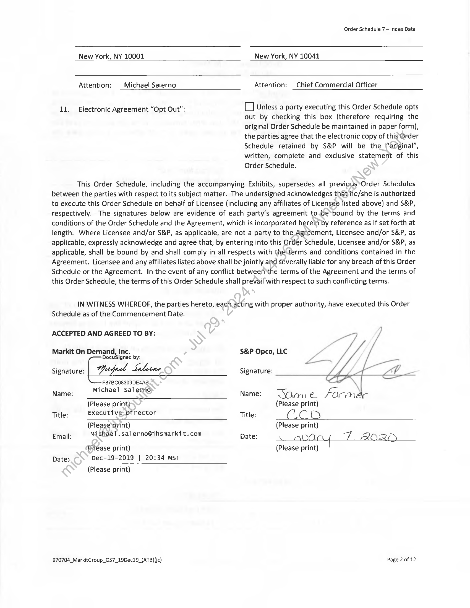
```  
```col-md
Order Schedule 7 — index Data  
New York, NY 10001 New York, NY 10041
Attention: Michael Salerno Attention: Chief Commercial Officer
11. Electronic Agreement “Opt Out”: (_] unless a party executing this Order Schedule opts  
out by checking this box (therefore requiring the
original Order Schedule be maintained in paper form),
the parties agree that the electronic copy of this Order
Schedule retained by S&P will be the_\“ariginal”,
written, complete and exclusive statement of this
Order Schedule.  
This Order Schedule, including the accompanying Exhibits, supersedes all previous’Order Schedules
between the parties with respect to its subject matter. The undersigned acknowledges that he/she is authorized
to execute this Order Schedule on behalf of Licensee (including any affiliates of Licensee listed above) and S&P,
respectively. The signatures below are evidence of each party’s agreement to.be*bound by the terms and
conditions of the Order Schedule and the Agreement, which is incorporated hereit by reference as if set forth at
length. Where Licensee and/or S&P, as applicable, are not a party to the Agreement, Licensee and/or S&P, as
applicable, expressly acknowledge and agree that, by entering into this Order Schedule, Licensee and/or S&P, as
applicable, shall be bound by and shall comply in all respects with the\terms and conditions contained in the
Agreement. Licensee and any affiliates listed above shall be jointly and severally liable for any breach of this Order
Schedule or the Agreement. In the event of any conflict between‘the terms of the Agreement and the terms of
this Order Schedule, the terms of this Order Schedule shall prevail with respect to such conflicting terms.  
IN WITNESS WHEREOF, the parties hereto, each acting with proper authority, have executed this Order
Schedule as of the Commencement Date.  
ACCEPTED AND AGREED TO BY:  
Markit On Demand, Inc. S&P Opco, LLC
DocuSigned by:
Signature: Wetfuct Saline Signature:
F87BC08303DE4A8.  

; Michael Salertio) . caw . cn. \|
Name: Name: Yam € Formac
(Please print) {Please print)
Title: Executive Director Title: ( ) C O
(Please print) (Please print)
Email: mMichael.salerno@ihsmarkit.com Date: A ata W/Z AOR >
{Please print) (Please print)
Date: Dec-19-2019 | 20:34 MST  
(Please print)  
970704_MarkitGroup_OS7_19Dec19_{ATB)(ic} Page 2 of 12  
```
````
Notes:    
````col
```col-md
flexGrow=.5
===
> [!info] [Page 3](_attachments/images_3.6.4.1.7.1SPDJI_MOD_MDA_OS7_20191201.pdf_155312/page_3.png)
> 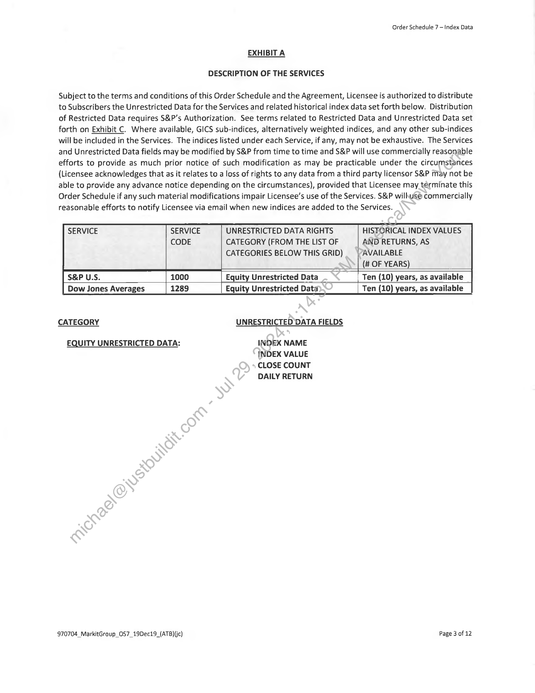
```  
```col-md
Order Schedule 7 — Index Data  
EXHIBITA  
DESCRIPTION OF THE SERVICES  
Subject to the terms and conditions of this Order Schedule and the Agreement, Licensee is authorized to distribute
to Subscribers the Unrestricted Data for the Services and related historical index data set forth below. Distribution
of Restricted Data requires S&P’s Authorization. See terms related to Restricted Data and Unrestricted Data set
forth on Exhibit C. Where available, GICS sub-indices, alternatively weighted indices, and any other sub-indices
will be included in the Services. The indices listed under each Service, if any, may not be exhaustive. The Services
and Unrestricted Data fields may be modified by S&P from time to time and S&P will use commercially reasonable
efforts to provide as much prior notice of such modification as may be practicable under the circumstances
(Licensee acknowledges that as it relates to a loss of rights to any data from a third party licensor S&P May not be
able to provide any advance notice depending on the circumstances), provided that Licensee may términate this
Order Schedule if any such material modifications impair Licensee’s use of the Services. S&P wilhusé commercially
reasonable efforts to notify Licensee via email when new indices are added to the Services.  
SERVICE SERVICE UNRESTRICTED DATA RIGHTS HISTORICAL INDEX VALUES
CODE CATEGORY (FROM THE LIST OF AND RETURNS, AS
CATEGORIES BELOW THIS GRiD) AVAILABLE
(OF YEARS) "
S&P U.S. 1000 Equity Unrestricted Data Ten (10) years, as available _
Dow Jones Averages 1289 Equity Unrestricted Data Ten (10) years, as available
CATEGORY UNRESTRICTED DATA FIELDS  
EQUITY UNRESTRICTED DATA: INDEX NAME  
INDEX VALUE  
CLOSE COUNT  
DAILY RETURN  
970704_MarkitGroup_OS7_19Dec19_(ATB)(jc) Page 3 of 12  
```
````
Notes:    
````col
```col-md
flexGrow=.5
===
> [!info] [Page 4](_attachments/images_3.6.4.1.7.1SPDJI_MOD_MDA_OS7_20191201.pdf_155312/page_4.png)
> 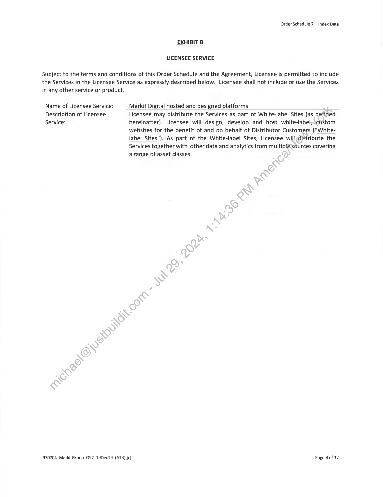
```  
```col-md
Order Schedule 7 — index Data  
EXHIBIT B
LICENSEE SERVICE
Subject to the terms and conditions of this Order Schedule and the Agreement, Licensee is permitted to include  
the Services in the Licensee Service as expressly described below. Licensee shall not include or use the Services
in any other service or product.  
Name of Licensee Service: Markit Digital hosted and designed platforms
Description of Licensee Licensee may distribute the Services as part of White-label Sites (as defined
Service: hereinafter). Licensee will design, develop and host white-label\custom  
websites for the benefit of and on behalf of Distributor Customers (“Whitelabel Sites”). As part of the White-label Sites, Licensee will distribute the
Services together with other data and analytics from multiplésources covering
a range of asset classes.  
970704_MarkitGraup_OS7_19Dec19_(ATB)(jc) Page 4 of 12  
```
````
Notes:    
````col
```col-md
flexGrow=.5
===
> [!info] [Page 5](_attachments/images_3.6.4.1.7.1SPDJI_MOD_MDA_OS7_20191201.pdf_155312/page_5.png)
> 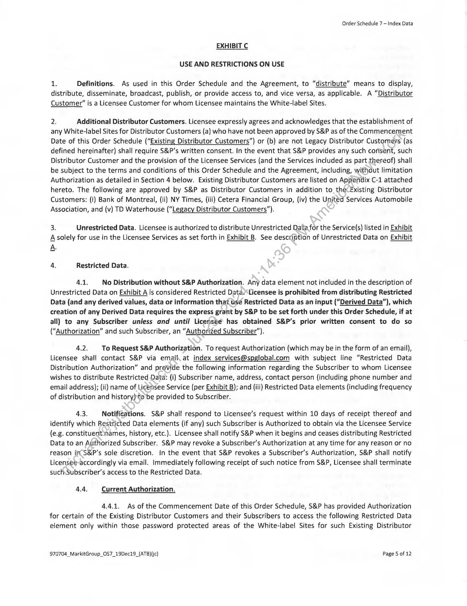
```  
```col-md
Order Schedule 7 — Index Data  
EXHIBIT C
USE AND RESTRICTIONS ON USE  
1. Definitions. As used in this Order Schedule and the Agreement, to “distribute” means to display,
distribute, disseminate, broadcast, publish, or provide access to, and vice versa, as applicable. A “Distributor
Customer” is a Licensee Customer for whom Licensee maintains the White-label Sites.  
2. Additional Distributor Customers. Licensee expressly agrees and acknowledges that the establishment of
any White-label Sites for Distributor Customers (a) who have not been approved by S&P as of the Commencement
Date of this Order Schedule (“Existing Distributor Customers”) or (b) are not Legacy Distributor Customers (as
defined hereinafter) shall require S&P’s written consent. In the event that S&P provides any such consent, such
Distributor Customer and the provision of the Licensee Services (and the Services included as part thereof) shall
be subject to the terms and conditions of this Order Schedule and the Agreement, including, without limitation
Authorization as detailed in Section 4 below. Existing Distributor Customers are listed on Appendix C-1 attached
hereto. The following are approved by S&P as Distributor Customers in addition to, theCExisting Distributor
Customers: (i) Bank of Montreal, (ii) NY Times, (iii) Cetera Financial Group, (iv) the United Services Automobile
Association, and (v) TD Waterhouse (“Legacy Distributor Customers”).  
3. Unrestricted Data. Licensee is authorized to distribute Unrestricted Data for the Service(s) listed in Exhibit
A solely for use in the Licensee Services as set forth in Exhibit B. See description of Unrestricted Data on Exhibit
A  
4. Restricted Data.  
4.1. No Distribution without S&P Authorization. Any data element not included in the description of
Unrestricted Data on Exhibit A is considered Restricted Data*Licensee is prohibited from distributing Restricted
Data (and any derived values, data or information that Use Restricted Data as an input (“Derived Data”), which
creation of any Derived Data requires the express grant by S&P to be set forth under this Order Schedule, if at
all) to any Subscriber unless and until Licensee has obtained S&P’s prior written consent to do so
(“Authorization” and such Subscriber, an “Authorized Subscriber”).  
4.2. To Request S&P Authorization. To request Authorization (which may be in the form of an email),
Licensee shall contact S&P via email at index services@spglobal.com with subject line “Restricted Data
Distribution Authorization” and provide the following information regarding the Subscriber to whom Licensee
wishes to distribute Restricted Data: (i) Subscriber name, address, contact person (including phone number and
email address); (ii) name of Licefisee Service (per Exhibit 8); and (iii) Restricted Data elements (including frequency
of distribution and history)to be provided to Subscriber.  
4.3. Notifications. S&P shall respond to Licensee’s request within 10 days of receipt thereof and
identify which Restricted Data elements (if any) such Subscriber is Authorized to obtain via the Licensee Service
(e.g. constituentnames, history, etc.). Licensee shall notify S&P when it begins and ceases distributing Restricted
Data to an Authorized Subscriber. S&P may revoke a Subscriber’s Authorization at any time for any reason or no
reason ii S&P’s sole discretion. in the event that S&P revokes a Subscriber’s Authorization, S&P shall notify
Licensee-accordingly via email. Immediately following receipt of such notice from S&P, Licensee shall terminate
such Subscriber’s access to the Restricted Data.  
4A, Current Authorization.  
4.4.1. As of the Commencement Date of this Order Schedule, S&P has provided Authorization
for certain of the Existing Distributor Customers and their Subscribers to access the following Restricted Data
element only within those password protected areas of the White-label Sites for such Existing Distributor  
970704_MarkitGroup_OS7_19Dec19_(ATB){jc) Page 5 of 12  
```
````
Notes:    
````col
```col-md
flexGrow=.5
===
> [!info] [Page 6](_attachments/images_3.6.4.1.7.1SPDJI_MOD_MDA_OS7_20191201.pdf_155312/page_6.png)
> 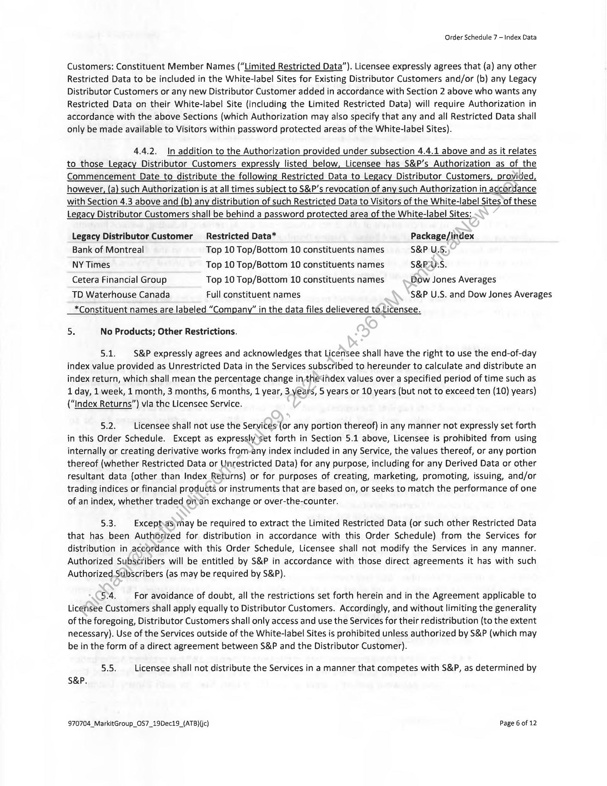
```  
```col-md
Order Schedule 7 — Index Data  
Customers: Constituent Member Names (“Limited Restricted Data”). Licensee expressly agrees that (a) any other
Restricted Data to be included in the White-label Sites for Existing Distributor Customers and/or (b) any Legacy
Distributor Customers or any new Distributor Customer added in accordance with Section 2 above who wants any
Restricted Data on their White-label Site (including the Limited Restricted Data) will require Authorization in
accordance with the above Sections (which Authorization may also specify that any and all Restricted Data shall
only be made available to Visitors within password protected areas of the White-label Sites).  
4.4.2. In addition to the Authorization provided under subsection 4.4.1 above and as it relates
to those Legacy Distributor Customers expressly listed below, Licensee has S&P’s Authorization as of the
Commencement Date to distribute the following Restricted Data to Legacy Distributor Customers, provided,
however, (a) such Authorization is at all times subject to S&P’s revocation of any such Authorization in accordance  
with Section 4.3 above and (b) any distribution of such Restricted Data to Visitors of the White-label Sites of these
Legacy Distributor Customers shall be behind a password protected area of the White-label Sites:  
Legacy Distributor Customer Restricted Data* Package/index  
Bank of Montreal Top 10 Top/Bottom 10 constituents names S&P U.S.  
NY Times Top 10 Top/Bottom 10 constituents names S&PUS.  
Cetera Financial Group Top 10 Top/Bottom 10 constituents names Dow Jones Averages  
TD Waterhouse Canada Full constituent names S&P U.S. and Dow Jones Averages  
*Constituent names are labeled “Company” in the data files delievered to Licensee.  
5. No Products; Other Restrictions.  
$.1. S&P expressly agrees and acknowledges that Licensee shall have the right to use the end-of-day
index value provided as Unrestricted Data in the Services subscribed to hereunder to calculate and distribute an
index return, which shall mean the percentage change in-the‘index values over a specified period of time such as
1 day, 1 week, 1 month, 3 months, 6 months, 1 year, 3. years, 5 years or 10 years (but not to exceed ten (10) years)
(“Index Returns”) via the Licensee Service.  
Swe Licensee shall not use the Services (or any portion thereof) in any manner not expressly set forth
in this Order Schedule. Except as expressly ‘set forth in Section 5.1 above, Licensee is prohibited from using
internally or creating derivative works from-any index included in any Service, the values thereof, or any portion
thereof (whether Restricted Data or Unrestricted Data) for any purpose, including for any Derived Data or other
resultant data (other than Index Returns) or for purposes of creating, marketing, promoting, issuing, and/or
trading indices or financial products or instruments that are based on, or seeks to match the performance of one
of an index, whether traded onan exchange or over-the-counter.  
5.3. Exceptyas)may be required to extract the Limited Restricted Data (or such other Restricted Data
that has been Authorized for distribution in accordance with this Order Schedule) from the Services for
distribution in accordance with this Order Schedule, Licensee shall not modify the Services in any manner.
Authorized Subscribers will be entitled by S&P in accordance with those direct agreements it has with such
Authorized Subscribers (as may be required by S&P).  
Sy. For avoidance of doubt, all the restrictions set forth herein and in the Agreement applicable to
Licensee Customers shall apply equally to Distributor Customers. Accordingly, and without limiting the generality
of the foregoing, Distributor Customers shall only access and use the Services for their redistribution (to the extent
necessary). Use of the Services outside of the White-label Sites is prohibited unless authorized by S&P (which may
be in the form of a direct agreement between S&P and the Distributor Customer).  
515: Licensee shall not distribute the Services in a manner that competes with S&P, as determined by
S&P.  
970704_MarkitGroup_OS7_19Dec19_(ATB)(jc) Page 6 of 12  
```
````
Notes:    
````col
```col-md
flexGrow=.5
===
> [!info] [Page 7](_attachments/images_3.6.4.1.7.1SPDJI_MOD_MDA_OS7_20191201.pdf_155312/page_7.png)
> 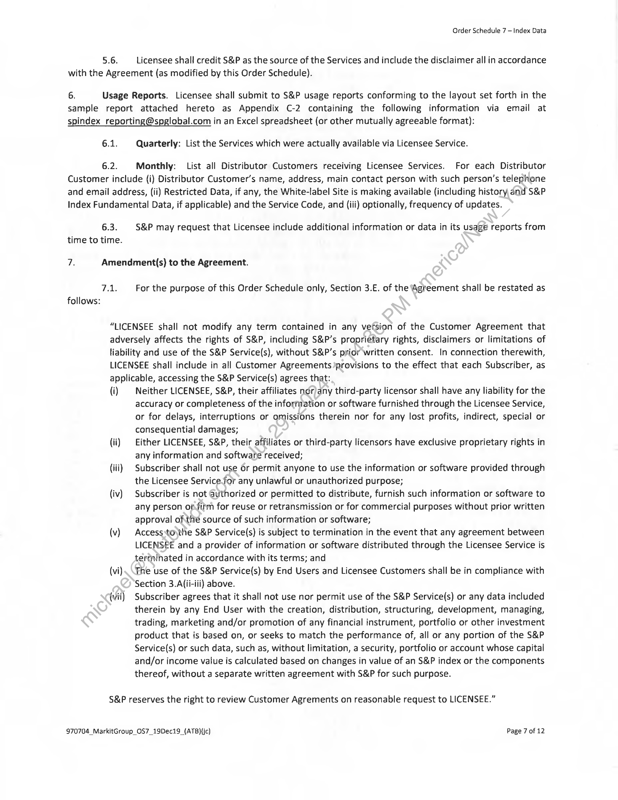
```  
```col-md
Order Schedule 7 — Index Data  
5.6. Licensee shall credit S&P as the source of the Services and include the disclaimer all in accordance
with the Agreement (as modified by this Order Schedule).  
6. Usage Reports. Licensee shall submit to S&P usage reports conforming to the layout set forth in the
sample report attached hereto as Appendix C-2 containing the following information via email at
spindex_reporting@spglobal.com in an Excel spreadsheet (or other mutually agreeable format):  
6.1. Quarterly: List the Services which were actually available via Licensee Service.  
6.2. Monthly: List all Distributor Customers receiving Licensee Services. For each Distributor
Customer include (i) Distributor Customer’s name, address, main contact person with such person’s telephone
and email address, (ii) Restricted Data, if any, the White-label Site is making available (including history, and S&P
Index Fundamental Data, if applicable) and the Service Code, and (iii) optionally, frequency of updates.  
6.3. S&P may request that Licensee include additional information or data in its usage reports from
time to time.  
7. Amendment(s) to the Agreement.  
7.1, For the purpose of this Order Schedule only, Section 3.E. of the Agreement shall be restated as
follows:  
“LICENSEE shall not modify any term contained in any vefsion of the Customer Agreement that
adversely affects the rights of S&P, including S&P’s proprietary rights, disclaimers or limitations of
liability and use of the S&P Service(s), without S&P’s prior written consent. In connection therewith,  
LICENSEE shall include in all Customer Agreements provisions to the effect that each Subscriber, as  
applicable, accessing the S&P Service(s) agrees that:  
(i) — Neither LICENSEE, S&P, their affiliates nor)any third-party licensor shall have any liability for the
accuracy or completeness of the information or software furnished through the Licensee Service,
or for delays, interruptions or omissions therein nor for any lost profits, indirect, special or
consequential damages;  
(ii) Either LICENSEE, S&P, their affiliates or third-party licensors have exclusive proprietary rights in
any information and software received;  
(iii) Subscriber shall not use or permit anyone to use the information or software provided through
the Licensee Service for any unlawful or unauthorized purpose;  
(iv) Subscriber is not authorized or permitted to distribute, furnish such information or software to
any person of-fitm for reuse or retransmission or for commercial purposes without prior written
approval ofthe source of such information or software;  
(v) Access :tovthe S&P Service(s) is subject to termination in the event that any agreement between
LICENSEE and a provider of information or software distributed through the Licensee Service is
terminated in accordance with its terms; and  
(vi) Fhe use of the S&P Service(s) by End Users and Licensee Customers shall be in compliance with
Section 3.A(ii-iii} above.  
(vil) Subscriber agrees that it shall not use nor permit use of the S&P Service(s) or any data included
therein by any End User with the creation, distribution, structuring, development, managing,
trading, marketing and/or promotion of any financial instrument, portfolio or other investment
product that is based on, or seeks to match the performance of, all or any portion of the S&P
Service(s) or such data, such as, without limitation, a security, portfolio or account whose capital
and/or income value is calculated based on changes in value of an S&P index or the components
thereof, without a separate written agreement with S&P for such purpose.  
S&P reserves the right to review Customer Agrements on reasonable request to LICENSEE.”  
970704_MarkitGroup_O$7_19Dec19_(ATB){jc) Page 7 of 12  
```
````
Notes:    
````col
```col-md
flexGrow=.5
===
> [!info] [Page 8](_attachments/images_3.6.4.1.7.1SPDJI_MOD_MDA_OS7_20191201.pdf_155312/page_8.png)
> 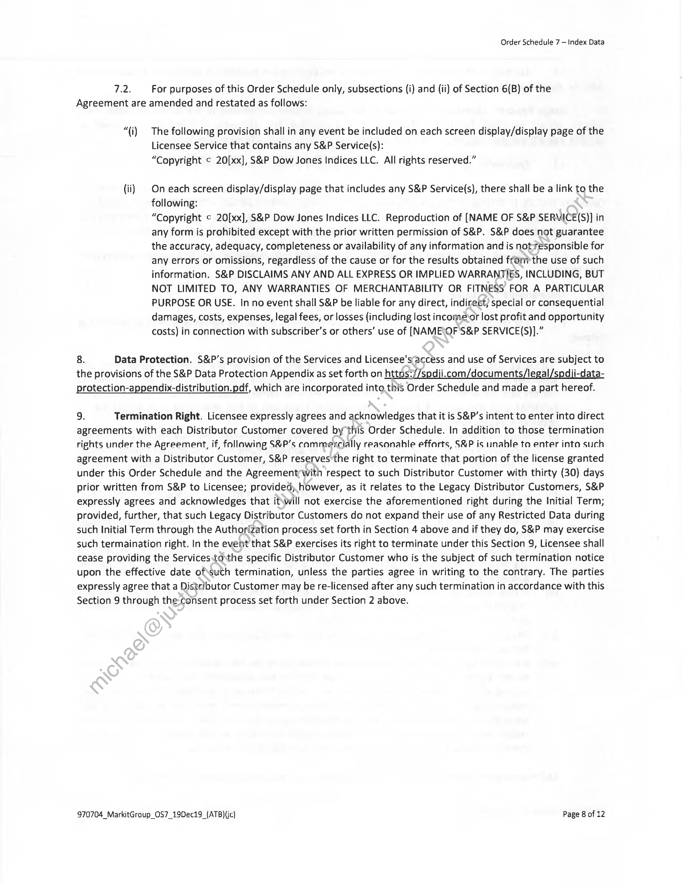
```  
```col-md
Order Schedule 7 — Index Data  
7.2. For purposes of this Order Schedule only, subsections (i) and (ii) of Section 6(B) of the
Agreement are amended and restated as follows:  
“(i) The following provision shall in any event be included on each screen display/display page of the
Licensee Service that contains any S&P Service(s):
“Copyright © 20[xx], S&P Dow Jones Indices LLC. All rights reserved.”  
(ii) On each screen display/display page that includes any S&P Service(s), there shall be a link to the
following:
“Copyright ¢ 20[xx], S&P Dow Jones Indices LLC. Reproduction of [NAME OF S&P SERVICE(S)] in
any form is prohibited except with the prior written permission of S&P. S&P does not guarantee
the accuracy, adequacy, completeness or availability of any information and is not-responsible for
any errors or omissions, regardless of the cause or for the results obtained fronmthe use of such
information. S&P DISCLAIMS ANY AND ALL EXPRESS OR IMPLIED WARRANTIES, INCLUDING, BUT
NOT LIMITED TO, ANY WARRANTIES OF MERCHANTABILITY OR FITNESS FOR A PARTICULAR
PURPOSE OR USE. In no event shall S&P be liable for any direct, indirect) special or consequential
damages, costs, expenses, legal fees, or losses (including lost incomeor lost profit and opportunity
costs) in connection with subscriber’s or others’ use of [NAME\OF S&P SERVICE(S)].”  
8. Data Protection. S&P’s provision of the Services and Licensee's‘access and use of Services are subject to  
the provisions of the S&P Data Protection Appendix as set forth on https://spdiji.com/documents/legal/spdii-dataprotection-appendix-distribution.pdf, which are incorporated into this Order Schedule and made a part hereof.  
9. Termination Right. Licensee expressly agrees and acknowledges that it is S&P’s intent to enter into direct
agreements with each Distributor Customer covered by this Order Schedule. In addition to those termination
rights under the Agreement, if, fnllawing S&P’s cammercially reasonahle efforts, S&P is unable to enter into such
agreement with a Distributor Customer, S&P reserves the right to terminate that portion of the license granted
under this Order Schedule and the Agreementwith respect to such Distributor Customer with thirty (30) days
prior written from S&P to Licensee; provided, however, as it relates to the Legacy Distributor Customers, S&P
expressly agrees and acknowledges that it\will not exercise the aforementioned right during the Initial Term;
provided, further, that such Legacy Distributor Customers do not expand their use of any Restricted Data during
such Initial Term through the Authorization process set forth in Section 4 above and if they do, S&P may exercise
such termaination right. In the event that S&P exercises its right to terminate under this Section 9, Licensee shall
cease providing the Services.tothe specific Distributor Customer who is the subject of such termination notice
upon the effective date of\such termination, unless the parties agree in writing to the contrary. The parties
expressly agree that a Distributor Customer may be re-licensed after any such termination in accordance with this
Section 9 through the-consent process set forth under Section 2 above.  
970704_MarkitGroup_OS7_19Dec19_(ATB){c) Page 8 of 12  
```
````
Notes:    
````col
```col-md
flexGrow=.5
===
> [!info] [Page 9](_attachments/images_3.6.4.1.7.1SPDJI_MOD_MDA_OS7_20191201.pdf_155312/page_9.png)
> 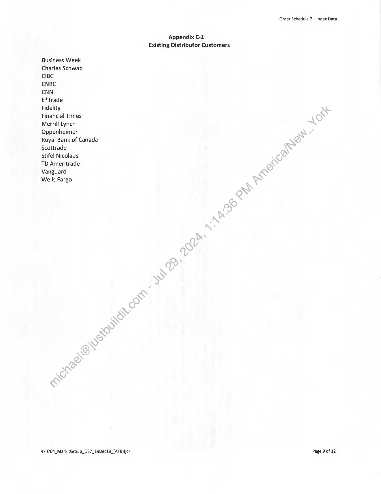
```  
```col-md
Business Week
Charles Schwab
CIBC  
CNBC  
CNN  
E*Trade
Fidelity
Financial Times
Merrill Lynch
Oppenheimer
Royal Bank of Canada
Scottrade  
Stifel Nicolaus
TD Ameritrade
Vanguard
Wells Fargo  
970704_MarkitGroup_OS7_19Dec19_{ATB)(jc)  
Appendix C-1
Existing Distributor Customers  
Order Schedule 7 — Index Data  
Page 9 of 12  
```
````
Notes:    
````col
```col-md
flexGrow=.5
===
> [!info] [Page 10](_attachments/images_3.6.4.1.7.1SPDJI_MOD_MDA_OS7_20191201.pdf_155312/page_10.png)
> 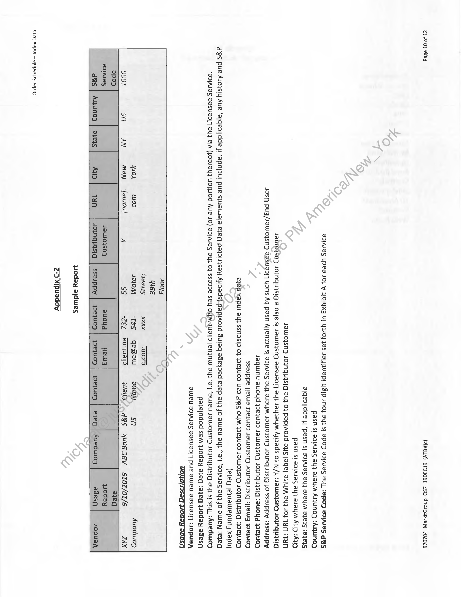
```  
```col-md
ZT $9 OF aded (PMaLv) 6toaa6T ZSO dnowpwyseW POLOLE  
DIIAIIS YILI JO} Y UG YXI U! YOY Jas JayyIUIP! WBIP 1NOJ AY} SI BPOD BIAJVS BY :apOD BITS d’BS  
pasn s! ad1asas ay} asaym Agjuno; :AyjunOD  
ajqeaidde 4! ‘pasn s! aaiasas ay] aJBYyM a}eI1s 3721S  
Pasn st adlAJas ay} auaym AqID :AND  
Jawoysny 103NG!43S1G a4} 0} paplAosd ays jage|-BNYM FYI 104 THN *1HN  
JaWOISND JOINGIISIG e OS|e SI J9WOJSND Vasuad!] ayi JaYIaYM ApIads 0} N/A WaWIOISND 4OINqUIISIG  
4Jasp puz/sawoysn> aasuacr yans Aq pasn Ajjenjoe si ad1Asas ay} BJaYM JaWOSND JOINGIJISIQ JO ssaippy :ssauppy  
Jaquinu auoyd 49e}U09 JaWoysn> JOINqIIsIq :auOY4d eIUOD  
ssaippe |JewWa 19e]U09 JaWOysND JOINqNISIG yyewy eWOD  
eyep XAPU! BU} SSNISIP 03 39E]UO UD g’RS OYM 1IEJUOD JaWOIsN>D JOINGIIISIG :39e3U0D  
(ejeq jeyuawWepun, xapul  
d'gs pue Asojsiy Aue ‘ajqesijdde 4! ‘apnjaul pue sjuawaja ejeg pajdisjsay Ayi9ads).papiaosd Bulag ageyIed ejep ay] Jo aWeU ay} “d‘! ‘BDIAJAS 94] JO QWeN :ejeG
“AD1AJVS BdSUaI!] BU} LIA (JOaJaU} UOIOd Aue JO) aI!AJaS ay} O} SsaIze SEY OYMaAUA!|D |enINW ay} ‘a! ‘AWeU JaWO SND JOINIIsSIG ayy Ss! SIU) :AUedWOD
pajejndod sem yoday ajeq :ayeqg Woday adesn  
aweuU aIAJas aasuaz!] pue aweU dasuar!] iopuap,  
UOndIsaq WOday JDDS/)  
400/4
YIGE
4eaaus XXXX woos
404 ulod 4a10M -IpS gqemeow ausdjy sn Aupdwioz  
O00T sn
apo
SIIAaS  
3s | Auquno) | 27e75  
SS WIZ’ dBS AuvGIgvY 61O0Z/OT/E ZAX  
Jawoysn9
4oynquisig  
jew
pejuoD  
auoud
ssauppy | We}U0D  
pequop | ejeq ; Auedwoz JOpUsA  
yoday ajdwes  
Zo xipusday  
ejeq xapul — ainpayrs 1apid  
```
````
Notes:    
````col
```col-md
flexGrow=.5
===
> [!info] [Page 11](_attachments/images_3.6.4.1.7.1SPDJI_MOD_MDA_OS7_20191201.pdf_155312/page_11.png)
> 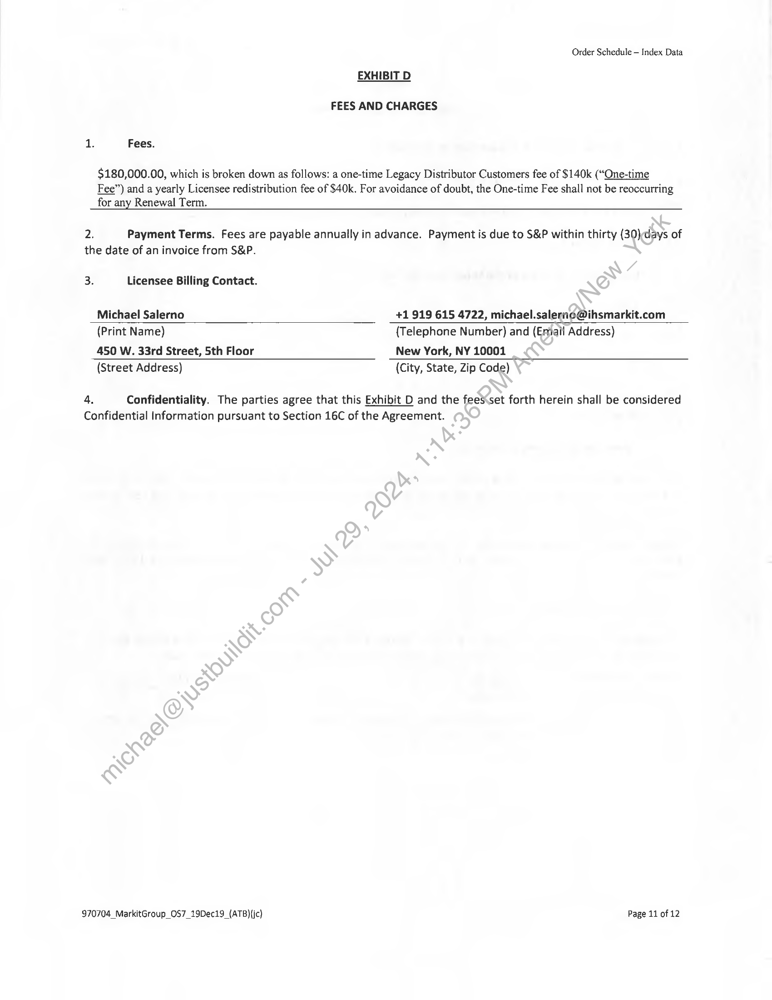
```  
```col-md
Order Schedule — Index Data  
EXHIBIT D  
FEES AND CHARGES  
as Fees.  
$180,000.00, which is broken down as follows: a one-time Legacy Distributor Customers fee of $140k (“One-time
Fee”) and a yearly Licensee redistribution fee of $40k. For avoidance of doubt, the One-time Fee shall not be reoccurring
for any Renewal Term.  
2) Payment Terms. Fees are payable annually in advance. Payment is due to S&P within thirty (30)days of
the date of an invoice from S&P.  
3. Licensee Billing Contact.
Michael Salerno +1919 615 4722, michael.salernc@ihsmarkit.com
(Print Name) {Telephone Number) and (Email Address)
450 W. 33rd Street, Sth Floor New York, NY 10001
(Street Address) (City, State, Zip Code)
4. Confidentiality. The parties agree that this Exhibit D and the fees set forth herein shall be considered  
Confidential Information pursuant to Section 16C of the Agreement.  
970704_MarkitGroup_OS7_219Dec19_(ATB){jc) Page 11 of 12  
```
````
Notes:    
````col
```col-md
flexGrow=.5
===
> [!info] [Page 12](_attachments/images_3.6.4.1.7.1SPDJI_MOD_MDA_OS7_20191201.pdf_155312/page_12.png)
> 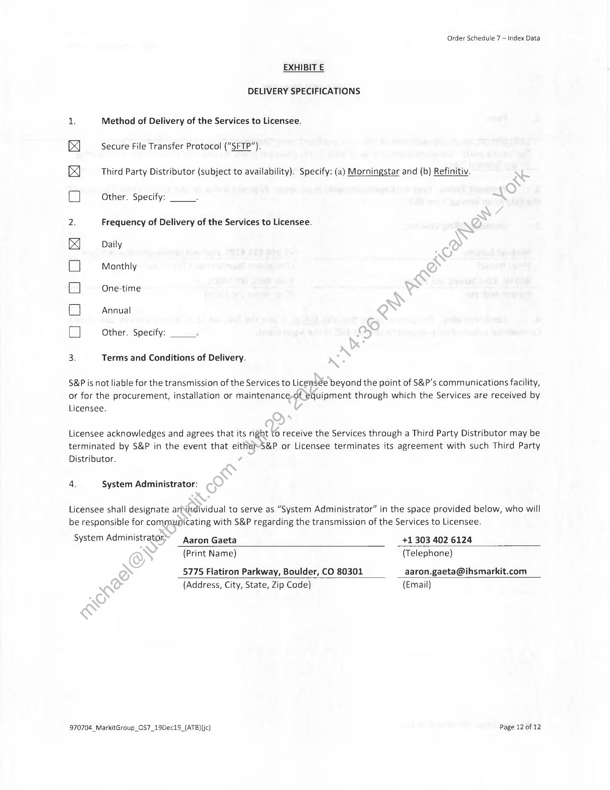
```  
```col-md
Order Schedule 7 — Index Data  
EXHIBIT E  
DELIVERY SPECIFICATIONS  
1. Method of Delivery of the Services to Licensee.  
Secure File Transfer Protocol (“SFTP”).  
Ki x  
Third Party Distributor (subject to availability). Specify: (a) Morningstar and (b) Refinitiv.  
Other. Specify: 7  
iS  
Frequency of Delivery of the Services to Licensee.  
Daily
Monthly  
One-time  
Annual  
OOOdO®  
Other. Specify: ;  
w  
Terms and Conditions of Delivery.  
S&P is not liable for the transmission of the Services to Licensee beyond the point of S&P’s communications facility,
or for the procurement, installation or maintenance-of equipment through which the Services are received by
Licensee.  
Licensee acknowledges and agrees that its right to receive the Services through a Third Party Distributor may be
terminated by S&P in the event that eitherS&P or Licensee terminates its agreement with such Third Party
Distributor.  
4. System Administrator:  
Licensee shall designate arNindividual to serve as “System Administrator” in the space provided below, who will
be responsible for communicating with S&P regarding the transmission of the Services to Licensee.  
System Administrator Aaron Gaeta +1 303 402 6124
(Print Name) (Telephone)
5775 Flatiron Parkway, Boulder, CO 80301 aaron.gaeta@ihsmarkit.com
(Address, City, State, Zip Code) (Email)  
970704_MarkitGroup_OS7_19Dec19_(ATB)(jc) Page 12 of 12  
```
````
Notes:  


![[_attachments/3.6.4.1.7.1 SPDJI_MOD_MDA_OS7_20191201.pdf]