##### STANDARD & POOR’S MASTER DISTRIBUTION AGREEMENT (US)]

  
````col
```col-md
flexGrow=.5
===
> [!info] [Page 1](_attachments/images_3.6.4.1.7.2SPDJI_MOD_MDA_20050401.pdf_155113/page_1.png)
> 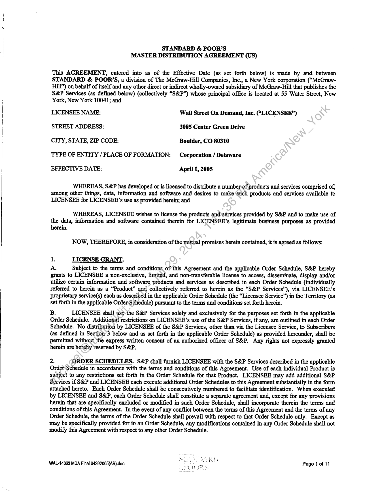
```  
```col-md
STANDARD -& POOR’S
MASTER DISTRIBUTION AGREEMENT (US)  
This AGREEMENT, entered into as of the Effective Date (as set forth below) is made by and between
STANDARD & POOR’S, a division of The McGraw-Hill Companies, Inc., a New York corporation (“McGrawHill”) on behalf of itself and any other direct or indirect wholly-owned subsidiary of McGraw-Hill that publishes the
S&P Services (as defined below) (collectively “S&P”) whose principal office is located at 55 Water Street, New
York, New York 10041; and  
LICENSEE NAME: Wall Street On Demand, Inc. (“LICENSEE”)
STREET ADDRESS: 3005 Center Green Drive
CITY, STATE, ZIP CODE: Boulder, CO 80310  
TYPE OF ENTITY / PLACE OF FORMATION: Corporation / Delaware  
EFFECTIVE DATE: April 1, 2005  
WHEREAS, S&P has developed or is licensed to distribute a numberof products and services comprised of,
among other things, data, information and software and desires to make “such products and services available to
LICENSEE for LICENSEE’s use as provided herein; and  
WHEREAS, LICENSEE wishes to license the products and@sérvices provided by S&P and to make use of
the data, information and software contained therein for LICENSEE’s legitimate business purposes as provided
herein.  
NOW, THEREFORE, in consideration of the mutval promises herein contained, it is agreed as follows:  
1. LICENSE GRANT.  
A, Subject to the terms and conditions ofthis Agreement and the applicable Order Schedule, S&P hereby
grants to LICENSEE a non-exclusive, limited, and non-transferable license to access, disseminate, display and/or
utilize certain information and software products and services as described in each Order Schedule (individually
referred to herein as a “Product” and collectively referred to herein as the “S&P Services”), via LICENSEE’s
proprietary service(s) each as described in the applicable Order Schedule (the “Licensee Service”) in the Territory (as
set forth in the applicable Order Schedule) pursuant to the terms and conditions set forth herein.  
B. LICENSEE shall ws¢-the S&P Services solely and exclusively for the purposes set forth in the applicable
Order Schedule. Additional restrictions on LICENSEE’s use of the S&P Services, if any, are outlined in each Order
Schedule. No distribution by LICENSEE of the S&P Services, other than via the Licensee Service, to Subscribers
(as defined in Section 3 below and as set forth in the applicable Order Schedule) as provided hereunder, shall be
permitted without the express written consent of an authorized officer of S&P. Any rights not expressly granted
herein are hereby reserved by S&P.  
2. ORDER SCHEDULES, S&P shall furnish LICENSEE with the S&P Services described in the applicable
Order Schedule in accordance with the terms and conditions of this Agreement. Use of each individual Product is
subject to any restrictions set forth in the Order Schedule for that Product. LICENSEE may add additional S&P
Services if S&P and LICENSEE each execute additional Order Schedules to this Agreement substantially in the form
attached hereto. Each Order Schedule shall be consecutively numbered to facilitate identification. When executed
by LICENSEE and S&P, each Order Schedule shall constitute a separate agreement and, except for any provisions
herein that are specifically excluded or modified in such Order Schedule, shall incorporate therein the terms and
conditions of this Agreement. In the event of any conflict between the terms of this Agreement and the terms of any
Order Schedule, the terms of the Order Schedule shall prevail with respect to that Order Schedule only, Except as
may be specifically provided for in an Order Schedule, any modifications contained in any Order Schedule shall not
modify this Agreement with respect to any other Order Schedule.  
WAL-14062 MDA Final 04262005(AB).doc Page 1 of 11  
```
````
Notes:    
````col
```col-md
flexGrow=.5
===
> [!info] [Page 2](_attachments/images_3.6.4.1.7.2SPDJI_MOD_MDA_20050401.pdf_155113/page_2.png)
> 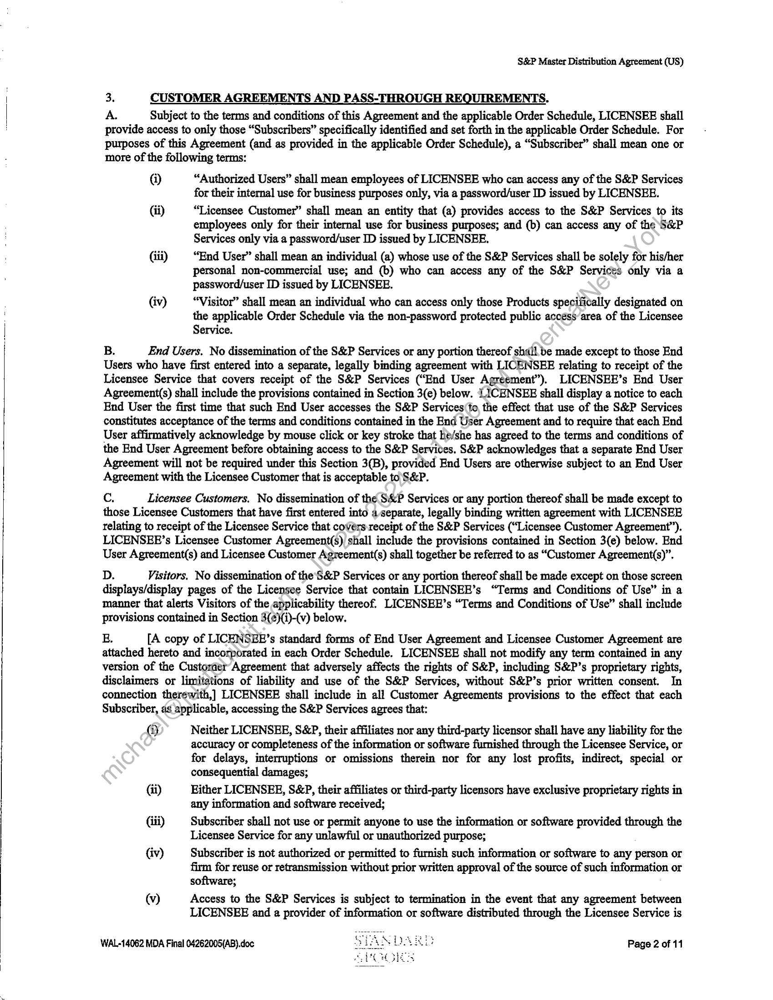
```  
```col-md
S&P Master Distribution Agreement (US)  
3. CUSTOMER AGREEMENTS AND PASS-THROUGH REQUIREMENTS.  
A. Subject to the terms and conditions of this Agreement and the applicable Order Schedule, LICENSEE shall
provide access to only those “Subscribers” specifically identified and set forth in the applicable Order Schedule. For
purposes of this Agreement (and as provided in the applicable Order Schedule), a “Subscriber” shall mean one or
more of the following terms:  
@ “Authorized Users” shall mean employees of LICENSEE who can access any of the S&P Services
for their internal use for business purposes only, via a password/user ID issued by LICENSEE.
(ii) “Licensee Customer” shall mean an entity that (a) provides access to the S&P Services to its  
employees only for their internal use for business purposes; and (b) can access any of the S&P
Services only via a password/user ID issued by LICENSEE.  
(iti) “End User” shall mean an individual (a) whose use of the S&P Services shall be solely for his/her
personal non-commercial use; and (b) who can access any of the S&P Services only via a
password/user ID issued by LICENSEE.  
(iv) “Visitor” shall mean an individual who can access only those Products specifically designated on
the applicable Order Schedule via the non-password protected public access area of the Licensee
Service.  
B. End Users. No dissemination of the S&P Services or any portion thereof shail. be made except to those End
Users who have first entered into a separate, legally binding agreement with LICENSEE relating to receipt of the
Licensee Service that covers receipt of the S&P Services (“End User Agreément”). LICENSEE’s End User
Agreement(s) shall include the provisions contained in Section 3(e) below. LICENSEE shall display a notice to each
End User the first time that such End User accesses the S&P Services(fo, the effect that use of the S&P Services
constitutes acceptance of the terms and conditions contained in the End User Agreement and to require that each End
User affirmatively acknowledge by mouse click or key stroke that he/she has agreed to the terms and conditions of
the End User Agreement before obtaining access to the S&P Servites. S&P acknowledges that a separate End User
Agreement will not be required under this Section 3(B), provided End Users are otherwise subject to an End User
Agreement with the Licensee Customer that is acceptable to S&P.  
c, Licensee Customers. No dissemination of the S&P Services or any portion thereof shall be made except to
those Licensee Customers that have first entered into a separate, legally binding written agreement with LICENSEE
relating to receipt of the Licensee Service that covers receipt of the S&P Services (“Licensee Customer Agreement”),
LICENSEE’s Licensee Customer Agreement(s) shall include the provisions contained in Section 3(e) below. End
User Agreement(s) and Licensee Customer Agreement(s) shall together be referred to as “Customer Agreement(s)”.  
D. Visitors. No dissemination of the S&P Services or any portion thereof shall be made except on those screen
displays/display pages of the Licensee Service that contain LICENSEE’s “Terms and Conditions of Use” in a
manner that alerts Visitors of the applicability thereof. LICENSEE’s “Terms and Conditions of Use” shall include
provisions contained in Section 3(¢)(i)-(v) below.  
E. [A copy of LICENSEE’s standard forms of End User Agreement and Licensee Customer Agreement are
attached hereto and incorporated in each Order Schedule. LICENSEE shall not modify any term contained in any
version of the Custorder Agreement that adversely affects the rights of S&P, including S&P’s proprietary rights,
disclaimers or limitations of liability and use of the S&P Services, without S&P’s prior written consent. In
connection therewith] LICENSEE shall include in all Customer Agreements provisions to the effect that each
Subscriber, as applicable, accessing the S&P Services agrees that:  
@ Neither LICENSEE, S&P, their affiliates nor any third-party licensor shall have any liability for the
accuracy or completeness of the information or software furnished through the Licensee Service, or
for delays, interruptions or omissions therein nor for any lost profits, indirect, special or
consequential damages;  
(ii) Either LICENSEE, S&P, their affiliates or third-party licensors have exclusive proprietary rights in
any information and software received;  
ii) Subscriber shall not use or permit anyone to use the information or software provided through the
Licensee Service for any unlawful or unauthorized purpose;  
{iv) Subscriber is not authorized or permitted to furnish such information or software to any person or
firm for reuse or retransmission without prior written approval of the source of such information or
software;  
@) Access to the S&P Services is subject to termination in the event that any agreement between
LICENSEE and a provider of information or software distributed through the Licensee Service is  
WAL-14062 MDA Final 04262005(AB).doc Page 2 of 11  
```
````
Notes:    
````col
```col-md
flexGrow=.5
===
> [!info] [Page 3](_attachments/images_3.6.4.1.7.2SPDJI_MOD_MDA_20050401.pdf_155113/page_3.png)
> 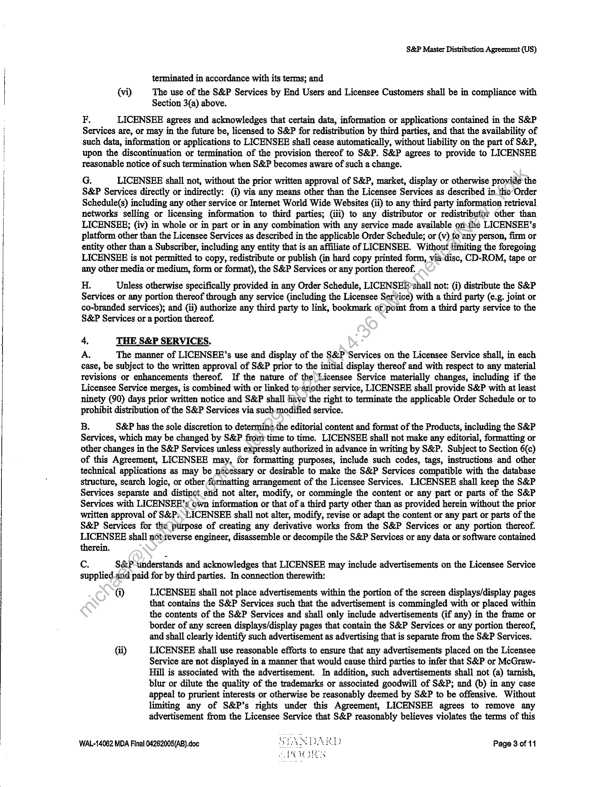
```  
```col-md
S&P Master Distribution Agreement (US)  
terminated in accordance with its terms; and
(vi) The use of the S&P Services by End Users and Licensee Customers shall be in compliance with
Section 3(a) above.  
F. LICENSEE agrees and acknowledges that certain data, information or applications contained in the S&P
Services are, or may in the future be, licensed to S&P for redistribution by third parties, and that the availability of
such data, information or applications to LICENSEE shall cease automatically, without liability on the part of S&P,
upon the discontinuation or termination of the provision thereof to S&P. S&P agrees to provide to LICENSEE
reasonable notice of such termination when S&P becomes aware of such a change.  
G. LICENSEE shall not, without the prior written approval of S&P, market, display or otherwise provide the
S&P Services directly or indirectly: (i) via any means other than the Licensee Services as described in the Order
Schedule(s) including any other service or Internet World Wide Websites (ii) to any third party information retrieval
networks selling or licensing information to third parties; (iii) to any distributor or redistribufor other than
LICENSEE; (iv) in whole or in part or in any combination with any service made available onthe LICENSEE’s
platform other than the Licensee Services as described in the applicable Order Schedule; or (v) to any person, firm or
entity other than a Subscriber, including any entity that is an affiliate of LICENSEE. Without limiting the foregoing
LICENSEE is not permitted to copy, redistribute or publish (in hard copy printed form, via-disc, CD-ROM, tape or
any other media or medium, form or format), the S&P Services or any portion thereof.  
H. Unless otherwise specifically provided in any Order Schedule, LICENSEEF’shall not: (i) distribute the S&P
Services or any portion thereof through any service (including the Licensee Service) with a third party (e.g. joint or
co-branded services); and (ii) authorize any third party to link, bookmark or)point from a third party service to the
S&P Services or a portion thereof.  
4. THE S&P SERVICES.  
A The manner of LICENSEE’s use and display of the S&P Services on the Licensee Service shall, in each
case, be subject to the written approval of S&P prior to the initial display thereof and with respect to any material
revisions or enhancements thereof. If the nature of the Licensee Service materially changes, including if the
Licensee Service merges, is combined with or linked to-ariother service, LICENSEE shall provide S&P with at least
ninety (90) days prior written notice and S&P shall have the right to terminate the applicable Order Schedule or to
prohibit distribution of the S&P Services via such-modified service.  
B. S&P has the sole discretion to determine the editorial content and format of the Products, including the S&P
Services, which may be changed by S&P from time to time. LICENSEE shall not make any editorial, formatting or
other changes in the S&P Services unless expressly authorized in advance in writing by S&P. Subject to Section 6(c)
of this Agreement, LICENSEE may, for formatting purposes, include such codes, tags, instructions and other
technical applications as may be nécessary or desirable to make the S&P Services compatible with the database
structure, search logic, or other formatting arrangement of the Licensee Services. LICENSEE shall keep the S&P
Services separate and distinct and not alter, modify, or commingle the content or any part or parts of the S&P
Services with LICENSEEF’s own information or that of a third party other than as provided herein without the prior
written approval of S&P:LICENSEE shall not alter, modify, revise or adapt the content or any part or parts of the
S&P Services for the purpose of creating any derivative works from the S&P Services or any portion thereof.
LICENSEE shall notreverse engineer, disassemble or decompile the S&P Services or any data or software contained
therein.  
c. S&P understands and acknowledges that LICENSEE may include advertisements on the Licensee Service
supplied.and paid for by third parties. In connection therewith:  
@ LICENSEE shail not place advertisements within the portion of the screen displays/display pages
that contains the S&P Services such that the advertisement is commingled with or placed within
the contents of the S&P Services and shall only include advertisements (if any) in the frame or
border of any screen displays/display pages that contain the S&P Services or any portion thereof,
and shall clearly identify such advertisement as advertising that is separate from the S&P Services.  
¢1)) LICENSEE shall use reasonable efforts to ensure that any advertisements placed on the Licensee
Service are not displayed in a manner that would cause third parties to infer that S&P or McGrawHill is associated with the advertisement. In addition, such advertisements shall not (a) tarnish,
blur or dilute the quality of the trademarks or associated goodwill of S&P; and (b) in any case
appeal to prurient interests or otherwise be reasonably deemed by S&P to be offensive. Without
limiting any of S&P’s rights under this Agreement, LICENSEE agrees to remove any
advertisement from the Licensee Service that S&P reasonably believes violates the terms of this  
WAL-14062 MDA Final 04262005(AB).doc Page 3 of 11  
```
````
Notes:    
````col
```col-md
flexGrow=.5
===
> [!info] [Page 4](_attachments/images_3.6.4.1.7.2SPDJI_MOD_MDA_20050401.pdf_155113/page_4.png)
> 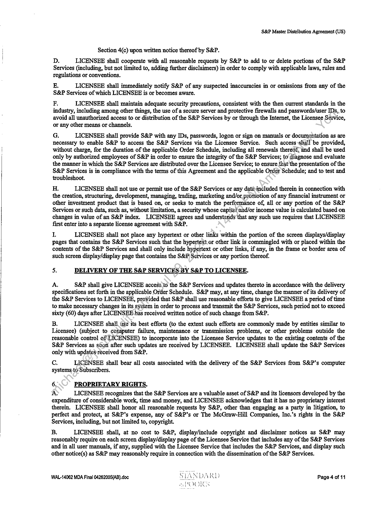
```  
```col-md
S&P Master Distribution Agreement (US)  
Section 4(c) upon written notice thereof by S&P.  
D. LICENSEE shall cooperate with all reasonable requests by S&P to add to or delete portions of the S&P
Services (including, but not limited to, adding further disclaimers) in order to comply with applicable laws, rules and
regulations or conventions,  
E. LICENSEE shall immediately notify S&P of any suspected inaccuracies in or omissions from any of the
S&P Services of which LICENSEE is or becomes aware.
F. LICENSEE shall maintain adequate security precautions, consistent with the then current standards in the  
industry, including among other things, the use of a secure server and protective firewalls and passwords/user IDs, to
avoid all unauthorized access to or distribution of the S&P Services by or through the Internet, the Licensee Service,
or any other means or channels.  
G. LICENSEE shall provide S&P with any IDs, passwords, logon or sign on manuals or documentation as are
necessary to enable S&P to access the S&P Services via the Licensee Service. Such access shall be provided,
without charge, for the duration of the applicable Order Schedule, including all renewals thereof, and shall be used
only by authorized employees of S&P in order to ensure the integrity of the S&P Services; to diagnose and evaluate
the manner in which the S&P Services are distributed over the Licensee Service; to ensure that the presentation of the
S&P Services is in compliance with the terms of this Agreement and the applicable Order Schedule; and to test and
troubleshoot.  
H. LICENSEE shall not use or permit use of the S&P Services or any dataincluded therein in connection with
the creation, structuring, development, managing, trading, marketing and/or promotion of any financial instrument or
other investment product that is based on, or seeks to match the performance of, all or any portion of the S&P
Services or such data, such as, without limitation, a security whose capita! end/or income value is calculated based on
changes in value of an S&P index. LICENSEE agrees and understands that any such use requires that LICENSEE
first enter into a separate license agreement with S&P.  
L LICENSEE shall not place any hypertext or other links within the portion of the screen displays/display
pages that contains the S&P Services such that the hypertext. or other link is commingled with or placed within the
contents of the S&P Services and shall only include hypertext or other links, if any, in the frame or border area of
such screen display/display page that contains the S&P Services or any portion thereof.  
5. DELIVERY OF THE S&P SERVICES BY S&P TO LICENSEE.  
A. S&P shall give LICENSEE access.to the S&P Services and updates thereto in accordance with the delivery
specifications set forth in the applicable Order Schedule. S&P may, at any time, change the manner of its delivery of
the S&P Services to LICENSEE, provided that S&P shall use reasonable efforts to give LICENSEE a period of time
to make necessary changes in its system in order to process and transmit the S&P Services, such period not to exceed
sixty (60) days after LICENSEE has received written notice of such change from S&P.  
B. LICENSEE shall tse its best efforts (to the extent such efforts are commonly made by entities similar to
Licensee) (subject to cotaputer failure, maintenance or transmission problems, or other problems outside the
reasonable control of LICENSEE) to incorporate into the Licensee Service updates to the existing contents of the
S&P Services as scon after such updates are received by LICENSEE. LICENSEE shall update the S&P Services
only with updates received from S&P.  
Cc. LICENSEE shall bear all costs associated with the delivery of the S&P Services from S&P’s computer
systems toSubscribers.  
6. PROPRIETARY RIGHTS.  
A LICENSEE recognizes that the S&P Services are a valuable asset of S&P and its licensors developed by the
expenditure of considerable work, time and money, and LICENSEE acknowledges that it has no proprietary interest
therein. LICENSEE shall honor all reasonable requests by S&P, other than engaging as a party in litigation, to
perfect and protect, at S&P’s expense, any of S&P’s or The McGraw-Hill Companies, Inc.’s rights in the S&P
Services, including, but not limited to, copyright.  
B. LICENSEE shall, at no cost to S&P, display/include copyright and disclaimer notices as S&P may
reasonably require on each screen display/display page of the Licensee Service that includes any of the S&P Services
and in all user manuals, if any, supplied with the Licensee Service that includes the S&P Services, and display such
other notice(s) as S&P may reasonably require in connection with the dissemination of the S&P Services.  
WAL-14062 MDA Final 04262005(AB).doc Page 4 of 11  
```
````
Notes:    
````col
```col-md
flexGrow=.5
===
> [!info] [Page 5](_attachments/images_3.6.4.1.7.2SPDJI_MOD_MDA_20050401.pdf_155113/page_5.png)
> 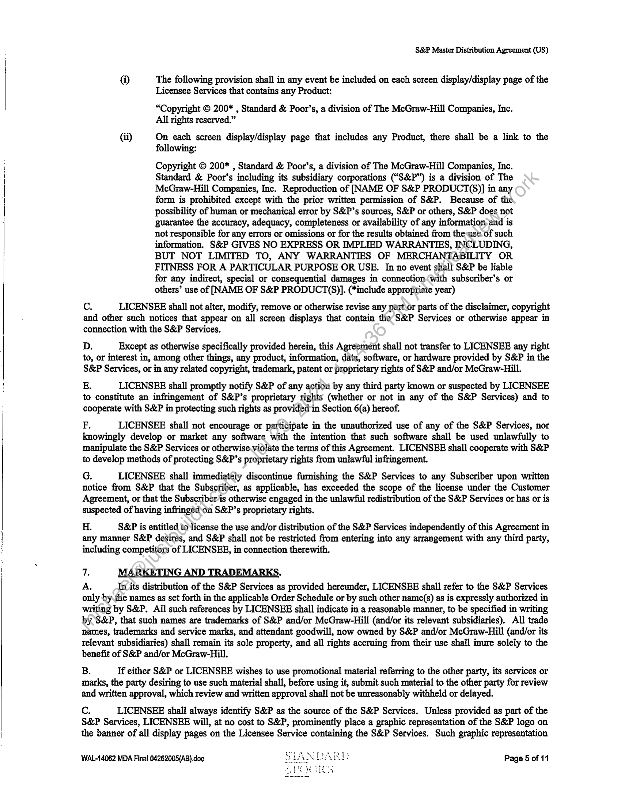
```  
```col-md
S&P Master Distribution Agreement (US)  
{i) The following provision shall in any event be included on each screen display/display page of the
Licensee Services that contains any Product:  
“Copyright © 200* , Standard & Poor’s, a division of The McGraw-Hill Companies, Inc.
All rights reserved.”  
Gi) On each screen display/display page that includes any Product, there shall be a link to the
following:  
Copyright © 200* , Standard & Poor’s, a division of The McGraw-Hill Companies, Inc.
Standard & Poor’s including its subsidiary corporations (“S&P”) is a division of The
McGraw-Hill Companies, Inc. Reproduction of [NAME OF S&P PRODUCT(S)] in any
form is prohibited except with the prior written permission of S&P. Because of the
possibility of human or mechanical error by S&P’s sources, S&P or others, S&P does not
guarantee the accuracy, adequacy, completeness or availability of any information-and is
not responsible for any errors or omissions or for the results obtained from the use of such
information. S&P GIVES NO EXPRESS OR IMPLIED WARRANTIES, INCLUDING,
BUT NOT LIMITED TO, ANY WARRANTIES OF MERCHANTABILITY OR
FITNESS FOR A PARTICULAR PURPOSE OR USE. In no event shall S&P be liable
for any indirect, special or consequential damages in connection(with subscriber’s or
others’ use of [NAME OF S&P PRODUCT(S)]. (*include appropriate year)  
Cc. LICENSEE shall not alter, modify, remove or otherwise revise any part.or parts of the disclaimer, copyright
and other such notices that appear on all screen displays that contain the S&P Services or otherwise appear in
connection with the S&P Services.  
D. Except as otherwise specifically provided herein, this Agreement shall not transfer to LICENSEE any right
to, or interest in, among other things, any product, information, data, software, or hardware provided by S&P in the
S&P Services, or in any related copyright, trademark, patent or proprietary rights of S&P and/or McGraw-Hill.  
EB. LICENSEE shall promptly notify S&P of any action by any third party known or suspected by LICENSEE
to constitute an infringement of S&P’s proprietary rights (whether or not in any of the S&P Services) and to
cooperate with S&P in protecting such rights as provided in Section 6(a) hereof.  
F. LICENSEE shall not encourage or participate in the unauthorized use of any of the S&P Services, nor
knowingly develop or market any software with the intention that such software shall be used unlawfully to
manipulate the S&P Services or otherwise violate the terms of this Agreement. LICENSEE shall cooperate with S&P
to develop methods of protecting S&P’s proprietary rights from unlawful infringement.  
G. LICENSEE shall immediately discontinue furnishing the S&P Services to any Subscriber upon written
notice from S&P that the Subscriber, as applicable, has exceeded the scope of the license under the Customer
Agreement, or that the Subscriber’is otherwise engaged in the unlawful redistribution of the S&P Services or has or is
suspected of having infringed’on S&P’s proprietary rights.  
H. S&P is entitled io license the use and/or distribution of the S&P Services independently of this Agreement in
any manner S&P desires, and S&P shall not be restricted from entering into any arrangement with any third party,
including competitors of LICENSEE, in connection therewith.  
7. MARKETING AND TRADEMARKS,  
A, Inv its distribution of the S&P Services as provided hereunder, LICENSEE shall refer to the S&P Services
only by.ihe names as set forth in the applicable Order Schedule or by such other name(s) as is expressly authorized in
writing by S&P. All such references by LICENSEE shall indicate in a reasonable manner, to be specified in writing
by S&P, that such names are trademarks of S&P and/or McGraw-Hill (and/or its relevant subsidiaries). All trade
names, trademarks and service marks, and attendant goodwill, now owned by S&P and/or McGraw-Hill (and/or its
televant subsidiaries) shall remain its sole property, and all rights accruing from their use shall inure solely to the
benefit of S&P and/or McGraw-Hill.  
B. If either S&P or LICENSEE wishes to use promotional material referring to the other party, its services or
marks, the party desiring to use such material shall, before using it, submit such material to the other party for review
and written approval, which review and written approval shall not be unreasonably withheld or delayed.  
c. LICENSEE shall always identify S&P as the source of the S&P Services. Unless provided as part of the
S&P Services, LICENSEE will, at no cost to S&P, prominently place a graphic representation of the S&P logo on
the banner of all display pages on the Licensee Service containing the S&P Services. Such graphic representation  
WAL-14062 MDA Final 04262005(AB).doc Page 5 of 11  
```
````
Notes:    
````col
```col-md
flexGrow=.5
===
> [!info] [Page 6](_attachments/images_3.6.4.1.7.2SPDJI_MOD_MDA_20050401.pdf_155113/page_6.png)
> 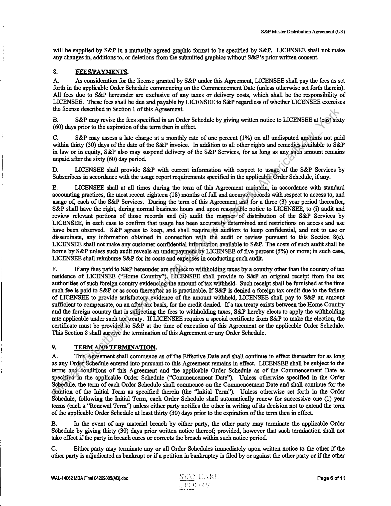
```  
```col-md
S&P Master Distribution Agreement (US)  
will be supplied by S&P in a mutually agreed graphic format to be specified by S&P. LICENSEE shall not make
any changes in, additions to, or deletions from the submitted graphics without S&P’s prior written consent.  
8. FEES/PAYMENTS.  
A. As consideration for the license granted by S&P under this Agreement, LICENSEE shall pay the fees as set
forth in the applicable Order Schedule commencing on the Commencement Date (unless otherwise set forth therein).
All fees due to S&P hereunder are exclusive of any taxes or delivery costs, which shall be the responsibility of
LICENSEE. These fees shall be due and payable by LICENSEE to S&P regardless of whether LICENSEE exercises
the license described in Section 1 of this Agreement.  
B. S&P may revise the fees specified in an Order Schedule by giving written notice to LICENSEE at least sixty
(60) days prior to the expiration of the term then in effect.  
Cc. S&P may assess a late charge at a monthly rate of one percent (1%) on all undisputed amounts not paid
within thirty (30) days of the date of the S&P invoice. In addition to all other rights and remedies available to S&P
in law or in equity, S&P also may suspend delivery of the S&P Services, for as long as any such amount remains
unpaid after the sixty (60) day period.  
D. LICENSEE shall provide S&P with current information with respect to usage of the S&P Services by
Subscribers in accordance with the usage report requirements specified in the applicable Order Schedule, if any.  
E. LICENSEE shall at all times during the term of this Agreement maintain, in accordance with standard
accounting practices, the most recent eighteen (18) months of full and accurate records with respect to access to, and
usage of, each of the S&P Services. During the term of this Agreement and for a three (3) year period thereafter,
S&P shall have the right, during normal business hours and upon reasonable notice to LICENSEE, to (i) audit and
review relevant portions of those records and (ii) audit the manner of distribution of the S&P Services by
LICENSEE, in each case to confirm that usage has been accurately’determined and restrictions on access and use
have been observed. S&P agrees to keep, and shall require its auditors to keep confidential, and not to use or
disseminate, any information obtained in connection with the audit or review pursuant to this Section 8(e).
LICENSEE shail not make any customer confidential information available to S&P. The costs of such audit shall be
bome by S&P unless such audit reveals an underpayment by LICENSEE of five percent (5%) or more; in such case,
LICENSEE shall reimburse S&P for its costs and expenses in conducting such audit.  
F, If any fees paid to S&P hereunder are subject to withholding taxes by a country other than the country of tax
residence of LICENSEE (“Home Country”), LICENSEE shall provide to S&P an original receipt from the tax
authorities of such foreign country evidencing)the amount of tax withheld. Such receipt shall be furnished at the time
such fee is paid to S&P or as soon thereafter as is practicable. If S&P is denied a foreign tax credit due to the failure
of LICENSEE to provide satisfactory.evidence of the amount withheld, LICENSEE shall pay to S&P an amount
sufficient to compensate, on an after tax basis, for the credit denied. If a tax treaty exists between the Home Country
and the foreign country that is subjecting the fees to withholding taxes, S&P hereby elects to apply the withholding
tate applicable under such tax treaty. If LICENSEE requires a special certificate from S&P to make the election, the
certificate must be provided.to S&P at the time of execution of this Agreement or the applicable Order Schedule.
This Section 8 shall survive the termination of this Agreement or any Order Schedule.  
9. TERM AND TERMINATION.
A. This Agreement shall commence as of the Effective Date and shall continue in effect thereafter for as long  
as any Order Schedule entered into pursuant to this Agreement remains in effect. LICENSEE shall be subject to the
terms and‘conditions of this Agreement and the applicable Order Schedule as of the Commencement Date as
specified in the applicable Order Schedule (“Commencement Date”). Unless otherwise specified in the Order
Schedule, the term of each Order Schedule shall commence on the Commencement Date and shall continue for the
duration of the Initial Term as specified therein (the “Initial Term”). Unless otherwise set forth in the Order
Schedule, following the Initial Term, each Order Schedule shall automatically renew for successive one (1) year
terms (each a “Renewal Term”) unless either party notifies the other in writing of its decision not to extend the term
of the applicable Order Schedule at least thirty (30) days prior to the expiration of the term then in effect.  
B. In the event of any material breach by either party, the other party may terminate the applicable Order
Schedule by giving thirty (30) days prior written notice thereof; provided, however that such termination shall not
take effect if the party in breach cures or corrects the breach within such notice period.  
Cc. Either party may terminate any or all Order Schedules immediately upon written notice to the other if the
other party is adjudicated as bankrupt or if a petition in bankruptcy is filed by or against the other party or if the other  
WAL-14062 MDA Final 04262005(AB).doc Page 6 of 11  
```
````
Notes:    
````col
```col-md
flexGrow=.5
===
> [!info] [Page 7](_attachments/images_3.6.4.1.7.2SPDJI_MOD_MDA_20050401.pdf_155113/page_7.png)
> 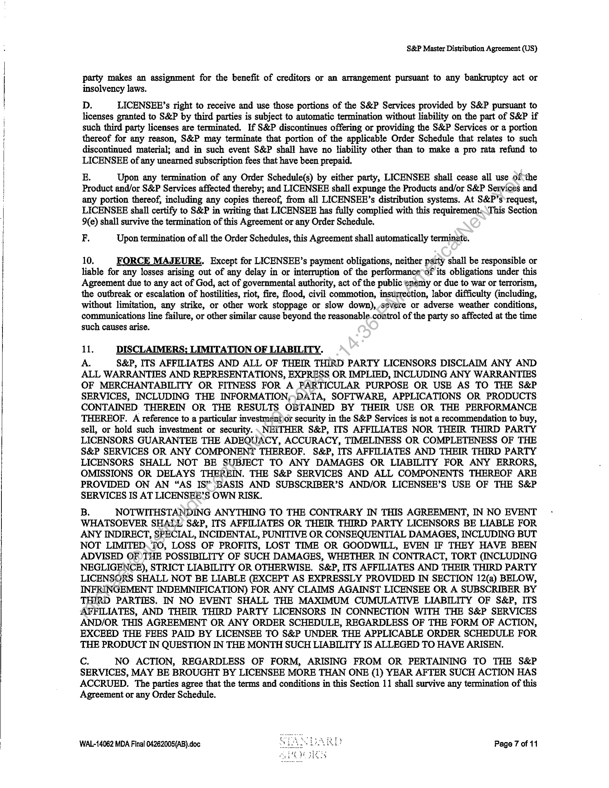
```  
```col-md
S&P Master Distribution Agreement (US)  
party makes an assignment for the benefit of creditors or an arrangement pursuant to any bankruptcy act or
insolvency laws.  
D. LICENSEE’s right to receive and use those portions of the S&P Services provided by S&P pursuant to
licenses granted to S&P by third parties is subject to automatic termination without liability on the part of S&P if
such third party licenses are terminated. If S&P discontinues offering or providing the S&P Services or a portion
thereof for any reason, S&P may terminate that portion of the applicable Order Schedule that relates to such
discontinued material; and in such event S&P shall have no liability other than to make a pro rata refund to
LICENSEE of any unearned subscription fees that have been prepaid.  
E. Upon any termination of any Order Schedule(s) by either party, LICENSEE shall cease all use of the
Product and/or S&P Services affected thereby; and LICENSEE shall expunge the Products and/or S&P Services and
any portion thereof, including any copies thereof, from all LICENSEE’s distribution systems. At S&P’s request,
LICENSEE shall certify to S&P in writing that LICENSEE has fully complied with this requirement:\This Section
9(e) shall survive the termination of this Agreement or any Order Schedule.  
F, Upon termination of all the Order Schedules, this Agreement shall automatically terminate.  
10. FORCE MAJEURE. Except for LICENSEE’s payment obligations, neither party shall be responsible or
liable for any losses arising out of any delay in or interruption of the performance of its obligations under this
Agreement due to any act of God, act of governmental authority, act of the public enemy or due to war or terrorism,
the outbreak or escalation of hostilities, riot, fire, flood, civil commotion, insurrection, labor difficulty (including,
without limitation, any strike, or other work stoppage or slow down), severe or adverse weather conditions,
communications line failure, or other similar cause beyond the reasonable.control of the party so affected at the time
such causes arise.  
11. DISCLAIMERS; LIMITATION OF LIABILITY.  
A. S&P, ITS AFFILIATES AND ALL OF THEIR THIRD PARTY LICENSORS DISCLAIM ANY AND
ALL WARRANTIES AND REPRESENTATIONS, EXPRESS OR IMPLIED, INCLUDING ANY WARRANTIES
OF MERCHANTABILITY OR FITNESS FOR A PARTICULAR PURPOSE OR USE AS TO THE S&P
SERVICES, INCLUDING THE INFORMATION,;)\DATA, SOFTWARE, APPLICATIONS OR PRODUCTS
CONTAINED THEREIN OR THE RESULTS OBTAINED BY THEIR USE OR THE PERFORMANCE
THEREOF. A reference to a particular investment)or security in the S&P Services is not a recommendation to buy,
sell, or hold such investment or security. NEITHER S&P, ITS AFFILIATES NOR THEIR THIRD PARTY
LICENSORS GUARANTEE THE ADEQUACY, ACCURACY, TIMELINESS OR COMPLETENESS OF THE
S&P SERVICES OR ANY COMPONENT THEREOF. S&P, ITS AFFILIATES AND THEIR THIRD PARTY
LICENSORS SHALL NOT BE SUBJECT TO ANY DAMAGES OR LIABILITY FOR ANY ERRORS,
OMISSIONS OR DELAYS THEREIN. THE S&P SERVICES AND ALL COMPONENTS THEREOF ARE
PROVIDED ON AN “AS IS’ BASIS AND SUBSCRIBER’S AND/OR LICENSEE’S USE OF THE S&P
SERVICES IS AT LICENSEE’S OWN RISK.  
B. NOTWITHSTANDING ANYTHING TO THE CONTRARY IN THIS AGREEMENT, IN NO EVENT
WHATSOEVER SHALE S&P, ITS AFFILIATES OR THEIR THIRD PARTY LICENSORS BE LIABLE FOR
ANY INDIRECT, SPECIAL, INCIDENTAL, PUNITIVE OR CONSEQUENTIAL DAMAGES, INCLUDING BUT
NOT LIMITED.TO, LOSS OF PROFITS, LOST TIME OR GOODWILL, EVEN IF THEY HAVE BEEN
ADVISED OF THE POSSIBILITY OF SUCH DAMAGES, WHETHER IN CONTRACT, TORT (INCLUDING
NEGLIGENCE), STRICT LIABILITY OR OTHERWISE. S&P, ITS AFFILIATES AND THEIR THIRD PARTY
LICENSORS SHALL NOT BE LIABLE (EXCEPT AS EXPRESSLY PROVIDED IN SECTION 12(a) BELOW,
INFRINGEMENT INDEMNIFICATION) FOR ANY CLAIMS AGAINST LICENSEE OR A SUBSCRIBER BY
THIRD PARTIES. IN NO EVENT SHALL THE MAXIMUM CUMULATIVE LIABILITY OF S&P, ITS
AFFILIATES, AND THEIR THIRD PARTY LICENSORS IN CONNECTION WITH THE S&P SERVICES
AND/OR THIS AGREEMENT OR ANY ORDER SCHEDULE, REGARDLESS OF THE FORM OF ACTION,
EXCEED THE FEES PAID BY LICENSEE TO S&P UNDER THE APPLICABLE ORDER SCHEDULE FOR
THE PRODUCT IN QUESTION IN THE MONTH SUCH LIABILITY IS ALLEGED TO HAVE ARISEN.  
Cc. NO ACTION, REGARDLESS OF FORM, ARISING FROM OR PERTAINING TO THE S&P
SERVICES, MAY BE BROUGHT BY LICENSEE MORE THAN ONE (1) YEAR AFTER SUCH ACTION HAS
ACCRUED. The parties agree that the terms and conditions in this Section 11 shall survive any termination of this
Agreement or any Order Schedule.  
WAL-14062 MDA Final 04262005(AB).doc Page 7 of 11  
```
````
Notes:    
````col
```col-md
flexGrow=.5
===
> [!info] [Page 8](_attachments/images_3.6.4.1.7.2SPDJI_MOD_MDA_20050401.pdf_155113/page_8.png)
> 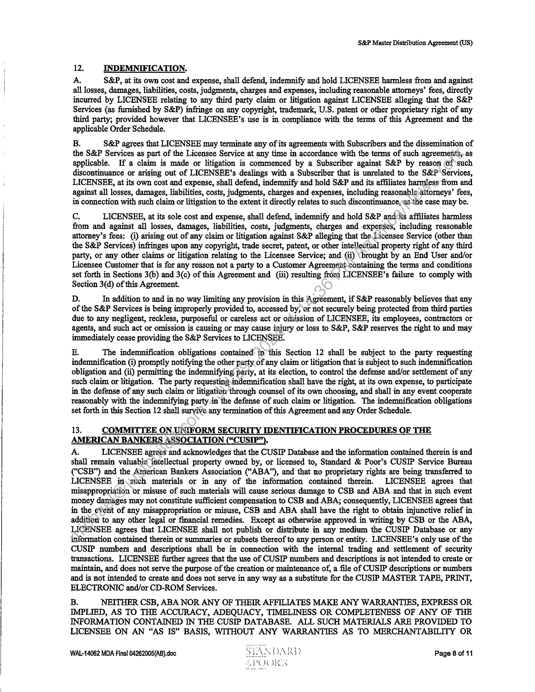
```  
```col-md
S&P Master Distribution Agreement (US)  
12. INDEMNIFICATION.  
A. S&P, at its own cost and expense, shall defend, indemnify and hold LICENSEE harmless from and against
all losses, damages, liabilities, costs, judgments, charges and expenses, including reasonable attorneys’ fees, directly
incurred by LICENSEE relating to any third party claim or litigation against LICENSEE alleging that the S&P
Services (as furnished by S&P) infringe on any copyright, trademark, U.S. patent or other proprietary right of any
third party; provided however that LICENSEE’s use is in compliance with the terms of this Agreement and the
applicable Order Schedule.  
B. S&P agrees that LICENSEE may terminate any of its agreements with Subscribers and the dissemination of
the S&P Services as part of the Licensee Service at any time in accordance with the terms of such agreements, as
applicable. If a claim is made or litigation is commenced by a Subscriber against S&P by reason Of such
discontinuance or arising out of LICENSEE’s dealings with a Subscriber that is unrelated to the S&P Services,
LICENSEE, at its own cost and expense, shall defend, indemnify and hold S&P and its affiliates harmless from and
against all losses, damages, liabilities, costs, judgments, charges and expenses, including reasonable attorneys’ fees,
in connection with such claim or litigation to the extent it directly relates to such discontinuance,as ‘the case may be.  
Cc. LICENSEE, at its sole cost and expense, shall defend, indemnify and hold S&P ands affiliates harmless
from and against all losses, damages, liabilities, costs, judgments, charges and expenses, including reasonable
attorney’s fees: (i) arising out of any claim or litigation against S&P alleging that the Licensee Service (other than
the S&P Services) infringes upon any copyright, trade secret, patent, or other intellectual property right of any third
party, or any other claims or litigation relating to the Licensee Service; and (ii) ‘brought by an End User and/or
Licensee Customer that is for any reason not a party to a Customer Agreemeiit-containing the terms and conditions
set forth in Sections 3(b) and 3(c) of this Agreement and (iii) resulting from LICENSEE’s failure to comply with
Section 3(d) of this Agreement.  
D. In addition to and in no way limiting any provision in this Agreement, if S&P reasonably believes that any
of the S&P Services is being improperly provided to, accessed by, or not securely being protected from third parties
due to any negligent, reckless, purposeful or careless act or omission of LICENSEE, its employees, contractors or
agents, and such act or omission is causing or may cause injury or loss to S&P, S&P reserves the right to and may
immediately cease providing the S&P Services to LICENSEE.  
E. The indemnification obligations contained in this Section 12 shall be subject to the party requesting
indemnification (i) promptly notifying the other party of any claim or litigation that is subject to such indemnification
obligation and (ii) permitting the indemnifying party, at its election, to control the defense and/or settlement of any
such claim or litigation. The party requestingindemnification shall have the right, at its own expense, to participate
in the defense of any such claim or litigation through counsel of its own choosing, and shall in any event cooperate
reasonably with the indemnifying party in the defense of such claim or litigation. The indemnification obligations
set forth in this Section 12 shall survive any termination of this Agreement and any Order Schedule.  
13. COMMITTEE ON. UNIFORM SECURITY IDENTIFICATION PROCEDURES OF THE
AMERICAN BANKERS ASSOCIATION (“CUSIP”).  
A. LICENSEE agrees and acknowledges that the CUSIP Database and the information contained therein is and
shall remain valuabie¢ intellectual property owned by, or licensed to, Standard & Poor’s CUSIP Service Bureau
(“CSB”) and the Anierican Bankers Association (“ABA”), and that no proprietary rights are being transferred to
LICENSEE in stich materials or in any of the information contained therein. LICENSEE agrees that
misappropriation or misuse of such materials will cause serious damage to CSB and ABA and that in such event
money damages may not constitute sufficient compensation to CSB and ABA; consequently, LICENSEE agrees that
in the event of any misappropriation or misuse, CSB and ABA shall have the right to obtain injunctive relief in
addition to any other legal or financial remedies. Except as otherwise approved in writing by CSB or the ABA,
LICENSEE agrees that LICENSEE shall not publish or distribute in any medium the CUSIP Database or any
information contained therein or summaries or subsets thereof to any person or entity. LICENSEE’s only use of the
CUSIP numbers and descriptions shall be in connection with the internal trading and settlement of security
transactions, LICENSEE further agrees that the use of CUSIP numbers and descriptions is not intended to create or
maintain, and does not serve the purpose of the creation or maintenance of, a file of CUSIP descriptions or numbers
and is not intended to create and does not serve in any way as a substitute for the CUSIP MASTER TAPE, PRINT,
ELECTRONIC and/or CD-ROM Services.  
B. NEITHER CSB, ABA NOR ANY OF THEIR AFFILIATES MAKE ANY WARRANTIES, EXPRESS OR
IMPLIED, AS TO THE ACCURACY, ADEQUACY, TIMELINESS OR COMPLETENESS OF ANY OF THE
INFORMATION CONTAINED IN THE CUSIP DATABASE. ALL SUCH MATERIALS ARE PROVIDED TO
LICENSEE ON AN “AS IS” BASIS, WITHOUT ANY WARRANTIES AS TO MERCHANTABILITY OR  
WAL-14062 MDA Final 04262005(AB).doc Page 8 of 11  
```
````
Notes:    
````col
```col-md
flexGrow=.5
===
> [!info] [Page 9](_attachments/images_3.6.4.1.7.2SPDJI_MOD_MDA_20050401.pdf_155113/page_9.png)
> 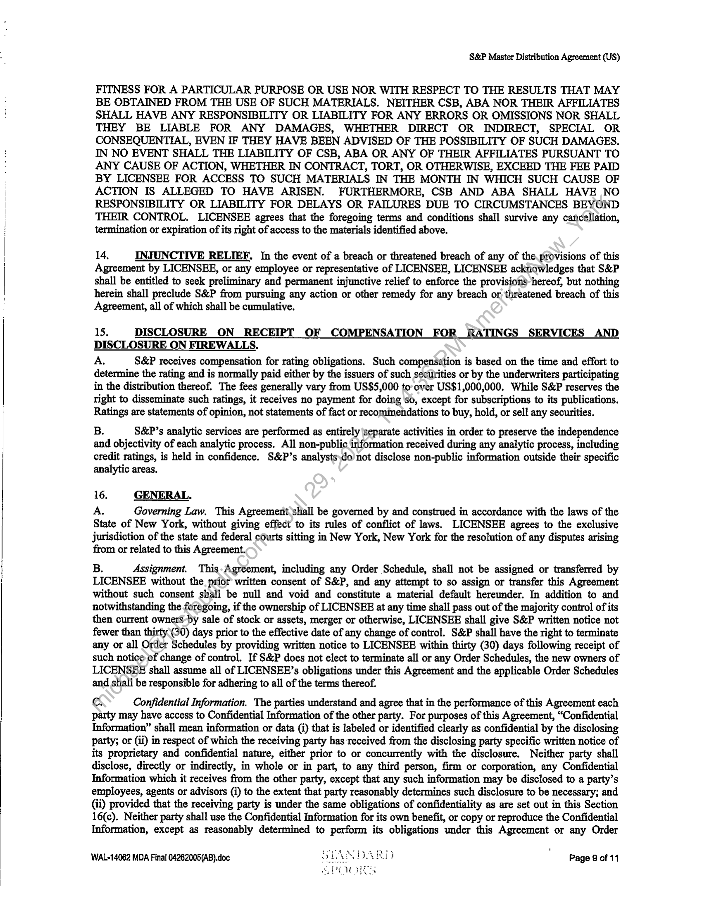
```  
```col-md
S&P Master Distribution Agreement (US)  
FITNESS FOR A PARTICULAR PURPOSE OR USE NOR WITH RESPECT TO THE RESULTS THAT MAY
BE OBTAINED FROM THE USE OF SUCH MATERIALS. NEITHER CSB, ABA NOR THEIR AFFILIATES
SHALL HAVE ANY RESPONSIBILITY OR LIABILITY FOR ANY ERRORS OR OMISSIONS NOR SHALL
THEY BE LIABLE FOR ANY DAMAGES, WHETHER DIRECT OR INDIRECT, SPECIAL OR
CONSEQUENTIAL, EVEN IF THEY HAVE BEEN ADVISED OF THE POSSIBILITY OF SUCH DAMAGES,
IN NO EVENT SHALL THE LIABILITY OF CSB, ABA OR ANY OF THEIR AFFILIATES PURSUANT TO
ANY CAUSE OF ACTION, WHETHER IN CONTRACT, TORT, OR OTHERWISE, EXCEED THE FEE PAID
BY LICENSEE FOR ACCESS TO SUCH MATERIALS IN THE MONTH IN WHICH SUCH CAUSE OF
ACTION JS ALLEGED TO HAVE ARISEN. FURTHERMORE, CSB AND ABA SHALL HAVE NO
RESPONSIBILITY OR LIABILITY FOR DELAYS OR FAILURES DUE TO CIRCUMSTANCES BEYOND
THEIR CONTROL. LICENSEE agrees that the foregoing terms and conditions shall survive any cancellation,
termination or expiration of its right of access to the materials identified above.  
14, INJUNCTIVE RELIEF. In the event of a breach or threatened breach of any of the.provisions of this
Agreement by LICENSEE, or any employee or representative of LICENSEE, LICENSEE acknowledges that S&P
shall be entitled to seek preliminary and permanent injunctive relief to enforce the provisions hereof, but nothing
herein shall preclude S&P from pursuing any action or other remedy for any breach or, threatened breach of this
Agreement, all of which shall be cumulative.  
15, DISCLOSURE ON RECEIPT OF COMPENSATION FOR RATINGS SERVICES AND
DISCLOSURE ON FIREWALLS.  
A, S&P receives compensation for rating obligations. Such compensation is based on the time and effort to
determine the rating and is normally paid either by the issuers of such secUrities or by the underwriters participating
in the distribution thereof. The fees generally vary from US$5,000 to over US$1,000,000. While S&P reserves the
right to disseminate such ratings, it receives no payment for doing ‘so, except for subscriptions to its publications,
Ratings are statements of opinion, not statements of fact or recommendations to buy, hold, or sell any securities.  
B. S&P’s analytic services are performed as entirely \separate activities in order to preserve the independence
and objectivity of each analytic process. All non-public information received during any analytic process, including
credit ratings, is held in confidence. S&P’s analystsydo not disclose non-public information outside their specific
analytic areas.  
16. | GENERAL.
A. Governing Law, This Agreement shall be governed by and construed in accordance with the laws of the  
State of New York, without giving effect to its rules of conflict of laws. LICENSEE agrees to the exclusive
jurisdiction of the state and federal courts sitting in New York, New York for the resolution of any disputes arising
from or related to this Agreement.  
B. Assignment. This-Agreement, including any Order Schedule, shall not be assigned or transferred by
LICENSEE without the prior written consent of S&P, and any attempt to so assign or transfer this Agreement
without such consent shall be null and void and constitute a material default hereunder. In addition to and
notwithstanding the foregoing, if the ownership of LICENSEE at any time shall pass out of the majority control of its
then current owners-by sale of stock or assets, merger or otherwise, LICENSEE shall give S&P written notice not
fewer than thirty (30) days prior to the effective date of any change of control. S&P shall have the right to terminate
any or all Order Schedules by providing written notice to LICENSEE within thirty (30) days following receipt of
such notice of change of control. If S&P does not elect to terminate all or any Order Schedules, the new owners of
LICENSEE shall assume all of LICENSEE’s obligations under this Agreement and the applicable Order Schedules
and shali be responsible for adhering to all of the terms thereof.  
c, Confidential Information. The parties understand and agree that in the performance of this Agreement each
party may have access to Confidential Information of the other party. For purposes of this Agreement, “Confidential
Information” shall mean information or data (i) that is labeled or identified clearly as confidential by the disclosing
party; or (ii) in respect of which the receiving party has received from the disclosing party specific written notice of
its proprietary and confidential nature, either prior to or concurrently with the disclosure. Neither party shall
disclose, directly or indirectly, in whole or in part, to any third person, firm or corporation, any Confidential
Information which it receives from the other party, except that any such information may be disclosed to a party’s
employees, agents or advisors (i) to the extent that party reasonably determines such disclosure to be necessary; and
(ii) provided that the receiving party is under the same obligations of confidentiality as are set out in this Section
16(c). Neither party shall use the Confidential Information for its own benefit, or copy or reproduce the Confidential
Information, except as reasonably determined to perform its obligations under this Agreement or any Order  
WAL-14062 MDA Final 04262005(AB).doc Page 9 of 11  
```
````
Notes:    
````col
```col-md
flexGrow=.5
===
> [!info] [Page 10](_attachments/images_3.6.4.1.7.2SPDJI_MOD_MDA_20050401.pdf_155113/page_10.png)
> 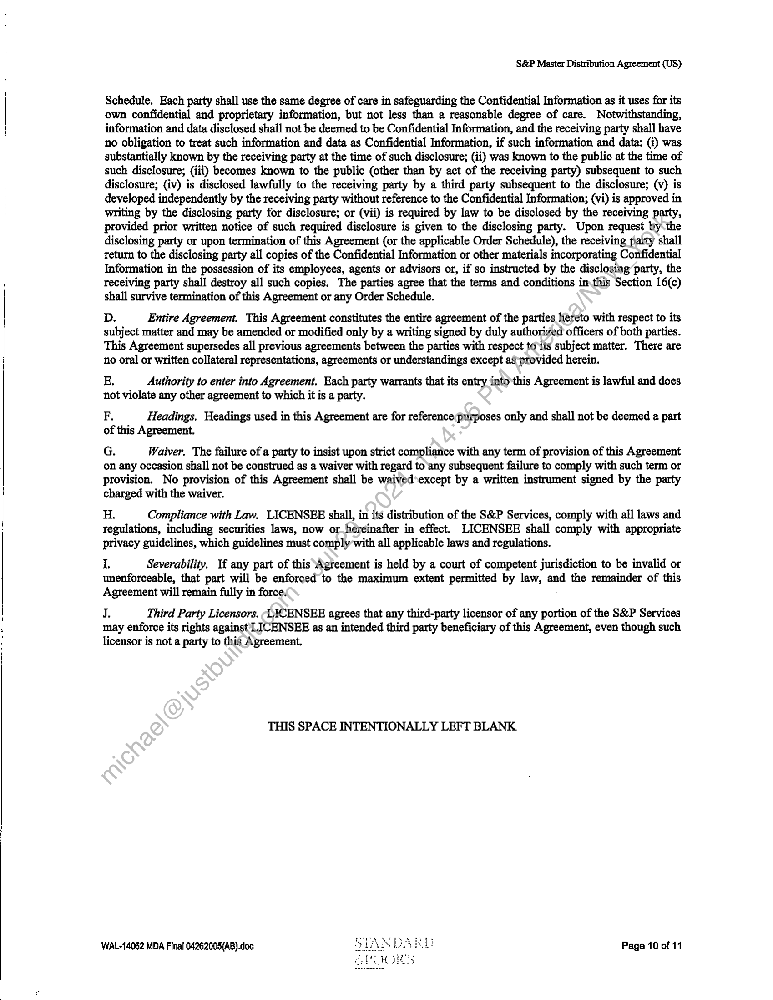
```  
```col-md
S&P Master Distribution Agreement (US)  
Schedule. Each party shall use the same degree of care in safeguarding the Confidential Information as it uses for its
own confidential and proprietary information, but not less than a reasonable degree of care. Notwithstanding,
information and data disclosed shall not be deemed to be Confidential Information, and the receiving party shall have
no obligation to treat such information and data as Confidential Information, if such information and data: (i) was
substantially known by the receiving party at the time of such disclosure; (ii) was known to the public at the time of
such disclosure; (iii) becomes known to the public (other than by act of the receiving party) subsequent to such
disclosure; (iv) is disclosed lawfully to the receiving party by a third party subsequent to the disclosure; (v) is
developed independently by the receiving party without reference to the Confidential Information; (vi) is approved in
writing by the disclosing party for disclosure; or (vii) is required by law to be disclosed by the receiving party,
provided prior written notice of such required disclosure is given to the disclosing party. Upon request by the
disclosing party or upon termination of this Agreement (or the applicable Order Schedule), the receiving paxty shall
return to the disclosing party all copies of the Confidential Information or other materials incorporating Confidential
Information in the possession of its employees, agents or advisors or, if so instructed by the disclosing party, the
receiving party shall destroy all such copies. The parties agree that the terms and conditions inthis Section 16(c)
shall survive termination of this Agreement or any Order Schedule.  
D. Entire Agreement. This Agreement constitutes the entire agreement of the parties hereto with respect to its
subject matter and may be amended or modified only by a writing signed by duly authorized officers of both parties.
This Agreement supersedes all previous agreements between the parties with respect toils subject matter. There are
no oral or written collateral representations, agreements or understandings except ag provided herein.  
E. Authority to enter into Agreement. Each party warrants that its entry into'this Agreement is lawful and does
not violate any other agreement to which it is a party.  
F Headings. Headings used in this Agreement are for referencepurposes only and shall not be deemed a part
of this Agreement.  
G. Waiver. The failure of a party to insist upon strict compliance with any term of provision of this Agreement
on any occasion shall not be construed as a waiver with regard to any subsequent failure to comply with such term or
provision. No provision of this Agreement shall be waived*except by a written instrument signed by the party
charged with the waiver.  
H. Compliance with Law. LICENSEE shall, in its distribution of the S&P Services, comply with all laws and
regulations, including securities laws, now or.hereinafter in effect. LICENSEE shall comply with appropriate
privacy guidelines, which guidelines must comply with all applicable laws and regulations.  
I. Severability. If any part of this Agreement is held by a court of competent jurisdiction to be invalid or
unenforceable, that part will be enforced to the maximum extent permitted by law, and the remainder of this
Agreement will remain fully in force:  
J. Third Party Licensors. LACENSEE agrees that any third-party licensor of any portion of the S&P Services
may enforce its rights against LICENSEE as an intended third party beneficiary of this Agreement, even though such
licensor is not a party to this Agreement.  
THIS SPACE INTENTIONALLY LEFT BLANK  
WAL-14062 MDA Final 04262005(AB).doc Page 10 of 11  
```
````
Notes:    
````col
```col-md
flexGrow=.5
===
> [!info] [Page 11](_attachments/images_3.6.4.1.7.2SPDJI_MOD_MDA_20050401.pdf_155113/page_11.png)
> 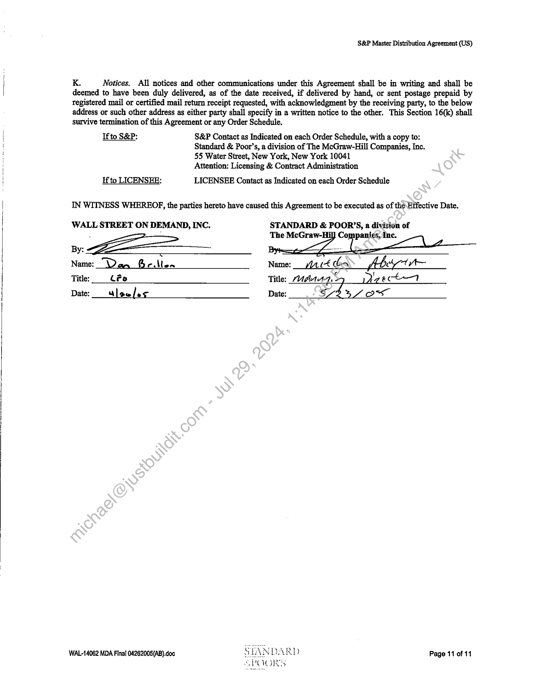
```  
```col-md
S&P Master Distribution Agreement (US)  
K. Notices. All notices and other communications under this Agreement shall be in writing and shall be
deemed to have been duly delivered, as of the date received, if delivered by hand, or sent postage prepaid by
registered mail or certified mail return receipt requested, with acknowledgment by the receiving party, to the below
address or such other address as either party shall specify in a written notice to the other. This Section 16(k) shall
survive termination of this Agreement or any Order Schedule.  
Ifto S&P: S&P Contact as Indicated on each Order Schedule, with a copy to:
Standard & Poor’s, a division of The McGraw-Hill Companies, Inc.
55 Water Street, New York, New York 10041
Attention: Licensing & Contract Administration  
If to LICENSEE: LICENSEE Contact as Indicated on each Order Schedule  
IN WITNESS WHEREOF, the parties hereto have caused this Agreement to be executed as of the Effective Date.  
WALL STREET ON DEMAND, INC. STANDARD & POOR’S, a division of  
The McGraw-Hil] Companies, Inc.
By:  
Name: “Dan Geillon Name: rt LA Abit  
Title: _ #0 Title: Maar4.5 eect
Date: Slow/es Date: SA Ow  
WAL-14062 MDA Final 04262005(AB).doc Page 11 of 11  
```
````
Notes:  


![[_attachments/3.6.4.1.7.2 SPDJI_MOD_MDA_20050401.pdf]