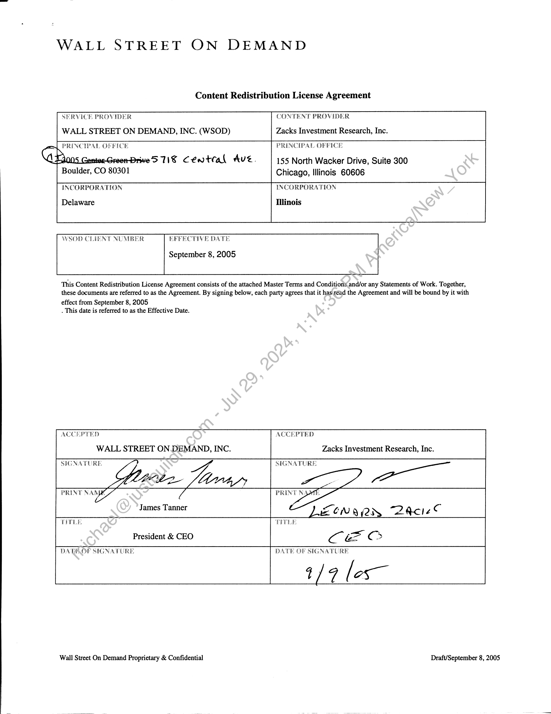
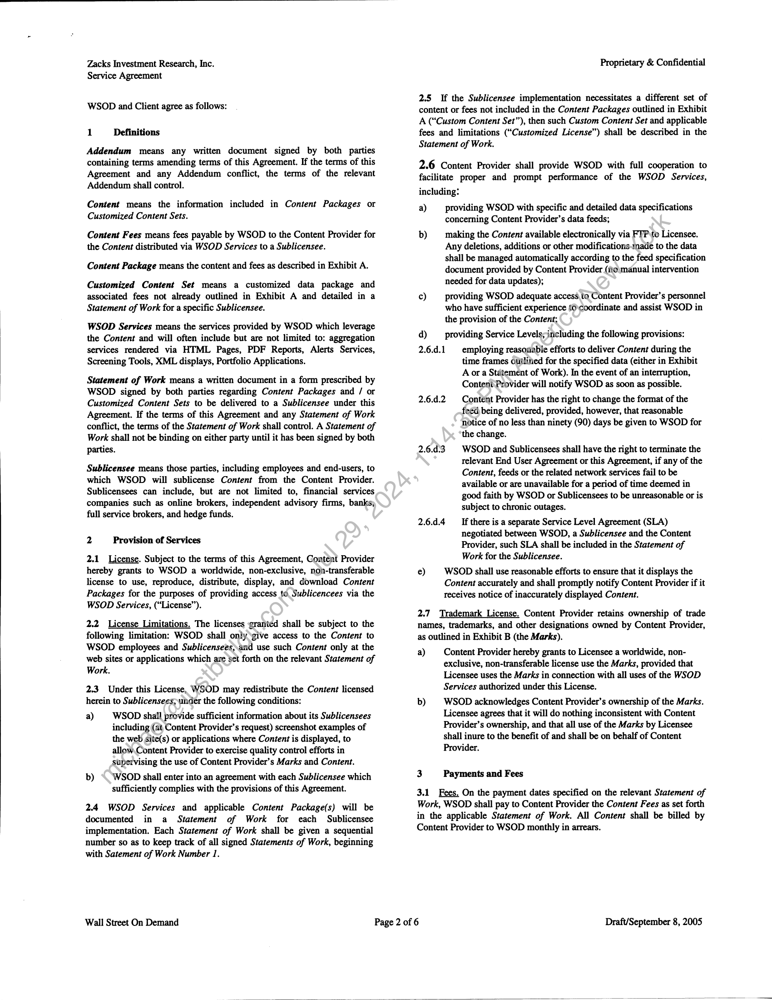
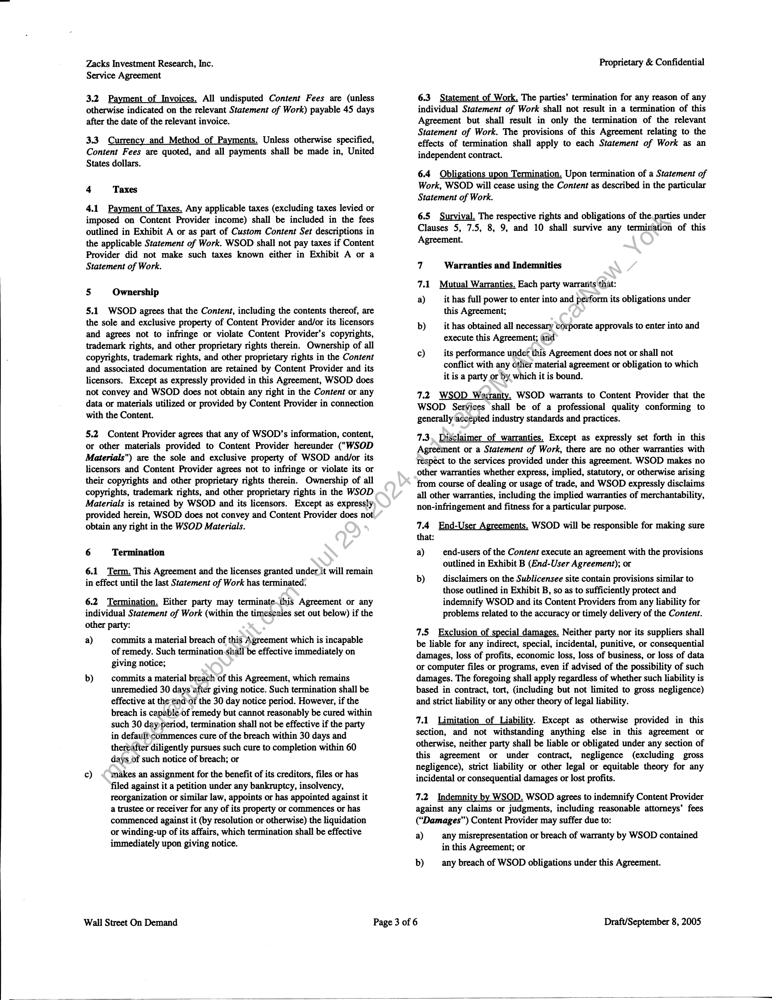
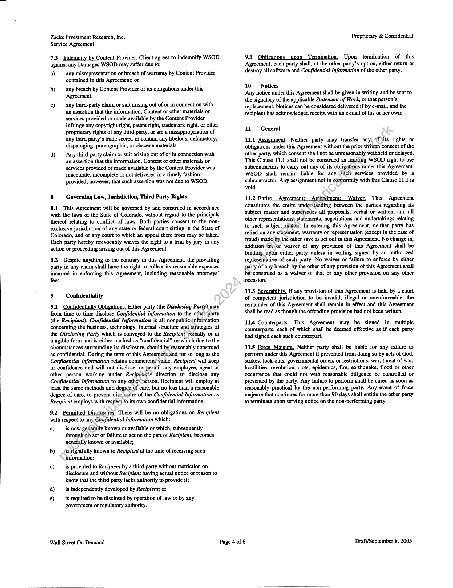
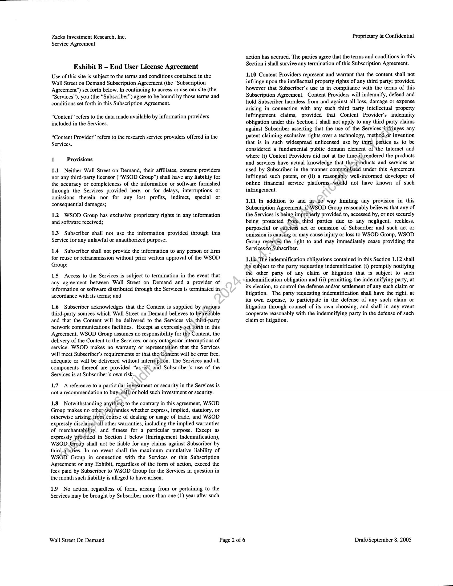
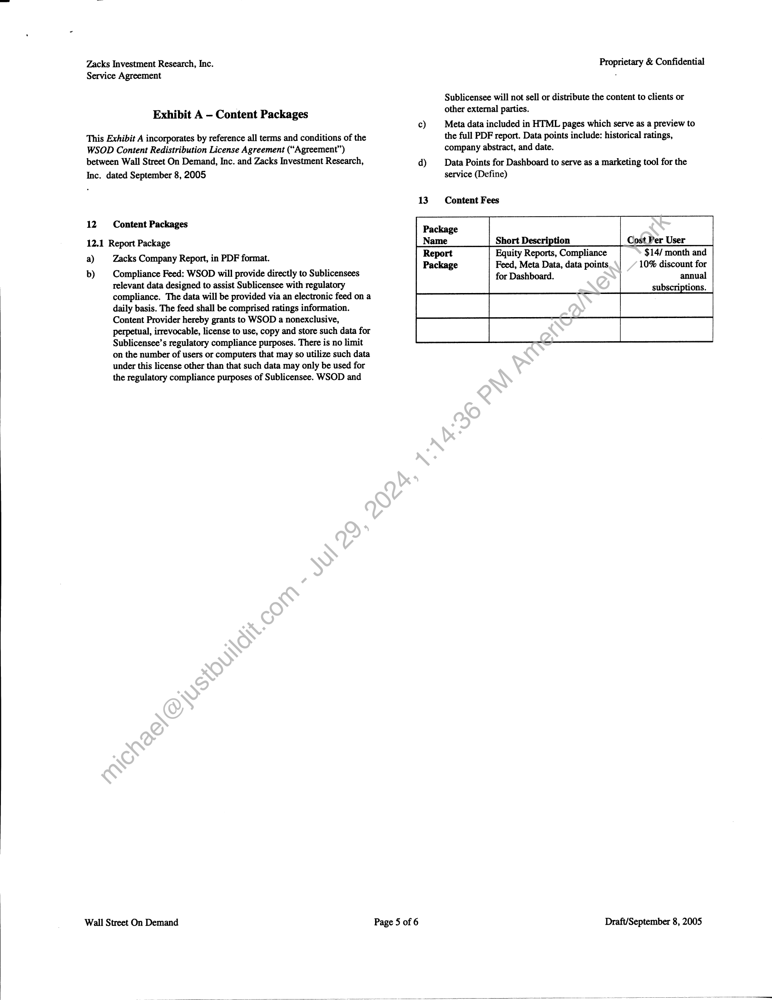

##### Content Redistribution License Agreement]

  
````col
```col-md
flexGrow=.5
===
> [!info] [Page 1](_attachments/images_3.6.4.1.8.120050908_WSOD_ZACKSContentRedistributionLicenseAgreement_signed.pdf_155512/page_1.png)
> 
```  
```col-md
WALL STREET ON DEMAND  
Content Redistribution License Agreement  
SERVICE PROVIDER
WALL STREET ON DEMAND, INC. (WSOD)  
CONTENT PROVIDER  
Zacks Investment Research, Inc.  
PRINCIPAL OFFICE
GProns canter Groom brive'S 71 Cental Ave.  
Boulder, CO 80301  
PRINCIPAL OFF  
155 North Wacker Drive, Suite 300
Chicago, Illinois 60606  
CE  
INCORPORATION  
Delaware  
WSOD CLIENT NUMBER  
EFFECTIVE DATE  
September 8, 2005  
INCORPORATION  
Illinois  
This Content Redistribution License Agreement consists of the attached Master Terms and Conditionsand/or any Statements of Work. Together,
these documents are referred to as the Agreement. By signing below, each party agrees that it has read the Agreement and will be bound by it with
effect from September 8, 2005  
. This date is referred to as the Effective Date.  
ACCEPTED
WALL STREET ON DEMAND, INC.  
ACCEPTED  
Zacks Investment Research, Inc.  
SIGNATURE  
“| SIGNATURE,  
> om,  
Veen Lenn  
James Tanner  
PRINT NAN  
TITLE
President & CEO  
PRINT N.  
ZONK QA Bare
CE  
TITLE  
DATEOP SIGNATURE  
DATE OF SIGNATURE  
Wall Street On Demand Proprietary & Confidential  
1/7 les—  
Draft/September 8, 2005  
```
````
Notes:    
````col
```col-md
flexGrow=.5
===
> [!info] [Page 2](_attachments/images_3.6.4.1.8.120050908_WSOD_ZACKSContentRedistributionLicenseAgreement_signed.pdf_155512/page_2.png)
> 
```  
```col-md
Zacks Investment Research, Inc.
Service Agreement  
WSOD and Client agree as follows:  
1 Definitions  
Addendum means any written document signed by both parties
containing terms amending terms of this Agreement. If the terms of this
Agreement and any Addendum conflict, the terms of the relevant
Addendum shall control.  
Content means the information included in Content Packages or
Customized Content Sets.  
Content Fees means fees payable by WSOD to the Content Provider for
the Content distributed via WSOD Services to a Sublicensee.  
Content Package means the content and fees as described in Exhibit A.  
Customized Content Set means a customized data package and
associated fees not already outlined in Exhibit A and detailed in a
Statement of Work for a specific Sublicensee.  
WSOD Services means the services provided by WSOD which leverage
the Content and will often include but are not limited to: aggregation
services rendered via HTML Pages, PDF Reports, Alerts Services,
Screening Tools, XML displays, Portfolio Applications.  
Statement of Work means a written document in a form prescribed by
WSOD signed by both parties regarding Content Packages and / or
Customized Content Sets to be delivered to a Sublicensee under this
Agreement. If the terms of this Agreement and any Statement of Work
conflict, the terms of the Statement of Work shall control. A Statement of
Work shall not be binding on either party until it has been signed by both
parties.  
Sublicensee means those parties, including employees and end-users, to
which WSOD will sublicense Content from the Content Provider.
Sublicensees can include, but are not limited to, financial services
companies such as online brokers, independent advisory firms, banks;
full service brokers, and hedge funds.  
2 Provision of Services  
2.1 License. Subject to the terms of this Agreement, Content Provider
hereby grants to WSOD a worldwide, non-exclusive, non-transferable
license to use, reproduce, distribute, display, and download Content
Packages for the purposes of providing access to. Sublicencees via the
WSOD Services, (“License”).  
2.2 License Limitations. The licenses granted shall be subject to the
following limitation: WSOD shall only give access to the Content to
WSOD employees and Sublicensees,.and use such Content only at the
web sites or applications which are set forth on the relevant Statement of  
Work.  
2.3. Under this License, WSOD may redistribute the Content licensed  
herein to Sublicensees, under the following conditions:  
a) WSOD shall provide sufficient information about its Sublicensees
including (at Content Provider’s request) screenshot examples of
the web site(s) or applications where Content is displayed, to
allow Content Provider to exercise quality control efforts in
supervising the use of Content Provider’s Marks and Content.  
b) \\WSOD shall enter into an agreement with each Sublicensee which
sufficiently complies with the provisions of this Agreement.  
2.4 WSOD Services and applicable Content Package(s) will be
documented in a Statement of Work for each Sublicensee
implementation. Each Statement of Work shall be given a sequential
number so as to keep track of all signed Statements of Work, beginning
with Satement of Work Number 1.  
Wall Street On Demand  
Page 2 of 6  
Proprietary & Confidential  
2.5 If the Sublicensee implementation necessitates a different set of
content or fees not included in the Content Packages outlined in Exhibit
A (“Custom Content Set”), then such Custom Content Set and applicable
fees and limitations (“Customized License”) shall be described in the
Statement of Work.  
2.6 Content Provider shall provide WSOD with full cooperation to
facilitate proper and prompt performance of the WSOD Services,
including:  
a) providing WSOD with specific and detailed data specifications
concerning Content Provider’s data feeds;  
b) making the Content available electronically via FTP\to Licensee.
Any deletions, additions or other modifications-made to the data
shall be managed automatically according to the feed specification
document provided by Content Provider (fo\manual intervention
needed for data updates);  
c) providing WSOD adequate access, to Content Provider’s personnel
who have sufficient experience {0 coordinate and assist WSOD in
the provision of the Content;  
d) _ providing Service Levels; including the following provisions:  
2.6.d.1_ employing reasonable efforts to deliver Content during the  
time frames outlined for the specified data (either in Exhibit
A ora Statement of Work). In the event of an interruption,
Content Provider will notify WSOD as soon as possible.  
Content Provider has the right to change the format of the
feed being delivered, provided, however, that reasonable
notice of no less than ninety (90) days be given to WSOD for
the change.  
WSOD and Sublicensees shall have the right to terminate the
relevant End User Agreement or this Agreement, if any of the
Content, feeds or the related network services fail to be
available or are unavailable for a period of time deemed in
good faith by WSOD or Sublicensees to be unreasonable or is
subject to chronic outages.  
If there is a separate Service Level Agreement (SLA)
negotiated between WSOD, a Sublicensee and the Content
Provider, such SLA shall be included in the Statement of
Work for the Sublicensee.  
e) | WSOD shall use reasonable efforts to ensure that it displays the
Content accurately and shall promptly notify Content Provider if it
teceives notice of inaccurately displayed Content.  
2.6.4.2  
2.6.4.3  
2.6.4.4  
2.7 Trademark License. Content Provider retains ownership of trade
names, trademarks, and other designations owned by Content Provider,
as outlined in Exhibit B (the Marks).  
a) Content Provider hereby grants to Licensee a worldwide, nonexclusive, non-transferable license use the Marks, provided that
Licensee uses the Marks in connection with all uses of the WSOD
Services authorized under this License.  
b) — WSOD acknowledges Content Provider’s ownership of the Marks.
Licensee agrees that it will do nothing inconsistent with Content
Provider’s ownership, and that all use of the Marks by Licensee
shall inure to the benefit of and shall be on behalf of Content
Provider.  
3 Payments and Fees  
3.1 Fees. On the payment dates specified on the relevant Statement of
Work, WSOD shall pay to Content Provider the Content Fees as set forth
in the applicable Statement of Work. All Content shall be billed by
Content Provider to WSOD monthly in arrears.  
Draft/September 8, 2005  
```
````
Notes:    
````col
```col-md
flexGrow=.5
===
> [!info] [Page 3](_attachments/images_3.6.4.1.8.120050908_WSOD_ZACKSContentRedistributionLicenseAgreement_signed.pdf_155512/page_3.png)
> 
```  
```col-md
Zacks Investment Research, Inc.
Service Agreement  
3.2 Payment of Invoices. All undisputed Content Fees are (unless
otherwise indicated on the relevant Statement of Work) payable 45 days
after the date of the relevant invoice.  
3.3. Currency and Method of Payments. Unless otherwise specified,
Content Fees are quoted, and all payments shall be made in, United
States dollars.  
4 Taxes  
4.1 Payment of Taxes. Any applicable taxes (excluding taxes levied or
imposed on Content Provider income) shall be included in the fees
outlined in Exhibit A or as part of Custom Content Set descriptions in
the applicable Statement of Work. WSOD shall not pay taxes if Content
Provider did not make such taxes known either in Exhibit A or a
Statement of Work.  
5 Ownership  
5.1 WSOD agrees that the Content, including the contents thereof, are
the sole and exclusive property of Content Provider and/or its licensors
and agrees not to infringe or violate Content Provider’s copyrights,
trademark rights, and other proprietary rights therein. Ownership of all
copyrights, trademark rights, and other proprietary rights in the Content
and associated documentation are retained by Content Provider and its
licensors. Except as expressly provided in this Agreement, WSOD does
not convey and WSOD does not obtain any right in the Content or any
data or materials utilized or provided by Content Provider in connection
with the Content.  
5.2 Content Provider agrees that any of WSOD’s information, content,
or other materials provided to Content Provider hereunder ("WSOD
Materials") are the sole and exclusive property of WSOD and/or its
licensors and Content Provider agrees not to infringe or violate its or
their copyrights and other proprietary rights therein. Ownership of all
copyrights, trademark rights, and other proprietary rights in the WSOD
Materials is retained by WSOD and its licensors. Except as expressly)
provided herein, WSOD does not convey and Content Provider does not.
obtain any right in the WSOD Materials.  
6 Termination  
6.1 Term. This Agreement and the licenses granted under it will remain
in effect until the last Statement of Work has terminated.  
6.2 Termination. Either party may terminate.this Agreement or any
individual Statement of Work (within the timescales set out below) if the
other party:  
a) commits a material breach of this Agreement which is incapable
of remedy. Such termination shall be effective immediately on
giving notice;  
b) commits a material breach of this Agreement, which remains
unremedied 30 days after giving notice. Such termination shall be
effective at the end of the 30 day notice period. However, if the
breach is capable of remedy but cannot reasonably be cured within
such 30 dayperiod, termination shall not be effective if the party
in defaulf#commences cure of the breach within 30 days and
thereafter diligently pursues such cure to completion within 60
days of such notice of breach; or  
c) «makes an assignment for the benefit of its creditors, files or has
filed against it a petition under any bankruptcy, insolvency,
reorganization or similar law, appoints or has appointed against it
a trustee or receiver for any of its property or commences or has
commenced against it (by resolution or otherwise) the liquidation
or winding-up of its affairs, which termination shall be effective
immediately upon giving notice.  
Wall Street On Demand  
Page 3 of 6  
Proprietary & Confidential  
6.3 Statement of Work, The parties’ termination for any reason of any
individual Statement of Work shall not result in a termination of this
Agreement but shall result in only the termination of the relevant
Statement of Work. The provisions of this Agreement relating to the
effects of termination shall apply to each Statement of Work as an
independent contract.  
6.4 Obligations upon Termination. Upon termination of a Statement of
Work, WSOD will cease using the Content as described in the particular
Statement of Work.  
6.5 Survival. The respective rights and obligations of the parties under
Clauses 5, 7.5, 8, 9, and 10 shall survive any termination of this
Agreement.  
7 Warranties and Indemnities  
7.1 Mutual Warranties. Each party warranits that:  
a) __ it has full power to enter into and perform its obligations under
this Agreement;  
b) _ it has obtained all necessary corporate approvals to enter into and
execute this Agreement; and  
c) __ its performance under this Agreement does not or shall not
conflict with any other material agreement or obligation to which
it is a party or by which it is bound.  
7.2, WSOD Warranty. WSOD warrants to Content Provider that the
WSOD Services shall be of a professional quality conforming to
generally accepted industry standards and practices.  
7.3. Disclaimer _of warranties. Except as expressly set forth in this
Agreement or a Statement of Work, there are no other warranties with
respect to the services provided under this agreement. WSOD makes no
other warranties whether express, implied, statutory, or otherwise arising
from course of dealing or usage of trade, and WSOD expressly disclaims
all other warranties, including the implied warranties of merchantability,
non-infringement and fitness for a particular purpose.  
7.4 End-User Agreements, WSOD will be responsible for making sure  
that:  
a) end-users of the Content execute an agreement with the provisions
outlined in Exhibit B (End-User Agreement); or  
b) disclaimers on the Sublicensee site contain provisions similar to
those outlined in Exhibit B, so as to sufficiently protect and
indemnify WSOD and its Content Providers from any liability for
problems related to the accuracy or timely delivery of the Content.  
7.5 Exclusion of special damages. Neither party nor its suppliers shall
be liable for any indirect, special, incidental, punitive, or consequential
damages, loss of profits, economic loss, loss of business, or loss of data
or computer files or programs, even if advised of the possibility of such
damages. The foregoing shall apply regardless of whether such liability is
based in contract, tort, (including but not limited to gross negligence)
and strict liability or any other theory of legal liability.  
7.1 Limitation of Liability. Except as otherwise provided in this
section, and not withstanding anything else in this agreement or
otherwise, neither party shall be liable or obligated under any section of
this agreement or under contract, negligence (excluding gross
negligence), strict liability or other legal or equitable theory for any
incidental or consequential damages or lost profits.  
7.2 Indemnity by WSOD. WSOD agrees to indemnify Content Provider  
against any claims or judgments, including reasonable attorneys’ fees  
(“Damages”) Content Provider may suffer due to:  
a) any misrepresentation or breach of warranty by WSOD contained
in this Agreement; or  
b) any breach of WSOD obligations under this Agreement.  
Draft/September 8, 2005  
```
````
Notes:    
````col
```col-md
flexGrow=.5
===
> [!info] [Page 4](_attachments/images_3.6.4.1.8.120050908_WSOD_ZACKSContentRedistributionLicenseAgreement_signed.pdf_155512/page_4.png)
> 
```  
```col-md
Zacks Investment Research, Inc.
Service Agreement  
7.3 Indemnity by Content Provider. Client agrees to indemnify WSOD  
against any Damages WSOD may suffer due to:  
a) any misrepresentation or breach of warranty by Content Provider
contained in this Agreement; or  
b) any breach by Content Provider of its obligations under this
Agreement.  
c) any third-party claim or suit arising out of or in connection with
an assertion that the information, Content or other materials or
services provided or made available by the Content Provider
infringe any copyright right, patent right, trademark right, or other
proprietary rights of any third party, or are a misappropriation of
any third party’s trade secret, or contain any libelous, defamatory,
disparaging, pornographic, or obscene materials.  
d) Any third-party claim or suit arising out of or in connection with
an assertion that the information, Content or other materials or
services provided or made available by the Content Provider was
inaccurate, incomplete or not delivered in a timely fashion;
provided, however, that such assertion was not due to WSOD.  
8 Governing Law, Jurisdiction, Third Party Rights  
8.1 This Agreement will be governed by and construed in accordance
with the laws of the State of Colorado, without regard to the principals
thereof relating to conflict of laws. Both parties consent to the nonexclusive jurisdiction of any state or federal court sitting in the State of
Colorado, and of any court to which an appeal there from may be taken.
Each party hereby irrevocably waives the right to a trial by jury in any
action or proceeding arising out of this Agreement.  
8.2 Despite anything to the contrary in this Agreement, the prevailing
party in any claim shall have the right to collect its reasonable expenses
incurred in enforcing this Agreement, including reasonable attorneys’
fees.  
9 Confidentiality  
9.1 Confidentially Obligations. Either party (the Disclosing Party) may
from time to time disclose Confidential Information to the other party
(the Recipient). Confidential Information is all nonpublic:information
concerning the business, technology, internal structure and Strategies of
the Disclosing Party which is conveyed to the Recipient yerbally or in
tangible form and is either marked as “confidential” or which due to the
circumstances surrounding its disclosure, should be reasonably construed
as confidential. During the term of this Agreement,and for so long as the
Confidential Information retains commercial*value, Recipient will keep
in confidence and will not disclose, or permit any employee, agent or
other person working under Recipient's direction to disclose any
Confidential Information to any other person. Recipient will employ at
least the same methods and degree of care, but no less than a reasonable
degree of care, to prevent disclosure of the Confidential Information as
Recipient employs with respect to its own confidential information.  
9.2 Permitted Disclosures. There will be no obligations on Recipient  
with respect to any Confidential Information which:  
a) is now generally known or available or which, subsequently
through a6 act or failure to act on the part of Recipient, becomes
generally known or available;  
b) _is.tightfully known to Recipient at the time of receiving such
information;  
c) is provided to Recipient by a third party without restriction on
disclosure and without Recipient having actual notice or reason to
know that the third party lacks authority to provide it;  
d) _ is independently developed by Recipient, or  
€) __ is required to be disclosed by operation of law or by any
government or regulatory authority.  
Wall Street On Demand  
Page 4 of 6  
Proprietary & Confidential  
9.3 Obligations upon Termination. Upon termination of this
Agreement, each party shall, at the other party’s option, either return or
destroy all software and Confidential Information of the other party.  
10 Notices  
Any notice under this Agreement shall be given in writing and be sent to
the signatory of the applicable Statement of Work, or that person’s
replacement. Notices can be considered delivered if by e-mail, and the
recipient has acknowledged receipt with an e-mail of his or her own;  
11 General  
11.1 Assignment. Neither party may transfer any; of )its rights or
obligations under this Agreement without the prior written consent of the
other party, which consent shall not be unreasonably withheld or delayed.
This Clause 11.1 shall not be construed as limiting WSOD right to use
subcontractors to carry out any of its obligations under this Agreement.
WSOD shall remain liable for any \sucii services provided by a
subcontractor. Any assignment not in conformity with this Clause 11.1 is
void.  
11.2 Entire Agreement; Amendment; Waiver. This Agreement
constitutes the entire understanding between the parties regarding its
subject matter and supétsedes all proposals, verbal or written, and all
other representations)\statements, negotiations and undertakings relating
to such subject matter. In entering this Agreement, neither party has
relied on any statement, warranty or representation (except in the case of
fraud) made/by, the other save as set out in this Agreement. No change in,
addition ‘to; or waiver of any provision of this Agreement shall be
binding. upon either party unless in writing signed by an authorized
reptesentative of such party. No waiver or failure to enforce by either
party of any breach by the other of any provision of this Agreement shall
be*construed as a waiver of that or any other provision on any other
occasion.  
11.3 Severability. If any provision of this Agreement is held by a court
of competent jurisdiction to be invalid, illegal or unenforceable, the
remainder of this Agreement shall remain in effect and this Agreement
shall be read as though the offending provision had not been written.  
11.4 Counterparts. This Agreement may be signed in multiple
counterparts, each of which shall be deemed effective as if each party
had signed each such counterpart.  
11.5 Force Majeure. Neither party shall be liable for any failure to
perform under this Agreement if prevented from doing so by acts of God,
strikes, lock-outs, governmental orders or restrictions, war, threat of war,
hostilities, revolution, riots, epidemics, fire, earthquake, flood or other
occurrence that could not with reasonable diligence be controlled or
prevented by the party. Any failure to perform shall be cured as soon as
reasonably practical by the non-performing party. Any event of force
majeure that continues for more than 90 days shall entitle the other party
to terminate upon serving notice on the non-performing party.  
Draft/September 8, 2005  
```
````
Notes:    
````col
```col-md
flexGrow=.5
===
> [!info] [Page 5](_attachments/images_3.6.4.1.8.120050908_WSOD_ZACKSContentRedistributionLicenseAgreement_signed.pdf_155512/page_5.png)
> 
```  
```col-md
Zacks Investment Research, Inc.
Service Agreement  
Exhibit B - End User License Agreement  
Use of this site is subject to the terms and conditions contained in the
Wall Street on Demand Subscription Agreement (the "Subscription
Agreement") set forth below. In continuing to access or use our site (the
“Services”), you (the “Subscriber”) agree to be bound by those terms and
conditions set forth in this Subscription Agreement.  
“Content” refers to the data made available by information providers
included in the Services.  
“Content Provider” refers to the research service providers offered in the
Services.  
1 Provisions  
1.1 Neither Wall Street on Demand, their affiliates, content providers
nor any third-party licensor (“WSOD Group”) shall have any liability for
the accuracy or completeness of the information or software furnished
through the Services provided here, or for delays, interruptions or
omissions therein nor for any lost profits, indirect, special or
consequential damages;  
1.2. WSOD Group has exclusive proprietary rights in any information
and software received;  
1.3 Subscriber shall not use the information provided through this
Service for any unlawful or unauthorized purpose;  
1.4 Subscriber shall not provide the information to any person or firm
for reuse or retransmission without prior written approval of the WSOD
Group;  
1.5 Access to the Services is subject to termination in the event that
any agreement between Wall Street on Demand and a provider of
information or software distributed through the Services is terminated in,
accordance with its terms; and  
1.6 Subscriber acknowledges that the Content is supplied by various
third-party sources which Wall Street on Demand believes to bejreliable
and that the Content will be delivered to the Services via. third-party
network communications facilities. Except as expressly,set forth in this
Agreement, WSOD Group assumes no responsibility for the Content, the
delivery of the Content to the Services, or any outages Or interruptions of
service. WSOD makes no warranty or representation that the Services
will meet Subscriber’s requirements or that the-Content will be error free,
adequate or will be delivered without interruption. The Services and all
components thereof are provided “as :is* and Subscriber’s use of the
Services is at Subscriber’s own risk.  
1.7 A reference to a particular investment or security in the Services is
not a recommendation to buy,,sell) or hold such investment or security.  
1.8 Notwithstanding anything to the contrary in this agreement, WSOD
Group makes no otherwartanties whether express, implied, statutory, or
otherwise arising from Course of dealing or usage of trade, and WSOD
expressly disclaims\all other warranties, including the implied warranties
of merchantability, and fitness for a particular purpose. Except as
expressly provided in Section J below (Infringement Indemnification),
WSOD Group shall not be liable for any claims against Subscriber by
third-parties. In no event shall the maximum cumulative liability of
WSOD Group in connection with the Services or this Subscription
Agreement or any Exhibit, regardless of the form of action, exceed the
fees paid by Subscriber to WSOD Group for the Services in question in
the month such liability is alleged to have arisen.  
1.9 No action, regardless of form, arising from or pertaining to the
Services may be brought by Subscriber more than one (1) year after such  
Wall Street On Demand  
Page 2 of 6  
Proprietary & Confidential  
action has accrued. The parties agree that the terms and conditions in this
Section i shall survive any termination of this Subscription Agreement.  
1.10 Content Providers represent and warrant that the content shall not
infringe upon the intellectual property rights of any third party; provided
however that Subscriber’s use is in compliance with the terms of this
Subscription Agreement. Content Providers will indemnify, defend and
hold Subscriber harmless from and against all loss, damage or expense
arising in connection with any such third party intellectual property
infringement claims, provided that Content Provider’s indemnity
obligation under this Section J shall not apply to any third party claims
against Subscriber asserting that the use of the Services infringes any
patent claiming exclusive rights over a technology, method.or invention
that is in such widespread unlicensed use by third parties as to be
considered a fundamental public domain element of ‘the Internet and
where (i) Content Providers did not at the time,ii,rendered the products
and services have actual knowledge that thesproducts and services as
used by Subscriber in the manner contemplated under this Agreement
infringed such patent, or (ii) a reasonably well-informed developer of
online financial service platforms-would not have known of such
infringement.  
1.11 In addition to and initio way limiting any provision in this
Subscription Agreement, if WSOD Group reasonably believes that any of
the Services is being improperly provided to, accessed by, or not securely
being protected from, third parties due to any negligent, reckless,
purposeful or cafeless act or omission of Subscriber and such act or
omission is causing or may cause injury or loss to WSOD Group, WSOD
Group reserves the right to and may immediately cease providing the
Services-to Subscriber.  
1.12, The indemnification obligations contained in this Section 1.12 shall
be subject to the party requesting indemnification (i) promptly notifying
the other party of any claim or litigation that is subject to such
indemnification obligation and (ii) permitting the indemnifying party, at
its election, to control the defense and/or settlement of any such claim or
litigation. The party requesting indemnification shall have the right, at
its own expense, to participate in the defense of any such claim or
litigation through counsel of its own choosing, and shall in any event
cooperate reasonably with the indemnifying party in the defense of such
claim or litigation.  
Draft/September 8, 2005  
```
````
Notes:    
````col
```col-md
flexGrow=.5
===
> [!info] [Page 6](_attachments/images_3.6.4.1.8.120050908_WSOD_ZACKSContentRedistributionLicenseAgreement_signed.pdf_155512/page_6.png)
> 
```  
```col-md
Zacks Investment Research, Inc. Proprietary & Confidential
Service Agreement .  
Sublicensee will not sell or distribute the content to clients or  
Exhibit A - Content Packages other external parties.
c) Meta data included in HTML pages which serve as a preview to
This Exhibit A incorporates by reference all terms and conditions of the the full PDF report. Data points include: historical ratings,
WSOD Content Redistribution License Agreement (“Agreement”) company abstract, and date.
between Wall Street On Demand, Inc. and Zacks Investment Research, d) Data Points for Dashboard to serve as a marketing tool for the  
Inc. dated September 8, 2005 service (Define)  
13 Content Fees  
12 Content Packages  
12.1 Report Package Short Description Cost Per User
Zacks C Re in PDF format. Equity Reports, Compliance $14/ month and  
a ° . ompany Report, in . a. as . Feed, Meta Data, data points, 10% discount for  
b) Compliance Feed: WSOD will provide directly to Sublicensees for Dashboard. annual  
relevant data designed to assist Sublicensee with regulatory subscriptions.
compliance. The data will be provided via an electronic feed on a
daily basis. The feed shall be comprised ratings information.
Content Provider hereby grants to WSOD a nonexclusive,
perpetual, irrevocable, license to use, copy and store such data for
Sublicensee’s regulatory compliance purposes. There is no limit
on the number of users or computers that may so utilize such data
under this license other than that such data may only be used for
the regulatory compliance purposes of Sublicensee. WSOD and  
Wall Street On Demand Page 5 of 6 Draft/September 8, 2005  
```
````
Notes:  


![[_attachments/3.6.4.1.8.1 20050908_WSOD_ZACKS Content Redistribution License Agreement_signed.pdf]