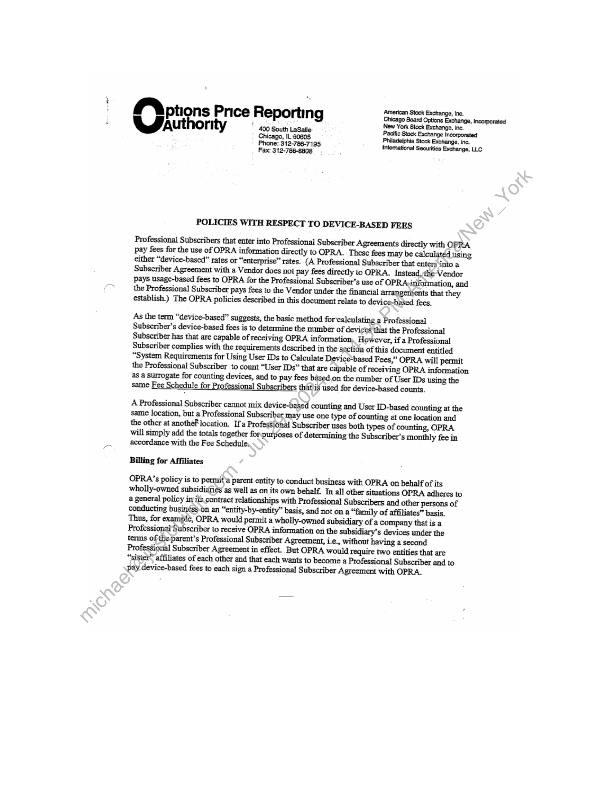
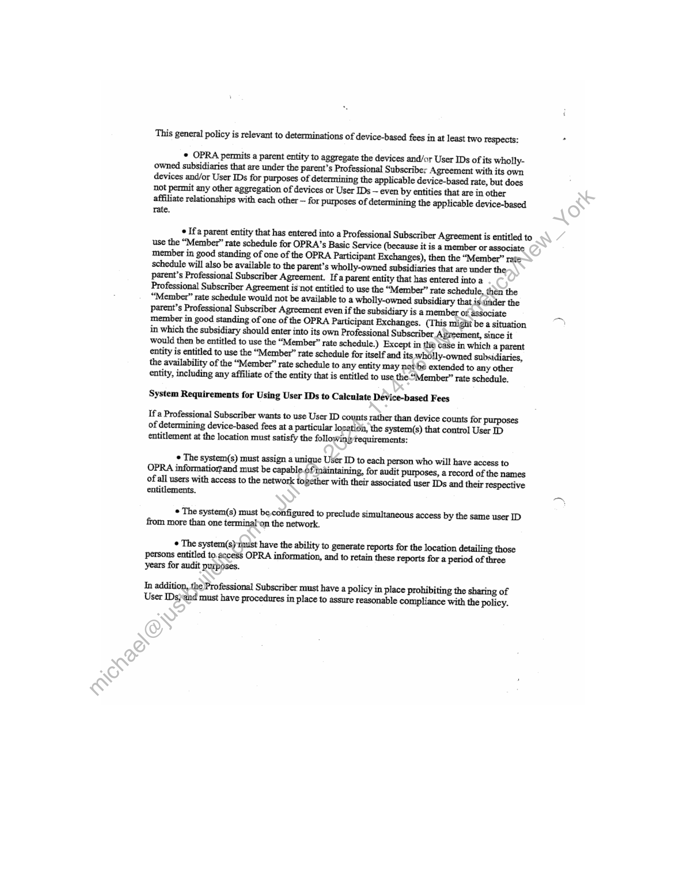
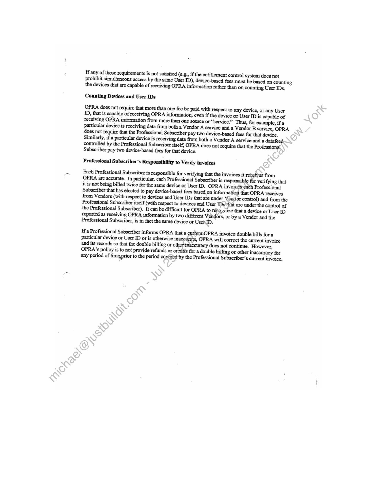

##### OPRA Policies with Respect to Device-Based Fees]

  
````col
```col-md
flexGrow=.5
===
> [!info] [Page 1](_attachments/images_3.6.4.1.9.1OPRA_WSOD_PolicyDocument_Undated.pdf_155121/page_1.png)
> 
```  
```col-md
’  
ptions Price Reporting Chicago Board Option Pectergs,incomorstad  
USauthority 7 Apo New York Stock Exchange, Inc.
Prone, $t2 786-7195 oneal Sock Biting, io.
Fax: 312-786-8808 \intemational Securities Exchange, LLC  
POLICIES WITH RESPECT TO DEVICE-BASED FEES  
Professional Subscribers that enter into Professional Subscriber Agreements directly with OPRA
pay fees for the use of OPRA information directly to OPRA. These fees may be calculated using
either “device-based” rates or “enterprise” rates. (A Professional Subscriber that enters into a
Subscriber Agreement witha Vendor does not pay fees directly to OPRA. Instead,the Vendor
Pays usage-based fees to OPRA for the Professional Subscriber’s use of OPRA:information, and
the Professional Subscriber pays fees to the Vendor under the financial arrangeritents that they
establish.) The OPRA policies described in this document relate to device-based fees.  
As the term “device-based” suggests, the basic method for'calculating a Professional
Subscriber's device-based fees is to determine the number of devices that the Professional
Subscriber has that are capable of receiving OPRA information, However, if a Professional
Subscriber complies with the requirements described in the section of this document entitled
“System Requirements for Using User IDs to Calculate Device*based Fees,” OPRA will permit
the Professional Subscriber to count “User IDs” that are capable of receiving OPRA information
as a surrogate for counting devices, and to pay fees biised.on the number of User IDs using the
same Fee Schedule for Professional Subscribers thatis used for device-based counts,  
A Professional Subscriber cannot mix device-based counting and User ID-based counting at the
same location, but a Professional Subscriber may use one type of counting at one location and
the other at anothéF location. If a Professiénal Subscriber uses both types of counting, OPRA
will simply add the totals together for purposes of determining the Subscriber’s monthly fee in
accordance with the Fee Schedule.  
Billing for Affiliates  
OPRA’s policy is to permit\a parent entity to conduct business with OPRA on behalf of its
wholly-owned subsidiaries as well as on its own behalf. In all other situations OPRA adheres to
a general policy in its contract relationships with Professional Subscribers and other persons of
conducting businés8-on an “entity-by-entity” basis, and not on a “family of affiliates” basis.
Thus, for example, OPRA would permit a wholly-owned subsidiary of a company that is a
Professional Subscriber to receive OPRA information on the subsidiary’s devices under the
terms of the parent’s Professional Subscriber Agreement, i.e., without having a second
Professional Subscriber Agreement in effect. But OPRA would require two entities that are
“sistet” affiliates of each other and that each wants to become a Professional Subscriber and to
pay device-based fees to each sign a Professional Subscriber Agreement with OPRA.  
```
````
Notes:    
````col
```col-md
flexGrow=.5
===
> [!info] [Page 2](_attachments/images_3.6.4.1.9.1OPRA_WSOD_PolicyDocument_Undated.pdf_155121/page_2.png)
> 
```  
```col-md
This general policy is relevant to determinations of device-based fees in at least two Tespects:  
* OPRA permits a parent entity to aggregate the devices and/or User IDs of its whollyowned subsidiaries that are under the parent’s Professional Subscriber Agreement with its own
devices and/or User IDs for purposes of determining the applicable device-based tate, but does
not permit any other aggregation of devices or User IDs ~ even by entities that are in other
affiliate relationships with each other — for purposes of determining the applicable device-based
rate.  
* If parent entity that has entered into a Professional Subscriber Agreement is entitled to
use the “Member” rate schedule for OPRA’s Basic Service (because it is a member or associate
member in good standing of one of the OPRA Participant Exchanges), then the “Member” rat=
schedule will also be available to the parent’s wholly-owned subsidiaries that are under the  
Professional Subscriber Agreement is‘not entitled to use the “Member” rate schedule, thén the
“Member” rate schedule would not be available to a wholly-owned subsidiary that is ander the
parent’s Professional Subscriber Agreement even if the subsidiary is a member of associate
member in good standing of one of the OPRA Participant Exchanges. (This might be a situation
in which the subsidiary should enter into its own Professional Subscriber Agreement, since it
would then be entitled to use the “Member” rate schedule.) Except in tlie case in which a parent
entity is entitled to use the “Member” rate schedule for itself and its wholly-owned subsidiaries,
the availability of the “Member” rate schedule to any entity may notbe extended to any other
entity, including any affiliate of the entity that is entitled to use the “Member” rate schedule.  
System Requirements for Using User IDs to Calculate Device-based Fees  
If a Professional Subscriber wants to use User ID counts rather than device counts for purposes
of determining device-based fees at a particular location, the system(s) that control User ID
entitlement at the location must satisfy the following requirements:  
The system(s) must assign a unique User ID to each person who will have access to
OPRA informatiortand must be capable.6f inaintaining, for audit purposes, a record of the names
of all users with access to the network together with their associated user IDs and their tespective
entitlements.  
© The system(s) must be, configured to preclude simultaneous access by the same user ID
from more than one terminaf‘on the network.  
© The system(s) taust have the ability to generate reports for the location detailing those
persons entitled to. 2ecess OPRA information, and to retain these reports for a period of three
years for audit purposes.
Jn addition, the)Professional Subscriber must have a policy in place prohibiting the sharing of
User IDs}and must have procedures in place to assure reasonable compliance with the policy.  
```
````
Notes:    
````col
```col-md
flexGrow=.5
===
> [!info] [Page 3](_attachments/images_3.6.4.1.9.1OPRA_WSOD_PolicyDocument_Undated.pdf_155121/page_3.png)
> 
```  
```col-md
If any of these requirements is not satisfied (¢.g., if the entitlement control system does not
prohibit simultaneous access by the same User ID), device-based fees must be based on counting
the devices that are capable of receiving OPRA information rather than on counting User IDs.  
Counting Devices and User IDs  
OPRA does not require that more than one fee be paid with respect to any device, or any User
ID, that is capable of receiving OPRA information, even if the device or User ID is capable of
teceiving OPRA information from more than one source or “service.” Thus, for example, ifa
particular device is receiving data from both a Vendor A service and a Vendor B service, OPRA
does not require that the Professional Subscriber pay two device-based fees for that device.
Similarly, if a particular device is receiving data from both a Vendor A service and a datafeed.
controlled by the Professional Subscriber itself, OPRA does not require that the Professional
Subscriber pay two device-based fees for that device.  
Professional Subscriber*s Responsibility to Verify Invoices  
Each Professional Subscriber is responsible for verifying that the invoices it reteives from
OPRA are accurate. In particular, each Professional Subscriber is responsible for verifying that
it is not being billed twice for the same device or User ID. OPRA invoicéseath Professional
Subscriber that has elected to pay device-based fees based on information that OPRA receives
from Vendors (with respect to devices and User IDs that are under Vendor contro!) and from the
Professional Subscriber itself (with respect to devices and User IDs that are under the control of
the Professional Subscriber). It can be difficult for OPRA to recognize that a device or User ID
reported as receiving OPRA information by two different Vendors, or by a Vendor and the
Professional Subscriber, is in fact the same device or UserID.  
Ifa Professional Subscriber informs OPRA that a current OPRA invoice double bills for a
particular device or User ID or is otherwise inaccurate, OPRA will correct the current invoice
and its records so that the double billing or other inaccuracy does not continue. However,
OPRA’s policy is to not provide refunds or credits for a double billing or other inaccuracy for
any period of time,prior to the period covéred’by the Professional Subscriber’s current invoice.  
```
````
Notes:  


![[_attachments/3.6.4.1.9.1 OPRA_WSOD_PolicyDocument_Undated.pdf]