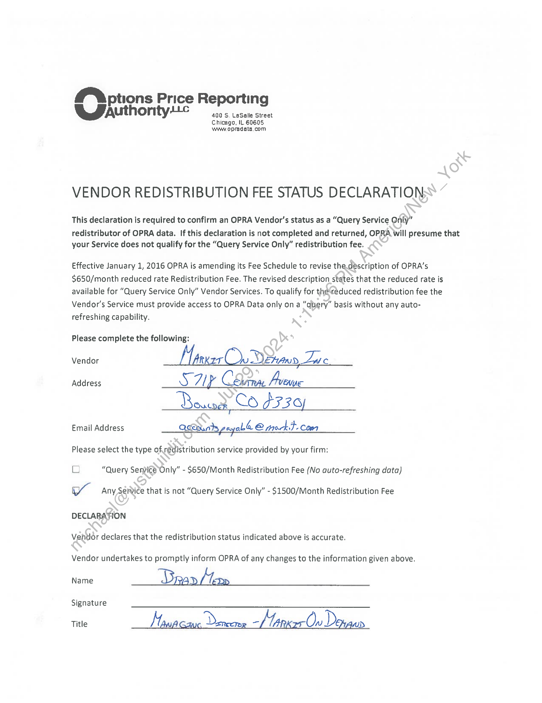

##### OPRA Vendor Redistribution Fee Status Declaration]

  
````col
```col-md
flexGrow=.5
===
> [!info] [Page 1](_attachments/images_3.6.4.1.9.2OPRA_MODDistribDeclaration20151218.pdf_155329/page_1.png)
> 
```  
```col-md
MA ptions Price Reportin
UJaut uthority¢ aad of  
Chicago, IL 60605
Www opredata.com  
VENDOR REDISTRIBUTION FEE STATUS DECLARATION  
This declaration is required to confirm an OPRA Vendor's status as a “Query Service Only”  
redistributor of OPRA data. If this declaration is not completed and returned, OPRA will presume that
your Service does not qualify for the “Query Service Only” redistribution fee.  
Effective January 1, 2016 OPRA is amending its Fee Schedule to revise the.déscription of OPRA’s
$650/month reduced rate Redistribution Fee. The revised description states that the reduced rate is
available for “Query Service Only” Vendor Services. To qualify for the‘reduced redistribution fee the
Vendor's Service must provide access to OPRA Data only ona “query” basis without any autorefreshing capability.  
Please complete the following:  
Vendor RKZT do aun Zue  
Address Ay 7 i CD Aree  
Email Address Qcwambspeyabe C mockt.com  
Please select the type ofredistribution service provided by your firm:  
O “Query Service Only” - $650/Month Redistribution Fee (No auto-refreshing data)  
WY Any Service that is not “Query Service Only” - $1500/Month Redistribution Fee  
DECLARATION
Vendor declares that the redistribution status indicated above is accurate.  
Vendor undertakes to promptly inform OPRA of any changes to the information given above.  
Name Dm D/ ap  
Signature  
Title Kt as “LTA Ou D. Ald  
```
````
Notes:  


![[_attachments/3.6.4.1.9.2 OPRA_MOD Distrib Declaration 20151218.pdf]