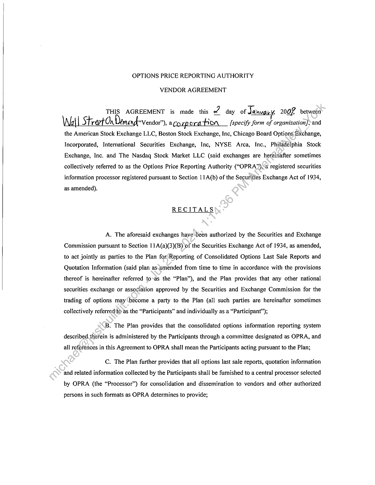
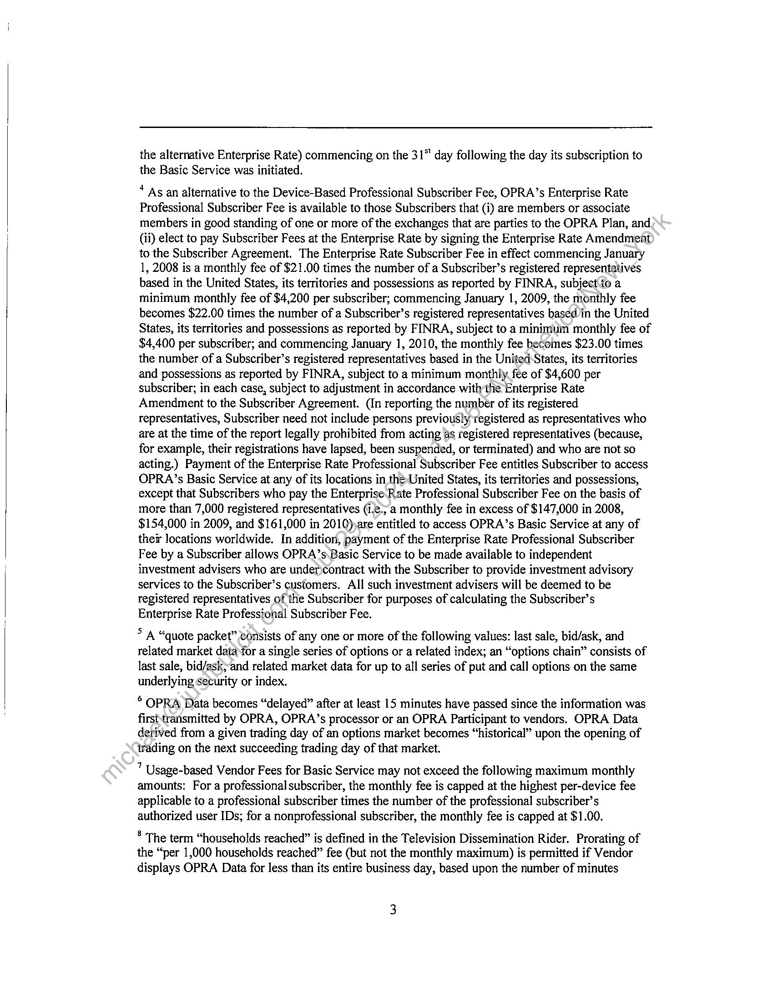

##### VENDOR AGREEMENT]

  
````col
```col-md
flexGrow=.5
===
> [!info] [Page 1](_attachments/images_3.6.4.1.9.3OPRA_WSOD_VendorAgreement_20090102.pdf_155406/page_1.png)
> 
```  
```col-md
OPTIONS PRICE REPORTING AUTHORITY  
VENDOR AGREEMENT  
THIS AGREEMENT is made this z day of Janvaicy 2007 between
Wall Street On Demengl Vendor” ac [specify form of organization], and  
the American Stock Exchange LLC, Boston Stock Exchange, Inc, Chicago Board Options Exchange,  
Incorporated, International Securities Exchange, Inc, NYSE Arca, Inc., Philadelphia Stock
Exchange, Inc. and The Nasdaq Stock Market LLC (said exchanges are hereinafter sometimes
collectively referred to as the Options Price Reporting Authority (“OPRA”),<a registered securities
information processor registered pursuant to Section 11A(b) of the Securities Exchange Act of 1934,  
as amended).  
RECITALS  
A. The aforesaid exchanges have\been authorized by the Securities and Exchange
Commission pursuant to Section 11A(a)(3)(B) of the Securities Exchange Act of 1934, as amended,
to act jointly as parties to the Plan for Reporting of Consolidated Options Last Saie Reports and
Quotation Information (said plan as.amended from time to time in accordance with the provisions
thereof is hereinafter referred to-as the “Plan”), and the Plan provides that any other national
securities exchange or association approved by the Securities and Exchange Commission for the
trading of options may become a party to the Plan (all such parties are hereinafter sometimes  
collectively referred(to as the “Participants” and individually as a “Participant”);  
B. The Plan provides that the consolidated options information reporting system
described.therein is administered by the Participants through a committee designated as OPRA, and  
all references in this Agreement to OPRA shall mean the Participants acting pursuant to the Plan;  
C. The Plan further provides that all options last sale reports, quotation information
and related information collected by the Participants shall be furnished to a central processor selected
by OPRA (the “Processor”) for consolidation and dissemination to vendors and other authorized  
persons in such formats as OPRA determines to provide;  
```
````
Notes:    
````col
```col-md
flexGrow=.5
===
> [!info] [Page 2](_attachments/images_3.6.4.1.9.3OPRA_WSOD_VendorAgreement_20090102.pdf_155406/page_2.png)
> 
```  
```col-md
D. Vendor is engaged in the business of publishing, disseminating or otherwise
distributing securities market information, and is desirous of including in such information  
consolidated market information provided by OPRA.  
AGREEMENTS  
1. Definitions.
As used in this Agreement, the following terms shail have the meanings set forth after each:  
(a) The term “Last Sale Reports” means any price, volume er related information  
reflecting completed transactions in Eligible Securities.  
(b) The term “Quotation Information” means bids and-offers or related information
pertaining to quotations in Eligible Securities. The term includes the BBO (as defined below) in
respect of any series of Eligible Securities whenever OPRA makes the BBO available in respect of  
such series.  
(c) The term “OPRA Data” means -Last Sale Reports and Quotation Information
and/or any other information transmitted over)the information reporting system administered by
OPRA.  
(d) The term “Service” has the meaning attributed to such term in Section 3 of this  
Agreement.  
(e) As usedin respect of OPRA Data, the term “current” means OPRA Data that has
been transmitted by the Processor, by a Participant or by OPRA to Vendor within the immediately
preceding 15 minutes, and the term “delayed” means OPRA Data that is no longer current. Last Sale
Reports that reflect transactions completed during a given trading session on an options market, and
Quotation Information entered during a given trading session on an options market, become
“historical” at the opening of trading on the next succeeding trading session in that market. (For
example, reports of transactions completed on a particular market in a trading session on Wednesday
become historical reports from and after the opening of trading on that market on the following  
Thursday.)  
(f) The term “Eligible Securities” means each series of option contracts listed and
traded on one or more of the Participant exchanges, and any other securities determined by OPRA to  
be eligible for inclusion in the information reporting system administered by OPRA.  
```
````
Notes:    
````col
```col-md
flexGrow=.5
===
> [!info] [Page 3](_attachments/images_3.6.4.1.9.3OPRA_WSOD_VendorAgreement_20090102.pdf_155406/page_3.png)
> 
```  
```col-md
(g) The term “Subscriber” means a person that has entered into a Professional
Subscriber Agreement with OPRA or a Subscriber Agreement with a vendor or with a
Correspondent Subscriber, which authorizes the person to access OPRA Data for its own use and not  
for the purpose of retransmitting or redistributing OPRA Data to any other person.  
(h) The term “Nonprofessional Subscriber” means a Subscriber who has entered.
into a Subscriber Agreement with a vendor or with a Correspondent Subscriber and who satisfies the  
requirements for a Nonprofessional Subscriber as set forth in Section 5 of this Agreement.  
(i) The term “Professional Subscriber” means a Subscriber ‘that is not a
Nonprofessional Subscriber, and has entered into either a Professional Subscriber Agreement with  
OPRA or a Subscriber Agreement with a vendor or with a Correspondent Subscriber.  
(j) The term “Professional Subscriber Agreement” means an agreement between
OPRA and a Professional Subscriber setting forth the terms and conditions under which such person
is permitted to receive OPRA Data in the capacity of a Subscriber. Pursuant to a Professional
Subscriber Agreement, a Professional Subscriber is required to pay access fees directly to OPRA, in  
accordance with OPRA’s Fee Schedule as in effect front time to time.  
(k) The term “Correspondent Subscriber” means a person that has entered into a
Professional Subscriber Agreement with OPRA and an agreement with Vendor that satisfies the
requirements of Section 7 of this Agreement pursuant to which Vendor distributes OPRA Data to
customers of the Correspondent Subscriber that have entered into Subscriber Agreements with the  
Correspondent Subscriber.  
(l) The ¢erm “Subscriber Agreement” means an agreement between Vendor or a
Correspondent Subscriber and a Subscriber (who may either be a Professional Subscriber or a
Nonprofessional\Subscriber) setting forth the terms and conditions under which such person is
permitted toreceive OPRA Data from Vendor in the capacity of a Subscriber. Access fees payable to
OPRA in respect of a Subscriber who has entered into a Subscriber Agreement with Vendor shall be
determined in accordance with OPRA’s Fee Schedule as in effect from time to time, and shall be the
‘obligation of Vendor, except that in respect of a Subscriber who has entered into a Subscriber
Agreement with a Correspondent Subscriber, such fees shall be the obligation of the Correspondent
Subscriber. Subscriber Agreements may be either in electronic form that permits the Subscriber to
evidence its consent to the terms of the Agreement electronically (an “Electronic Subscriber
Agreement”), or in paper form that provides for the Subscriber to evidence its consent to the terms of  
the Agreement by means of a manual signature (a “Hardcopy Subscriber Agreement”). Subscriber  
```
````
Notes:    
````col
```col-md
flexGrow=.5
===
> [!info] [Page 4](_attachments/images_3.6.4.1.9.3OPRA_WSOD_VendorAgreement_20090102.pdf_155406/page_4.png)
> 
```  
```col-md
Agreements shall be substantially in the standard forms approved by OPRA from time to time
(OPRA’s current standard forms of Electronic Subscriber Agreement and Hardcopy Subscriber
Agreement are set forth as Attachment B-1 hereto and Attachment B-2 hereto, respectively) or in
another form approved by OPRA that complies with the requirements of Section 6 of this  
Agreement.  
(m) The term “Electronic Subscriber” means a Subscriber who has entered ‘into an  
Electronic Subscriber Agreement.  
(n) The term “person” means a firm, corporation, limited liability company,  
partnership, trust or other form of entity or association, as well as an individual natural person.  
(0) The term “Affiliate,” as used in reference to any person, means each governor,
director, officer, employee, subsidiary or other affiliated entity of such person and each director,  
officer or employee of each such subsidiary or other affiliated entity.  
(p) The term “Print News Publisher” means the publisher of a bona fide newspaper,
newsmagazine or other news publication of general circulation published on a regular schedule  
solely in print form and not distributed electronically, by fax or by radio or television broadcast.  
(q) The term “Vendor Agreement” means an agreement in the form of this  
Agreement between OPRA and a person who intends to disseminate OPRA Data to other persons.  
(r) The term “Fee Schedule” has the meaning attributed to such term in Section 2 of  
this Agreement.  
(s) The term “SEC” means the Securities and Exchange Commission or any  
successor thereto havitig-primary regulatory oversight authority over the Participants.  
(t) The term “BBO” means the consolidated best bid and offer in all Participants’  
markets for any series of Eligible Securities, as calculated by or on behalf of OPRA.  
2. Furnishing OPRA Data to Vendor.  
OPRA Data (in a format conforming to OPRA’s technical specifications as in effect
from time to time, subject to the provisions of Section 15 hereof) may be furnished to Vendor
directly from the Processor or from another vendor for the purpose of enabling Vendor to distribute
or publish OPRA Data in accordance with the terms hereof. If Vendor desires to access OPRA Data
directly from the Processor, Vendor must provide telecommunications facilities to the Processor and
the OPRA Data will be furnished to Vendor in the format established by OPRA from time to time
(subject to the provisions of Section 15 hereof). Vendor shall pay to OPRA the applicable fees in  
```
````
Notes:    
````col
```col-md
flexGrow=.5
===
> [!info] [Page 5](_attachments/images_3.6.4.1.9.3OPRA_WSOD_VendorAgreement_20090102.pdf_155406/page_5.png)
> 
```  
```col-md
accordance with the Fee Schedule set forth in Attachment A hereto, as the same may be amended
from time to time (the “Fee Schedule”). In the event Vendor intends to utilize OPRA Data other than
in its capacity as a vendor as authorized under this Agreemént, Vendor must complete the
appropriate agreements governing such other use, and pay any additional applicable fees. Upon
request of Vendor, OPRA will provide Vendor with the technical specifications for OPRA Data as  
they exist at the time of the request.  
3. Authority of Vendor to Furnish OPRA Data.  
(a) Subject to the terms of this Agreement and applicable rules and regulations of
the SEC, Vendor is hereby authorized to furnish a market data redistribution and/or retrieval service
or services with respect to OPRA Data only to persons that at the time of receipt thereof, either
individually or as members of a category of persons, have been authorized by OPRA to receive
access to OPRA Data. Such service or services are sometimes) collectively referred to in this
Agreement as the “Service.” The Service is more fully described in Exhibit A hereto, which has been
prepared by Vendor and includes the information requiredxpursuant to Section 14 hereof. Vendor
shall not furnish OPRA Data in any manner except as’described in Exhibit A, as it may be amended  
by Vendor from time to time with the approval of OPRA.  
(b) In selecting OPRA Data pertaining to a series of Eligible Securities to be
included in a Service furnished by Vendor, Vendor shall not exclude information or otherwise
discriminate on the basis of the market in which a transaction took place or a quotation was entered.
Accordingly, if Vendor includes in a Service Last Sale Reports or Quotation Information from any
Participant’s market in respect of a series of Eligible Securities, Vendor must also include in that
same Service comparable information in respect of that same series from every other Participant’s
market whose information is carried over the OPRA System. At any time when OPRA makes
available the BBO for a series of Eligible Securities as authorized by paragraph (c) of this Section 3,
Vendor shall-be deemed to have satisfied its obligation under the preceding two sentences in respect
of a series of Eligible Securities if Vendor’s Service as described in Exhibit A includes both the BBO
andconsolidated Last Sale Reports for that series, notwithstanding that the Service may also include  
additional unconsolidated information in respect of that series.  
(c) Vendor may offer a Service that includes the BBO in respect of any series of
Eligible Securities. If Vendor offers such a Service, it must include the best bid and ask price that
constitutes the BBO as reported by OPRA for each series of Eligible Securities included in the
Service, but it need not include the size or the market identifier associated with the BBO. If the size  
or the market identifier associated with the BBO is included in Vendor’s BBO Service, such  
```
````
Notes:    
````col
```col-md
flexGrow=.5
===
> [!info] [Page 6](_attachments/images_3.6.4.1.9.3OPRA_WSOD_VendorAgreement_20090102.pdf_155406/page_6.png)
> 
```  
```col-md
information must be included on a current basis as reported by OPRA. If Vendor excludes from its
BBO Service either the size or the market identifier associated with the BBO or both, it must do so in
a manner that does not discriminate on the basis of the market in which quotations are entered.
Additionally, if the market identifier associated with the BBO is not included in a dynamically
updated Service offered by Vendor, that same information must be made available to recipients of
the dynamically updated Service through an inquiry-only Service provided by Vendor without  
additional cost.  
(d) Vendor may furnish OPRA Data only to: (1) other vendors vassdescribed in
paragraph 3(e) hereof, (2) Print News Publishers as described in paragraph (3(f) hereof, (3)
Professional Subscribers as described in Section 4 hereof, (4) Nonprofessional Subscribers as
described in Section 5 hereof, and (5) other persons that, either individually or as members of a
category of persons, have been authorized by OPRA to receive OPRA Data. Vendor may furnish
OPRA Data via a bulk data feed transmission (a data feed thatris not controlled by the Vendor) only
to: (i) other vendors, (ii) Print News Publishers, (iii) Professional Subscribers that have entered into
Indirect (Vendor Pass-Through) Circuit Connection Riders, and (iv) other persons that, either
individually or as members of a category of persons, have been authorized by OPRA to receive such  
a data feed transmission.  
(e) Vendor may furnish OPRA Data on a current or delayed basis to a person who
intends to retransmit all or a portion of the information to other persons only if such person has
entered into a Vendor Agreement with OPRA, except that Vendor may furnish OPRA Data to a Print
News Publisher to the extent@nd subject to the conditions set forth in paragraph 3(f), and except that
Vendor may furnish historical OPRA Data to any person. Vendor may furnish delayed OPRA Data
to any person except,a person that intends to retransmit or does retransmit all or a portion of the  
information to other persons and has not entered into a Vendor Agreement with OPRA.  
(f) Vendor may furnish OPRA Data to a Print News Publisher in the form of
formatted options tables or in any other format, provided that the redistribution of such information
bythe Print News Publisher is limited to options tables appearing in a bona fide newspaper,
newsmagazine or other news publication of general circulation published on a regular schedule in
hardcopy (paper) form, and provided further that Vendor shall have entered into a written agreement
with the Print News Publisher, expressly for the benefit of OPRA, in which the Print News Publisher
agrees that its redistribution of OPRA Data will be so limited and acknowledges that neither OPRA,
the Processor nor any Participant guarantees the timeliness, sequence, accuracy or completeness of  
any OPRA Data, and that neither OPRA, the Processor nor any Participant shall be liable in any way  
```
````
Notes:    
````col
```col-md
flexGrow=.5
===
> [!info] [Page 7](_attachments/images_3.6.4.1.9.3OPRA_WSOD_VendorAgreement_20090102.pdf_155406/page_7.png)
> 
```  
```col-md
to the Print News Publisher for any claims or damages, consequential or otherwise, for any delays,
inaccuracies, errors in, or omissions of, any OPRA Data, or in the transmission or delivery thereof or
for any damage arising therefrom or occasioned thereby. Vendor shall provide to OPRA, in advance,  
a copy of every form of agreement it intends to use for this purpose.  
(g) Vendor is authorized to provide a voice-synthesized element of its Service (a
“Voice-Synthesized Service”) in conformity with the description of such element in Exhibit™A
hereto, without requiring that persons who have access thereto be Subscribers in order to.have such
access. Any Voice-Synthesized Service shall be limited to OPRA Data transmittedsin‘the form of
synthesized speech over conventional telephones. The description of any Voice-. Synthesized Service
shall include information with respect to the number of telephone trunk lines*to Vendor’s voicesynthesized computer and the number of active ports in such computer{since such information is
necessary to determine the fees for any Voice-Synthesized Service)»Vendor shall report in writing
to OPRA at least 30 days in advance of any changes proposed to.be made to any Voice-Synthesized
Service as described in Exhibit A, including any changes in’the number of telephone trunk lines to
Vendor’s voice-synthesized computer or in the number of active ports of such computer. Vendor
shall also provide to OPRA any other information that OPRA may reasonably request concerning
any Voice-Synthesized Service, including thechumiber of inquiries for market information received
over specified periods of time, which information shall be held in confidence by OPRA. Vendor
agrees to notify each person who receives OPRA Data through any Voice-Synthesized Service that  
the timeliness, sequence, accuracy‘and completeness of OPRA Data is not guaranteed.
4. Professional Subscribers.  
To become entitled to receive OPRA Data from Vendor as a Professional
Subscriber, a persan\miust have either entered into a Professional Subscriber Agreement with OPRA
or a Subscriber)Agreement with Vendor or a Correspondent Subscriber of Vendor. To become
entitled to receive OPRA Data from Vendor via a bulk data feed transmission as a Professional
Subscriber, a person must have entered into a Professional Subscriber Agreement and an Indirect
(Vendor Pass-Through) Circuit Connection Rider with OPRA. If OPRA notifies Vendor that a
person previously approved as a Professional Subscriber does not meet the requirements for such
approval, Vendor will promptly terminate such person’s Subscriber Agreement or cause the
Correspondent Subscriber to promptly terminate such person’s Subscriber Agreement in accordance
with the terms thereof and promptly discontinue furnishing OPRA Data to such person unless and
until such person is again approved to receive such information in some authorized capacity, except  
that in accordance with Section 3(e) Vendor may continue to furnish delayed information to such  
```
````
Notes:    
````col
```col-md
flexGrow=.5
===
> [!info] [Page 8](_attachments/images_3.6.4.1.9.3OPRA_WSOD_VendorAgreement_20090102.pdf_155406/page_8.png)
> 
```  
```col-md
person, if such person is not retransmitting the information to other persons prior to the time the  
information becomes historical.  
5. Nonprofessional Subscribers.  
To become entitled to receive OPRA Data from Vendor as a Nonprofessional
Subscriber, a person must have entered into a Subscriber Agreement with Vendor or a Correspondent
Subscriber of Vendor either (i) in the form of Attachment B-1 or Attachment B-2 hereto in which the
person has made the representations set forth in the Addendum for Nonprofessionals attached to such
form, or (ii) in an alternative form that satisfies the requirements of paragraph 6(c) hereof in which
the person has made representations equivalent to those in the Addendum for/Nonprofessionals
attached to Attachment B-1 or Attachment B-2 hereto. If Vendor, OPRA or (if applicable) a
Correspondent Subscriber of Vendor determines that a person. previously approved as a
Nonprofessional Subscriber does not meet the requirements for such approval (in the case of such
determination by OPRA, OPRA shall furnish Vendor notice thereof), Vendor will promptly
terminate such person’s Subscriber Agreement or cause. the Correspondent Subscriber to promptly
terminate such person’s Subscriber Agreement in accordance with the terms thereof and promptly
discontinue furnishing OPRA Data to such person)unless or until such person is again approved to
receive such information in some authorized) capacity, except that in accordance with Section 3(e)
Vendor may continue to furnish delayed. information to such person, if such person is not  
retransmitting the information to othér persons prior to the time the information becomes historical.  
6. Subscriber Agreements.  
(a) Approvai_of Subscriber Agreements by Vendor. Vendor, on behalf of and as  
agent for OPRA, shall-review each completed Subscriber Agreement submitted to it. Upon Vendor’s
determination that‘a’ Subscriber Agreement is complete in all material respects and, if the applicant is
seeking to receive OPRA Data as a Nonprofessional Subscriber, that the applicant in fact qualifies to
be a Nonprofessional Subscriber, Vendor may approve the applicant. In the case of a completed
Hardcopy Subscriber Agreement Vendor shall be deemed to have approved the applicant when
Vendor has endorsed the completed Hardcopy Subscriber Agreement or Vendor commences to
provide OPRA Data to the applicant. In the case of a completed Electronic Subscriber Agreement
Vendor shall be deemed to have approved the applicant when Vendor commences to provide OPRA
Data to the applicant. A Subscriber whose Subscriber Agreement has been approved shall remain a
duly approved Subscriber only so long as the Subscriber remains in compliance with the provisions  
of the Subscriber Agreement and neither Vendor nor OPRA has determined, as described in Section  
-8-  
```
````
Notes:    
````col
```col-md
flexGrow=.5
===
> [!info] [Page 9](_attachments/images_3.6.4.1.9.3OPRA_WSOD_VendorAgreement_20090102.pdf_155406/page_9.png)
> 
```  
```col-md
4 or 5 as applicable, that the Subscriber no longer meets the requirements to be approved as a  
Professional Subscriber or a Nonprofessional Subscriber.  
(b) Approval of Subscriber Agreements by __a Correspondent _ Subscriber.  
Notwithstanding paragraph (a), Vendor may delegate to a Correspondent Subscriber its obligation to
review completed Subscriber Agreements submitted to the Correspondent Subscriber. A
Correspondent Subscriber’s determinations that a Subscriber Agreement is complete in all material
respects and, if the applicant is seeking to receive OPRA Data as a Nonprofessional Subscriber, that
the applicant in fact qualifies to be a Nonprofessional Subscriber, shall be binding on\Vendor. In the
case of a completed Hardcopy Subscriber Agreement submitted to a Correspondent Subscriber,
Vendor shall be deemed to have approved the applicant when the Correspondent Subscriber has
endorsed the completed Hardcopy Subscriber Agreement or Vendor commiences to provide OPRA
Data to the applicant. In the case of a completed Electronic Subscriber Agreement submitted to a
Correspondent Subscriber, Vendor shall be deemed to have approved the applicant when Vendor
commences to provide OPRA Data to the applicant. A Subscriber whose Subscriber Agreement has
been approved in accordance with this paragraph shall‘remain a duly approved Subscriber only so
long as the Subscriber remains in compliance with the provisions of the Subscriber Agreement and
neither Vendor, OPRA nor the Correspondent Subscriber has determined, as described in Section 4
or 5 as applicable that the Subscriber.no longer meets the requirements to be approved as a  
Professional Subscriber or a Nonprofessional Subscriber.  
(c) Forms of Subscriber Agreement, Vendor may enter into electronic or hardcopy  
Subscriber Agreements with its customers in the standard forms approved by OPRA from time to
time (OPRA’s current standard forms of Electronic Subscriber Agreement and Hardcopy Subscriber
Agreement are set forth as Attachment B-1 hereto and Attachment B-2 hereto, respectively), or
Vendor may enter)into electronic or hardcopy Subscriber Agreements with its customers in one or
more alternative forms approved by OPRA. Any such alternative forms of Subscriber Agreements  
shall reflect the agreement of the Subscriber that it:  
(i) shall receive OPRA Data solely for such person’s own use (including, in
the case of a Professional Subscriber, the use of such person’s employees on behalf  
of such person),
(ii) shall not retransmit or otherwise furnish OPRA Data to any other person  
(iii) (other than, in the case of a Professional Subscriber, such Professional  
Subscriber’s employees),  
-9-  
```
````
Notes:    
````col
```col-md
flexGrow=.5
===
> [!info] [Page 10](_attachments/images_3.6.4.1.9.3OPRA_WSOD_VendorAgreement_20090102.pdf_155406/page_10.png)
> 
```  
```col-md
(iv) acknowledges that OPRA Data is and shall remain the property of the
respective exchange or other market on which a reported transaction took place or a  
reported quotation was entered,  
(v) acknowledges the absence of any guarantee and the disclaimer of
liability on the part of OPRA, the Processor and each Participant as stated in Section  
12 of this Agreement,  
(vi) acknowledges that the terms and conditions of the>Subscriber
Agreement may be modified by OPRA at any time upon notice to\the Subscriber,  
and  
(vii) acknowledges that the Subscriber Agreement may be terminated by the
Subscriber or Vendor upon 30 days notice from the\terminating party to the other
party, and may be terminated immediately by Vendor upon a determination by
Vendor or OPRA that the Subscriber is notin compliance with the Subscriber  
Agreement.  
In addition, any such alternative form shall include provisions, in form satisfactory to
OPRA, permitting the Subscriber to represent/that he or she qualifies as a Nonprofessional
Subscriber where necessary to satisfy the requirements of Section 5 hereof. Any such alternative  
form shall also state that it is for the express benefit of OPRA, the Processor and each Participant.  
(d) Use of Electronic Subscriber Agreements. Notwithstanding any other provision
of this Agreement, Vendor-tay use Electronic Subscriber Agreements only if those Subscribers
entering into such Agreements with Vendor may also enter into any other contracts with Vendor (or
a Correspondent Subscriber acting on Vendor’s behalf) electronically. In addition, Vendor may use
Electronic Subscriber Agreements only if the conditions set forth in Attachment C hereto are  
satisfied.  
Vendor agrees to indemnify, hold harmless and defend OPRA, each Participant, the
Processor and each Affiliate of the foregoing from and against any and all claims, suits, proceedings
at law or in equity, and any and all liability, loss, damages, costs or expenses (other than fees and
expenses of attorneys separately retained by any of the indemnified parties) arising out of or in
connection with any allegation that an Electronic Subscriber Agreement is unenforceable or invalid,
if any of the reasons for the alleged unenforceability or invalidity of the contract is based upon or
related to the fact that the contract was entered into or administered electronically; provided,  
however, that Vendor shall be notified promptly in writing of any such claims and Vendor shall have  
-10-  
```
````
Notes:    
````col
```col-md
flexGrow=.5
===
> [!info] [Page 11](_attachments/images_3.6.4.1.9.3OPRA_WSOD_VendorAgreement_20090102.pdf_155406/page_11.png)
> 
```  
```col-md
sole contro! of the defense of any such claim, suit or proceeding and all negotiations for settlement or
compromise thereof, but only insofar as such settlement or compromise does not impose any liability  
on OPRA, any Participant, any Affiliate thereof, or the Processor.  
7. Correspondent Subscriber Agreements.  
Vendor shall obtain a written agreement, in a form approved by OPRA, from each of  
its Correspondent Subscribers in which the Correspondent Subscriber agrees:  
(i) to obtain from each of its customers to whom Vendor furnishes OPRA
Data an Electronic Subscriber Agreement or Hardcopy Subscriber Agreement  
agreed to by the customer;  
(ii) to maintain the same customer records.that are required to be
maintained by Vendor in respect of its customers-pursuant to Section 14 of this
Agreement and upon Vendor request to provide Vendor with information as  
necessary to enable Vendor to comply with paragraph 14(b) of this Agreement;  
Gii) upon request to certify that each of its customers who is receiving
OPRA Data from Vendor or whoyis*named on any list of Subscribers provided to
Vendor by Correspondent Subscriber has entered into an agreement as described in  
clause (i) of this paragraph; and  
(iv) that it acknowledges the absence of any guarantee and the disclaimer of
liability on the part of OPRA, the Processor and each Participant as stated in Section
12 of this Agreement.  
8. Subscriber Fees.  
(a) For each Subscriber with which it has entered into a Subscriber Agreement and
to which it furnishes current OPRA Data, Vendor shall pay to OPRA the applicable fees as set forth
in the;Fee, Schedule. Except as may otherwise be stated in the Fee Schedule, such fees shall
commience to accrue on the day on which Vendor initially furnishes OPRA Data to a new Subscriber,
and thereafter the fee shall be due and payable on a calendar month basis. If Vendor initiates service
to a new Nonprofessional Subscriber following the 15th day of any month, or if Vendor discontinues
service to a Nonprofessional Subscriber on or before the 15th day of any month, that month’s fee for
the service so initiated or discontinued shall be 50% of the regular applicable monthly fee. If any
amount due from Vendor to OPRA under this paragraph 8(a) has not been paid by the 30th day after  
such amount is due, OPRA may impose a late payment charge for each day from and after the due  
-11-  
```
````
Notes:    
````col
```col-md
flexGrow=.5
===
> [!info] [Page 12](_attachments/images_3.6.4.1.9.3OPRA_WSOD_VendorAgreement_20090102.pdf_155406/page_12.png)
> 
```  
```col-md
date that the amount remains unpaid. The late payment charge shal] be at an annual rate that does not
exceed the lesser of (i) the commercial prime rate of interest as last published in The Wall Street
Journal prior to the date such charge is computed plus three percent, or (ii) the maximum rate of  
interest permitted by applicable law.  
(b) In the event OPRA, in its sole discretion, determines that a person has been
improperly approved by Vendor as a Nonprofessional Subscriber, upon written notice of such
determination to Vendor, within 20 days of receipt of such notice, Vendor shall pay to.OPRA the
difference between (i) the amount that would have been billed to that person at the rates-applicable to
Professional Subscribers since the date of his or her approval as a Nonprofessiona!l Subscriber and
(ii) the Nonprofessional Subscriber fees actually paid by Vendor with respect to that person;
provided, however, that if Vendor demonstrates to OPRA’s reasonable satisfaction that the improper
approval of the Subscriber in question was the result of a good faith-error of Vendor, the maximum
amount that Vendor shall be required to pay to OPRA under-this subsection with respect to any  
single Subscriber shall be the applicable Professional Subscriber fees for a period of twelve months.  
9. Transactions Effected on Other Exchanges.  
To the extent that rules and (regulations of the SEC require the reporting of
transactions or quotations involving option contracts having the same terms as Eligible Securities
effected in markets other than the Participants’, and to the extent that information pertaining to such
transactions is furnished to Vendor by\OPRA, Vendor agrees that it will include such information as
a part of its Service, unless the SEC, either individually or as a member of a category of persons,  
shall have granted Vendor an exemption from this requirement.  
10. Defense of Suits.~ Indemnification — Vendor Cooperation.  
(a) If Vendor shall refuse to furnish OPRA Data to any person who is not a
Subscriber or shall refuse to continue furnishing OPRA Data to any person who has been terminated
as a Subscriber, solely by reason of having received written notice from OPRA that the approval of
suclp person as a Subscriber has been denied or revoked, the Participants shall indemnify, hold
harmless and defend Vendor from and against any and all suits or proceedings at law or in equity
based on such refusal and any and all liability, loss, damages and expenses (other than fees and
expenses of attorneys separately retained by Vendor) that Vendor incurs as a result of such suit or
proceeding, provided, however, that Vendor shall promptly notify OPRA in writing of any such suit  
or proceeding and the Participants shall have the sole control of the defense of any such suit or  
-12-  
```
````
Notes:    
````col
```col-md
flexGrow=.5
===
> [!info] [Page 13](_attachments/images_3.6.4.1.9.3OPRA_WSOD_VendorAgreement_20090102.pdf_155406/page_13.png)
> 
```  
```col-md
proceeding and all negotiations for the settlement or compromise thereof, but only insofar as such  
settlement or compromise does not impose any liability on Vendor.  
(b) In the event any suit or legal proceeding is brought to enjoin Vendor from
refusing to furnish Last Sale Reports or Quotation Information to any person because the approval of
such person as a Subscriber has been denied or revoked by OPRA, Vendor shall at once inform
OPRA of such suit or proceeding. Upon the receipt of any such notice by OPRA, the Participants
shall have the right to intervene in such suit in the name of Vendor, and/or through counsehof their
choice to assume the defense of such suit on behalf of Vendor, and the Participants shall indemnify
and hold Vendor harmless from and against any and all liability, loss, damages end-expenses (other
than attorneys’ fees incurred by Vendor after the Participants have assumed the’defense of the suit)  
resulting from such suit.  
(c) The obligation of a Participant to indemnify Vendor pursuant to paragraph (a) or
(b) shall survive the termination of this Agreement as to such Participant, but only to the extent of
any liability arising out of action by OPRA terminating, revoking or denying the approval of any
person as a Subscriber occurring prior to the effective date of termination of this Agreement as to  
such Participant.  
(d) In case any one or more of the Participants institutes any suit or proceeding to
enjoin any person not entitled to receive. OPRA Data from obtaining or using the same, Vendor will,
in all reasonable respects, cooperate with and assist such Participants in such suit or proceeding,  
provided Vendor is reimbursed for its actual expenses in connection therewith.
1]. Protection of OPRA Data.  
Vendor agrees to use its best efforts to prevent any persons from obtaining OPRA
Data through its\equipment or facilities, except as authorized hereunder or under Vendor’s other
agreements (vith OPRA. In the event OPRA or Vendor has reason to believe any OPRA Data is
being biained by unauthorized persons, Vendor agrees to use its best efforts to ascertain the source
frory which, and the manner in which, the same is being obtained and to promptly inform OPRA
fully with respect thereto. Upon reasonable notice to Vendor, an authorized representative of OPRA
shall be permitted to inspect Vendor’s equipment and facilities used in connection with the
dissemination or retransmission of OPRA Data; provided, however, that this right of inspection shall
extend only so far as may be necessary to insure compliance by Vendor with the provisions of this  
Agreement and Vendor’s other agreements with OPRA, and that, at the request of Vendor, OPRA  
```
````
Notes:    
````col
```col-md
flexGrow=.5
===
> [!info] [Page 14](_attachments/images_3.6.4.1.9.3OPRA_WSOD_VendorAgreement_20090102.pdf_155406/page_14.png)
> 
```  
```col-md
and its authorized representative shall maintain the confidentiality of any information that is  
confidential information of Vendor concerning its equipment and facilities.  
12. No Warranty as to OPRA Data.  
Neither OPRA, the Processor nor any Participant guarantees the timeliness,
sequence, accuracy or completeness of any OPRA Data, and neither OPRA, the Processor nor-any
Participant shall be liable in any way to Vendor or to any Subscriber or to any other person
whatsoever for any loss, damages, cost or expense which may arise out of any failure of performance
by OPRA, the Processor or any Participant, or from any delays, inaccuracies, errors in, or omissions
of, any OPRA Data, or in the transmission or delivery thereof, whether or not due to any negligent
act or omission on the part of OPRA, the Processor or any Participant. In no.event shall OPRA, the
Processor or any Participant be liable for any incidental, special, indirect or consequential damages,
including but not limited to lost profits, trading losses, or damages)resulting from inconvenience, or  
loss of use of any OPRA Data.  
13. Proprietary Rights of Participants.  
Last Sale Reports and Quotation Information are the property of the Participant on
which the respective transactions took place orthe quotations were entered, and no Participant shall
be deemed to have waived any of its proprietary interests therein as a result of furnishing the same to  
Vendor.  
14. Vendor Records and Reporting)  
(a) Vendor‘agrees to maintain at all times a full, complete and current list of all
Subscribers to whom. Vendor is furnishing any OPRA Data. The list shall identify the capacity in
which each Subscriber is being furnished OPRA Data. For each Subscriber included on the list, the
list shall includethe name and billing address of the Subscriber and, for each Professional Subscriber
that has entered into a Professional Subscriber Agreement with OPRA and that receives OPRA Data
on terminals or other devices and/or at User IDs under the control of Vendor, the list shall also
inclade the number of devices and/or User IDs on which such Professional Subscriber currently
receives OPRA Data. The list shall include such additional information concerning its furnishing of
OPRA Data to Subscribers as OPRA may from time to time reasonably request. Not less frequently
than monthly, Vendor shall provide to OPRA (i) the information on the current version of such list
with respect to Professional Subscribers that have entered into Professional Subscriber Agreements
with OPRA (or changes from the previous version of such information provided to OPRA) and (ii)  
summary information with respect to Vendor’s furnishing of OPRA Data to the other Subscribers on  
-14-  
```
````
Notes:    
````col
```col-md
flexGrow=.5
===
> [!info] [Page 15](_attachments/images_3.6.4.1.9.3OPRA_WSOD_VendorAgreement_20090102.pdf_155406/page_15.png)
> 
```  
```col-md
the current version of such list supporting Vendor’s calculation of the fees owed by Vendor to OPRA
with respect to such Subscribers. Vendor shall provide such information to OPRA in an electronic  
form that is reasonably satisfactory to OPRA.  
(b) At such time or times as OPRA may request (but not more frequently than
quarterly), Vendor shall deliver to OPRA a full, complete and current copy of the list described an
the first sentence of paragraph (a) as of the last day of the most recently completed calendar quarter
and also including Vendor’s calculation of the fees due from Vendor to OPRA with respect to the
Subscribers on the list since the period covered by the most recent prior report furnished to OPRA
pursuant to this paragraph. At the request of Vendor, such information shall be kept confidential by
OPRA. If OPRA so requests, any such report furnished with respect to the end of Vendor's fiscal
year shali be audited, at Vendor’s expense, by Vendor’s regular independent public accountant.
Vendor shall provide any such report to OPRA within 30 days of OPRA’s request, or within 90 days
of OPRA’s request if OPRA has requested that the report be audited.  
(c) Vendor shall maintain detailed records. of and with respect to all Subscriber  
Agreements, including without limitation:  
qd) hard copies of each form of Elecironic Subscriber Agreement (and any amendments
and modifications thereto) entered) into between Vendor and any of its Electronic  
Subscribers;  
(2) for each Electronic\Subscriber, records identifying the terms and conditions of the
Electronic Subscriber Agreement (and any amendments or modifications thereto) agreed to
by such Electronic, Subscriber, and information concerning the Electronic Subscriber’s
assent to sucl. Electronic Subscriber Agreement (and any amendments or modifications  
thereto), including records that:  
(A) identify the exact form of Subscriber Agreement (and any amendments or  
modifications thereto) that the Electronic Subscriber assented to;  
(B) set forth all of the information requested of and entered by the Electronic
Subscriber in the Electronic Subscriber Agreement (and any amendments or  
modifications thereto);  
(C) describe the manner in which the Electronic Subscriber manifested assent to  
the Subscriber Agreement (and any amendments or modifications thereto);  
(D) provide the date and time of each assent by the Electronic Subscriber; and  
-15-  
```
````
Notes:    
````col
```col-md
flexGrow=.5
===
> [!info] [Page 16](_attachments/images_3.6.4.1.9.3OPRA_WSOD_VendorAgreement_20090102.pdf_155406/page_16.png)
> 
```  
```col-md
(E) identify the effective date of the Subscriber Agreement (and any amendment
or modification thereto) and, if the Subscriber Agreement or any amendment or  
modification thereto specifies a termination date, such termination date;  
(3) an original or a copy of each completed and signed Hardcopy Subscriber Agreement
(and any amendments or modifications thereto), provided, that any such copy maintained  
electronically shall be maintained in a non-rewriteable, non-eraseable format; and  
(4) information with respect to the computation of the fees due from Vendor to OPRA  
with respect to the use of OPRA Data by Vendor’s Subscribers.  
(d) All of Vendor’s records pertaining to Subscribers and to ihe computation of
Subscriber fees due from Vendor to OPRA, including the required copiés. of and with respect to
Subscriber Agreements, shall be maintained in a reasonably accessible.place and in a manner that is
reasonably secure in accordance with standard industry practice. Vendor shall maintain records with
respect to any Subscriber described in clauses 14(c)(1), (2) and (3) during the time that Vendor
furnishes OPRA Data to such person and for at Jeast three’years after the date Vendor discontinues
furnishing OPRA Data to such person, and Vendor shall maintain records described in paragraph  
14(a) and clause 14(c)(4) for not less than three years from the time such records are created.  
(e) Vendor represents that Exhibit A attached hereto sets forth a description in
reasonable detail of Vendor’s Service, including a description of: the various components of the
Service, the form and nature of theinformation made or to be made available through the Service,
the classes of persons to whom Vendor provides or intends to provide the Service, the equipment
used or to be used in providing the Service and the manner in which such equipment serves or will
serve to furnish the’ Service (but without disclosing any of Vendor’s trade secrets or adversely
affecting its proprietary interests in its equipment), the procedures and system that Vendor proposes
to use in coiinection with the administration of Electronic Subscriber Agreements including the
information described in paragraph (d)(1) of Attachment C to this Agreement (if Vendor is using or
intends to use Electronic Subscriber Agreements) and the nature of any sales literature used or to be
used by Vendor in marketing the Service. Vendor shall update Exhibit A from time to time as may
be necessary so that it continues to set forth an accurate description in reasonable detail of the
Service. At such reasonable times as OPRA shall request, Vendor shall review Exhibit A, update it
as may be necessary to cause it to comply with the requirements of this paragraph, and confirm to
OPRA that it continues to set forth an accurate description in reasonable detail of the Service. At the
request of Vendor (and provided that Exhibit A or any updated version thereof has been identified by
Vendor as “Confidential” to Vendor), such information shall be kept confidential by OPRA.  
-16-  
```
````
Notes:    
````col
```col-md
flexGrow=.5
===
> [!info] [Page 17](_attachments/images_3.6.4.1.9.3OPRA_WSOD_VendorAgreement_20090102.pdf_155406/page_17.png)
> 
```  
```col-md
(f) Vendor shall promptly send such notices to its customers who are Subscribers
and shall obtain such additional information from such persons as OPRA may from time to time  
request.  
(g) Vendor shall make all of its records with respect to its activities as a vendor of
OPRA Data available for inspection by duly authorized representatives of OPRA upon reasonable  
notice during ordinary business hours.  
15. Alteration or Cessation of Transmission of OPRA Data.  
Nothing herein shal! be deemed to prevent, or restrict in any mannenwhatsoever, the
exercise by the Participants of their rights, without any notice and without any_liability to Vendor or
to any other person, to furnish, or to contract with any other person to furnish, any element of OPRA
Data by any means whatever, or to attach devices or equipment of ‘any design or manufacture to
circuits carrying OPRA Data, whether or not competitive with the service or equipment furnished by
Vendor, on such terms and conditions as OPRA may determine, OPRA may, upon compliance with
any applicable requirements of the Securities Exchange Act of 1934 (including any affirmative
action by the SEC, if required): (a) make such changes in the speed of transmission, the
specifications governing the format of OPRA Data, or other characteristics of the electrical signals
representing OPRA Data as OPRA may from time to time determine (whether or not such changes
would require changes to be made by~Vendor in its service or equipment), or (b) discontinue
furnishing elements of OPRA Data\to Vendor, or (c) discontinue circuits carrying OPRA Data;
provided, however, that OPRA agrées to give Vendor as much prior notice as is practicable under the
circumstances (but in any event not less than sixty days unless Vendor agrees to a shorter period of  
notice) of any such action:  
16. No Endorsement by OPRA.
Vendor shall not represent, and shall not cause or permit any other person to
represent, either directly or indirectly, that all or any part of its Service is sponsored, endorsed or  
approved by any Participant or by OPRA.  
17, Patent Indemnity.  
Vendor hereby agrees to indemnify, hold harmless and defend each Participant and
each Affiliate of a Participant from and against any and all suits, proceedings at law or in equity, and
any and all liability, loss, damages and expenses (other than fees and expenses of attorneys
separately retained by any of the indemnified parties), arising out of, or in connection with any claim  
by any person that the use of Vendor’s Service infringes any United States patent or violates any  
-17-  
```
````
Notes:    
````col
```col-md
flexGrow=.5
===
> [!info] [Page 18](_attachments/images_3.6.4.1.9.3OPRA_WSOD_VendorAgreement_20090102.pdf_155406/page_18.png)
> 
```  
```col-md
property right; provided, however, that Vendor shall be notified promptly in writing of any such suit;
and Vendor shall have the sole control of the defense of any such suit or proceeding and all
negotiations for the settlement or compromise thereof, but only insofar as such settlement or  
compromise does not impose any liability on any Participant or any Affiliate thereof.  
18. Effectiveness of Agreement; Integration.  
(a) This Agreement shall become effective as of the date set forth on the first page
hereof, and shall thereupon supersede and cancel any and all previous agreements between Vendor
and any or all of the Participants providing for the furnishing of OPRA Data to Vendor and be and
constitute the entire agreement between the parties relating to such subject matter) Without limiting
the generality of the foregoing, this Agreement supersedes any previous agreernent between Vendor
and any or all of the Participants named “Vendor Agreement” providing for the furnishing of OPRA
Data to Vendor and any previous agreement between Vendor and-any or all of the Participants
named “Dial-Up Market Data Service Rider to Vendor Agreement,” “Electronic Contract Rider to
Vendor Agreement” or “Voice-Synthesized Market Data Service Rider to Vendor and Subscriber
Agreement.” This Agreement does not supersede any\previous agreement between Vendor and any
or all of the Participants named “Radio Paging Market Data Service Rider to Vendor Agreement,”
and references in any such agreement to the‘‘Vendor Agreement” shall from and after the effective  
date of this Agreement be deemed to be references to this Agreement.  
(b) Notwithstanding \paragraph (a) or any other provision of this Agreement,
Professional Subscriber Agreements between OPRA and any Professional Subscriber,
Nonprofessional Subscriber‘Applications and Agreements between Vendor and any Nonprofessional
Subscriber and other agreements between Vendor and any customer of Vendor pertaining to OPRA
Data in a form approved by OPRA, which in each case became effective prior to the effective date of
this Agreement shall remain in effect in accordance with their respective terms until such time as
terminated ‘in accordance with their respective terms. Any Nonprofessional Subscriber Application
and Agreement between Vendor and any Nonprofessional Subscriber and any other agreement
between Vendor and any Subscriber of Vendor pertaining to OPRA Data, which in each case became
effective prior to the effective date of this Agreement shall be deemed to be “Subscriber
Agreements” for purposes of this Agreement and as such shall be subject to the terms of this  
Agreement.  
(c) Following its effectiveness, this Agreement shall continue in effect until  
terminated as herein provided.  
-18-  
```
````
Notes:    
````col
```col-md
flexGrow=.5
===
> [!info] [Page 19](_attachments/images_3.6.4.1.9.3OPRA_WSOD_VendorAgreement_20090102.pdf_155406/page_19.png)
> 
```  
```col-md
19. Modification and Termination of Agreement.  
(a) Upon compliance with any applicable requirements of the Securities Exchange
Act of 1934 (including any affirmative action by the SEC, if required), OPRA may modify the terms
of this Agreement, including the Fee Schedule, by giving written notice to Vendor not less than 30
days prior to the effective date of the modification. Vendor may terminate this Agreement upoi
thirty days written notice given to OPRA on or before the date specified in OPRA’s notice-as the
effective date of the modification. Unless Vendor gives such a written notice to OPRA of the
termination of this Agreement on or before the date specified in OPRA’s notice, Wendor shall be
deemed to have consented to the modification. If Vendor gives such a written notice to OPRA of the
termination of this Agreement on or before the date specified in OPRA’s notice, the modification
shall not become effective with respect to Vendor prior to the datésof the termination of this  
Agreement.  
(b) Subject to compliance with any applicable requirements of the Securities
Exchange Act of 1934 (including any affirmative action bythe SEC, if required), either the Vendor
or OPRA may terminate this Agreement: (1) without ‘cause on not less than thirty days prior written
notice to the other; or (2) following the failure.ofthe other to cure any breach of this Agreement
within twenty days following its receipt ofjnotice of the breach, on not less than ten days prior  
written notice to the other.  
(c) In the event a Participant, upon compliance with any applicable requirements of
the Securities Exchange Act of 1934 (including any affirmative action by the SEC, if required), shall
withdraw from or otherwise cease to be a Participant in the Plan, this Agreement shall be deemed to
have terminated with, respect to such Participant effective as of the date of such withdrawal or
cessation. Notwithstanding the withdrawal by any one or more of the Participants from the Plan, this
Agreement shall)remain in effect as between the remaining Participants in the Plan and the Vendor,
unless and ‘until terminated as herein provided, and on or following any such withdrawal the term
“Participant” and “Participants” as used herein shall refer only to the remaining Participants in the
Plan.  
(d) The provisions of this Section and Sections 10, 11, 12, 13, 14, 15, 17 and 20  
hereof shall survive any termination of this Agreement.
20. Arbitration.  
Any dispute or controversy between the parties hereto relating to the breach or  
alleged breach of this Agreement shall be promptly submitted to arbitration in New York, New York  
-19-  
```
````
Notes:    
````col
```col-md
flexGrow=.5
===
> [!info] [Page 20](_attachments/images_3.6.4.1.9.3OPRA_WSOD_VendorAgreement_20090102.pdf_155406/page_20.png)
> 
```  
```col-md
in accordance with the rules of the American Arbitration Association then obtaining and judgment
upon any award rendered may be entered in any court having jurisdiction. Solely for the purposes
hereof, each of the parties hereto hereby submits to the jurisdiction of the courts of the State of New  
York.  
21. Assignment of Agreement.  
Vendor shall not assign this Agreement in whole or in part without the prior written
consent of the OPRA, except to a successor upon merger or consolidation of Vendor,or to an
acquiror acquiring all or substantially all of the property, assets and business of Vendor. Subject to
the foregoing restriction, this Agreement shall bind and inure to the benefit ofthe assignees and  
successors of the parties hereto.
22. Most Favored Provision.  
If OPRA shall enter into any agreement with any*other person providing for such
other person acting as a vendor to have access to Last Sale Reports or Quotation Information and
such agreement contains terms and/or conditions more favorable to such other person than the terms
and conditions of this Agreement applicable to Vendor, OPRA shall promptly notify Vendor thereof
and, at Vendor’s request, shall amend this Agreement to include substantially the same terms and  
conditions as are included in such other agreement.  
23. New Participants.  
Each new Participant, as a condition to its becoming a party to the Plan, shall be
required to subscribe in writing to the terms and conditions of this Agreement and to authorize  
OPRA to take action on its’ behalf in respect to this Agreement.
24. Notices.  
All notices, bills, consents or requests required or authorized to be given hereunder
shall be deemed sufficiently given if in writing and sent by registered mail to OPRA at the following
address, or at such other address as may be specified in written notice from OPRA to Vendor:  
Options Price Reporting Authority  
400 South LaSalle Street, 6th Floor
Chicago, Illinois 60605  
and in the case of Vendor: W, al i Stree + On Dewma viel
S718 Central Avenve  
Attention: ; . id ' ,
Date line POM Co $030)  
-20-  
```
````
Notes:    
````col
```col-md
flexGrow=.5
===
> [!info] [Page 21](_attachments/images_3.6.4.1.9.3OPRA_WSOD_VendorAgreement_20090102.pdf_155406/page_21.png)
> 
```  
```col-md
25. Governing Law.  
This Agreement shall be construed in accordance with and governed by the laws of
the State of Illinois. The respective rights and obligations of the parties to this Agreement shall be
subject to any applicable provisions of the Securities Exchange Act of 1934 (as amended) and any  
rules and regulations promulgated thereunder.  
26. Headings.
Section headings used in this Agreement are for convenience in reference only and  
shall not affect the meaning or construction hereof.  
-21-  
```
````
Notes:    
````col
```col-md
flexGrow=.5
===
> [!info] [Page 22](_attachments/images_3.6.4.1.9.3OPRA_WSOD_VendorAgreement_20090102.pdf_155406/page_22.png)
> 
```  
```col-md
IN WITNESS WHEREOF, the parties hereto have caused this Agreement to be  
executed by their respective officers or duly authorized agents on the day and year first above  
written.
l Va | tre On De may A OPTIONS PRICE REPORTING AUTHORITY ~
[Name of Vendor}
AMERICAN STOCK EXCHANGE LLC
By. sab BOSTON STOCK EXCHANGE, INC.  
Name He a h er M c (ve er | CHICAGO BOARD OPTIONS
EXCHANGE, INC.7 Ny .
Title ( ek InNanc 1 al iit @r INTERNATIONAL SECURITIES  
EXCHANGE,INC.
NYSE ARCA, INC.  
PHILADELPHIA STOCK EXCHANGE,
INC.  
THE NASDAQ STOCK MARKET LLC  
Nami Siranes Rectye
Tite UP Mae; Dato  
0808  
Attachments and Exhibits  
Attachment A — Fee Schedule  
Attachment B-1 - Form of Electronic Subscriber Agreement
Attachment B-2 — Form of Hardcopy Subscriber Agreement
Attachment C — Conditions for Use of Electronic Subscriber Agreement  
Exhibit A — Description of Vendor’s Service (to be provided by Vendor)  
~22-  
```
````
Notes:    
````col
```col-md
flexGrow=.5
===
> [!info] [Page 23](_attachments/images_3.6.4.1.9.3OPRA_WSOD_VendorAgreement_20090102.pdf_155406/page_23.png)
> 
```  
```col-md
OPTIONS PRICE REPORTING AUTHORITY
FEE SCHEDULE
(Effective February 1, 2008, and thereafter as set forth below)  
Description Basic Service FCO
Service  
Professional Subscriber Device-Based Fees (Monthly fee applicable to persons $21.00 per device | $5.00 per
that enter into Professional Subscriber Agreements directly with OPRA): These commencing device
fees are subject to written policies, which are available at www.opradata.com.” *“ | January 1, 2008  
$22.00 per device
commencing,
January 1,\2009
$23.00\per device  
commencing
January 1, 2010  
Nonprofessional Subscriber Fee: Flat monthly fee payable by every vendor that $1.00 per
furnishes OPRA Data to any nonprofessional subscriber, unless vendor elects to nonprofessional
pay usage-based fee in respect of subscriber. subscriber  
$0.005 per “quote
packet” or $0.02
per “options
chain”, subject to a
stated maximum
amount per month’  
$10 per port,
or $0,005
per “quote
packet”; no
separate fee
for
nonprofessio
nal
subscribers.  
Usage-based Vendor Fee (Applicable in respect of professional subscribers who
enter into Subscriber Agreements with Vendors in place of Professional
Subscriber Agreements with OPRA, and in respect of nonprofessional subscribers
to Basic Service in place of flat monthly Nonprofessional Sabscriber Fee):
Monthly fee payable in arrears by a vendor with respect-to.the use of OPRA Data
by persons that enter into Subscriber Agreements with veridors. Usage-based
vendor fees apply to each “quote packet” or, if elected)in writing by the vendor
with respect to the Basic Service, to each “options chain.” All inquiries are
counted for purposes of calculating usage-based_fees, except that requests for
“delayed” and “historical” OPRA Data are noi counted.®  
$1,500;
$650 (Internet
service only)  
Redistribution Fee: Monthly fee payable by every vendor that redistributes OPRA
Data to any person, whether on a.current or delayed basis, except that this fee does
not apply to a Vendor whose redistribution of OPRA Data is limited solely to  
“historical” OPRA Data.  
Subscriber Indirect Access Fee: A monthly fee payable by every professional
subscriber that receives indirect access to OPRA Data via a data feed transmission
from an OPRA vendor. This fee shall not apply to a subscriber that receives a
data feed transmission on a single, stand-alone computer for the sole purpose of
providing a-single-screen display of OPRA Data for the subscriber's internal use,
or to a subscriber whose access and entitlement to OPRA Data received via a data
feed transmission is controlled by an authorized control service provider or by the
vendor furnishing the data feed transmission.  
```
````
Notes:    
````col
```col-md
flexGrow=.5
===
> [!info] [Page 24](_attachments/images_3.6.4.1.9.3OPRA_WSOD_VendorAgreement_20090102.pdf_155406/page_24.png)
> 
```  
```col-md
Description Basic Service FCO
Service  
Direct_Access Fee: Monthly fee payable by every vendor and professional | $1,000 $150
subscriber that has been authorized by OPRA to receive OPRA Data directly from  
OPRA’s processor. This charge includes one primary and one back-up circuit  
connection at the processor. Additional circuit connections are available at a  
monthly charge of $100 per connection.  
Voice-Synthesized Market Data Service Fee: Monthly fee payable in arrears by } Port-based fee, Port-based
every vendor or professional subscriber that offers a voice-synthesized market | same as deyive- fee at a rate
data service. (To offer such a service, a professional subscriber must enter into a | based Professional | of $1 per
Voice-Synthesized Market Data Service Rider to its Professional Subscriber | Subscriber Fee port, or
Agreement.) The fee is based on the number of active simultaneously accessible | treating each port | usage-based
ports of the voice-synthesized computer facility of the vendor or professional | as.one device; or fee at a rate  
subscriber through which the service is furnished. Alternatively, a vendor (but not |/usage-based fee at | of $0.005
a professional subscriber) may elect in writing to pay a usage-based fee for OPRA™| arate of $0.005 per “quote
Data accessed over vendor’s voice-synthesized market data service as an | per “quote packet” | packet”.
alternative to the port-based fee. All inquiries are counted for purposes of | or $0.02 per  
calculating usage-based fees, except that requests for “delayed” and “historical” | “options chain”.  
OPRA Data are not counted.  
Control Service Fee: A monthly fee payable by every authorized control service | $2,800
provider that offers a market information electronic data control service to OPRA
subscribers and in connection therewith has entered into.a) Data Control Service
Agreement with OPRA.  
Television Display Fee: A monthly fee payable-by’every Vendor that has entered | $0.50 per 1,000
into a Television Dissemination Rider with OPRA. households
reached*  
' OPRA’s Basic Service includes all last sale and quotation information pertaining to equity
options, index‘options and foreign currency options, except for a single “legacy” class of foreign
currency options traded on PHLX that will continue to be included in OPRA’s FCO Service until
that classexpires in March 2008, after which the FCO Service will be discontinued.  
? Copies of these Policies will be mailed to any Subscriber upon request. Among other things,
these Policies describe the circumstances in which a Professional Subscriber may count “User
IDs” that are capable of receiving OPRA information as a surrogate for counting “devices,” and
pay OPRA’s Professional Subscriber Fees based on the number of its User IDs rather than on the
number of its devices.  
> OPRA offers new Professional Subscribers the opportunity to receive OPRA’s Basic Service on
a “free trial” basis for the first 30 days. In order to qualify for the 30-day free trial, a new
Subscriber must sign a Professional Subscriber Agreement and indicate on the Agreement that it
wishes to subscribe for a 30-day free trial period. Unless the Subscriber notifies OPRA in writing
before the end of the 30-day trial period that it wishes to cancel its subscription to OPRA’s Basic
Service, the Subscriber will be obligated to pay access fees to OPRA at the device-based rate (or  
2  
```
````
Notes:    
````col
```col-md
flexGrow=.5
===
> [!info] [Page 25](_attachments/images_3.6.4.1.9.3OPRA_WSOD_VendorAgreement_20090102.pdf_155406/page_25.png)
> 
```  
```col-md
the alternative Enterprise Rate) commencing on the 31" day following the day its subscription to
the Basic Service was initiated.  
* Asan alternative to the Device-Based Professional Subscriber Fee, OPRA’s Enterprise Rate
Professional Subscriber Fee is available to those Subscribers that (i) are members or associate
members in good standing of one or more of the exchanges that are parties to the OPRA Plan, and
(ii) elect to pay Subscriber Fees at the Enterprise Rate by signing the Enterprise Rate Amendment
to the Subscriber Agreement. The Enterprise Rate Subscriber Fee in effect commencing January
1, 2008 is a monthly fee of $21.00 times the number of a Subscriber’s registered representatives
based in the United States, its territories and possessions as reported by FINRA, subject to a
minimum monthly fee of $4,200 per subscriber; commencing January 1, 2009, the monthly fee
becomes $22.00 times the number of a Subscriber’s registered representatives based in the United
States, its territories and possessions as reported by FINRA, subject to a minimum monthly fee of
$4,400 per subscriber; and commencing January 1, 2010, the monthly fee becomes $23.00 times
the number of a Subscriber’s registered representatives based in the United States, its territories
and possessions as reported by FINRA, subject to a minimum monthly fee of $4,600 per
subscriber; in each case, subject to adjustment in accordance withthe Enterprise Rate
Amendment to the Subscriber Agreement. (In reporting the number of its registered
representatives, Subscriber need not include persons previously registered as representatives who
are at the time of the report legally prohibited from acting as registered representatives (because,
for example, their registrations have lapsed, been suspended, or terminated) and who are not so
acting.) Payment of the Enterprise Rate Professional Subscriber Fee entities Subscriber to access
OPRA’s Basic Service at any of its locations in the United States, its territories and possessions,
except that Subscribers who pay the Enterprise Rate Professional Subscriber Fee on the basis of
more than 7,000 registered representatives (1,¢.; a monthly fee in excess of $147,000 in 2008,
$154,000 in 2009, and $161,000 in 2010)yare entitled to access OPRA’s Basic Service at any of
their locations worldwide. In addition, payment of the Enterprise Rate Professional Subscriber
Fee by a Subscriber allows OPRA’s Basic Service to be made available to independent
investment advisers who are undercontract with the Subscriber to provide investment advisory
services to the Subscriber’s customers. All such investment advisers will be deemed to be
registered representatives of the Subscriber for purposes of calculating the Subscriber’s
Enterprise Rate Professional Subscriber Fee.  
> A “quote packet” consists of any one or more of the following values: last sale, bid/ask, and
related market data‘for a single series of options or a related index; an “options chain” consists of
last sale, bid/ask,-and related market data for up to all series of put and call options on the same
underlying security or index.  
° OPRA Data becomes “delayed” after at least 15 minutes have passed since the information was
firsttransmitted by OPRA, OPRA’s processor or an OPRA Participant to vendors. OPRA Data
derived from a given trading day of an options market becomes “historical” upon the opening of
irading on the next succeeding trading day of that market.  
7 Usage-based Vendor Fees for Basic Service may not exceed the following maximum monthly
amounts: For a professional subscriber, the monthly fee is capped at the highest per-device fee
applicable to a professional subscriber times the number of the professional subscriber’s
authorized user IDs; for a nonprofessional subscriber, the monthly fee is capped at $1.00.  
® The term “households reached” is defined in the Television Dissemination Rider. Prorating of
the “per 1,000 households reached” fee (but not the monthly maximum) is permitted if Vendor
displays OPRA Data for less than its entire business day, based upon the number of minutes  
```
````
Notes:    
````col
```col-md
flexGrow=.5
===
> [!info] [Page 26](_attachments/images_3.6.4.1.9.3OPRA_WSOD_VendorAgreement_20090102.pdf_155406/page_26.png)
> 
```  
```col-md
current OPRA Data is displayed by Vendor divided by 390 (or such other number as OPRA.
reasonably designates from time to time to represent the number of minutes that the U.S. markets
are open for trading). Vendor may simulcast over multiple television channels and not be
charged more than once for households reached that have access to multiple simulcast channels.  
```
````
Notes:    
````col
```col-md
flexGrow=.5
===
> [!info] [Page 27](_attachments/images_3.6.4.1.9.3OPRA_WSOD_VendorAgreement_20090102.pdf_155406/page_27.png)
> 
```  
```col-md
ATTACHMENT B-I
OPTIONS PRICE REPORTING AUTHORITY  
ELECTRONIC FORM OF
SUBSCRIBER AGREEMENT  
IMPORTANT NOTICE: THIS SUBSCRIBER AGREEMENT (THIS “AGREEMENT”) IS_AN
AGREEMENT BETWEEN YOU AND [INSERT VENDOR NAME] FOR YOU TO RECEIVE
INFORMATION PUBLISHED BY THE OPTIONS PRICE REPORTING AUTHORITY
(‘OPRA”). PLEASE READ THIS AGREEMENT CAREFULLY. AFTER YOU HAVE READ
THIS AGREEMENT, PLEASE INDICATE YOUR AGREEMENT TO BE BOUND BY ITS
TERMS AND CONDITIONS BY CLICKING ON THE “I AGREE” BUTTON)AT THE END.
IF YOU DO NOT AGREE TO THESE TERMS AND CONDITIONS,-YOU WILL BE
UNABLE TO RECEIVE THE INFORMATION.  
By completing and submitting this Agreement, you are applying to receive from /insert
Vendor name, street address and email address] (“Vendor”) a market data service (the
“Service”) providing access to current options last sale and;quotation information and related
information (“OPRA Data”) published by OPRA pursuant io a Plan declared effective by the
Securities and Exchange Commission. In reviewing and‘approving this Agreement, Vendor is
authorized to act on behalf of the “OPRA Participants,” which are those national securities
exchanges who, from time to time, are parties to this Plan. The person who acts from time to
time as data processor on behalf of OPRA is referred to herein as “OPRA’s Processor.”  
By completing and submitting this Agreement and clicking on the “I agree” button at the
end of this Agreement, you are consenting to enter into this Agreement in electronic form. You
have the right to withdraw your consent by terminating this Agreement and your receipt of the
OPRA Data. Your right to terminate this Agreement and your receipt of the OPRA Data, and the
procedure you must follow to_do so, are described in paragraph 6 below. If any information
needed to contact you electronically changes, the procedure for notifying Vendor is described in
paragraph 11 below. If you wish to have a copy of this Agreement in paper form and you are
unable to print a copyson-your own computer system, Vendor will provide you with a paper copy
at no charge upon itsreceipt of your request transmitted as described in paragraph 11. You may
access a copy of this Agreement electronically at no charge, if your access to OPRA Data is from
a device capable of receiving text, by [insert description of procedure for accessing the
Agreement.  
This Agreement includes an “Addendum for Nonprofessionals.” The term
“Nonprofessional” is defined in the Addendum. The purpose of the Addendum is to determine
whether you are a Nonprofessional under this definition. If you are a Nonprofessional under this
definition, OPRA’s charges to Vendor for your use of the OPRA Data are subject to a cap, and
you may be entitled to pay lower fees to Vendor. You do not need to complete the Addendum,
but if you do not do so, or if you cannot agree with all of the statements in the Addendum, OPRA
will not consider you to be a Nonprofessional.  
You hereby represent and agree as follows:  
```
````
Notes:    
````col
```col-md
flexGrow=.5
===
> [!info] [Page 28](_attachments/images_3.6.4.1.9.3OPRA_WSOD_VendorAgreement_20090102.pdf_155406/page_28.png)
> 
```  
```col-md
Your full name and address are: [Vendor must provide a means for Subscriber
to furnish this information]  
You shall receive the Service and the OPRA Data included therein solely for your
own business or personal use, and you shall not retransmit or otherwise-furnish
the OPRA Data to any person, other than your own employees on devices that are
subject to the control of Vendor. If you are a Nonprofessional,and have
completed the Addendum for Nonprofessionals, you are only permitted under this
Agreement to use the OPRA Data for the investment activities described in the
Addendum for Nonprofessionals.  
You acknowledge that OPRA Data is and shall remain:the property of the OPRA
Participant on which a reported transaction took place.or a reported quotation was
entered.  
DISCLAIMER OF LIABILITY -- NEITHER VENDOR, OPRA, OPRA’S
PROCESSOR NOR ANY OPRA PARTICIPANT GUARANTEES THE
TIMELINESS, SEQUENCE, ACCURACY OR COMPLETENESS OF ANY OF
THE OPRA DATA SUPPLIED,TO YOU HEREUNDER AND NEITHER
VENDOR, OPRA, OPRA’S PROCESSOR NOR ANY OPRA PARTICIPANT
SHALL BE LIABLE IN ANY) WAY, TO YOU OR TO ANY OTHER PERSON,
FOR ANY LOSS, DAMAGES, COST OR EXPENSE WHICH MAY ARISE
FROM ANY FAILURE OF PERFORMANCE BY VENDOR, OPRA, OPRA’S
PROCESSOR OR ANY OPRA PARTICIPANT, OR FROM ANY DELAYS,
INACCURACIES, ERRORS IN OR OMISSIONS OF, ANY OF THE OPRA
DATA OR IN THE TRANSMISSION OR DELIVERY THEREOF, WHETHER
OR NOT DUE TO ANY NEGLIGENT ACT OR OMISSION ON THE PART
OF VENDOR, OPRA, OPRA’S PROCESSOR OR ANY OPRA PARTICIPANT.
IN NOSEVENT SHALL VENDOR, OPRA, OPRA’S PROCESSOR OR ANY
PARTICIPANT BE LIABLE FOR ANY INCIDENTAL, SPECIAL, INDIRECT
QR) CONSEQUENTIAL DAMAGES, INCLUDING BUT NOT LIMITED TO
LOST PROFITS, TRADING LOSSES, OR DAMAGES RESULTING FROM
INCONVENIENCE OR LOSS OF USE OF THE SERVICE.  
The terms of this Agreement may be modified at any time upon notice to you. If
you do not assent to this Agreement as modified at or prior to the time you next
attempt to access the Service, this Agreement shall automatically be terminated.
This Agreement as modified shall apply to your use of the Service from and after
the date of the modification.  
Your receipt of the OPRA Data hereunder may be terminated at any time by you
or by Vendor upon 30 days notice from the terminating party to the other party,
and may be terminated immediately upon a determination by Vendor or OPRA
that you are not in compliance with this Agreement.  
```
````
Notes:    
````col
```col-md
flexGrow=.5
===
> [!info] [Page 29](_attachments/images_3.6.4.1.9.3OPRA_WSOD_VendorAgreement_20090102.pdf_155406/page_29.png)
> 
```  
```col-md
Nothing herein shall be deemed to prevent or restrict OPRA, OPRA’s Processor
or any OPRA Participant from discontinuing to furnish OPRA Data for
dissemination or from making such changes in the speed of transmission, the
characteristics of the electrical signals representing the OPRA Data or the manner
of disseminating the same, as OPRA shall from time to time determine to be
appropriate, with or without notice to you. You shall not hold OPRA, OPRA’s
Processor, or any OPRA Participant liable for any resulting liability, loss.or
damage that may arise therefrom.  
You agree to notify Vendor promptly of any changes in the information provided
herein and to furnish Vendor any additional information requested by it in
connection with your receipt of the OPRA Data.  
The parties acknowledge and agree that this Agreement is forthe express benefit
of OPRA, OPRA’s Processor and each OPRA Participant:  
The provisions of Sections 3, 4 and 9 will survive any termination of this
Agreement and will remain in full force and effect.  
All notices under this Agreement may. be provided either in writing or
electronically. All written notices to Vendor shall be sent to the Vendor’s street
address set forth above and all such notices to you shall be sent to the street
address that you provide in paragraph 1. All electronic notices to Vendor shall be
sent to Vendor’s email address sét forth above and all such notices to you shall be
provided to you where you access the OPRA Data electronically.  
IF YOU AGREE TO THE TERMScAND CONDITIONS SET FORTH ABOVE, PLEASE
TYPE IN YOUR NAME AND ADDRESS IN THE SPACES PROVIDED ABOVE AND
CLICK ON THE “I AGREE” BUTTON BELOW. By clicking on the “I AGREE” button below
and typing in your name as indicated above, you agree that:  
i)  
ii)  
you have read and you understand ail of the terms and conditions set forth above;
and  
youintend to form a legally binding and valid contract under which you will be
bound by all of the terms and conditions set forth above.  
“J AGREE”  
ADDENDUM FOR NONPROFESSIONALS  
(To be completed by Nonprofessional Subscribers only)  
The purpose of this Addendum is to determine whether you are a “Nonprofessional” for OPRA’s
purposes. OPRA defines a “Nonprofessional” as a legal person for whom the four statements set
out in paragraphs 1(a) through (d) of this Addendum are true.  
```
````
Notes:    
````col
```col-md
flexGrow=.5
===
> [!info] [Page 30](_attachments/images_3.6.4.1.9.3OPRA_WSOD_VendorAgreement_20090102.pdf_155406/page_30.png)
> 
```  
```col-md
1. You represent and agree that the following statements are and will continue to be
true for so long as you receive OPRA Data as a Nonprofessional:  
(a) You are either a “natural person” (an individual human being) or a “qualifying
trust.”* You are not a corporation, partnership, limited liability company, or other form of entity
(including any form of trust that does not qualify as a qualifying trust). If you agree, click on “I
AGREE”:  
“! AGREE”  
(b) If you are a natural person, you shall use the OPRA Data solely in-connection
with your personal investment activities and the personal investment activities of your immediate
family members** and qualifying trusts of which you are the trustee or custodian. If you are a
qualifying trust, you shall use the OPRA Data solely in connection«with your personal
investment activities. In any case, you shall not use the OPRA Data,it/connection with any
trade, business, professional or other commercial activities. If you agree; click on “I AGREE”:  
“T AGREE”  
(c) You are not a securities broker-dealer, investment advisor, futures commission
merchant, commodities introducing broker or commodity trading advisor, member of a securities
exchange or association or futures contract market, or an owner, partner or associated person of
any of the foregoing. If you agree, click on “I AGREE”:  
“T AGREE”  
(d) You are not employed by-a bank or an insurance company or an affiliate of either
to perform functions related to securities or commodity futures investment or trading activity. If
you agree, click on “I AGREE”:  
“J AGREE”  
2. You agree.to notify Vendor promptly if your circumstances change such that any
of the statements in Section | of this Addendum would no longer be true for you.  
“T AGREE”  
*The term “qualifying trust” means (a) any irrevocable or revocable trust (1) which has only one trustee, who is a
natural person and is not receiving any compensation for acting as trustee and (2) of which the only current
benefiviaries are any one or more of the trustee and the immediate family members of the trustee, and (b) any
custodial account established under a Uniform Transfers to Minors Act or similar state statute (1) which has only
one custodian, who is a natural person and is not receiving any compensation for acting as custodian, and (2) of
which the beneficiary is a lineal descendant {a child, grandchild, etc.) of the custodian. A “current beneficiary” is a
beneficiary to whom the current income or principal of the trust may or must then be distributed, ignoring the
possible exercise of any then unexercised power of appointment. The term “immediate family members” is defined
in the footnote to paragraph 1(b) of this Addendum.  
**The term “immediate family members” means, with reference to a particular natural person, the spouse of that
person, that person’s lineal ancestors (that is, parents, grandparents, etc.) and lineal descendants (that is, children,
grandchildren, etc.), and the spouses (including surviving spouses) of that person’s lineal ancestors and lineal
descendants. The term includes step and adoptive relationships.  
```
````
Notes:    
````col
```col-md
flexGrow=.5
===
> [!info] [Page 31](_attachments/images_3.6.4.1.9.3OPRA_WSOD_VendorAgreement_20090102.pdf_155406/page_31.png)
> 
```  
```col-md
ATTACHMENT B-2
OPTIONS PRICE REPORTING AUTHORITY  
HARDCOPY FORM OF
SUBSCRIBER AGREEMENT
This Subscriber Agreement (this “Agreement”) is an agreement between the undersigned
(“Subscriber” or “you”) and [insert Vendor name and address]  
(“Vendor”).  
The purpose of this Agreement is to establish the terms and conditions.upon which you
may receive from Vendor a market data service (the “Service”) providing access to information
published by the Options Price Reporting Authority (“OPRA”). The information published by
OPRA consists of current options last sale and quotation information and related information
(“OPRA Data”). The OPRA Data is published by OPRA pursuant to a Plan declared effective by
the Securities and Exchange Commission. In reviewing and approving this Agreement, Vendor is
authorized to act on behalf of the “OPRA Participants,” which are those national securities
exchanges who, from time to time, are parties to this PlawThe person who acts from time to
time as data processor on behalf of OPRA is referred to in this Agreement as ““OPRA’s
Processor.”  
This Agreement includes an “Addendum for Nonprofessionals.” The term
“Nonprofessional” is defined in the Addendum: The purpose of the Addendum is to determine
whether you are a Nonprofessional under thissdefinition. If you are a Nonprofessional under this
definition, OPRA’s charges to Vendor for your use of the OPRA Data are subject to a cap, and
you may be entitled to pay lower fees to’Vendor. You do not need to complete the Addendum,
but if you do not do so, or if you cannot agree with all of the statements in the Addendum, OPRA
will not consider you to be a Nonprofessional.  
You hereby representrand agree as follows:
1. Your full name andaddress: (please type)  
2. You.shall receive the Service and the OPRA Data included therein solely for your own
business or personal use, and you shall not retransmit or otherwise furnish the OPRA
Data to any person other than your own employees on devices that are subject to the
control of Vendor. If you are a Nonprofessional in accordance with the Addendum for
Nonprofessionals, you are only permitted under this Agreement to use the OPRA Data
for the investment activities described in the Addendum for Nonprofessionals.  
3. You acknowledge that OPRA Data is and shall remain the property of the OPRA
Participant on which a reported transaction took place or a reported quotation was
entered.  
4. DISCLAIMER OF LIABILITY -- NEITHER VENDOR, OPRA, OPRA’S PROCESSOR
NOR ANY OPRA PARTICIPANT GUARANTEES THE TIMELINESS, SEQUENCE,
ACCURACY OR COMPLETENESS OF ANY OF THE OPRA DATA SUPPLIED TO  
```
````
Notes:    
````col
```col-md
flexGrow=.5
===
> [!info] [Page 32](_attachments/images_3.6.4.1.9.3OPRA_WSOD_VendorAgreement_20090102.pdf_155406/page_32.png)
> 
```  
```col-md
YOU HEREUNDER AND NEITHER VENDOR, OPRA, OPRA’S PROCESSOR NOR
ANY OPRA PARTICIPANT SHALL BE LIABLE IN ANY WAY, TO YOU OR TO
ANY OTHER PERSON, FOR ANY LOSS, DAMAGES, COST OR EXPENSE WHICH
MAY ARISE FROM ANY FAILURE OF PERFORMANCE BY VENDOR, OPRA,
OPRA’S PROCESSOR OR ANY OPRA PARTICIPANT, OR FROM ANY DELAYS,
INACCURACIES, ERRORS IN OR OMISSIONS OF, ANY OF THE OPRA DATA OR
IN THE TRANSMISSION OR DELIVERY THEREOF, WHETHER OR NOT DUE TO
ANY NEGLIGENT ACT OR OMISSION ON THE PART OF VENDOR, -OPRA,
OPRA’S PROCESSOR OR ANY OPRA PARTICIPANT. IN NO EVENT, SHALL
VENDOR, OPRA, OPRA’S PROCESSOR OR ANY PARTICIPANT BE LIABLE FOR
ANY INCIDENTAL, SPECIAL, INDIRECT OR CONSEQUENTIAE-DAMAGES,
INCLUDING BUT NOT LIMITED TO LOST PROFITS, TRADING, LOSSES, OR
DAMAGES RESULTING FROM INCONVENIENCE OR LOSS°OF USE OF THE
SERVICE.  
Your receipt of the OPRA Data hereunder may be terminated/at any time by you or by
Vendor upon 30 days notice from the terminating party to\the other party, and may be
terminated immediately upon a determination by Vendor or OPRA that you are not in
compliance with this Agreement.  
Nothing herein shall be deemed to prevent or restifict OPRA, OPRA’s Processor or any
OPRA Participant from discontinuing to furnish OPRA Data for dissemination or from
making such changes in the speed of transmission, the characteristics of the electrical
signals representing the OPRA Data or the manner of disseminating the same, as OPRA
shall from time to time determine to-be’appropriate, with or without notice to you. You
shall not hold OPRA, OPRA’s-Processor, or any OPRA Participant liable for any
resulting liability, loss or damage that may arise therefrom.  
You agree to notify Vendorpromptly of any changes in the information provided herein
and to furnish Vendor any additional information requested by it in connection with your
receipt of the OPRA Data.  
The parties acknowledge and agree that this Agreement is for the express benefit of
OPRA, OPRA’s.Processor and each OPRA Participant.  
The provisions of Sections 3, 4 and 8 survive any termination of this Agreement and
remain in full force and effect.  
All notices to Vendor under this Agreement shall be sent to the Vendor’s street address
set-forth above and all notices to you under this Agreement shall be sent to the street
address that you provide in paragraph 1.  
Dated: >  
(Subscriber’s Name)  
By:
(Signature of or on behalf of Subscriber)  
```
````
Notes:    
````col
```col-md
flexGrow=.5
===
> [!info] [Page 33](_attachments/images_3.6.4.1.9.3OPRA_WSOD_VendorAgreement_20090102.pdf_155406/page_33.png)
> 
```  
```col-md
ADDENDUM FOR NONPROFESSIONALS
(To be completed by Nonprofessional Subscribers only)  
The purpose of this Addendum is to determine whether you are a “Nonprofessional” for OPRA’s
purposes. OPRA defines a “Nonprofessional” as a legal person for whom the four statements set
out in paragraphs 1(a) through (d) of this Addendum are true.  
1. You represent and agree that the following statements are and will continue,to.be
true for so long as you receive OPRA Data as a Nonprofessional:  
(a) You are either a “natural person” (an individual human being) or a
“qualifying trust.”* You are not a corporation, partnership, limited liability;company, or
other form of entity (including any form of trust that does not qualify\as a qualifying
trust).  
(b) If you are a natural person, you shall use the,OPRA Data solely in
connection with your personal investment activities and the personal investment activities
of your immediate family members** and qualifying trustsof which you are the trustee
or custodian. If you are a qualifying trust, you shail/use the OPRA Data solely in
connection with your personal investment activities.In any case, you shall not use the
OPRA Data in connection with any trade, business, professional or other commercial
activities.  
(c) You are not a securities broker-dealer, investment advisor, futures
commission merchant, commodities introducing broker or commodity trading advisor,
member of a securities exchange or-dssociation or futures contract market, or an owner,
partner, or associated person of any of the foregoing.  
(d) You are not employed by a bank or an insurance company or an affiliate
of either to perform functions related to securities or commodity futures investment or
trading activity.  
2. You agree to notify Vendor promptly if your circumstances change such that any
of the statements in Section.) of this Addendum would no longer be true for you.  
(Subscriber’s Signature)  
(Type or print Subscriber’s Name)  
*The term “qualifying trust” means (a) any irrevocable or revocable trust (1) which has only one trustee, who is a
natural ‘person and is not receiving any compensation for acting as trustee and (2) of which the only current
beneficiaries are any one or more of the trustee and the immediate family members of the trustee, and (b) any
custodial account established under a Uniform Transfers to Minors Act or similar state statute (1) which has only
one custodian, who is a natural person and is not receiving any compensation for acting as custodian, and (2) of
which the beneficiary is a lineal descendant (a child, grandchild, etc.) of the custodian. A “current beneficiary” is a
beneficiary to whom the current income or principal of the trust may or must then be distributed, ignoring the
possible exercise of any then unexercised power of appointment. The term “immediate family members” is defined
in the footnote to paragraph 1(b) of this Addendum.  
**The term “immediate family members” means, with reference to a particular natural person, the spouse of that
person, that person’s lineal ancestors (that is, parents, grandparents, efc.) and lineal descendants (that is, children,
grandchildren, efc.), and the spouses (including surviving spouses) of that person’s lineal ancestors and lineal
descendants. The term includes step and adoptive relationships.  
```
````
Notes:    
````col
```col-md
flexGrow=.5
===
> [!info] [Page 34](_attachments/images_3.6.4.1.9.3OPRA_WSOD_VendorAgreement_20090102.pdf_155406/page_34.png)
> 
```  
```col-md
Attachment C  
CONDITIONS FOR USE OF ELECTRONIC SUBSCRIBER AGREEMENTS  
qd) Vendor’s Exhibit A attached to this Agreement shall describe the
procedures and system that Vendor proposes to use in connection with the administration
of Electronic Subscriber Agreements. This description shall include at least the
following information:  
i. how Vendor’s customers electronically register «for Vendor’s own
services;  
ii. how Vendor will capture, record and document each Subscriber’s assent to
an Electronic Subscriber Agreement; and  
iii. the attribution procedure that Vendor will use in connection with its
administration of Electronic Subscriber Agreements, including the procedure used to
verify the identity of each Subscriber sand to confirm the terms of the Electronic
Subscriber Agreement assented to by that’Subscriber.  
(2) Vendor must present the complete text of the Electronic Subscriber
Agreement (or any amendment ‘or modification thereto) to the Electronic Subscriber on
the computer screen before the Electronic Subscriber is requested to manifest the
Electronic Subscriber’s assent to its terms and conditions.  
(3) Vendor must require each Electronic Subscriber to manifest its assent to
any Electronic-Subscriber Agreement (or any amendment or modification thereto) by
“clicking” at the appropriate spaces on the computer screen or in another manner that is
described on Exhibit A and is acceptable to OPRA.  
(4) Vendor must adopt a commercially reasonable attribution procedure for all
Electronic Subscriber Agreements and all amendments and modifications thereto, and
each Electronic Subscriber must agree to an Electronic Subscriber Agreement pursuant to
that procedure.  
(5) The text of the Electronic Subscriber Agreement (and any modifications or  
amendments thereto) entered into by a particular Electronic Subscriber must be available  
```
````
Notes:    
````col
```col-md
flexGrow=.5
===
> [!info] [Page 35](_attachments/images_3.6.4.1.9.3OPRA_WSOD_VendorAgreement_20090102.pdf_155406/page_35.png)
> 
```  
```col-md
for review at the request of the Subscriber every time the Subscriber accesses OPRA
Data.  
(6) Each time an Electronic Subscriber accesses the Service, the following
notice (or similar notice in a form approved in writing by OPRA) must prominently  
appear on the first screen viewed by the Subscriber:
YOUR RECEIPT AND USE OF THIS SERVICE IS SUBJECT TO THE TERMS AND  
CONDITIONS OF YOUR ELECTRONIC AGREEMENT WITH [VENDOR]. .TO VIEW THE
TERMS AND CONDITIONS OF THIS AGREEMENT, PLEASE CLICK HERE.  
-2-  
```
````
Notes:  


![[_attachments/3.6.4.1.9.3 OPRA_WSOD_VendorAgreement_20090102.pdf]