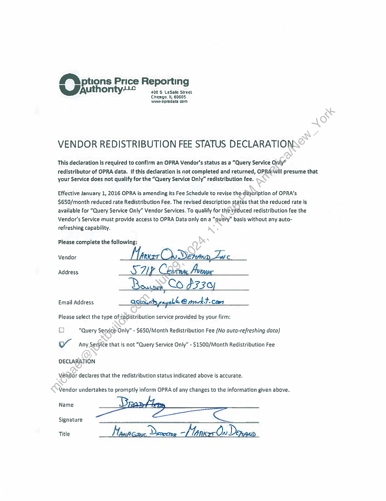
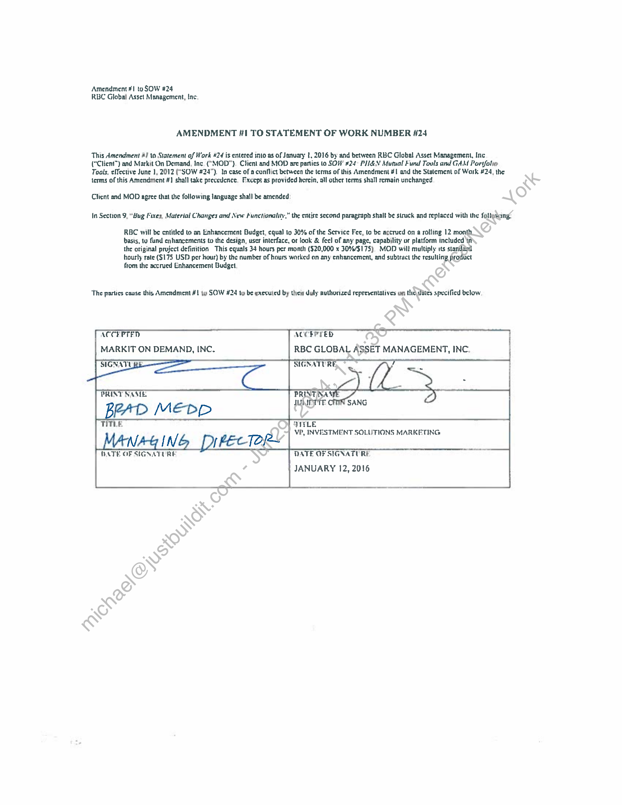

##### Amendment #1 to Statement of Work #24]

  
````col
```col-md
flexGrow=.5
===
> [!info] [Page 1](_attachments/images_3.6.4.1.9.4OPRA_MODDistribDeclaration_Executed20160112.pdf_155228/page_1.png)
> 
```  
```col-md
M™ptions Price Reportin
GSauthontyc abn cy  
Chicago. IL 6060S
wane opradsta com  
VENDOR REDISTRIBUTION FEE STATUS DECLARATION  
This declaration Is required to confirm an OPRA Vendor's status as a “Query Service Only”  
redistributor of OPRA data. If this declaration is not completed and returned, OPRAWill presume that.
your Service does not qualify for the “Query Service Only” redistribution fee.  
Effective January 1, 2016 OPRA is amending its Fee Schedule to revise the déseription of OPRA’s
$650/month reduced rate Redistribution Fee. The revised description states that the reduced rate is
available for “Query Service Only” Vendor Services. To qualify for the reduced redistribution fee the
Vendor's Service must provide access to OPRA Data only on a “query” basis without any autorefreshing capability.  
Please complete the following:
Vendor f WerAuD  
Address. S Zl ? Camm. Avewe  
Email Address Odkoanbypayab® @ mock}. cow  
Please select the type ofsredistribution service provided by your firm:  
D0 “Query Service Only” - $650/Month Redistribution Fee (No auto-refreshing data)
WY Any Service that is not “Query Service Only” - $1500/Month Redistribution Fee
DECLARATION  
Vehdor declares that the redistribution status indicated above is accurate.  
Vendor undertakes to promptly infarm OPRA of any changes to the information given above.
Name D  
Signature  
Title hy, na “Lit: Ow)D  
```
````
Notes:    
````col
```col-md
flexGrow=.5
===
> [!info] [Page 2](_attachments/images_3.6.4.1.9.4OPRA_MODDistribDeclaration_Executed20160112.pdf_155228/page_2.png)
> 
```  
```col-md
Amendment #1 to SOW #24
RBC Global Asse! Management, Inc.  
AMENDMENT #1 TO STATEMENT OF WORK NUMBER 424  
This Amendment #1 to Statement of Work #24 is entered into as of January t, 2016 by and between RBC Global Asset Management, Inc
("Client") and Markit On Demand, Inc ("MOD"). Client and MOD are parties to SOW #24 PH&N Mutual Fund Touls and GAM Portfolio
Tools, effective June 1, 2012 (“SOW 824°). In case of a conflict between the terms of this Amendment #1 and the Statement of Wark #24, the
terms of this Amendment #] shall take precedence. Except as provided hercin, all other terms shall remain unchanged  
Chicnt and MOD agree that the following language shall be amended:  
In Section 9, “Sug Fixes, Material Changes and New functionality,” the entire second paragraph shalt be struck and replaced with the follexang:  
RBC will be entitled to an Enhancement Budget, equal 19 30% of the Service Fee, to be accrucd on a rolling 12 month.
basis, tu fund enhancements to the design, user interface, of look & feel of any page, capability or platform included in
the original project definition This equals 34 hours per month ($20,000 x 30%/$175), MOD will multiply its standard
hourly rate ($175 USD per hour) by the number of hours worked on any enhancement, and subtruct the resulling product
from the accrued Enhancement Budget,  
The partics cause this Amendment #! y SOW #24 ty be executed by then duly authorized representatives on thedines specified below.  
ACCEPTED
MARKIT ON DEMAND, INC.  
ACCEPTED }  
SIGNATURE  
PRINT NASLE BRINTINAY
JUNIITTE 8 SANG  
NAG ING PrPECTOR  
VP, INVESTMENT SOLUTIONS MARKETING
DATE OF SIGNATURE  
|
RBC GLOBAL ASSET MANAGEMENT, INC. i  
DATE OF SIGNATURE
JANUARY 12, 2016  
```
````
Notes:  


![[_attachments/3.6.4.1.9.4 OPRA_MOD Distrib Declaration_Executed 20160112.pdf]