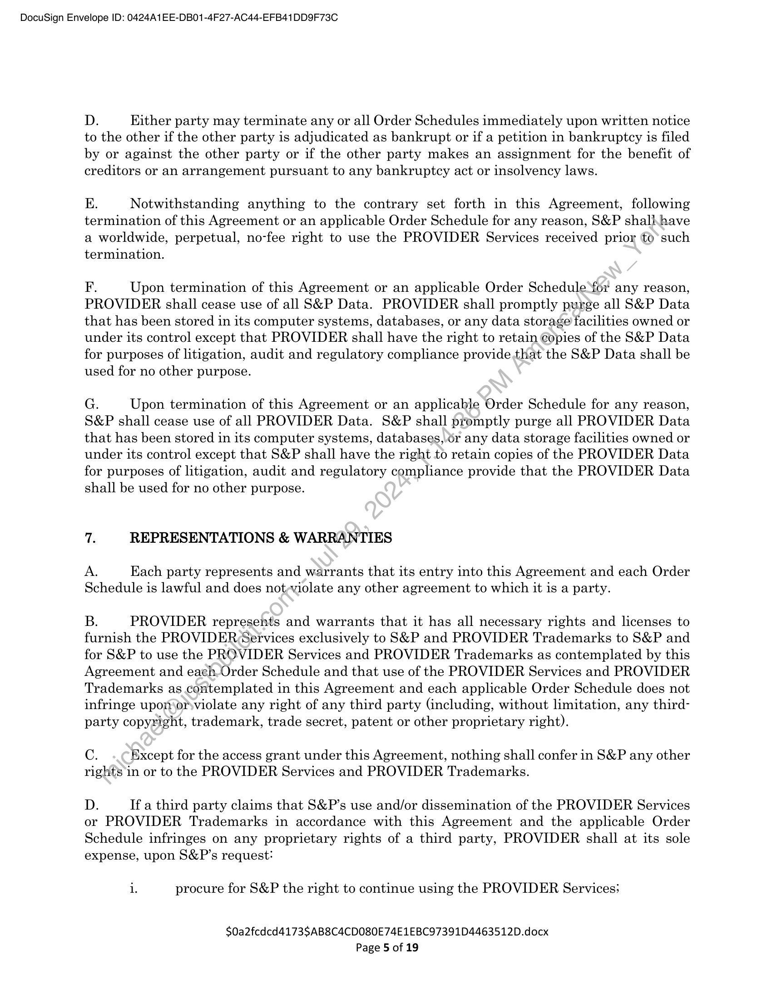

##### Master Information Access Agreement]

  
````col
```col-md
flexGrow=.5
===
> [!info] [Page 1](_attachments/images_3.6.4.2.1.120230804SPGMI-MoDBenzingaMasterLogos.pdf_155023/page_1.png)
> 
```  
```col-md
DocuSign Envelope ID: 0424A1EE-DB01-4F27-AC44-EFB41DD9F73C  
MASTER INFORMATION ACCESS AGREEMENT  
This Master Information Access Agreement (“Agreement”), entered into as of the Effective Date,
is made by and between S&P Global Inc., a Delaware corporation whose principal office is
located at 55 Water Street, New York, NY 10041, USA, on behalf of itself and its Affiliates  
(“S&P”), and
NAME: [Accretive Capital LLC, d/b/a BENZINGA.COM | (“PROVIDER”)
STREET ADDRESS: One Campus Martius, Suite 200
CITY: Detroit
STATE: Michigan
COUNTRY:
POSTAL CODE: 48226
TYPE OF ENTITY: LLC
PLACE OF FORMATION: Delaware
EFFECTIVE DATE: 8/04/2023 (“Effective Date”)  
WHEREAS, PROVIDER has developed and/or is fully Micensed to distribute certain
information, products, software, and/or services and desires to make such products and services
available to S&P for S&P’s use as provided herein and as set forth in each Order Schedule
attached hereto and made a part hereof (each, an “Order Schedule”); and  
WHEREAS, S&P desires to access PROVIDER’s information, products, related software and/or
services to use internally and provide to its customers through various S&P Products and
Services as set forth herein.  
NOW, THEREFORE, in consideration.ofthe mutual promises herein contained, it is agreed by
both parties as follows:  
1. DEFINITIONS
For the purpose of this Agreement, the following terms shall have the meanings given below:  
“Affiliate” means any’ current or future entity directly or indirectly Controlled by, under
common Control with, or Controlling S&P Global Inc.  
“Control” (and<all of its variations) means having greater than fifty percent (50%) equity
interest (or.other comparable interest for an entity other than a corporation) or the sole power
to direct orcause the direction of the management or policies of the entity, whether through the
abilityto- exercise voting power, by contract or otherwise.  
“Data’-means any data used in connection with this Agreement, including S&P Data.
“Delivery Specifications” means the specifications for delivery of the PROVIDER Services to
S&P, as described in the applicable Order Schedule.  
“Derivative Works” means any and all works, content, derived data, and/or calculations
developed by a party and/or its Affiliates utilizing Data and/or other information from the other
party under the terms of this Agreement.  
“PROVIDER Service(s)” means the information, product(s), software, and/or service(s) provided
by PROVIDER to S&P, as described in the applicable Order Schedule.  
$0a2fcdcd4173SAB8C4CD080E74E1EBC97391D4463512D.docx
Page 1 of 19  
```
````
Notes:    
````col
```col-md
flexGrow=.5
===
> [!info] [Page 2](_attachments/images_3.6.4.2.1.120230804SPGMI-MoDBenzingaMasterLogos.pdf_155023/page_2.png)
> 
```  
```col-md
DocuSign Envelope ID: 0424A1EE-DB01-4F27-AC44-EFB41DD9F73C  
“PROVIDER Trademarks” means the trademark(s), service mark(s), logo(s), and/or Internet
domain name(s) of PROVIDER set forth in the applicable Order Schedule and/or as otherwise
provided by PROVIDER to S&P.  
“S&P Data” means data provided by S&P to PROVIDER in its performance of the PROVIDER
Service, as well as any S&P Confidential Information as defined in Section 15(C)  
“S&P Products and Services” means any and all product(s) and/or service(s) developed and/or
licensed by S&P and/or its Affiliates currently or in the future (including, without limitation,
any replacement or successor product(s) now in existence or hereafter developed) ;to- its
customers and/or potential customers, including but not limited to customers who are permitted
to redistribute the PROVIDER Services.  
“Service Level Agreement”/“SLA” means service level specifications relating to the PROVIDER
Services and associated escalation procedures as described in the applicable Order Schedule.  
2. ACCESS GRANT  
A. Subject to the terms and conditions of this Agreement and .asmay be further set forth
in the applicable Order Schedule(s), PROVIDER hereby grants to S&P a royalty-free, worldwide
right and license to access, store, process, edit, translateyspackage, reformat, reproduce,
disseminate, display, distribute, and/or utilize each PROVIDER Service: (i) for S&P’s own
internal use including, without limitation, for research and’dévelopment purposes: (ii) to create
Derivative Works only if affirmatively granted in an Order Schedule; (iii) as part of the S&P
Products and Services provided to its customers and/or potential customers in any and all media
now known or hereafter devised (including, without limitation, in desktop products, mobile
applications, software applications, application ‘program interfaces [i.e., APIs], and/or feed
products); and/or (iv) for each S&P customer’s-(a) internal use and limited distribution in its
ordinary course of business and/or (b) if applicable, further distribution to its clients Gf and as
may be further set forth in an Order Schedule). PROVIDER further grants to S&P the right to
sub-license the usage rights as detailéd in this Section 2(A) to its Affiliates. Notwithstanding
the foregoing, S&P may provide the PROVIDER Services to S&P’s third party service
facilitator.  
B. PROVIDER shallfurnish S&P with the PROVIDER Services described in the applicable
Order Schedule(s) in‘aécordance with the terms and conditions of this Agreement and the
applicable Order Schedule(s). Use of each individual PROVIDER Service is subject to any
restrictions set forth in the applicable Order Schedule for that individual PROVIDER Service.
S&P may add\additional PROVIDER Services if S&P and PROVIDER each execute additional
Order Schedule(s) to this Agreement substantially in the form attached hereto. When executed
by S&P aad PROVIDER, each Order Schedule shall constitute a separate agreement and,
except for any provisions herein that are specifically excluded or modified in such Order
Schedule, shall incorporate therein the terms and conditions of this Agreement. In the event
of any conflict between the terms of this Agreement and the terms of any Order Schedule, the
terms of the Order Schedule shall prevail with respect to that Order Schedule only. Except as
may be specifically provided for in an Order Schedule, any modifications contained in any Order
Schedule shall not modify this Agreement with respect to any other Order Schedule.  
C. Except for the rights provided pursuant to this Agreement, S&P owns and retains all
intellectual property rights in and to the S&P Data and Derivative Works and reserves all right,
title and interest in the S&P Data and Derivative Works.  
$0a2fcdcd4173SAB8C4CD080E74E1EBC97391D4463512D.docx
Page 2 of 19  
```
````
Notes:    
````col
```col-md
flexGrow=.5
===
> [!info] [Page 3](_attachments/images_3.6.4.2.1.120230804SPGMI-MoDBenzingaMasterLogos.pdf_155023/page_3.png)
> 
```  
```col-md
DocuSign Envelope ID: 0424A1EE-DB01-4F27-AC44-EFB41DD9F73C  
D. PROVIDER hereby grants to S&P a non-exclusive, non-transferable, royalty-free right
and license to use the PROVIDER Trademarks as part of and/or in connection with its
marketing, promotion, and distribution of the PROVIDER Services as part of the S&P Products
and Services.  
3. DELIVERY OF THE PROVIDER SERVICES BY PROVIDER TO S&P  
A. PROVIDER shall provide S&P with access to the PROVIDER Services and updates
thereto in accordance with the Delivery Specifications and Service Level Agreement in the
applicable Order Schedule. PROVIDER will provide all PROVIDER Services\in’a highly
professional manner consistent with generally accepted professional standards.for companies
engaged in services of similar complexity. PROVIDER shall ensure that all personnel involved
in providing the PROVIDER Services shall have sufficient experience, skills and expertise for
the applicable PROVIDER Services.  
B. Services and that all times PROVIDER shall devote, sufficient resources to the
PROVIDER Services.  
C. PROVIDER shall adhere to the terms of each Order Schedule and its Annexes, including any
Service Level Agreement with regard to delivery and functionality of each PROVIDER Service and
PROVIDER’s performance under this Agreement and the-applicable Order Schedule.  
4. NO PROMOTION  
PROVIDER shall not, without the prior-written consent of S&P in each instance, (A) use in
advertising, publicity, or otherwise: (i) the name of S&P or any employee of S&P, Gi) any S&Powned trade name, trademark, trade device, service mark, logo, symbol, or any other S&P indicia,
or (iii) any abbreviation, contraction or simulation thereof; or (B) represent, directly or indirectly,
that any product or any service provided by PROVIDER has been approved or endorsed by S&P.  
5. FEES AND PAYMENTS  
A. In full consideration for the access and rights granted by PROVIDER under this
Agreement and the»applicable Order Schedule, S&P shall pay the fees as set forth in the
applicable OrderySchedule (“Fees”) if/as such Fees may become payable, commencing on the
Billing Commencement Date (as defined in the applicable Order Schedule) unless otherwise set
forth therein.  
B. All Fees shall be paid in United States dollars plus all applicable sales, use, value added,
goods and services, or similar consumption taxes chargeable on the Fees and set forth in the
applicable invoice; provided, however, that New York state sales and use tax will not be owed
if S&P provides a New York State and Local Sales and Use Tax Exemption Certificate to
Provider. S&P shall be entitled to deduct and withhold from the Fees any taxes it is required
to deduct and withhold under applicable law, and to the extent such deducted amounts are
timely paid to the applicable governmental authority, all such amounts shall be deemed and
treated as paid and delivered to the PROVIDER hereunder. PROVIDER shall provide
information or certification as to the tax residence of PROVIDER and shall notify S&P of any
change in such information or certification.  
$0a2fcdcd4173SAB8C4CD080E74E1EBC97391D4463512D.docx
Page 3 of 19  
```
````
Notes:    
````col
```col-md
flexGrow=.5
===
> [!info] [Page 4](_attachments/images_3.6.4.2.1.120230804SPGMI-MoDBenzingaMasterLogos.pdf_155023/page_4.png)
> 
```  
```col-md
DocuSign Envelope ID: 0424A1EE-DB01-4F27-AC44-EFB41DD9F73C  
A. The Fees shall be due and payable as specified in the applicable Order Schedule. All
invoices shall be addressed to S&P as specified in the applicable Order Schedule and delivered
to: CARMInvoices@spglobal.com.  
B. If PROVIDER wishes to propose revised Fees for any Renewal Term (defined in Section
6(B) below), PROVIDER shall send S&P written notice of the proposed Fees at least one
hundred twenty (120) days prior to the end of the Initial Term or the then-current Renewal
Term. S&P shall use best efforts to respond to such proposal within thirty (30) days\of S&P’s
receipt of such written notice. Any price increase will take effect at an S&P customer’s next
renewal period upon a notice period of not less than 60-days prior to the end of that customers
current initial or renewal term. For the avoidance of doubt, however, S&P shall be under no
obligation to approve any such proposed Fee revision and in no event shall a Fee increase exceed
the greater of three percent (3%) or the US Consumer Price Index (CPI) rate for the preceding
year.  
C. Unless otherwise specified in the applicable Order Schedule, PROVIDER shall be
responsible for all transmission costs relevant to provisiom and delivery to S&P of the
PROVIDER Services and any associated information.  
D. In addition to any other remedies it may have, S&P reserves the right to reduce the Fees
by an amount equal to the Fees for the relevant calendar quarter divided by the number of
Business Days (where a “Business Day’ means,any day excluding Saturdays, Sundays and
holidays when the New York Stock Exchange) is closed) during which, for any reason not
attributable to S&P, the PROVIDER Services‘are not delivered to S&P.  
E. For the avoidance of doubt, S&P reserves the right to determine, in its sole discretion,
the fees charged for the S&P Products,and Services to its clients and customers.  
6. TERM AND TERMINATION  
A. This Agreement shall commence as of the Effective Date set forth above and shall
continue in effect thereafter for as long as any Order Schedule entered into pursuant to this
Agreement remains in-effect. Should all Order Schedules pursuant to this Agreement be
terminated, this Agreement shall automatically terminate.  
B. The termof each Order Schedule shall commence on the Commencement Date specified
therein and shall continue for the duration of the Initial Term as specified therein. Following
the Initial}Term of any Order Schedule, unless otherwise specified in the applicable Order
Schedule, such Order Schedule shall be automatically extended for successive renewal term(s)
of twelve (12) months (each, a “Renewal Term”) each unless either party notifies the other in
writing of its decision not to extend the term of such Order Schedule at least ninety (90) days
prior to the expiration of the term then in effect.  
C. In the event of a material breach by either party, the non-breaching party may terminate
the applicable Order Schedule by giving thirty (30) days prior written notice thereof (such notice
specifying the breach); provided, however, that such termination shall not take effect if the
party in breach cures or corrects the breach and provides notice of such rectification within such
thirty-day notice period.  
$0a2fcdcd4173SAB8C4CD080E74E1EBC97391D4463512D.docx
Page 4 of 19  
```
````
Notes:    
````col
```col-md
flexGrow=.5
===
> [!info] [Page 5](_attachments/images_3.6.4.2.1.120230804SPGMI-MoDBenzingaMasterLogos.pdf_155023/page_5.png)
> 
```  
```col-md
DocuSign Envelope ID: 0424A1EE-DB01-4F27-AC44-EFB41DD9F73C  
D. Either party may terminate any or all Order Schedules immediately upon written notice
to the other if the other party is adjudicated as bankrupt or if a petition in bankruptcy is filed
by or against the other party or if the other party makes an assignment for the benefit of
creditors or an arrangement pursuant to any bankruptcy act or insolvency laws.  
E. Notwithstanding anything to the contrary set forth in this Agreement, following
termination of this Agreement or an applicable Order Schedule for any reason, S&P shall\have
a worldwide, perpetual, no-fee right to use the PROVIDER Services received prior to*such
termination.  
F. Upon termination of this Agreement or an applicable Order Schedule f6r any reason,
PROVIDER shall cease use of all S&P Data. PROVIDER shall promptly purge all S&P Data
that has been stored in its computer systems, databases, or any data storage facilities owned or
under its control except that PROVIDER shall have the right to retain Copies of the S&P Data
for purposes of litigation, audit and regulatory compliance provide that the S&P Data shall be
used for no other purpose.  
G. Upon termination of this Agreement or an applicable Order Schedule for any reason,
S&P shall cease use of all PROVIDER Data. S&P shall promptly purge all PROVIDER Data
that has been stored in its computer systems, databases,.6r any data storage facilities owned or
under its control except that S&P shall have the right to retain copies of the PROVIDER Data
for purposes of litigation, audit and regulatory compliance provide that the PROVIDER Data
shall be used for no other purpose.  
7. REPRESENTATIONS & WARRANTIES  
A. Each party represents and warrants that its entry into this Agreement and each Order
Schedule is lawful and does not;-violate any other agreement to which it is a party.  
B. PROVIDER represents and warrants that it has all necessary rights and licenses to
furnish the PROVIDER Services exclusively to S&P and PROVIDER Trademarks to S&P and
for S&P to use the PROVIDER Services and PROVIDER Trademarks as contemplated by this
Agreement and eaeh-Order Schedule and that use of the PROVIDER Services and PROVIDER
Trademarks as contemplated in this Agreement and each applicable Order Schedule does not
infringe uponorsviolate any right of any third party (including, without limitation, any thirdparty copyright, trademark, trade secret, patent or other proprietary right).  
C. Except for the access grant under this Agreement, nothing shall confer in S&P any other
rights in or to the PROVIDER Services and PROVIDER Trademarks.  
D. If a third party claims that S&P’s use and/or dissemination of the PROVIDER Services
or PROVIDER Trademarks in accordance with this Agreement and the applicable Order
Schedule infringes on any proprietary rights of a third party, PROVIDER shall at its sole
expense, upon S&P’s request:  
i. procure for S&P the right to continue using the PROVIDER Services:  
$0a2fcdcd4173SAB8C4CD080E74E1EBC97391D4463512D.docx
Page 5 of 19  
```
````
Notes:    
````col
```col-md
flexGrow=.5
===
> [!info] [Page 6](_attachments/images_3.6.4.2.1.120230804SPGMI-MoDBenzingaMasterLogos.pdf_155023/page_6.png)
> 
```  
```col-md
DocuSign Envelope ID: 0424A1EE-DB01-4F27-AC44-EFB41DD9F73C  
i.  
ill.  
modify or amend the PROVIDER Services or the infringing part thereof so that
the same become(s) non-infringing; and/or  
replace the PROVIDER Services or the infringing part thereof by other data of
similar content to S&P’s reasonable specifications.  
In addition to the foregoing rights of S&P under this Section 7(D), in the event of such a thirdparty claim, S&P may, in its sole discretion, (a) terminate this Agreement or any appli¢able
Order Schedule hereto, in which case PROVIDER shall refund to S&P any prepaid fees) or (b)
where S&P reasonably believes that the modification of the PROVIDER Services as permitted
by subsections 7(D)(ii) or 7(D)Gii) above has adversely impacted the value of PROVIDER
Services to S&P, within ninety (90) days of any such modification of the PROVIDER Services,
request a reduction in Fees for the impacted PROVIDER Services, in which\case the parties
shall negotiate in good faith. Should the parties fail to agree on revised Fees within sixty (60)
days of such request, S&P may terminate the applicable Order Schédule(s) hereto and be
reimbursed for any prepaid fees calculated as of the date of such modification.  
E. PROVIDER agrees and covenants that:  
i.  
ill.  
lv.  
it is responsible for determining the methods and means of performing the
PROVIDER Services in accordance with this Agreement and the applicable Order
Schedule in order to achieve S&Ps goals.as effectively and efficiently as possible.  
it will make all reasonable efforts to ensure that the PROVIDER Services
delivered to S&P have been and-will continue to be developed with due care and
skill and that, if notified by S&P of any errors or omissions in the PROVIDER
Services, PROVIDER shall promptly correct or complete such errors or omissions
and then retransmit the corrected or completed PROVIDER Services to S&P;  
the PROVIDER Services will continue to be provided during the term of the
applicable OrderSchedule at least to the same standard in terms of quality and
timeliness, as-at the Commencement Date specified in each applicable Order
Schedule;  
it willnot include computer code in the PROVIDER Services (a) which may
disrupt, disable, harm, or otherwise impede in any manner the operation of the
S&P Products and Services (including, without limitation, aesthetical
disruptions or distortions), or any other associated software, firmware, hardware,
computer system or network (sometimes referred to as “viruses”, “Trojan horses”
or “worms”), (b) that would disable the S&P Products and Services or impair in
any way its operation based on the elapsing of a period of time, exceeding an
authorized number of copies, or advancement to a particular date or other
numeral (sometimes referred to as “time bombs”, “time locks”, or “drop dead”
devices), or (c) that would permit PROVIDER to access the S&P Products and
Services to cause such disablement or impairment (sometimes referred to as
“traps”, “access codes” or “trap door” devices), or any other similar harmful,
malicious or hidden procedures, routines or mechanisms that would cause such
programs to cease functioning or to damage or corrupt the S&P Products and  
$0a2fcdcd4173SAB8C4CD080E74E1EBC97391D4463512D.docx
Page 6 of 19  
```
````
Notes:    
````col
```col-md
flexGrow=.5
===
> [!info] [Page 7](_attachments/images_3.6.4.2.1.120230804SPGMI-MoDBenzingaMasterLogos.pdf_155023/page_7.png)
> 
```  
```col-md
DocuSign Envelope ID: 0424A1EE-DB01-4F27-AC44-EFB41DD9F73C  
Services, storage media, programs, equipment or communications, or otherwise
interfere with operations; and  
v. All proprietary rights (including, without limitation, copyrights, trademark
rights, trade secrets, and database rights) in and to the S&P Products and
Services and any Derivative Works are and shall remain the sole and exclusive
property of S&P. S&P reserves the right to use, publish, license and distribute
the S&P Products and Services and/or the Derivative Works in its sole discrétion
and is under no obligation to purge or modify them should this Agreement, and/or
applicable Order Schedule terminate.  
vi. Notwithstanding anything to the contrary contained herein)’ PROVIDER
reserves the right to change, modify, add to, discontinue, or retire any aspect or
feature of the PROVIDER Service at any time without noticé From time to time,
PROVIDER may, but is under no obligation to, release upgrades, fixes or new
versions of the PROVIDER Service, although these’upgrades may not be
consistent across all platforms and devices, provided that, if PROVIDER
schedules a change to PROVIDER Service that) has a reasonable likelihood of
directly causing a material detrimental effect;to the services provided hereunder
(each, a “Material Modification”), then S&P»shall be entitled to terminate the
Agreement pursuant to Section 6.C heredf. To the extent possible under the
circumstances, PROVIDER shall provide notice to S&P of its intention to make
a Material Modification at least sixty (60) days prior to making the Material
Modification.  
8. DISCLAIMER OF WARRANTIES  
EXCEPT (A) AS EXPRESSLY STATED HEREIN AND/OR THE APPLICABLE ORDER
SCHEDULK(S), AND/OR (B) FOR FRAUD OR FRAUDULENT MISREPRESENTATION,
PROVIDER AND ITS AFFIEIATES, S&P AND ITS AFFILIATES, AND ALL OF THEIR
SUPPLIERS DISCLAIM ANY AND ALL WARRANTIES AND REPRESENTATIONS,
EXPRESS OR IMPLIED» INCLUDING ANY WARRANTIES OF MERCHANTABILITY OR
FITNESS FOR A PARTICULAR PURPOSE OR USE AS TO THE PROVIDER SERVICES OR
THE S&P PRODUCTS AND SERVICES, INCLUDING THE INFORMATION, DATA,
SOFTWARE OR\PRODUCTS CONTAINED THEREIN OR THE RESULTS OBTAINED BY
THEIR USE OR.AS TO THE PERFORMANCE THEREOF.  
9. LIMITATION OF LIABILITIES  
NOTWITHSTANDING ANYTHING TO THE CONTRARY IN THIS AGREEMENT, IN NO
EVENT WHATSOEVER SHALL S&P OR ITS AFFILIATES, PROVIDER OR ITS
AFFILIATES, OR THEIR RESPECTIVE SUPPLIERS BE LIABLE FOR ANY INDIRECT,
SPECIAL, INCIDENTAL, PUNITIVE OR CONSEQUENTIAL DAMAGES, INCLUDING BUT
NOT LIMITED TO LOSS OF PROFITS OR LOST TIME OR GOODWILL, EVEN IF THEY
HAVE BEEN ADVISED OF THE POSSIBILITY OF SUCH DAMAGES, WHETHER IN
CONTRACT, TORT (INCLUDING NEGLIGENCE), STRICT LIABILITY OR OTHERWISE.  
$0a2fcdcd4173SAB8C4CD080E74E1EBC97391D4463512D.docx
Page 7 of 19  
```
````
Notes:    
````col
```col-md
flexGrow=.5
===
> [!info] [Page 8](_attachments/images_3.6.4.2.1.120230804SPGMI-MoDBenzingaMasterLogos.pdf_155023/page_8.png)
> 
```  
```col-md
DocuSign Envelope ID: 0424A1EE-DB01-4F27-AC44-EFB41DD9F73C  
NEITHER PARTY NOR THEIR RESPECTIVE AFFILIATES SHALL BE LIABLE (EXCEPT
AS EXPRESSLY PROVIDED IN SECTION 10 BELOW) FOR ANY CLAIMS AGAINST THE
OTHER BY THIRD PARTIES.  
IN NO EVENT SHALL THE MAXIMUM CUMULATIVE LIABILITY OF EITHER PARTY OR
THEIR RESPECTIVE AFFILIATES UNDER THIS AGREEMENT, REGARDLESS OF THE
FORM(S) OF ACTION, EXCEED THE FEES PAYABLE BY S&P TO PROVIDER FOR THE
APPLICABLE PROVIDER SERVICE IN THE PRECEDING CALENDAR YEAR IN WHICH
SUCH LIABILITY IS ALLEGED TO HAVE ARISEN EXCEPT TO THE EXTENT THAT SUCH
DAMAGES ARE RELATED TO OR ARISE FROM A PARTY’S VIOLATION OF ANY OF THE
OTHER PARTY’S INTELLECTUAL PROPERTY AND DATABASE RIGHTS (INCLUDING,
BUT NOT LIMITED TO, TRADEMARKS AND COPYRIGHTS), AND/OR’A PARTY’S
WILLFUL MISCONDUCT, AND IN THE CASE OF PROVIDER, ITS INDEMINTY
OBLIGATIONS UNDER SECTION 10(B) BELOW. NOTHING IN THIS AGREEMENT
SEEKS TO LIMIT OR RESTRICT LIABILITY FOR DEATH OR(@ERSONAL INJURY
RESULTING FROM NEGLIGENCE.  
NO ACTION, REGARDLESS OF FORM, ARISING FROM*<OR PERTAINING TO THE
SERVICES MAY BE BROUGHT BY A PARTY MORE THAN TWO (2) YEARS AFTER SUCH
ACTION HAS ACCRUED, EXCEPT FOR CLAIMS ARISING FROM A _ PARTY’S
INDEMNIFICATION OBLIGATIONS PURSUANT TO SECTION 10 BELOW.  
10. INDEMNIFICATION  
A. Each party shall, at its sole cost and-expense, indemnify and hold the other party
harmless from and against any and all liabilities, claims, losses, damages, injuries or expenses,
including reasonable attorneys’ fees, arising in connection with any third-party claim resulting
out of a breach or alleged breach of any of a party’s representations, warranties or obligations
in Section 7 of this Agreement.  
B. PROVIDER shall, at its\sole cost and expense, defend, indemnify and hold S&P harmless
from and against any and,alLiiabilities, claims, losses, damages, injuries or expenses, including
reasonable attorneys’ feés; relating directly or indirectly to (i) any Security Incident; and (i)
any third-party claim*or litigation against S&P alleging that the PROVIDER Services or any
element thereof infringe(s) on and/or violate(s) any copyright, trademark, patent or other
proprietary right.of any third party.  
C. With respect to any claim which may form the basis of an indemnity under this Section
10, the party seeking indemnification shall give prompt notice of such claim to the other party,
as well as the opportunity to defend, compromise, or settle such claim with counsel selected by
such other party, and shall fully cooperate (at the indemnifying party’s expense) in the course
thereof; provided, however, that the indemnifying party shall not enter into any compromise or
settlement that shall have the effect of creating any liability or obligation (whether legal or
equitable) on the part of the indemnified party without the indemnified party's prior written
consent, which will not be unreasonably withheld, and no such compromise or settlement is
hereby authorized unless the indemnified party obtains a complete release under said
compromise or settlement.  
11. INJUNCTIVE RELIEF  
$0a2fcdcd4173SAB8C4CD080E74E1EBC97391D4463512D.docx
Page 8 of 19  
```
````
Notes:    
````col
```col-md
flexGrow=.5
===
> [!info] [Page 9](_attachments/images_3.6.4.2.1.120230804SPGMI-MoDBenzingaMasterLogos.pdf_155023/page_9.png)
> 
```  
```col-md
DocuSign Envelope ID: 0424A1EE-DB01-4F27-AC44-EFB41DD9F73C  
In the event of a breach or threatened breach of any of the provisions of this Agreement or any
Order Schedule by either party, or any employee or representative of either party, the other
party shall be entitled to seek preliminary and permanent injunctive relief to enforce the
provisions hereof, but nothing herein shall preclude either party from pursuing any action or
other remedy for any breach or threatened breach of this Agreement or any Order Schedule, all
of which shall be cumulative.  
12. FORCE MAJEURE  
Neither party shall be responsible or liable for any losses arising out of anydelay in or
interruption of the performance of its obligations under this Agreement due to‘any act of God,
act of governmental authority, act of the public enemy or due to war or terrorism, the outbreak
or escalation of hostilities, riot, fire, flood, severe or adverse ;weather conditions,
communications line failure, or other similar cause beyond the reasonable control of the party
so affected at the time such causes arise and not due to such party’s negligence. In the event
that a force majeure event prevents PROVIDER from performing its obligations under this
Agreement or any Order Schedule for a period of five (5) consecuitive Business Days, S&P shall
have the right to terminate the applicable Order Schedule upon written notice and PROVIDER
shall refund any prepaid, unearned fees.  
13. BUSINESS CONTINUITY AND DISASTER,RECOVERY PLAN  
PROVIDER represents, warrants, and covenants that it has implemented, will maintain
throughout the term of this Agreement, andshall follow best industry practices in its standard
data security, business continuity, disaster recovery, and anti-virus processes, policies, and
procedures (including, but not limited~to, backup capabilities and facilities) to assist
PROVIDER in performing its obligations hereunder with minimal disruptions or delays
including but not limited to mitigating risk and/or severity of a force majeure occurrence as set
forth in Section 12 above. Such-plans shall include the transition to a backup site within four
(4) to six (6) hours of the occurrence of any failover. PROVIDER’s current Business Continuity
and Disaster Recovery Plan\(Plan”), is attached hereto as Exhibit A. PROVIDER shall provide
S&P with an updated Plan written in the English language within sixty (60) days of each
anniversary of the Effective Date of this Agreement.  
14. SECURITY INCIDENT PROCEDURES  
Unless expressly prevented by law enforcement or other similar authority, PROVIDER will
provide immediate notice (within 24 hours of discovery of such incident) to S&P in the event of
any actual or suspected Security Incident (as hereinafter defined), whether or not such notice
is required by law. A Security Incident shall include, but not be limited to, any actual or
suspected (A) unauthorized access to or acquisition of S&P Data; (B) any unauthorized or
accidental loss, alteration, or destruction of any S&P Confidential Information (as defined in
Section 15(C) below) and/or any Derivative Works (if applicable) (collectively, “S&P Data”); (C)
any compromise, intrusion, interference with, or unauthorized access to networks, systems,
databases, servers, or electronic or other media on which S&P Data is processed or from which
S&P Data may be accessed; or (D) any other event that could compromise the privacy,
confidentiality, integrity, or availability of S&P Data or the proper functioning of the network
resources of S&P or any suppliers/service PROVIDERs of S&P. Notwithstanding Section 15(L)  
$0a2fcdcd4173SAB8C4CD080E74E1EBC97391D4463512D.docx
Page 9 of 19  
```
````
Notes:    
````col
```col-md
flexGrow=.5
===
> [!info] [Page 10](_attachments/images_3.6.4.2.1.120230804SPGMI-MoDBenzingaMasterLogos.pdf_155023/page_10.png)
> 
```  
```col-md
DocuSign Envelope ID: 0424A1EE-DB01-4F27-AC44-EFB41DD9F73C  
below, such notice will be made via live phone call (not voice message) to S&P’s Chief Legal
Officer or other designated representative of S&P. PROVIDER shall investigate and fully
cooperate with S&P with respect to the investigation of, response to, and remediation of, any
such Security Incident, and shall share all applicable information with S&P. PROVIDER shall
also fully cooperate with all reasonable requests made by S&P should either PROVIDER or
S&P determine that the Security Incident must be disclosed to the authorities, to individuals
whose information was affected, or to any other person or entity who has been affected by the
Security Incident. Unless otherwise directed by S&P, all such disclosures, and any otherssteps
taken related to any such Security Incident, including without limitation identifying,
investigating, addressing, managing, remediating, notifying individuals or government
authorities about a Security Incident, and, if applicable, providing notification and‘credit watch
services to the affected individuals and any forensic analysis conducted as‘aresult of the
Security Incident, shall be fully managed by PROVIDER: provided, however, that: G) unless
otherwise required by law, no such disclosures or notifications shall be:made by PROVIDER
without S&P’s prior written consent, and (ii) the content and delivéry details of all such
disclosures and notifications is subject to review and approval .by*S&P in each instance.
Notwithstanding any other provision to the contrary, PROVIDER shall be solely responsible for
all direct and indirect costs and expenses that S&P and/or PROVIDER may incur that are
attributable to or arise from identifying, investigating, addressing, managing, remediating, or
notifying individuals or government authorities about a Security Incident, including, without
limitation, the costs associated with providing notification and credit watch services to the
affected individuals and any forensic analysis conducted as a result of the incident.  
15. MISCELLANEOUS  
A. Governing Law. This Agreement shall be governed by and construed in accordance with
the laws of the State of New York, without giving effect to its rules of conflict of laws. Both
parties agree to the exclusive jurisdiction of the state and federal courts sitting in New York,
New York for the resolution of any disputes arising from or related to this Agreement.  
B. Assignment. Neither;party may assign or transfer this Agreement (and/or any Order
Schedule) or assign or delegate its rights or obligations hereunder, in whole or in part, without
the prior written consentyof the other party, which consent will not be unreasonably withheld;
provided, however, that’ S&P shall be permitted to assign its rights and/or obligations in whole
or in part to any entity that acquires all or substantially all of the business or assets of S&P or
any Affiliate (whether through stock purchase, asset acquisition, merger or otherwise) and in
such circumstance S&P shall provide PROVIDER with prompt written notice or to any Affiliate.  
C. Confidential Information. The parties understand and agree that in the performance of
this Agreement each party may have access to Confidential Information of the other party. For
purposes of this Agreement, “Confidential Information” shall mean information or data (i) that
is labelled or identified clearly as confidential by the disclosing party; or (ii) in respect of which
the receiving party has received from the disclosing party specific written notice of its
proprietary and confidential nature, either prior to or concurrently with the disclosure: or (iii)
information that by the nature of its contents would be considered confidential information by
a reasonable person under the circumstances. Neither party shall disclose, directly or
indirectly, in whole or in part, to any third person, firm or corporation, any Confidential
Information which it receives from the other party, except that any such information may be
disclosed to a party’s employees, agents or advisors (i) to the extent that party reasonably  
$0a2fcdcd4173SAB8C4CD080E74E1EBC97391D4463512D.docx
Page 10 of 19  
```
````
Notes:    
````col
```col-md
flexGrow=.5
===
> [!info] [Page 11](_attachments/images_3.6.4.2.1.120230804SPGMI-MoDBenzingaMasterLogos.pdf_155023/page_11.png)
> 
```  
```col-md
DocuSign Envelope ID: 0424A1EE-DB01-4F27-AC44-EFB41DD9F73C  
determines such disclosure to be necessary; and (ii) provided that the receiving party is under
the same obligations of confidentiality as are set out in this Section 15(C). Neither party shall
use the Confidential Information for its own benefit, or copy or reproduce the Confidential
Information, except as reasonably determined to perform its obligations under this Agreement
(including any Order Schedule). Each party shall use the same degree of care in safeguarding
the Confidential Information as it uses for its own confidential and proprietary information, but
not less than a reasonable degree of care. Notwithstanding the foregoing, information and data
disclosed shall not be deemed to be Confidential Information, and the receiving party shallhave
no obligation to treat such information and data as Confidential Information, df*such
information and data: (i) was substantially known by the receiving party at the time of such
disclosure; (ii) was known to the public at the time of such disclosure: (iii) becomes known to
the public (other than by act of the receiving party) subsequent to such disclosure; (iv) is
disclosed lawfully to the receiving party by a third party subsequent to the\disclosure; (v) is
developed independently by the receiving party without reference ;to the Confidential
Information; (vi) is approved in writing by the disclosing party for disclosure: or (vii) is required
by law to be disclosed by the receiving party, provided prior written‘notice of such required
disclosure is given to the disclosing party. Upon request by the disclosing party or upon
termination of this Agreement (or the applicable Order Schedule), the receiving party shall
return to the disclosing party all copies of the Confidential Information or other materials
incorporating Confidential Information in the possession‘ of its employees, agents or advisors
or, if so instructed by the disclosing party, the receiving party shall destroy all such copies.  
D. Independent Contractor. Each party acknowledges and agrees that the other is an
independent contractor and shall have no authority to act as an agent of the other; nor shall
either party bind or purport to bind the other) te any commitment, obligation, or liability to any
third party. This Agreement does not create a partnership or a joint venture relationship
between the parties.  
E. Entire Agreement. This Agreement, together with all executed Order Schedules,
constitutes the entire agreement, of the parties hereto with respect to its subject matter and
may not be amended or modified other than in a writing signed by duly authorized officers of
both parties. This Agreement supersedes all previous agreements between the parties with
respect to its subject matter.  
F. Headings. ‘Headings used in this Agreement are for reference purposes only and shall
not be deemed.a part of this Agreement.  
G. Waiver. The failure of a party to insist upon strict compliance with any term or provision
of this Agreement on any occasion shall not be construed as a waiver with regard to any
subsequent failure to comply with such term or provision. No provision of this Agreement shall
be waived except by a written instrument signed by the party charged with the waiver.  
H. Compliance with Law. Both parties shall perform their obligations hereunder in
compliance with all applicable laws and regulations, including but not limited to anticorruption, economic sanctions, securities and anti-money laundering laws and regulations,
now or hereinafter in effect. Nothing in this Agreement (including in any Order Schedule)
shall be construed to mean that either party is required to take any action contrary to, or
prohibited by, or otherwise in violation of any applicable laws or regulations.  
$0a2fcdcd4173SAB8C4CD080E74E1EBC97391D4463512D.docx
Page 11 of 19  
```
````
Notes:    
````col
```col-md
flexGrow=.5
===
> [!info] [Page 12](_attachments/images_3.6.4.2.1.120230804SPGMI-MoDBenzingaMasterLogos.pdf_155023/page_12.png)
> 
```  
```col-md
DocuSign Envelope ID: 0424A1EE-DB01-4F27-AC44-EFB41DD9F73C  
L Economic Sanctions. As of the Effective Date of this Agreement: (i) neither PROVIDER
nor S&P (nor any of the subsidiaries or any director or corporate officer of any of the foregoing
entities) is the subject of any sanctions administered by the Office of Foreign Assets Control of
the U.S. Department of the Treasury, the U.S. State Department, the United Nations Security
Council, the European Union or other relevant sanctions authority (collectively, “Sanctions”);
(ii) neither PROVIDER nor S&P is: (a) fifty percent (50%) or more owned or controlled, directly
or indirectly, by any person or entity that is the subject of Sanctions, (b) an agency or
instrumentality of, or an entity owned or controlled by, the government of a country that'ié-the
subject of territorial Sanctions, or (c) located, organized, or resident in a country that)is the
subject of territorial Sanctions; (iii) to the best of PROVIDER’s knowledge, no entity fifty
percent (50%) or more owned or controlled by a direct or indirect parent of PROVIDER is the
subject of Sanctions; and (iv) to the best of S&P’s knowledge, no entity fifty. percent (50%) or
more owned or controlled by a direct or indirect parent of S&P is the subjectpof' Sanctions. For
so long as this Agreement is in effect, either party will promptly notify the‘other if any of these
circumstances change.  
J. Anti-Corruption Compliance. PROVIDER represents and\warrants that it has policies
and procedures in place designed to ensure that, in carrying outvits responsibilities under this
Agreement, PROVIDER, its officers, employees, agents and others working on its behalf comply
with the Foreign Corrupt Practices Act of 1977 (as amended), the United Kingdom Bribery Act
2010 (as amended) and other applicable anti-corruption laws; and that PROVIDER shall take
reasonable best efforts to ensure that the payments made to PROVIDER by S&P under this
Agreement will not be used to make payments to,any government official or employee, political
party, official or employee of any political party, candidate for political office, or anyone else
acting in an official capacity, in order to obtain;vetain or direct business or obtain any improper
advantage in violation of applicable anti-corruption laws.  
K. Severability. If any part of this Agreement is held by a court of competent jurisdiction
to be invalid or unenforceable, that part will be enforced to the maximum extent permitted by
law, and the remainder of this Agreement will remain in full force and effect.  
L. Notices. All notices and other communications under this Agreement shall be in writing
and shall be deemed to iave been duly delivered as of the date received, if delivered by hand,
overnight courier, or sent postage prepaid by registered mail or certified mail return receipt
requested, with acknowledgment by the receiving party, to the below address or such other
address as either-party shall specify in a written notice to the other. Notwithstanding the
foregoing, noticés and other communications regarding notice addresses and contact persons
shall be effective if sent to the other party via electronic mail.  
If to.S&P, unless otherwise set forth in the applicable Order Schedule:  
S&P Global Inc.  
55 Water Street  
New York, NY 10041 USA  
Attention: Global Head, Content Acquisition & Rights Management
And an email copy to: CARMVendorNotices@spglobal.com  
With a copy to:
S&P Global Inc.  
$0a2fcdcd4173SAB8C4CD080E74E1EBC97391D4463512D.docx
Page 12 of 19  
```
````
Notes:    
````col
```col-md
flexGrow=.5
===
> [!info] [Page 13](_attachments/images_3.6.4.2.1.120230804SPGMI-MoDBenzingaMasterLogos.pdf_155023/page_13.png)
> 
```  
```col-md
DocuSign Envelope ID: 0424A1EE-DB01-4F27-AC44-EFB41DD9F73C  
55 Water Street
New York, NY 10041 USA
Attention: Legal Department  
If to PROVIDER: as set forth in the applicable Order Schedule.  
M. Survival. Sections 4, 6(E), 7, 8, 9, 10, 15(C), and 15(L) shall survive the expiration or
termination of this Agreement for whatever reason.  
N. Counterparts. This Agreement may be executed in counterparts, all of which together  
shall be considered one and the same agreement.  
IN WITNESS WHEREOF, the parties hereto have caused this Agreementto be executed as of
the Effective Date.  
Ben4INSERT NAME] S&P Global Inc., on behalf of itself and
its Affiliates
DocuSigned by:
DocuSighed by:
By: fom [ebbos
D87E2F1EC87149D. By: Dairy Wad swortle
BASSOBUI2SAB408,
N. . Andrew Lebbos
ame:  
Name: Dan wadsworth  
Title: VP of Licensing  
Title: Senior vice President  
8/4/2023
Date: (a/  
Date: 31 October 2023  
$0a2fcdcd4173SAB8C4CD080E74E1EBC97391D4463512D.docx
Page 13 of 19  
```
````
Notes:    
````col
```col-md
flexGrow=.5
===
> [!info] [Page 14](_attachments/images_3.6.4.2.1.120230804SPGMI-MoDBenzingaMasterLogos.pdf_155023/page_14.png)
> 
```  
```col-md
DocuSign Envelope ID: 0424A1EE-DB01-4F27-AC44-EFB41DD9F73C  
EXHIBIT A  
PROVIDER’s Business Continuity and Disaster Recovery Plan  
Benzinga Backup and Disaster Recovery  
This document outlines Benzinga’s critical resources and outlines storage and recovery plans.  
90% Infrastructure could be spun up within 24hrs considering, and much less-focusing on any
single service. The main bottleneck for any data service are the recovery time from network /
disk I/O for our Content and Datastores.  
1 Recovery Point Objective / RPO  
24 Hours - Designated RPO, however, aim for a much-higher standard for news, and data. All
critical data is backed-up with in a 24hr period or more frequently.  
2 Recovery Time Objective / RTO  
Being a service provider to the active trader community, 0 downtime is our expectation during
market hours, and much isn’t tolerated during off-hours.  
3 Recovery Responsibility
As a whole}.the platform (backend and operation) engineering team is responsible for recovery
of all services. Some services have individual owners who specialize in development an
ownership of that service, however, most setup is run to be replicable and documented so any
individual on the team may help.  
Service Recovery  
$0a2fcdcd4173SAB8C4CD080E74E1EBC97391D4463512D.docx
Page 14 of 19  
```
````
Notes:    
````col
```col-md
flexGrow=.5
===
> [!info] [Page 15](_attachments/images_3.6.4.2.1.120230804SPGMI-MoDBenzingaMasterLogos.pdf_155023/page_15.png)
> 
```  
```col-md
DocuSign Envelope ID: 0424A1EE-DB01-4F27-AC44-EFB41DD9F73C  
Internal / IT / 3rd Part  
Google Workspaces Managed service, 3rd Party RPO:
Benzinga internal email and | Backup Druva At most 24hr loss of data
drive/docs  
Team:  
IT Team, Lead Bert David
SalesForce Managed service, 3rd Party RPO:  
Backup Druva At most 24hr loss of data  
Team:  
$0a2fcdcd4173SAB8C4CD080E74E1EBC97391D4463512D.docx
Page 15 of 19  
```
````
Notes:    
````col
```col-md
flexGrow=.5
===
> [!info] [Page 16](_attachments/images_3.6.4.2.1.120230804SPGMI-MoDBenzingaMasterLogos.pdf_155023/page_16.png)
> 
```  
```col-md
DocuSign Envelope ID: 0424A1EE-DB01-4F27-AC44-EFB41DD9F73C  
IT Team, Lead Bert David  
Public APIs
TCP Services Runs as StandAlone EC2 Team:
Instance Platform Team, Lead Darwin
Smith
Data in Kafka
NewsAPI Runs in Kubernetes Cluster Team:  
Data in Elasticsearch  
Platform Team,-kead Darwin
Smith  
CalendarAPI, Signals  
Runs in Kubernetes Cluster  
Data in Elasticsearch  
Team:
Platform Team, Lead Darwin
Smith  
Realtime News (websockets,
webhooks, Discord)  
Runs in Kubernetes Cluster  
Data in Kafka  
Team:
Platform Team, Lead Darwin
Smith  
Corporate Logos  
Runs in Kubernetes Cluster  
Data in Elasticsearch, Mongo
Druapl  
Team:
Platform Team, Lead Darwin
Smith  
Market Data (Bars,
Fundamentals)  
Runs in)Kubernetes Cluster  
Datain RDS, Kafka  
Team:
Platform Team, Lead Tom
Fishwick  
Squawk Runs both in Kubernetes Team:
Cluster and as stand-alone Platform Team, Lead Hemraj
instance Gharia  
Platform Servic  
GitLab @.Digital Ocean
Code repository, code review
issue queue, ci/cd pipelines  
System & Files - Automated
system snapshots  
Database - managed service
with point-in-time recovery  
Periodic full backups to S3  
RPO:
At most 24hr loss of data  
Recovery Time:
1-6hrs  
Any code node in an existing
backup can by synced by any
developer with that code.  
Team:  
$0a2fcdcd4173SAB8C4CD080E74E1EBC97391D4463512D.docx  
Page 16 of 19  
```
````
Notes:    
````col
```col-md
flexGrow=.5
===
> [!info] [Page 17](_attachments/images_3.6.4.2.1.120230804SPGMI-MoDBenzingaMasterLogos.pdf_155023/page_17.png)
> 
```  
```col-md
Fastly
CDN for most site properties  
AWS EC2
Compute instances  
Market Data  
Fundamentals  
Drupal  
Wordpress + Laravel (maincom / Money / News)  
Kubernetes.@ AWS
Contianer services  
Wordpress (Events) @
Digital Ocean  
DocuSign Envelope ID: 0424A1EE-DB01-4F27-AC44-EFB41DD9F73C  
Managed service, support  
Kubernetes resources are
automated.  
Stand-alone services are
given a snapshot when built
for fast recovery.  
Critical systems are
provisioned using a hosted
terraform service.  
Runs in Kubernetes Cluster  
Runs in Kubernetes Cluster  
Runs asStandAlone EC2
Instance (cluster)  
Data in RDS, Mongo  
Runs as StandAlone EC2
Instance  
Data in RDS, APIs
All code saved to code  
repository and can be
recreated.  
Systems, Files and
Databases have automated
system snapshots.  
Platform Team, Lead Darwin
Smith  
Team:
Platform Team, Lead Bert
David  
RPO:
N/A  
Recovery time:
Any single instance < 2hrs,
most casés< 10minutes.  
Platform Team, Lead Darwin
Smith  
Team:
Platform Team, Lead Tom
Fishwick  
Team:
Platform Team, Lead Tom
Fishwick  
Team:
Platform Team, Lead Bert
David  
Team:
Platform Team, Lead John
Gulbronson  
RPO:
N/A  
Recovery time:
<6hrs  
Team:
Platform Team, Lead Darwin
Smith  
RPO:
At most 24hr loss of data  
$0a2fcdcd4173SAB8C4CD080E74E1EBC97391D4463512D.docx  
Page 17 of 19  
```
````
Notes:    
````col
```col-md
flexGrow=.5
===
> [!info] [Page 18](_attachments/images_3.6.4.2.1.120230804SPGMI-MoDBenzingaMasterLogos.pdf_155023/page_18.png)
> 
```  
```col-md
DocuSign Envelope ID: 0424A1EE-DB01-4F27-AC44-EFB41DD9F73C  
Data on local instance.  
Recovery time:
Any single instance < thr.  
Marketfy @ GCP  
Platform Services /
Datastores  
Kafka @ Aiven  
RDS @ AWS  
Database services  
Mongo @\AWS, Mongo
Cloud Manager  
Automated backups are
handled for managed
database.  
Systems are provisioned with
terraform.  
Managed service, support  
Managed database services.
Point in time)backupds
enabled/for,all production
databases.  
Critical systems are
replicated in multiple
availability zones.  
Content and Data stores are
synced to multiple datastores
and s3 for additional recovery
options.  
Runs as StandAlone EC2
Instance backed by Mongo
Cloud Manager  
Replicated, 3 hosts, multi-AZ
Primary data for calendar,
API admin, and other data
stores.  
Secondary for content.  
RPO:  
At most 24hr loss of data
Recover time:  
In full < 6hrs  
Team:
Platform Team, Lead Will
Wagner  
RPO:
At most 24hr loss of data  
Team:
Platform Team, Lead Darwin
Smith  
RPO:
At most 24hr loss of data  
Team:  
Platform Team, Lead Darwin
Smith and respective
members from above  
RPO:
At most 4hr loss of data  
Team:
Platform Team, Lead Bert
David  
$0a2fcdcd4173SAB8C4CD080E74E1EBC97391D4463512D.docx  
Page 18 of 19  
```
````
Notes:    
````col
```col-md
flexGrow=.5
===
> [!info] [Page 19](_attachments/images_3.6.4.2.1.120230804SPGMI-MoDBenzingaMasterLogos.pdf_155023/page_19.png)
> 
```  
```col-md
Elasticsearch (Calendar) @ | Managed service, support  
Aiven  
Elasticsearch (Content) @
AWS  
DocuSign Envelope ID: 0424A1EE-DB01-4F27-AC44-EFB41DD9F73C  
Replicated, Multi-AZ  
Secondary data. Backfill jobs
available if cluster needs to  
be rebuilt.  
Managed service, support
Replicated, Multi-AZ
Secondary data. Backfill jobs  
available if cluster needs to
be rebuilt.  
RPO:
N/A  
Recovery time:
<1 hrs to realtime data, up to
4 hours for complete backfill  
Team:
Platform Team, Lead Darwin
Smith  
RPO:
N/A  
Recovery-time:
<1 hrs‘to realtime data, up to
24 hours for complete backfill  
Team:
Platform Team, Lead Darwin
Smith  
$0a2fcdcd4173SAB8C4CD080E74E1EBC97391D4463512D.docx  
Page 19 of 19  
```
````
Notes:  


![[_attachments/3.6.4.2.1.1 20230804 SPGMI-MoD Benzinga Master Logos.pdf]