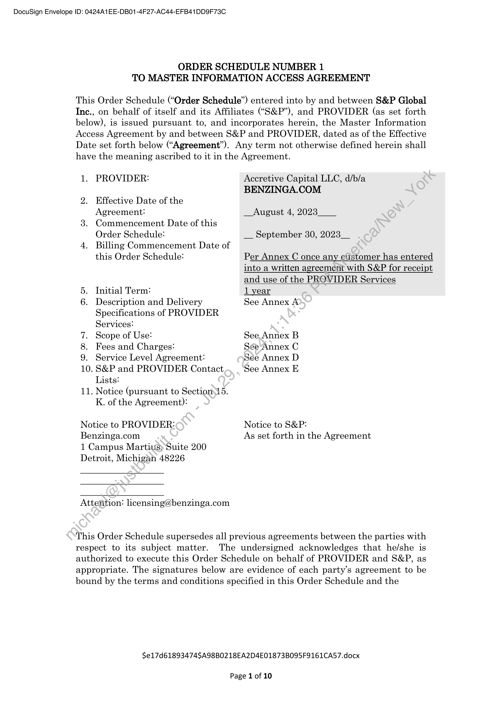
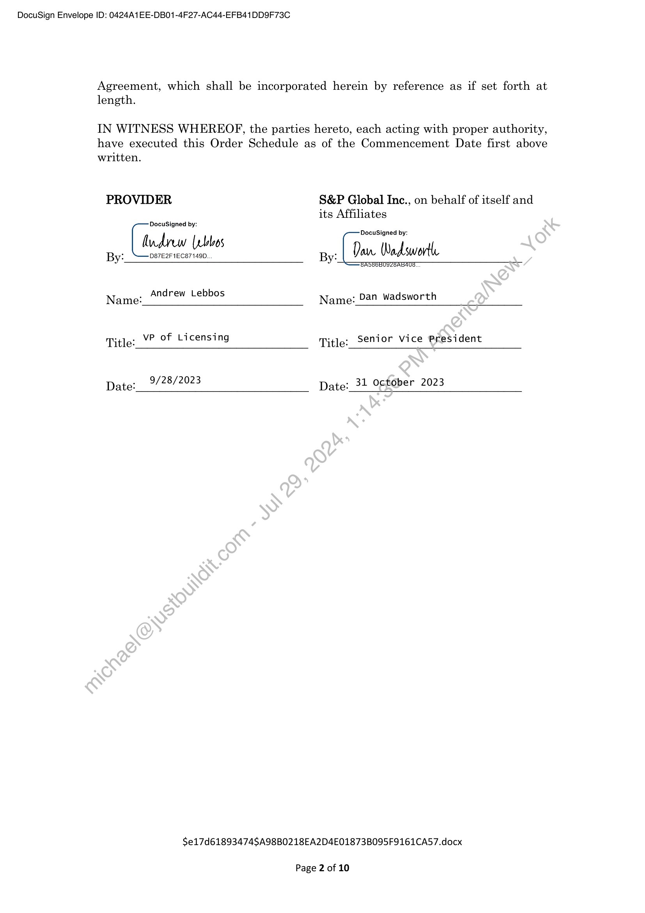
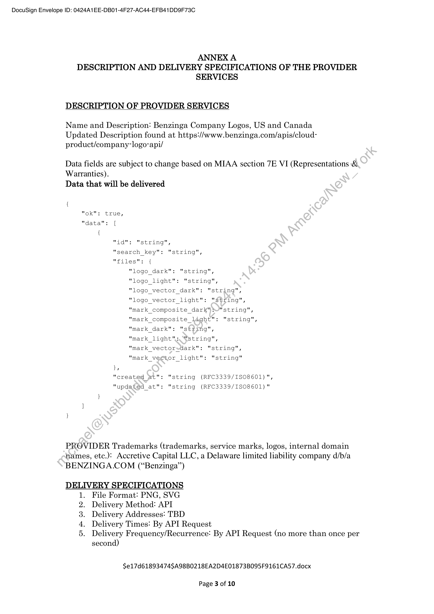
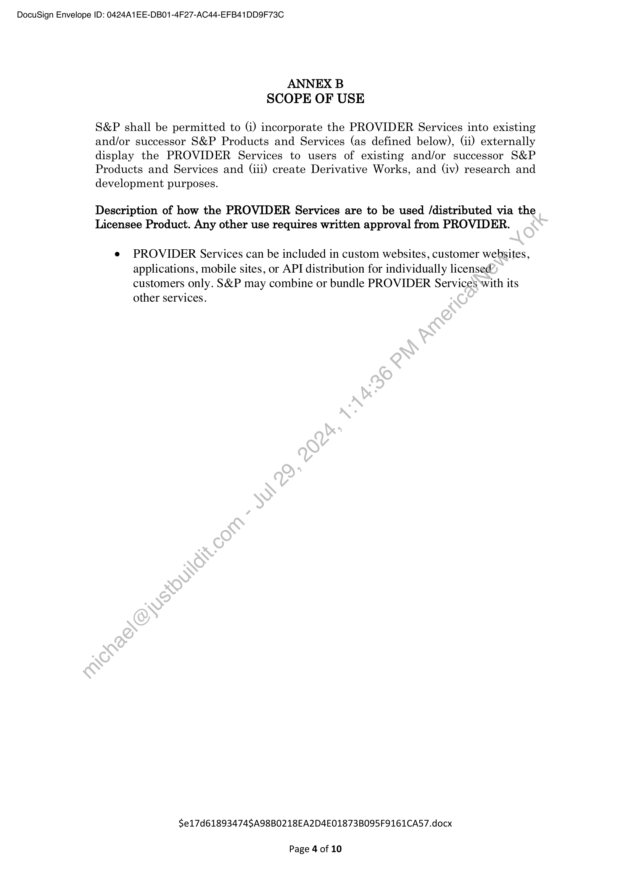
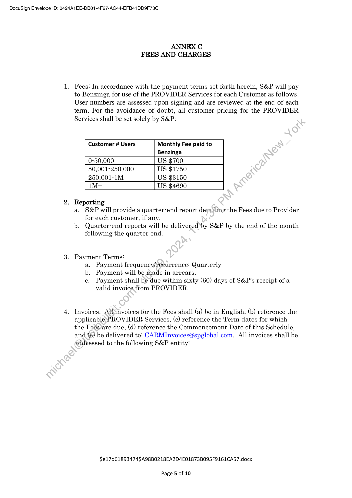
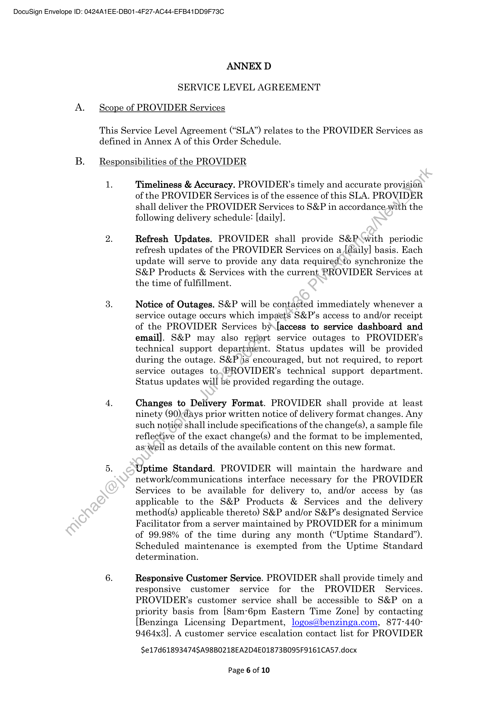
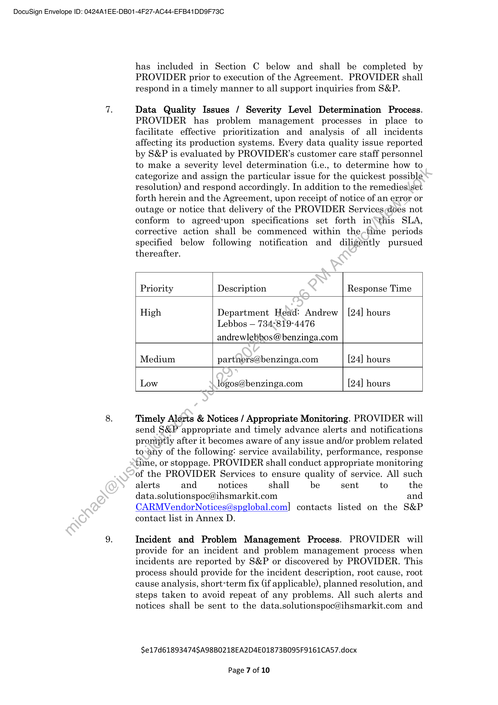
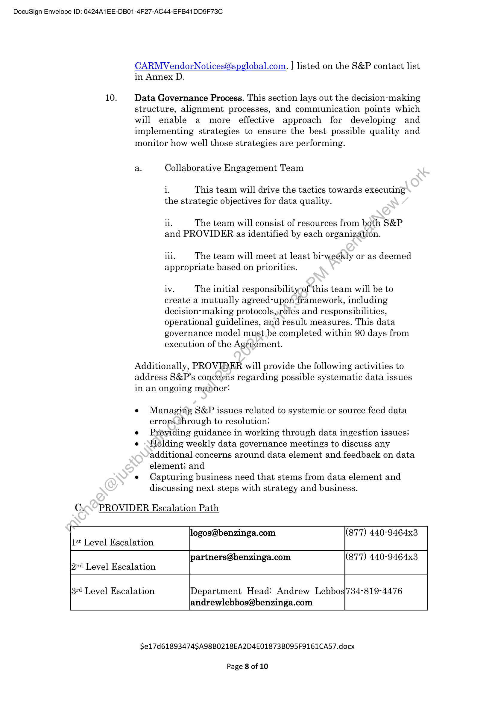
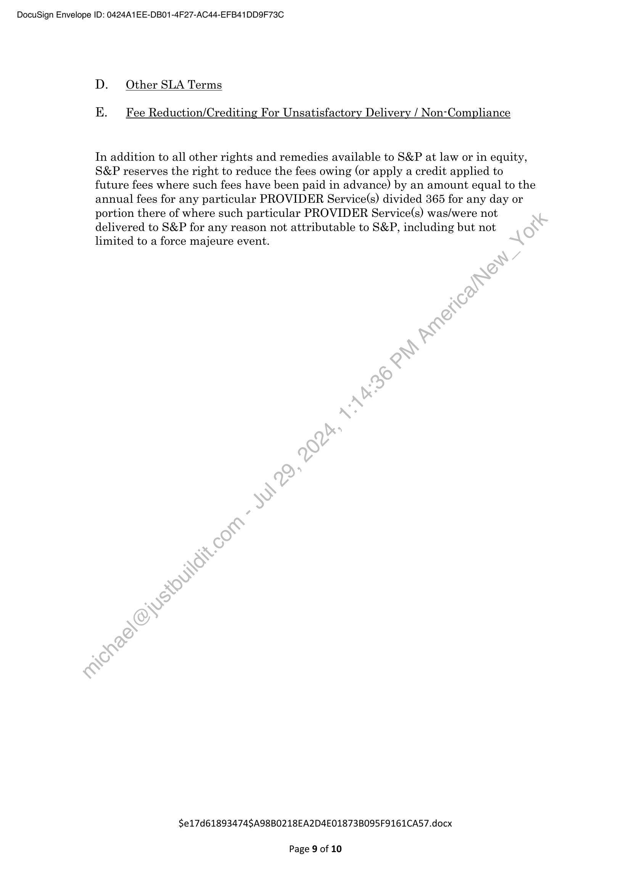
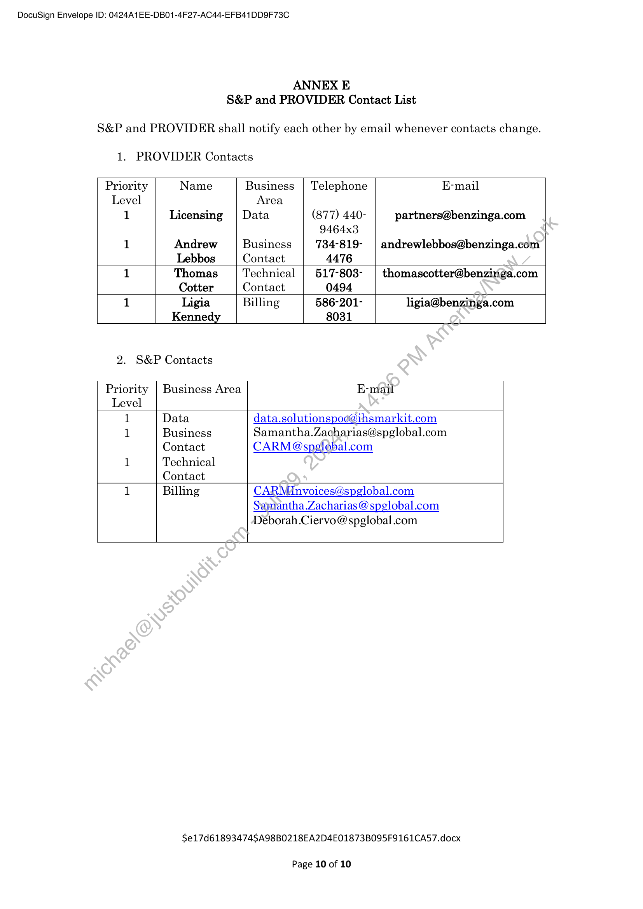

##### Order Schedule Number 1 to Master Information Access Agreement]

  
````col
```col-md
flexGrow=.5
===
> [!info] [Page 1](_attachments/images_3.6.4.2.1.220230930SPGMI-MoDBenzingaOrderSched1Logos.pdf_155357/page_1.png)
> 
```  
```col-md
DocuSign Envelope ID: 0424A1EE-DB01-4F27-AC44-EFB41DD9F73C  
ORDER SCHEDULE NUMBER 1
TO MASTER INFORMATION ACCESS AGREEMENT  
This Order Schedule (“Order Schedule”) entered into by and between S&P Global
Inc., on behalf of itself and its Affiliates (“S&P”), and PROVIDER (as set forth
below), is issued pursuant to, and incorporates herein, the Master Information
Access Agreement by and between S&P and PROVIDER, dated as of the Effective
Date set forth below (“Agreement”). Any term not otherwise defined herein shall
have the meaning ascribed to it in the Agreement.  
1. PROVIDER: Accretive Capital LLC, d/b/a
BENZINGA.COM
2. Effective Date of the
Agreement: _ August 4, 2023
3. Commencement Date of this
Order Schedule: __ September 30, 2023 __
4. Billing Commencement Date of
this Order Schedule: Per Annex C once any customer has entered  
into a written agreement with S&P for receipt
and use of the PROVIDER Services  
5. Initial Term: 1 year
6. Description and Delivery See Annex A
Specifications of PROVIDER
Services:
7. Scope of Use: See Annex B
8. Fees and Charges: See'Annex C
9. Service Level Agreement: See Annex D
10. S&P and PROVIDER Contact See Annex E
Lists:  
11. Notice (pursuant to Section15.
K. of the Agreement):  
Notice to PROVIDER: Notice to S&P:  
Benzinga.com As set forth in the Agreement
1 Campus Martius; ‘Suite 200  
Detroit, Michigan 48226  
Attention: licensing@benzinga.com  
This Order Schedule supersedes all previous agreements between the parties with
respect to its subject matter. The undersigned acknowledges that he/she is
authorized to execute this Order Schedule on behalf of PROVIDER and S&P, as
appropriate. The signatures below are evidence of each party’s agreement to be
bound by the terms and conditions specified in this Order Schedule and the  
$e17d61893474SA98B0218EA2D4E01873B095F9161CA57.docx  
Page 1 of 10  
```
````
Notes:    
````col
```col-md
flexGrow=.5
===
> [!info] [Page 2](_attachments/images_3.6.4.2.1.220230930SPGMI-MoDBenzingaOrderSched1Logos.pdf_155357/page_2.png)
> 
```  
```col-md
DocuSign Envelope ID: 0424A1EE-DB01-4F27-AC44-EFB41DD9F73C  
Agreement, which shall be incorporated herein by reference as if set forth at
length.  
IN WITNESS WHEREOPF, the parties hereto, each acting with proper authority,
have executed this Order Schedule as of the Commencement Date first above  
written.
PROVIDER S&P Global Inc., on behalf of itself and
its Affiliates
DocuSigned by:
DocuSigned by:
fudrew (rlbos  
By: [fade By: Daw Wad swore
SASSOBUIZEABAM  
Name: Andrew Lebbos Name: an Wadsworth  
Title: VP of Licensing Title: Senior Vice President  
Date: 2/28/2023 Date: 31 October 2023  
$e17d61893474SA98B0218EA2D4E01873B095F9161CA57.docx  
Page 2 of 10  
```
````
Notes:    
````col
```col-md
flexGrow=.5
===
> [!info] [Page 3](_attachments/images_3.6.4.2.1.220230930SPGMI-MoDBenzingaOrderSched1Logos.pdf_155357/page_3.png)
> 
```  
```col-md
DocuSign Envelope ID: 0424A1EE-DB01-4F27-AC44-EFB41DD9F73C  
ANNEX A
DESCRIPTION AND DELIVERY SPECIFICATIONS OF THE PROVIDER
SERVICES  
DESCRIPTION OF PROVIDER SERVICES  
Name and Description: Benzinga Company Logos, US and Canada
Updated Description found at https://www.benzinga.com/apis/cloudproduct/company-logo-api/  
Data fields are subject to change based on MIAA section 7E VI (Representations &  
Warranties).
Data that will be delivered  
"ok": true,  
"data": [
{  
"id": "string",  
"search_key": "string",  
"files": {
"logo_dark": "string",
"logo_light": "string",
"logo_vector_dark": "string",
"logo_vector_light": "Stfing",
"mark_composite_dark}~"string",
"mark composite light": "string",
"mark dark": "string",
"mark light": "string",
"mark_vectorsdark": "string",
"mark vector light": "string"  
},  
"created at": "string (RFC3339/1S08601)",  
"updated_at": "string (RFC3339/1S08601)"  
PROVIDER Trademarks (trademarks, service marks, logos, internal domain
names, etc.): Accretive Capital LLC, a Delaware limited liability company d/b/a
BENZINGA.COM (‘Benzinga”)  
DELIVERY SPECIFICATIONS
1. File Format: PNG, SVG
Delivery Method: API
Delivery Addresses: TBD
Delivery Times: By API Request
Delivery Frequency/Recurrence: By API Request (no more than once per
second)  
$e17d61893474SA98B0218EA2D4E01873B095F9161CA57.docx  
Page 3 of 10  
```
````
Notes:    
````col
```col-md
flexGrow=.5
===
> [!info] [Page 4](_attachments/images_3.6.4.2.1.220230930SPGMI-MoDBenzingaOrderSched1Logos.pdf_155357/page_4.png)
> 
```  
```col-md
DocuSign Envelope ID: 0424A1EE-DB01-4F27-AC44-EFB41DD9F73C  
ANNEX B
SCOPE OF USE  
S&P shall be permitted to (i) incorporate the PROVIDER Services into existing
and/or successor S&P Products and Services (as defined below), (i) externally
display the PROVIDER Services to users of existing and/or successor S&P
Products and Services and (iii) create Derivative Works, and (iv) research and
development purposes.  
Description of how the PROVIDER Services are to be used /distributed via the
Licensee Product. Any other use requires written approval from PROVIDER.  
e PROVIDER Services can be included in custom websites, customer websites,
applications, mobile sites, or API distribution for individually licensed
customers only. S&P may combine or bundle PROVIDER Services with its
other services.  
$e17d61893474SA98B0218EA2D4E01873B095F9161CA57.docx  
Page 4 of 10  
```
````
Notes:    
````col
```col-md
flexGrow=.5
===
> [!info] [Page 5](_attachments/images_3.6.4.2.1.220230930SPGMI-MoDBenzingaOrderSched1Logos.pdf_155357/page_5.png)
> 
```  
```col-md
DocuSign Envelope ID: 0424A1EE-DB01-4F27-AC44-EFB41DD9F73C  
ANNEX C
FEES AND CHARGES  
1. Fees: In accordance with the payment terms set forth herein, S&P will pay
to Benzinga for use of the PROVIDER Services for each Customer as follows.
User numbers are assessed upon signing and are reviewed at the end of each
term. For the avoidance of doubt, all customer pricing for the PROVIDER
Services shall be set solely by S&P:  
Customer Users Monthly Fee paid to
Benzinga  
0-50,000 US $700
50,001-250,000 US $1750  
250,001-1M US $3150
1M+ US $4690
2. Reporting
a. S&P will provide a quarter-end report detailing the Fees due to Provider
for each customer, if any.  
b. Quarter-end reports will be delivered by S&P by the end of the month
following the quarter end.  
3. Payment Terms:
a. Payment frequency/recurrence: Quarterly
b. Payment will be made in arrears.
c. Payment shall be due within sixty (60) days of S&P’s receipt of a
valid invoice from PROVIDER.  
4. Invoices. Ailinvoices for the Fees shall (a) be in English, (b) reference the
applicable:PROVIDER Services, (c) reference the Term dates for which
the Feés)are due, (d) reference the Commencement Date of this Schedule,
and (¢) be delivered to: CARMInvoices@spglobal.com. All invoices shall be
addressed to the following S&P entity:  
$e17d61893474SA98B0218EA2D4E01873B095F9161CA57.docx  
Page 5 of 10  
```
````
Notes:    
````col
```col-md
flexGrow=.5
===
> [!info] [Page 6](_attachments/images_3.6.4.2.1.220230930SPGMI-MoDBenzingaOrderSched1Logos.pdf_155357/page_6.png)
> 
```  
```col-md
DocuSign Envelope ID: 0424A1EE-DB01-4F27-AC44-EFB41DD9F73C  
ANNEX D  
SERVICE LEVEL AGREEMENT  
A. Scope of PROVIDER Services  
This Service Level Agreement (“SLA”) relates to the PROVIDER Services as
defined in Annex A of this Order Schedule.  
B. Responsibilities of the PROVIDER  
1.  
Timeliness & Accuracy. PROVIDER’s timely and accurate provision
of the PROVIDER Services is of the essence of this SLA. PROVIDER
shall deliver the PROVIDER Services to S&P in accordance-with the
following delivery schedule: [daily].  
Refresh Updates. PROVIDER shall provide S&P with periodic
refresh updates of the PROVIDER Services on a {@aily] basis. Each
update will serve to provide any data requiredsto synchronize the
S&P Products & Services with the current PROVIDER Services at
the time of fulfillment.  
Notice of Outages. S&P will be contacted immediately whenever a
service outage occurs which impatets S&P’s access to and/or receipt
of the PROVIDER Services by\[access to service dashboard and
email]. S&P may also report service outages to PROVIDER’s
technical support department. Status updates will be provided
during the outage. S&P is encouraged, but not required, to report
service outages to.PROVIDER’s technical support department.
Status updates will be provided regarding the outage.  
Changes to Delivery Format. PROVIDER shall provide at least
ninety (90)days prior written notice of delivery format changes. Any
such notice shall include specifications of the change(s), a sample file
reflective of the exact change(s) and the format to be implemented,
as well as details of the available content on this new format.  
Uptime Standard. PROVIDER will maintain the hardware and
network/communications interface necessary for the PROVIDER
Services to be available for delivery to, and/or access by (as
applicable to the S&P Products & Services and the delivery
method(s) applicable thereto) S&P and/or S&P’s designated Service
Facilitator from a server maintained by PROVIDER for a minimum
of 99.98% of the time during any month (“Uptime Standard”).
Scheduled maintenance is exempted from the Uptime Standard
determination.  
Responsive Customer Service. PROVIDER shall provide timely and
responsive customer service for the PROVIDER Services.
PROVIDER’s customer service shall be accessible to S&P on a
priority basis from [8am-6pm Eastern Time Zone] by contacting
[Benzinga Licensing Department, logos@benzinga.com, 877-4409464x3]. A customer service escalation contact list for PROVIDER  
$e17d61893474SA98B0218EA2D4E01873B095F9161CA57.docx  
Page 6 of 10  
```
````
Notes:    
````col
```col-md
flexGrow=.5
===
> [!info] [Page 7](_attachments/images_3.6.4.2.1.220230930SPGMI-MoDBenzingaOrderSched1Logos.pdf_155357/page_7.png)
> 
```  
```col-md
DocuSign Envelope ID: 0424A1EE-DB01-4F27-AC44-EFB41DD9F73C  
has included in Section C below and shall be completed by
PROVIDER prior to execution of the Agreement. PROVIDER shall
respond in a timely manner to all support inquiries from S&P.  
7. Data Quality Issues / Severity Level Determination Process.
PROVIDER has problem management processes in place to
facilitate effective prioritization and analysis of all incidents
affecting its production systems. Every data quality issue reported
by S&P is evaluated by PROVIDER’s customer care staff personnel
to make a severity level determination (i.e., to determine how to
categorize and assign the particular issue for the quickest possible
resolution) and respond accordingly. In addition to the remedies\set
forth herein and the Agreement, upon receipt of notice of an error or
outage or notice that delivery of the PROVIDER Services,does not
conform to agreed-upon specifications set forth inthis SLA,
corrective action shall be commenced within the,time periods
specified below following notification and diligently pursued  
thereafter.
Priority Description Response Time
High Department Head: Andrew | [24] hours
Lebbos — 734-819-4476
andrewlebbos @benzinga.com
Medium partners@benzinga.com [24] hours
Low logos@benzinga.com [24] hours  
8. Timely Alerts & Notices / Appropriate Monitoring. PROVIDER will
send S&P appropriate and timely advance alerts and notifications
promptly after it becomes aware of any issue and/or problem related
to-any of the following: service availability, performance, response
time, or stoppage. PROVIDER shall conduct appropriate monitoring
of the PROVIDER Services to ensure quality of service. All such
alerts and notices shall be sent to the
data.solutionspoc@ihsmarkit.com and
CARMVendorNotices@spglobal.com] contacts listed on the S&P
contact list in Annex D.  
9. Incident and Problem Management Process. PROVIDER will
provide for an incident and problem management process when
incidents are reported by S&P or discovered by PROVIDER. This
process should provide for the incident description, root cause, root
cause analysis, short-term fix (if applicable), planned resolution, and
steps taken to avoid repeat of any problems. All such alerts and
notices shall be sent to the data.solutionspoc@ihsmarkit.com and  
$e17d61893474SA98B0218EA2D4E01873B095F9161CA57.docx  
Page 7 of 10  
```
````
Notes:    
````col
```col-md
flexGrow=.5
===
> [!info] [Page 8](_attachments/images_3.6.4.2.1.220230930SPGMI-MoDBenzingaOrderSched1Logos.pdf_155357/page_8.png)
> 
```  
```col-md
DocuSign Envelope ID: 0424A1EE-DB01-4F27-AC44-EFB41DD9F73C  
10.  
CARMVendorNotices@spglobal.com. ] listed on the S&P contact list
in Annex D.  
Data Governance Process. This section lays out the decision-making
structure, alignment processes, and communication points which
will enable a more effective approach for developing and
implementing strategies to ensure the best possible quality and
monitor how well those strategies are performing.  
a. Collaborative Engagement Team  
1. This team will drive the tactics towards executing
the strategic objectives for data quality.  
ii. The team will consist of resources from both S&P
and PROVIDER as identified by each organization.  
ill. The team will meet at least bi-weekly or as deemed
appropriate based on priorities.  
lv. The initial responsibility-of this team will be to
create a mutually agreed-upon framework, including
decision-making protocols,,reles and responsibilities,
operational guidelines, and result measures. This data
governance model must.be completed within 90 days from
execution of the Agréement.  
Additionally, PROVIDER will provide the following activities to
address S&P’s concerns regarding possible systematic data issues
in an ongoing manner:  
e Managing S&P issues related to systemic or source feed data
errors.through to resolution:  
e Providing guidance in working through data ingestion issues;  
e -Holding weekly data governance meetings to discuss any
additional concerns around data element and feedback on data
element; and  
e Capturing business need that stems from data element and
discussing next steps with strategy and business.  
Cx“ PROVIDER Escalation Path  
ogos@benzinga.com (877) 440-9464x3
1st Level Escalation
artners@benzinga.com (877) 440-9464x3
2-4 Level Escalation
3"¢ Level Escalation Department Head: Andrew Lebbos|734-819-4476
landrewlebbos@benzinga.com  
$e17d61893474SA98B0218EA2D4E01873B095F9161CA57.docx  
Page 8 of 10  
```
````
Notes:    
````col
```col-md
flexGrow=.5
===
> [!info] [Page 9](_attachments/images_3.6.4.2.1.220230930SPGMI-MoDBenzingaOrderSched1Logos.pdf_155357/page_9.png)
> 
```  
```col-md
DocuSign Envelope ID: 0424A1EE-DB01-4F27-AC44-EFB41DD9F73C  
D. Other SLA Terms  
E. Fee Reduction/Crediting For Unsatisfactory Delivery / Non-Compliance  
In addition to all other rights and remedies available to S&P at law or in equity,
S&P reserves the right to reduce the fees owing (or apply a credit applied to
future fees where such fees have been paid in advance) by an amount equal to the
annual fees for any particular PROVIDER Service(s) divided 365 for any day or
portion there of where such particular PROVIDER Service(s) was/were not
delivered to S&P for any reason not attributable to S&P, including but not
limited to a force majeure event.  
$e17d61893474SA98B0218EA2D4E01873B095F9161CA57.docx  
Page 9 of 10  
```
````
Notes:    
````col
```col-md
flexGrow=.5
===
> [!info] [Page 10](_attachments/images_3.6.4.2.1.220230930SPGMI-MoDBenzingaOrderSched1Logos.pdf_155357/page_10.png)
> 
```  
```col-md
DocuSign Envelope ID: 0424A1EE-DB01-4F27-AC44-EFB41DD9F73C  
ANNEX E  
S&P and PROVIDER Contact List  
S&P and PROVIDER shall notify each other by email whenever contacts change.  
1. PROVIDER Contacts  
Priority Name Business | Telephone E-mail
Level Area
1 Licensing | Data (877) 440- partners@benzinga.com
9464x3
1 Andrew Business 734-819- | andrewlebbos@benzinga.com
Lebbos Contact 4476
1 Thomas Technical | 517-803- | thomascotter@benzirniga.com
Cotter Contact 0494
1 Ligia Billing 586-201- ligia@benzinga.com
Kennedy 8031  
2. S&P Contacts  
Priority | Business Area E-mail
Level  
1 Data data.solutionspoe@ihsmarkit.com  
1 Business Samantha.Zacharias@spglobal.com
Contact CARM @spglobal.com  
1 Technical
Contact  
1 Billing CARMinvoices@spglobal.com  
Samantha.Zacharias @ spglobal.com
Deborah.Ciervo@ spglobal.com  
$e17d61893474SA98B0218EA2D4E01873B095F9161CA57.docx  
Page 10 of 10  
```
````
Notes:  


![[_attachments/3.6.4.2.1.2 20230930 SPGMI-MoD Benzinga Order Sched 1 Logos.pdf]