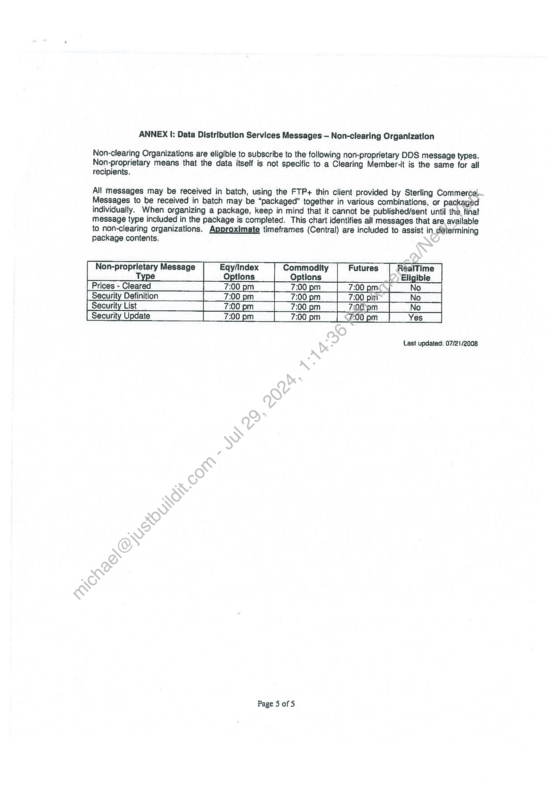

##### Non-Clearing Member Agreement for OCC Data Distribution Service]

  
````col
```col-md
flexGrow=.5
===
> [!info] [Page 1](_attachments/images_3.6.4.2.2.1OCC_MGLAgreementFullyExecuted20120322.pdf_155136/page_1.png)
> 
```  
```col-md
4th floor tel +44 20 7260 2000  
an Ropemaker Place fax +44 20 7260 2001
a C 25 Ropemaker Street www.markitcom
London
EC2Y OLY
United Kingdom  
Options Clearing Corporation
One North Wacker Drive
Suite 500  
Chicago, IL 60606  
Attn: John Petrella  
15" March 2012  
Re: Non-Clearing Member Agreement  
Dear Mr. Petrella:  
Per your request, please find enclosed a new Non-Clearing Member Agreément updating Wall Street on
Demand’s legal entity. Our relationship with OCC is an important ong; ‘and this agreement will continue
our successful partnership.  
Enclosed please find two executed copies of the agreement. Please have them countersigned, and
return one copy to Michael Salerno at:  
Markit  
620 Eighth Avenue  
35" Floor  
New York, NY 10018  
Please also email a scanned countersigned:copy to Mr. Salerno at michael.salemo@markit.com.  
If you have any questions, please contact Inder Grewal (212.931.4945) in our New York office.  
Best regards,  
Rony Grushka
Head of Corporate St  
```
````
Notes:    
````col
```col-md
flexGrow=.5
===
> [!info] [Page 2](_attachments/images_3.6.4.2.2.1OCC_MGLAgreementFullyExecuted20120322.pdf_155136/page_2.png)
> 
```  
```col-md
NON-CLEARING MEMBER AGREEMENT FOR OCC DATA DISTRIBUTION SERVICE  
Subscriber Information  
a5 ue Lanzred C244 20 73G0 2.000  
NOE 5 S y™ h, Telephone 0 Brass  
City  
Street Facsimile
Dnisea) Uk €cay HY Sufpact @mert-com
E-Mail Address  
State Zip Code  
OCC produces certain data which from time to time OCC provides on a subscription basis to non-cledring members
as a part of OCC’s Data Distribution Service (“DDS”). The Subscriber identified above desires tO subscribe to
OCC’s DDS pursuant to the terms and conditions set forth herein in order to obtain such data from OCC. In
consideration of the mutual promises set forth herein, and other good and valuable considefation, the receipt and
sufficiency of which are acknowledged, OCC and Subscriber agree as follows:  
1.  
Data Distribution Service  
OCC’s DDS permits Subscriber: (a) to select various message types(“tessage” or “messages”) in order to
access or receive data; (b) to select whether Subscriber will accesS.messages itself, or receive messages
from OCC; and (c) to select whether access or receipt will be “real time,” in “batches,” or both, all as a part
of OCC’s DDS. (For convenience, the term “delivery” is hereinafter used to describe the process of either
“accessing” or “receiving” messages.) Subscriber elects to°receive DDS on a distribution or o nondistribution basis (check applicable box).  
Subscriber shall cause its designated representatiVe(s) to contact OCC’s Member Services Department to
make its selections in order to receive DDS_or (o modify previously made selections. OCC reserves the
right in its sole discretion to add, delete, or modify messages, applicable delivery methods, and frequency
of delivery upon such notice to the Subscriber that OCC deems to be reasonable and practicable under the
circumstances, and Subscriber agrees-to-reasonably cooperate with OCC with respect to implementing such
changes. Modifications made to Subscriber’s message and delivery selections shall be effective as of the
date specified by OCC. An overview of DDS is contained in the attached Annex I.  
Certain Representations, Acknowledgments, and Agreements  
2.1 If Subscriber ‘has elected a non-distribution subscription, Subscriber is permitted to use and copy
the messages for its internal business purposes only (provided such purpose is lawful), but
Subscriber’shall not redistribute or provide the messages or any copy thereof to any third party
unless\required to do so by operation of law. Subscriber agrees to reproduce on any internal
copies of such messages any copyright notice of OCC included with the messages.  
2.2 If Subscriber has elected a distribution subscription, Subscriber is permitted to use and copy the
messages for any lawful purpose and provide copies of the messages to any third party provided
that it reproduces on such copies any copyright notice of OCC included with the messages.  
23 Subscriber agrees to pay OCC the fees applicable to its selected subscriptions as set forth in
OCC’s Schedule of Fees as may be amended from time to time. OCC’s Schedule of Fees is
published on its web site at www.optionsclearina.com. OCC will provide Subscriber with 30
calendar days’ prior notice (which may be provided by email) of any change in the fees applicable
to its selected subscriptions. OCC will invoice Subscriber for such fees on a monthly basis, and
Subscriber agrees to pay the amounts reflected in such invoice within 30 calendar days from the
date of such invoice. Subscriber shall pay and be responsible for any taxes (including, without
limitation, sales, lease or use taxes) which may be imposed on Subscriber or OCC (other than
taxes relating to OCC’s income) resulting from this Agreement or OCC’s delivery of messages
hereunder. Subscriber shall supply OCC with information as to whom and where invoices shall be
directed.  
Page | of 5  
```
````
Notes:    
````col
```col-md
flexGrow=.5
===
> [!info] [Page 3](_attachments/images_3.6.4.2.2.1OCC_MGLAgreementFullyExecuted20120322.pdf_155136/page_3.png)
> 
```  
```col-md
3.  
24 In the event Subscriber fails to make a required payment on a timely basis, OCC may elect in its
sole discretion to (i) terminate this Agreement pursuant to Section 6 hereof or (ii) require an
interest payment of the overdue amount at a rate of 1.5% per month.  
25 Subscriber acknowledges and agrees that each method for delivering messages as a part of DDS is
a secure and commercially reasonable means for delivering such messages. Subscriber is
responsible for providing and maintaining its own computer and communications equipment and
services needed to use DDS, and OCC shall have no responsibility with respect thereto.  
2.6 If Subscriber selects delivery of messages on a “batch basis”, then Subscriber acknowledges and
agrees that such messages are final when delivered on each day that OCC effects message delivery
as apart of DDS. If Subscriber selects delivery of messages on a “real time basis”, Subscriber
acknowledges and agrees that such messages shall be deemed provisional and {formational only
and shall be subject to revision until OCC has transmitted an “end of day” meSsage indicating that
OCC will not deliver any further DDS messages to Subscriber for a particular activity date. Even
if Subscriber selects delivery of messages on a real time basis, OCC mayelect to deliver messages
to Subscriber on a batch basis in the event: (a) OCC experiences problems with communication
channels, computer equipment, or applications; (b) OCC experientes\problems that affect DDS; or
(c) under such other circumstances as OCC deems appropriate.’ OCC will endeavor to notify
Subscriber about the change in delivery methods as,\feasonably practicable under the
circumstances, and will reinstitute real time delivery when OCC deems it appropriate to do so.  
2.7 If the Subscriber believes there is a bona fide error or-omission in the messages, Subscriber shall
notify OCC and shall effect such adjustments as requested by OCC to correct the bona fide error
or omission.  
Disclaimer of Warranties  
OCC DISCLAIMS ALL WARRANTIES, WHETHER STATUTORY, EXPRESS, OR IMPLIED,
INCLUDING BUT NOT LIMITED 'TO THE IMPLIED WARRANTIES OF MERCHANTABILITY
AND FITNESS FOR A PARTICULAR PURPOSE, IN CONNECTION WITH THIS AGREEMENT
AND THE DATA DISTRIBUTION SERVICES PROVIDED HEREUNDER. OCC DOES NOT
GUARANTEE OR MAKE ANY REPRESENTATIONS OR WARRANTIES OR ASSUME ANY
LIABILITY REGARDING (I) OMISSIONS OR INACCURACIES IN THE MESSAGES
TRANSMITTED HEREUNDER, OR (II) DELAYS OR INTERRUPTIONS IN PROVIDING SUCH
MESSAGES. ALL(MESSAGES ARE PROVIDED ON AN “AS IS” AND “AS AVAILABLE”
BASIS.  
Limitation ofQiability  
41 QCC, ITS DIRECTORS, OFFICERS, EMPLOYEES, AGENTS, AND SUBSIDIARIES
SHALL NOT BE LIABLE FOR ANY LOSSES OR DAMAGES INCURRED OR
RELATED IN ANY WAY TO SUBSCRIBER’S USE OF THE DATA DISTRIBUTION
SERVICES. WITHOUT LIMITING THE GENERALITY OF THE FOREGOING, OCC,
ITS DIRECTORS, OFFICERS, EMPLOYEES, AGENTS, AND SUBSIDIARIES SHALL
NOT BE LIABLE FOR ANY LOSSES OR DAMAGES CAUSED BY THE NEGLIGENCE,
ACTIONS, OR OMISSIONS OF ANY TELECOMMUNICATIONS CARRIER OR
OTHER PROVIDER OF COMMUNICATION CHANNELS USED IN CONNECTION
WITH THIS AGREEMENT OR THE DATA DISTRIBUTION SERVICES PROVIDED
HEREUNDER.  
4.2 EXCEPT AS OTHERWISE PROVIDED BY LAW, OCC, ITS DIRECTORS, OFFICERS,
EMPLOYEES, AGENTS AND SUBSIDIARIES SHALL NOT BE LIABLE FOR ANY
DIRECT, SPECIAL, PUNITIVE, EXEMPLARY, INCIDENTAL OR CONSEQUENTIAL
DAMAGES OR FOR ANY LOST PROFITS OR COMMERCIAL LOSSES, FROM ANY
CAUSE WHATSOEVER RELATING TO THIS AGREEMENT OR THE DATA
DISTRIBUTION SERVICES PROVIDED HEREUNDER, INCLUDING, BUT NOT LIMITED  
Page 2 of 5  
```
````
Notes:    
````col
```col-md
flexGrow=.5
===
> [!info] [Page 4](_attachments/images_3.6.4.2.2.1OCC_MGLAgreementFullyExecuted20120322.pdf_155136/page_4.png)
> 
```  
```col-md
TO, FAILURE OF ELECTRONIC OR MECHANICAL EQUIPMENT, UNAUTHORIZED
ACCESS, STRIKES, FAILURES OF COMMON CARRIER OR UTILITY SYSTEMS,
SEVERE WEATHER, OR OTHER CAUSES COMMONLY KNOWN AS “ACTS OF GOD”,
IN EACH CASE WHETHER OR NOT OCC HAS RECEIVED NOTICE OF THE
POSSIBILITY OR CERTAINTY OF SUCH DAMAGES OR LOSSES.  
4.3 SUBSCRIBER AGREES THAT ANY OCC LIABILITY UNDER THIS AGREEMENT;
REGARDLESS OF THE CLAIM OR DAMAGES ASSERTED, SHALL NOT EXCEED THE
AMOUNT PAID TO OCC BY SUBSCRIBER IN FEES IN THE CALENDAR YEAR ‘TO
WHICH SUCH CLAIM OR DAMAGES RELATE.  
Indemnification  
Subscriber shall defend, indemnify and hold OCC harmless from and against any and.all liabilities, claims,
losses, damages (consequential or otherwise) and expenses, including attorneys fees, asserted against OCC
by any third party, including, without limitation, any customers of Subscriber,(arising directly or indirectly
from Subscriber's use of DDS.  
Termination; Breach  
This Agreement shall remain in effect until terminated by either party (a) upon seven business (7) days
prior written notice to the other party or (b) upon material breach by the other party of this Agreement;
provided, however, OCC may terminate this Agreement jimriiediately, with or without notice, in the event
that: (i) Subscriber fails to make a required monthly payment (including any interest due and owing); or (ii)
Subscriber shall be insolvent, bankrupt, or shall either\invoke or have invoked against it any law for the
relief of debtors. As of the effective date of suchtermination, Subscriber shall be obligated to pay a prorated portion of the fee for the month of the.termination based upon a 30 day calendar month. OCC’s
determination of such pro-rated amount shall be binding upon Subscriber.  
General
7.1 Amendment. Any amendment to this agreement shall be in a writing signed by the parties hereto.
U2 Severability. If any portion of this Agreement is held invalid, illegal or unenforceable, the parties  
agree that such)invalidity, illegality or unenforceability shall not affect the remaining portions of
this Agreement, and the parties further agree to substitute for the invalid, itlegat or unenforceable
provision,a valid, legal and enforceable provision that most closely approximates the economic
effectand intent of the invalid, illegal or unenforceable provision.  
73 Waiver. Failure or delay on the part of either party to exercise any right, power, privilege or
remedy hereunder shall not constitute a waiver thereof. A waiver of default shall not operate as a
waiver of any other default, a waiver of the provision itself, or of the same type of default on a
future occasion.  
74 Survival. The provisions of Sections 3, 4, 5, and 6 shall survive any expiration or termination of
this Agreement.  
18 Notice. Any notice required hereunder shalt be directed to:  
Page 3 of 5  
```
````
Notes:    
````col
```col-md
flexGrow=.5
===
> [!info] [Page 5](_attachments/images_3.6.4.2.2.1OCC_MGLAgreementFullyExecuted20120322.pdf_155136/page_5.png)
> 
```  
```col-md
Subscriber: Occ:  
Member Services
{insert} Attn: Department Head  
One North Wacker Drive  
Suite 500  
Chicago, IL 60606  
Notices shall be delivered via courier delivery or first class mail, postage pre-paid. Either party may diteét in
writing that notices be delivered to a different person or address.  
76 Governing Law; Jurisdiction. This Agreement shall be governed by, and constited in accordance
with, the laws of the State of Illinois, without regard to principles of conflicts Oflaw. Any dispute
in connection with this Agreement shall be adjudicated in the appropriate courts located in
Chicago, Illinois, and Subscriber hereby consents to the exclusive jurisdiotion of such courts,  
Subscriber and OCC each represent that the individual signing this Agreement dnmits behalf has the power and
authority to enter into this Agreement on its behalf and that this Agreemeitt constitutes a valid and binding
obligation of such party. Subscriber acknowledges that Subscriber has read ‘this Agreement and that Subscriber
understands it and agrees to be bound by it.  
SUBSCRIBER: THE OPTIONS CLEARING CORPORATION  
(Print or Type Name of Subscriber)  
By.  
Name, Leavie| VAY,
Title ees FIL)  
Date. Pent BBY L2  
: Page 4 of 5
Non-clearing member DDS Agreement  
```
````
Notes:    
````col
```col-md
flexGrow=.5
===
> [!info] [Page 6](_attachments/images_3.6.4.2.2.1OCC_MGLAgreementFullyExecuted20120322.pdf_155136/page_6.png)
> 
```  
```col-md
ANNEX I: Data Distribution Services Messages — Non-clearing Organization  
Non-clearing Organizations are eligible to subscribe to the following non-proprietary DDS message types.
Non-proprietary means that the data itself is not specific to a Clearing Member-it is the same for all
recipients.  
All messages may be received in batch, using the FTP+ thin client provided by Sterling Commerce.
Messages to be received in batch may be “packaged” together in various combinations, or packaged
individually. When organizing a package, keep in mind that it cannot be published/sent until the. final
message type included in the package is completed. This chart identifies all messages that are available
to non-clearing organizations. Approximate timeframes (Central) are included to assist in determining  
package contents.
Eqy/Index Commodity RealTime
Options Options Eligible  
Non-proprietary Message  
Type g
|Prices-Cleared | 7:00pm [7:00pm | 7:00pme\y Noi
| Security Definition 7:00pm 7:00pm | 7:00pm [No _|
[Security List" 7:00pm 7:00pm | 7:00}pm_[ No _|  
Last updated: 07/21/2008  
Page 5 of S  
```
````
Notes:  


![[_attachments/3.6.4.2.2.1 OCC_MGL Agreement Fully Executed 20120322.pdf]