##### Product License Agreement]

  
````col
```col-md
flexGrow=.5
===
> [!info] [Page 1](_attachments/images_3.6.4.2.3.1Morningstar_MOD_ProductLicenseAgreement_20140501.pdf_155444/page_1.png)
> 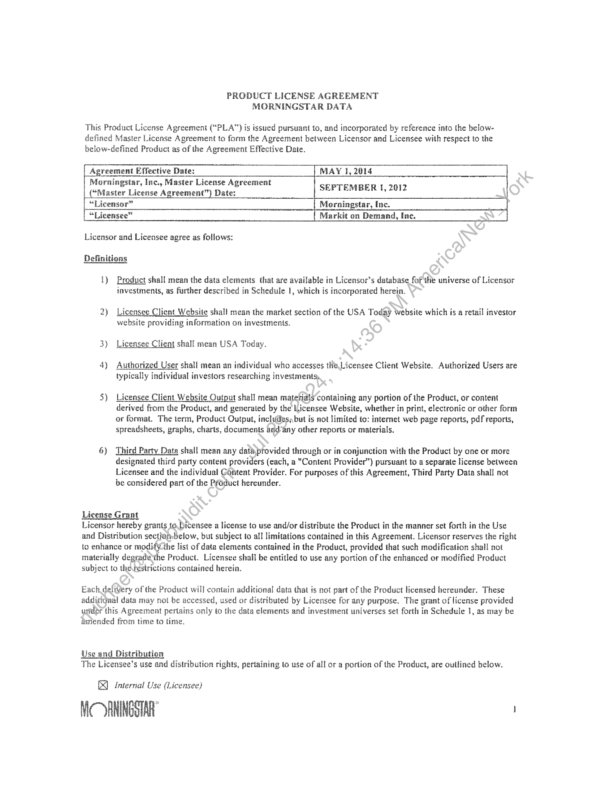
```  
```col-md
PRODUCT LICENSE AGREEMENT
MORNINGSTAR DATA  
This Product License Agreement (“PLA") is issued pursuant to, and incorporated by reference into the belowdefined Master License Agreement to form the Agreement between Licensor and Licensee with respect to the
below-defined Product as of the Agreement Effective Date.  
Agreement Effective Date: MAY 1, 2014  
Morningstar, Inc., Master License Agreement
“Master License Agreement”) Date: SEPTEMBER 1, 2612
“Licensor” | Morningstar, Inc.  
| “Licensee” [Markit on Demand, inc.  
Licensor and Licensee agree as follows:  
Definitions  
1) Product shall mean the data elements that are available in Licensor’s database _for the universe of Licensor
investments, as further described in Schedule |, which is incorporated herein.  
2} Licensee Client Website shall mean the market section of the USA Today website which is a retail investor
website providing information on investments.  
3} Licensee Client shall mean USA Today.  
4) Authorized User shall mean an individual who accesses te Licensee Client Website. Authorized Users are
typically individual investors researching investments,  
5) Licensee Client Website Output shall mean matetials containing any portion of the Product, or content
derived from the Product, and generated by the Licensee Website, whether in print, electronic or other form
or format. The term, Product Output, includes, but is not limited to: intemet web page reports, pdf reports,
spreadsheets, graphs, charts, documents and any other reports or materials.  
6) Third Party Data shall mean any data provided through or in conjunction with the Product by one or more
designated third party content providers (cach, a “Content Provider”) pursuant to a separate license between
Licensee and the individual Content Provider. For purposes af this Agreement, Third Party Data shall not
be considered part of the Product hereunder.  
License Grant  
Licensor hereby grants to Dicensee a license to use and/or distribute the Product in the manner set forth in the Use
and Distribution section-below, but subject to all limitations contained in this Agreement. Licensor reserves the right
to enhance or modify the list of data elements contained in the Product, provided that such modification shall not
materially degradethe Product. Licensee shall be entitled to use any portion of the enhanced or modified Product
subject to the restrictions contained herein.  
Each delivery of the Product will contain additional data that is not part of the Product licensed hereunder. These
additignal data may not be accessed, used or distributed by Licensee lor any purpose. The grant of license provided
under this Agreement periains only to the data elements and investment universes set forth in Schedule 1, as may be
amended from time to time,  
Use and Distribution
The Licensee’s use and distribution rights, pertaining to use of all or a portion of the Product, are outlined below,  
I) lnternal Use (Licensee)  
MC OANINGSTAR  
```
````
Notes:    
````col
```col-md
flexGrow=.5
===
> [!info] [Page 2](_attachments/images_3.6.4.2.3.1Morningstar_MOD_ProductLicenseAgreement_20140501.pdf_155444/page_2.png)
> 
```  
```col-md
(a) Licensee may use the Product for the development and maintenance the Licensee Chent Website.  
Dy) External Use(Licenseg}
{a) Licensee may incorporate all or « portion of the Product into the Licensee Client Website so as io be
made available to Authorized Users.  
{b) Licensee must execute a binding contract with Licensee Client and such contract must:
{i} Contain language substantially similar to the following:
Certain of the information contained in the Licensee Tool: (1) is proprietary te
Morningstar Inc. and/or its content providers; (2) may not be copied or distributedyand
(3) is not warranted to be accurate, complete or timely. Neither Morningstar fdr its
content previders are responsible for any damages or losses arising from any use of this
information. Past performance is ne guarantee of future results.  
(i Require that Authorized Users Hmit use of Licensee Too! and distribution of any Licensee Tool
Output as described in the External Use (Authorized Users) section below.  
({c} Licensee shall use commercially reasonable efforts to ensure that Authorizél Users utilize the Product ina
manner consistent with the terms and conditions of this Agreement and@my breach of the terms and
conditions of this Agreement by an Authorized User shall be deemed-a breach by Licensee. In the event
Licensor becomes aware of any use of the Product not specifically alitiorized hereunder, Licensee
understands and agrees that Licensor may immediately terminate Licensee's access to the Product (without
any liability) and may pursue damages and/or injunctive relief against Authorized User separate and apart
from any rights or remedies that Licensee may assert for any unauthorized use of the Licensee Tool,  
{d) Inno event may the Product or Product Output-be fesold by Licensee.  
[External Use (Authorized Users)  
(a) Authorized Users may utilize the Licensee Client Website and Licensee Client Website Output in
arder to view information dAvavestments which may contain any portion of the Product for their
own personal, non-commercial use.  
(b) Authorized Users may not export the Product from Licensee Client Website except as part of
Licensee Client(Website Output.  
in the event Licensee wisfies to supplement the number of Product deliveries, change its proposed use of the Product
or alter the manner indvhich it distributes the Product, Licensee will first send an e-mail to Licenser’s designated
representative In which Licensee will outline exactly what it is requesting and include any details the Licensee
believe are pertingel, The parties will then work in good faith to determine if Licensee’s requests are commercially
feasible and, (fo, how to best document the proposed change, including the imposition of any additional fees.  
Review OCU se
At anime during the term of this Agreement, but no more than once per calendar quarter, Licensor may request
thaleicensee provide to Licensor examples of Product Output generated.  
Notices and Disclaimers
In every instance where the Product or any data contained therein are used or displayed, Licensee shall  
conspicuously disclose the date to which the data within the Product pertain. In addition, Licensee shall ensure that
the following notice/disclaimer is displayed, or linked to, each discrete reference (i.e. in an end note of a print
product or a printed report generated by a software product, the initial login or splash screens of a software product  
MORNINGSTAR  
we  
```
````
Notes:    
````col
```col-md
flexGrow=.5
===
> [!info] [Page 3](_attachments/images_3.6.4.2.3.1Morningstar_MOD_ProductLicenseAgreement_20140501.pdf_155444/page_3.png)
> 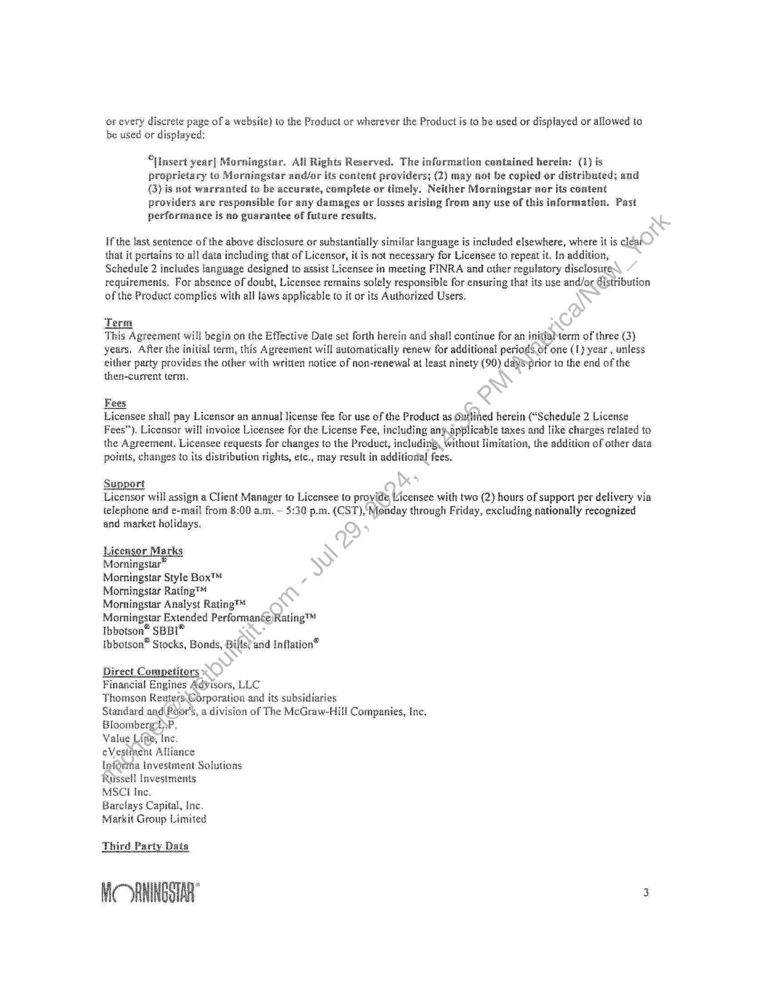
```  
```col-md
or every discrete page of a website) to the Product or wherever the Product is to be used or displayed or allowed io
be used or displayed:  
°lnsert year] Morningstar. AH Rights Reserved. The infermation contained herein: (1) is
proprietary to Morningstar and/or its content providers; (2) may aot be copied or distributed; and
(3) is not warranted to be accurate, complete or timely. Neither Morningstar nor its content
providers are responsible for any damages er losses arising from any use of this information. Past
performance is no guarantee of future results.  
if the last sentence of the above disclosure or substantially similar language is included elsewhere, where it is clear
that it pertains to all data including that of Licensor, it is not necessary for Licensee to repeat it. In addition,
Schedule 2 includes language designed to assist Licensee in meeting FINRA and cther regulatory disclosure
requirements. For absence of doubt, Licensee remains solely responsible for ensuring that its use and/or Cistribution
of the Product complies with all laws applicable to it or its Authorized Users.  
Term
This Agreement will begin on the Effective Date set forth herein and shal! continue for an initialerm of three (3)  
years, After the initial term, this Agreement will automatically renew for additional periods of one (1) year , unless
either party provides the other with written notice of non-renewal at least ninety (90) dayeyirior to the end of the
then-current term.  
Fees  
Licensee shall pay Licensor an annual license fee for use of the Product as Outlined herein (“Schedule 2 License
Fees”). Licensor will invoice Licensee for the License Fee, including any applicable taxes and like charges related to
the Agreement. Licensee requests for changes to the Product, including, Without limitation, the addition of other data
points, changes to its distribution rights, etc., may result in additioral fees.  
Support
Licensor will assign a Client Manager to Licensee to provide Vicensee with two (2) hours of support per delivery via  
telephone and e-mail from 8:06 a.m. ~ 5:30 p.m. (CST), Monday through Friday, exciuding nationally recognized
and market holidays.  
Licensor Marks  
Morningstar  
Morningstar Style Box™  
Morningstar Rating™  
Morningstar Analyst Rating™  
Morningstar Extended Performante)Rating™
Ibbotson” SBBI®  
ibbotson® Stocks, Bonds, Bills) and Inflation®  
Direct Competitors  
Financial Engines Advisors, LLC  
Thomson Reuters Corporation and its subsidiaries
Standard and Poor's, a division of The McGraw-Hill Companies, Inc.
Bicomberm yp.  
Value Line, Inc.  
eVestment Alliance  
infortia Investment Solutions  
Rassell Investments  
MSCI Inc.  
Barclays Capital, Inc.  
Markit Group Limited  
Third Party Dais  
MORNINGSTAR 3  
```
````
Notes:    
````col
```col-md
flexGrow=.5
===
> [!info] [Page 4](_attachments/images_3.6.4.2.3.1Morningstar_MOD_ProductLicenseAgreement_20140501.pdf_155444/page_4.png)
> 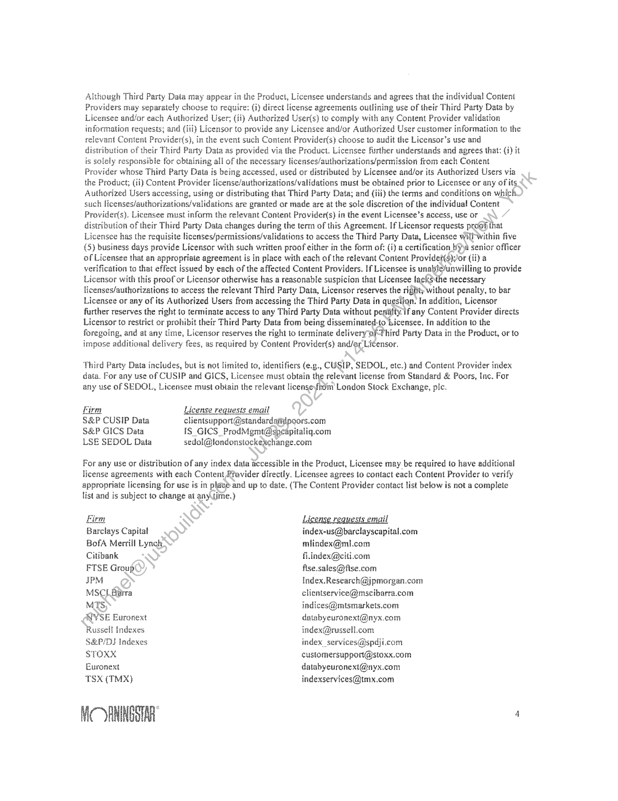
```  
```col-md
Although Third Party Data may appear in the Product, Licensee understands and agrees that the individual Content
Providers may separately choase to require: (1) direct license agreemenis outlining use of their Third Party Data by
Licensee and/or each Authorized User; (fi) Authorized User(s) to comply with any Content Provider validation
information requests; and (11i} Licensor to provide any Licensee and/or Authorized User customer information to the
relevant Content Provider(s), in the event such Content Provider(s) choose to audit the Licensor’s use and
distribution of their Third Party Data as provided via the Product. Licensee Rirther understands and agrees that: (2) it
is solely responsible for obtaining all of the necessary licenses/authorizations/permission from each Content
Provider whose Third Party Dats is being accessed, used or distributed by Licensee and/or its Authorized Users via
the Product, (1i} Content Provider license/authorizations/validations must be obtained prior to Licensee or any of its
Authorized Users accessing, using or distributing that Third Party Data; and (iii) the terms and conditions on which
such licenses/authorizations/ validations are granted or made are at the sole discretion of the individual Content
Provider(s). Licensee must inform the relevant Content Provider(s) in the event Licensee’s access, use or
distribution of their Third Party Data changes during the term of this Agreement. If Licensor requests proof that
Licensee has the requisite Heenses/permissions/validations to access the Third Party Data, Licensee wilh within five
(5) business days provide Licensor with such written proof either in the form of: (4) a certification by)a senior officer
of Licensee that an appropriate agreement is in place with each of the relevant Content Provider(s)or (i) a
verification to that effect issued by each of the affected Content Providers. If Licensee is unablevunwiiling to provide
Licenser with this proof or Licensor otherwise has a reasonable suspicion that Licensee lacksthe necessary
licenses/authorizations to access the relevant Third Party Data, Licensor reserves the right; without penalty, to bar
Licensee or any of its Authorized Users from accessing the Third Party Data in question. In addition, Licensor
further reserves the right to terminate access to any Third Party Data without penalty if any Content Provider directs
Licensor to restrict or prohibit their Third Party Data from being disseminated-to Licensee. in addition to the
foregoing, and at any me, Licensor reserves the right to terminate delivery of Third Party Data in the Product, or to
impose additional delivery fees, as required by Content Provider(s) and/or Licensor.  
Third Party Data includes, but is not limited to, identifiers (e.g., CUSIP, SEDOL, etc.) and Content Provider index
data. Por any use of CUSIP and GICS, Licensee must obtain the relevant license from Standard & Poors, Inc. For
any use of SEDOL, Licensee must obtain the relevant licenseyfrdm London Stock Exchange, ple.  
Firm License requests email  
S&P CUSIP Data clientsupport@standardatlpoors.com
S&P GICS Data 1S_GICS_ProdMgmt@spenpitalig.com
LSE SEDOL Datla sedal@londonstockexchange.com  
For any use or distribution of any index data accessible in the Product, Licensee may be required to have additional
license agreements with each Content Provider directly. Licensee agrees to contact each Content Provider to verify
appropriate licensing for use is in placé and up to date. (The Content Provider contact list below is not a complete
lst and is subject to change af any ime.)  
Flem i reques! ib
Barclays Capital index-us@barclayscapital.com
BofA Merrill Lynch miindex@ml.com  
Citibank fiindex@citi.com  
FTSE Group fise.sales@fise.com  
IPM Index.Research@jpmorgan.com
MSCI Berra clientservice@mscibarra.com
MTS, indices@mismarkets.com
NYSE Euronext databyeuronext@nyx.com
Russell indexes indexi@nussell.com  
S&P/DS Indexes index services@spdji.com
STOXX customersuppor@stoxx.com
Euronext databyeuronext@inyx.com
TSX (TMX) indexservices@tmx.com  
MORNINGSTAR ‘  
```
````
Notes:    
````col
```col-md
flexGrow=.5
===
> [!info] [Page 5](_attachments/images_3.6.4.2.3.1Morningstar_MOD_ProductLicenseAgreement_20140501.pdf_155444/page_5.png)
> 
```  
```col-md
UBS OL-UBS-Index-Group@ubs.com
Wilshire Index .access@wilshire.com  
For the avoidance of doubt, no license for any external use of Third Party Data is granted by Licensor under this
Agreement. Licensee may be required to obtain permission directly from Content Providers for external use of  
Third Party Data by Licensee.  
The parties huve each signed, or caused their authorized representatives ta siga, this binding Agreement as of the
Agreement Effective Date.  
Licensor: Licensee:  
Momsasar Ya ; Markite Inc.
‘  
nome Kocher  
Win vere Name:
Title: Dovedae of Pane Title: burn Headl (dehin Se furans
Date: “7- 22-14 Date: u ul i [5 Pal4  
WiC ORNINGSTAR  
```
````
Notes:    
````col
```col-md
flexGrow=.5
===
> [!info] [Page 6](_attachments/images_3.6.4.2.3.1Morningstar_MOD_ProductLicenseAgreement_20140501.pdf_155444/page_6.png)
> 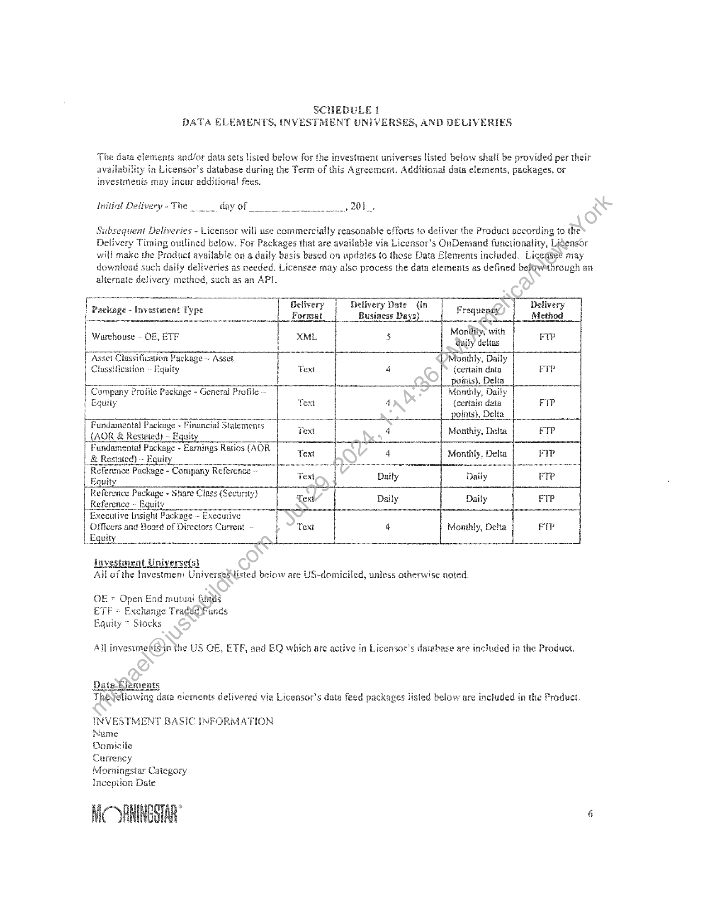
```  
```col-md
SCHEBULE I
DATA ELEMENTS, INVESTMENT UNIVERSES, AND DELIVERIES  
‘The data elements and/or data sets sted below for the investment universes listed below shall be provided per their
availability in Licensor’s database during the Term of this Agreement, Additional data clements, packages, or
investments may incur additional fees.  
Initial Delivery-The  dayof ys BOE.  
Subsequent Deliveries - Licensor will use commercially reasonable efforts to deliver the Product according to the
Delivery Timing outlined below. For Packages that are available via Licensor's OnDemand functionality, Lidensor
will make the Product available on a daily basis based on updates to those Data Elements included. Licensee may
download such daily deliveries as needed. Licensee may also process the data elements as defined belowthrough an  
alternate delivery method, such as an APT.  
Delivery Date (in
Business Days  
Package - Investment Type  
shee 2 ooTr Monilily, with
Warehouse ~ OF, ETF XML Guily deltas
Asset Classification Package ~ Assct i Monthly, Daily
Classification ~ Equity Text (certain data
| points), Delta
Company Profile Package - General Profile Monthly, Daily
{ Equity ‘Text (certain data FIP
i oints), Delta
Fundamental Package - Pinancial Statements .
(AOR & Restated) - Equity Text Monthly, Delta
Fundamental Package - Earnings Ratios (AOR.
& Restated) ~ Equi Text Monthly, Delta
Reference Package - Company Reference ~ Text
Equity
Reference Package - Share Class (Security) Text
Reference ~ Equity
Executive Insight Package ~ Executive
Officers and Board of Directors Current ~ Text Monthly, Delta
Equity  
investment Universe(s)  
All ofthe Investment UniversesMisted below are US-domiciled, unless otherwise noted.  
OE » Open End mutual finals
ETF © Exchange Tradud Funds
Equity ~ Stocks  
All investmeafoin the US OE, ETF, and EQ which are active in Licensor’s database are included in the Product.  
Date -Kiements  
The following data elements delivered vie Licensor’s data feed packages Usted below are included in the Product.  
INVESTMENT BASIC INFORMATION
Name  
Domicile  
Currency  
Morningstar Category  
Inception Date  
WiORNINGSTAR®  
```
````
Notes:    
````col
```col-md
flexGrow=.5
===
> [!info] [Page 7](_attachments/images_3.6.4.2.3.1Morningstar_MOD_ProductLicenseAgreement_20140501.pdf_155444/page_7.png)
> 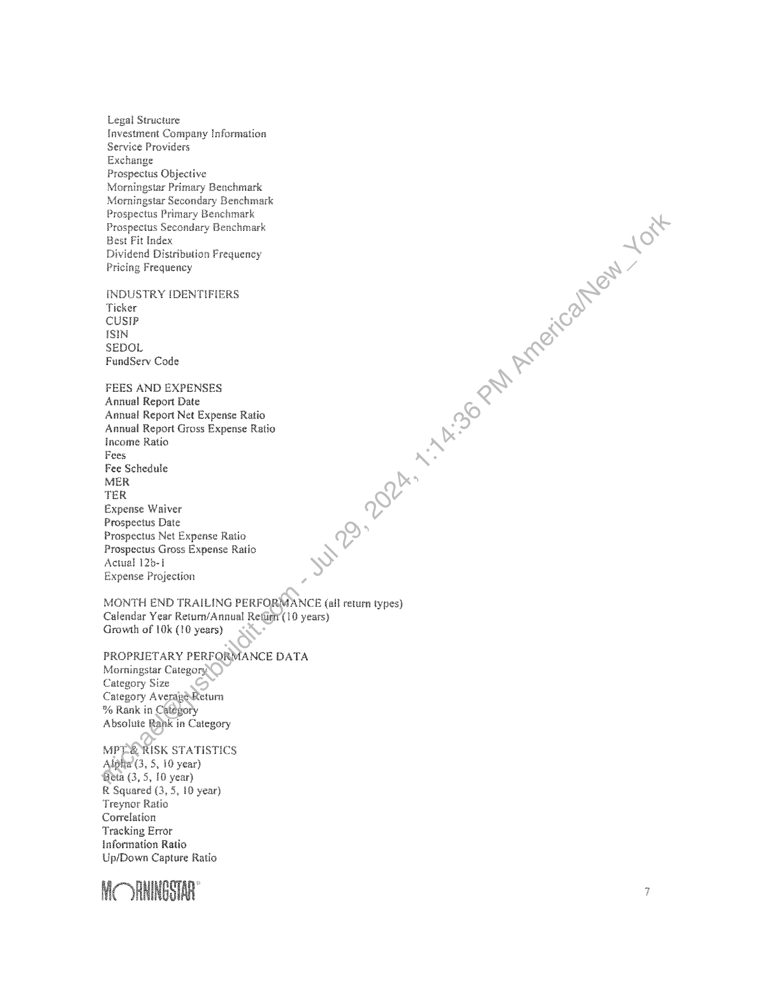
```  
```col-md
Legal Structure  
lnvestment Company Information
Service Providers  
Exchange  
Prospectus Objective
Morningstar Primary Benchmark
Morningstar Secondary Benchmark
Prospectus Primary Benchmark
Prospectus Secondary Benchmark
Best Fit Index  
Dividend Distribution Frequency
Pricing Frequency  
INDUSTRY [DENTIFIERS
Ticker  
CUSIP  
ISIN  
SEDOL  
FundServ Code  
FEES AND EXPENSES  
Annual Report Date  
Annual Report Net Expense Ratio
Annual Report Gross Expense Ratio
inceme Ratio  
Fees  
Fee Schedule  
MER  
TER  
Expense Waiver  
Prospectus Date  
Prospectus Net Expense Ratio
Prospectus Gross Expense Ratio
Actual 126-1  
Expense Projection  
MONTH END TRAILING PERFORMANCE (all return types)
Calendar Year Return/Annual Retin (10 years)
Growth of 10k (10 years)  
PROPRIETARY PERFORMANCE DATA
Morningstar Category  
Category Size  
Category Average Return  
%% Rank in Category  
Absolute Rank in Category  
MPP RISK STATISTICS
Alpha (3, 5, 10 year)  
Geta (3, 5, 10 year}  
R Squared (3, 5, 10 year)
Treynor Ratio  
Correlation  
Tracking Error  
information Ratio
Up/Down Capture Ratio  
MORNINGSTAR  
```
````
Notes:    
````col
```col-md
flexGrow=.5
===
> [!info] [Page 8](_attachments/images_3.6.4.2.3.1Morningstar_MOD_ProductLicenseAgreement_20140501.pdf_155444/page_8.png)
> 
```  
```col-md
Batting Average
Standard Deviation
Skewness  
Kurtosis  
Sharpe Ratio
Sortino Ratio  
MORNINGSTAR STAR RATING
Morningstar Category  
Category Size  
Morningstar Return  
Morningstar Risk  
3,5, 16 Year Rating  
Overall Rating  
CLASSIFICATION
Morningstar Category
Asset Allocation Breakdown  
TOP 10 HOLDINGS
Detailed Holding Type
Holding Country  
Holdings Industry Identifier
Security Name  
Weighting  
Number of Shares  
Market Value  
Share Change  
FOR EQUITIES  
Fundamentals Package
Earnings
Revenues (5 years history)  
xecutive Insi Packace
Executive Officers  
Company Profiles Package
Company Profile  
Asset Classification Package
Morningstar Sector
Morningstar Industty  
NC ANINGSTAR  
```
````
Notes:    
````col
```col-md
flexGrow=.5
===
> [!info] [Page 9](_attachments/images_3.6.4.2.3.1Morningstar_MOD_ProductLicenseAgreement_20140501.pdf_155444/page_9.png)
> 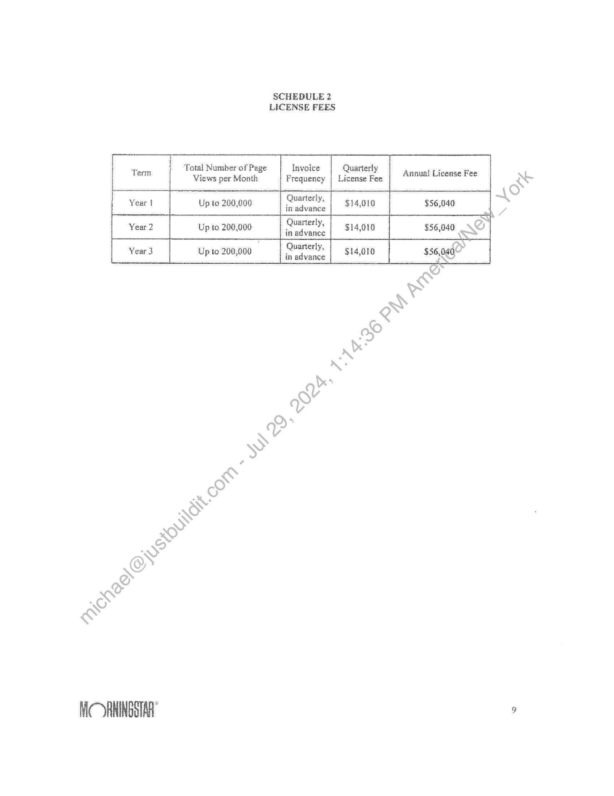
```  
```col-md
SCHEDULE 2
LICENSE FEES  
Total Number of Page lavoice
Views per Month | Frequency  
Quarterly
License Fee  
Term Annual License Fee  
ee  
Quarterly, |  
Up io 200,000 : $14,610 $56,040in advance i
Year? Up to 200,000 Quarterly, sua org $56,040
in advance  
Quarterly,  
z
Up to 200,000 in advance  
$14,010  
$56,040  
MOORAINGSTAR  
```
````
Notes:    
````col
```col-md
flexGrow=.5
===
> [!info] [Page 10](_attachments/images_3.6.4.2.3.1Morningstar_MOD_ProductLicenseAgreement_20140501.pdf_155444/page_10.png)
> 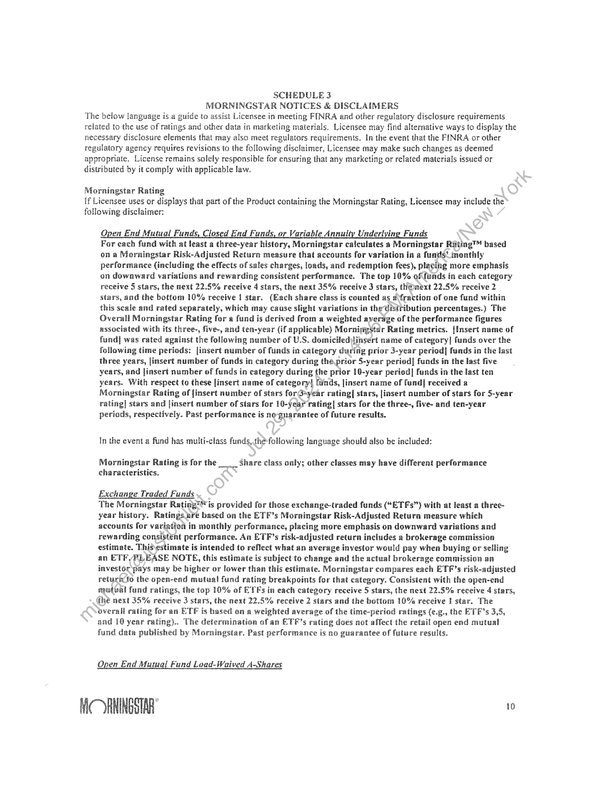
```  
```col-md
SCHEDULE 3  
MORNINGSTAR NOTICES & DISCLAIMERS
The below language is a guide to assist Licensee in meeting FINRA and other regulatory disclosure requirements
related to the use of ratings and other data in marketing materials. Licensee may find alternative ways to display the
necessary disclosure elements that may also meet regulators requirements. In the event that the FINRA or other
regulatory agency requires revisions to the following disclaimer, Licensee may make such changes as deemed
appropriate. License remains solely responsible for ensuring that any marketing or related materials issued or
distributed by it comply with applicable law.  
Morningstar Rating
If Licensee uses or displays that part of the Product containing the Morningstar Rating, Licensee may include the  
following disclaimer:  
Open End Mutual Funds, Closed End Funds, or Variable Annuity Underlying Funds  
For each fund with at least a three-year history, Morningstar calculates a Morningstar Rating™ based
on a Morningstar Risk-Adjusted Return measure that accounts fer variation in a funds’ ineathly
performance (including the effects of sales charges, loads, and redemption fees), placing mare emphasis
on downward variations and rewarding consistent performance. The top 10% of funds in each category
receive § stars, the next 22.5% receive 4 stars, the next 38% receive 3 stars, thmext 22.5% receive 2
stars, and the bottom 10% receive 1 star, (Each share class is counted as a\fraction of one fund within
this scale and rated separately, which may cause slight variations in the Uisttibution percentages.) The
Overall Morningstar Rating for a fund is derived from a weighted average of the performance figures
associated with its three-, five-, and ten-year (if epplicable) Morningstar Rating metrics. {insert name of
fund| was rated against the following number of U.S. domiciled insert name of category] funds over the
following time periods: [insert number of funds in category during prior 3-year period| funds in the last
three years, |insert number of funds in category during tha prior S-year period] funds in the last five
years, and liasert number of funds in category during the prior 10-year period] funds in the last ten
years. With respect to these [insert name of category! [unds, jinsert name of fund] received a
Morningstar Rating of finsert number of stars for G»year rating| stars, [insert number of stars for 5-year
rating] stars and jinsert number of stars for 10-year rating| stars for the three-, five- and ten-year
periods, respectively. Past performance is ne-guarantec of future results.  
In the event a fund has multi-class funds,.the following language should also be included:  
Morningstar Rating is for the Share class only; other classes may have different performance
characteristics.  
Exchange Traded Funds
The Morningstar Rating" is provided for those exchange-traded funds (“ETFs”) with at least a three-  
year history. Ratings wre based on the ETF's Morningstar Risk-Adjusted Retura measure which
accounts for variatiod in monthly performance, placing more emphasis on downward variations and
rewarding consistent performance. An ETF’s risk-adjusted return includes a brokerage commission
estimate. Thisvestimate is intended to reflect what an average investor would pay when buying or selling
an ETF/PLEASE NOTE, this estimate is subject to change and the actual brokerage commission an
investor pays may be higher or lower than this estimate. Morningstar compares each ETF’s risk-adjusted
returnto the epen-end mutual fund rating breakpoints for that category. Consistent with the open-end
stufteal fund ratings, the top 10% of ETFs in each category receive 5 stars, the next 22.5% receive 4 stars,
dhe next 35% receive 3 stars, the next 22.5% receive 2 stars and the bottom 10% receive I star. The
overall rating fer an ETP is based on a weighted average of the time-period ratings (e.g., the ETF’s 3,5,
and 1@ year rating).  
 The determination of an ETE’s rating dees not affect the retail open end mutual
fund data published by Morningstar, Past performance is no guarantee of future results.  
Open End Mummal Fund Load-Waived A-Shares  
MORNINGSTAR to  
```
````
Notes:    
````col
```col-md
flexGrow=.5
===
> [!info] [Page 11](_attachments/images_3.6.4.2.3.1Morningstar_MOD_ProductLicenseAgreement_20140501.pdf_155444/page_11.png)
> 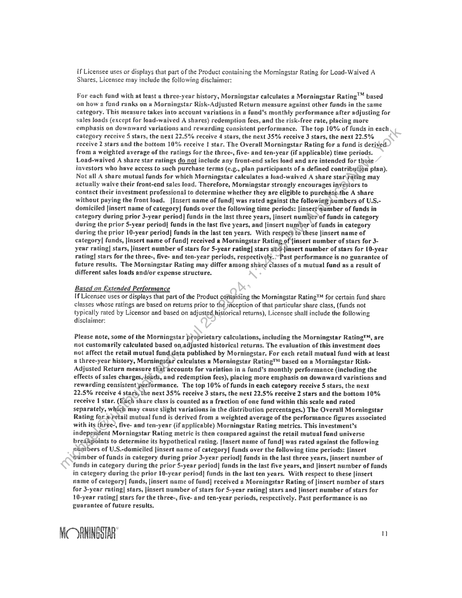
```  
```col-md
if Licensee uses or displays that part of the Product containing the Morningstar Rating for Load-Waived A
Shares, Licensee may include the following disclaimer:  
For each fund with at least a three-year history, Morningstar calculates a Morningstar Rating’ based
on how a fund ranks one Morningstar Risk-Adjusted Return measure against other funds in the same
category. This measure takes into account variations in a fund's monthly performance after adjusting for
sales loads (except for load-waived A shares) redemption fees, and the risk-free rate, placing more
emphasis on downward variations and rewarding consistent performance. The top 10% of funds in each
entegory receive 5 stars, the next 22.5% receive 4 stars, the next 35% receive 3 stars, the next 22.5%
receive 2 stars and the bottem 10% receive | star. The Overall Morningstar Rating for a find is derived.
from a weighted average ef the ratings for the three-, five- and ten-year (if applicable) time periods.
Lead-waived A share star ratings do not include any front-end sales Joad and are intended for those
investors who have access to such purchase terms (¢.g., plan participants of a defined contribufion plan).
Not all A share mutual funds for which Morningstar calculates a load-waived A share star rating may
actually waive their front-end sales toad. Therefore, Morningstar strongly encourages investors to
contact their investment professional to determine whether they are eligible to purchasethe A share
without paying the front toad. [Insert name of fund] was rated against the following numbers of U.S.domiciled |insert name of category| funds over the following time periods: [insert dumber of funds in
category during prior 3-year period] funds in the last three years, jinsert number of funds in category
during the prior 5-year period] funds in the last five years, and |insert number of funds in category
during the prior 10-year period| funds in the last ten years, With respect to these Jinsert name of
category] funds, Jinsert name of fund| received a Morningstar Rating of jinsert number of stars for 3year rating| stars, jinsert number of stars for 5-year rating] stars ahd-4finsert number of stars for 10-year
rating] stars for the three-, five- and ten-year periods, respectively.-Past performance is no guarantee of
future results, The Morningstar Rating may differ among share classes of a mutual fund as a result of
different sales loads and/or expense structure.  
Based on Extended Performance  
If Licensee uses or displays that part of the Product cefitaining the Morningstar Rating™ for certain fund share
classes whose ratings are based on returns prior to the inception of that particular share class, (funds not
typically rated by Licensor and based on adjusted historical returns), Licensee shall include the following
disclaimer:  
Please note, some of the Morningstar proprietary calculations, including the Morningstar Rating™, sre
not customarily calculated based on adjusted historical returns. The evaluation of this investment does
not affect the retall mutual fund data published by Morningstar. For each retail mutual fund with at least
x three-year history, Morningstar calculates e Morningstar Rating™! based oa a Morningstar RiskAdjusted Return measure thafaccounts for variation in a fund’s monthly performance (including the
effects of sales churges,loads, and redemption fees), placing more emphasis on downward variations and
rewarding consistent performance. The top 10% of funds in each category receive 5 stars, the next
22.5% receive 4 stars, the next 35% receive 3 stars, the next 22.5% receive 2 stars and the bottom 10%
receive I star. (Eich share class is counted as a fraction of one fund within this scale and rated
separately, which may cause slight variations in the distribution percentages.) The Overall Morningstar
Rating for wretail mutual fund is derived from a weighted average of the performance figures associated
with its three-, five- and ten-year (if applicable) Morningstar Rating metrics. This investment’s
independent Morningstar Rating metric is then compared against the retail mutual fund universe
breakpoints to determine its hypothetical rating. (Insert name of fund| was rated against the following
numbers of U.S.-domicited [insert name of category] funds over the following time periods: [insert
trumber of funds in category during prior 3-year period] funds in the last three years, [insert number of
funds in categery during the prior 5-year period] funds in the last five years, and |insert number of funds
in category during the prior 16-year period] funds in the last ten years. With respect to these [insert
name of category] funds, [insert same of fund] received a Morningstar Rating of Jinsert number of stars
for 3-year rating| stars, jinsert number of stars for 5-year rating] stars and jinsert number of stars for
10-year rating{ stars for the three-, five- and ten-year periods, respectively. Past performance is no
guarantee of future results,  
MORNINGSTAR "  
```
````
Notes:    
````col
```col-md
flexGrow=.5
===
> [!info] [Page 12](_attachments/images_3.6.4.2.3.1Morningstar_MOD_ProductLicenseAgreement_20140501.pdf_155444/page_12.png)
> 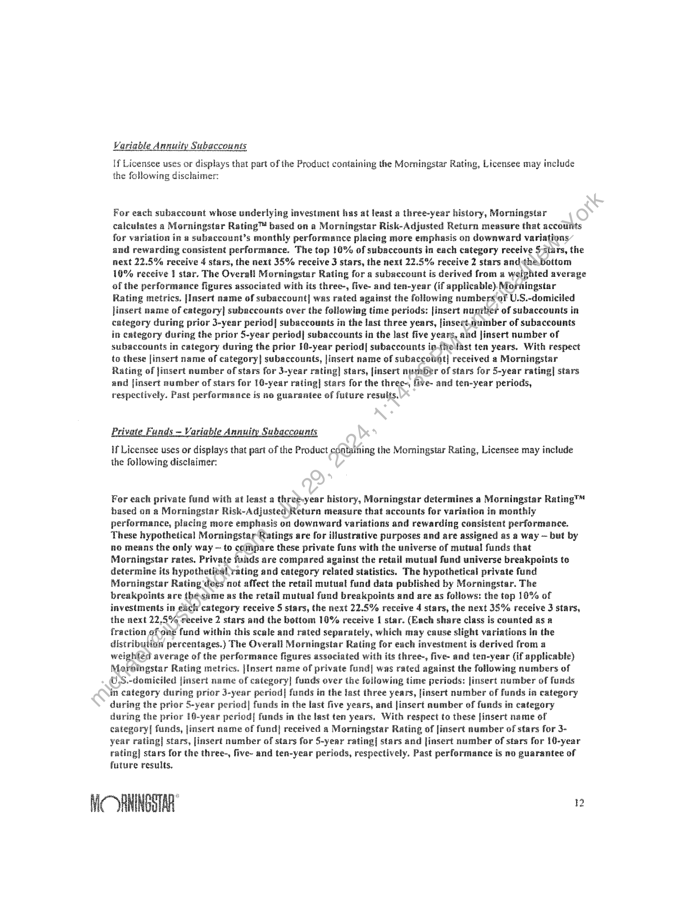
```  
```col-md
Variable Annuity Subaccounts  
If Licensee uses or displays that part of the Product containing the Morningstar Rating, Licensee may include
the following disclaimer:  
For each subaccount whose underlying investment has at least a three-year history, Morningstar
calculates a Morningstar Rating™ based on a Morningstar Risk-Adjusted Return measure that accounts
for variation in a subaccouat’s monthly performance placing more emphasis on downward variations
and rewarding consistent performance. The tep 10% of subaceounts in each category receive Sstars, the
next 22.5% receive 4 stars, the next 35% receive 3 stars, the next 22.5% receive 2 stars and ¢ha bottom
16% receive | ster. The Oversli Morningstar Rating for a subaccount is derived from a weighted average
of the performance Rgures associated with its three-, five- and ten-year (if applicable) Morningstar
Rating metrics. [Insert name of subaccount] was rated against the following numbers of U.S.-domiciled
linsert name of category| subnccounts over the following time periods: [insert nuntber of subaccounts in
category during prior 3-year period] subaccounts in the last three years, linsert.mumber of subaccounts
in category ducing the prior 5-year period] subaccounts in the last five years, and linsert number of
subaccounts in category during the prior 10-year period| subaccounts intielast ten years. With respect
to these [insert name of category} subaccounts, [insert name of subaccebat] received a Morningstar
Rating of jinsert number of stars for 3-year rating] stars, [insert number of stars for 5-year rating] stars
and [insert number of stars for 10-year rating] stars for the threc-, five- and ten-year periods,
respectively. Past performance is ne guarantee of future results.  
Private Funds ~ Variable Annuity Subaccounts  
if Licensee uses or displays that part of the Product containing the Morningstar Rating, Licensee may include
the following disclaimer:  
For cach private fund with at least a thre@year history, Morningstar determines a Morningstar Rating™
based an 2 Morningstar Risk-Adjusted\Return measure that accounts for variation in monthly
performance, placing more emphasis on downward variations and rewarding consistent performance.
These hypothetical Morningstar Ratings are for illustrative purposes and are assigned as a way — but by
no means the only way — to compare these private funs with the universe of mutual funds that
Morningstar rates, Private funds are compared against the retail mutual fund universe breakpoints to
determine its hypothetiegl rating and category related statistics. The hypothetical private fund
Morningstar Rating dees not affect the retail mutual fund data published by Morningstar. The
breakpoints are theasime as the retail mutual fund breakpoints and are as follows: the top 10% of
investments im eich category receive $ stars, the next 22.5% receive 4 stars, the next 35% receive 3 stars,
the next 22.5% receive 2 stars and the bottom 10% receive i star. (Each share class is counted as a
fraction ef one fund within this scale and rated separately, which may cause slight variations in the
distribution percentages.) The Overall Morningstar Rating for each investment is derived from a
weighted average of the performance figures associated with its three-, five- and ten-year (if applicable}
Moroingstar Rating metrics. [Insert name of private fund| was rated against the following numbers of
U.S.-demiciled jinsert name of category! funds over the following (ime periods: [insert number of funds
in category during prior 3-year period] funds in the last three years, [insert number of funds in category
during the prior 5-year period| funds in the last five years, and linsert number of funds in category
during the prior i@-year period! funds in the last ten years, With respect to these [insert name of
category| funds, jinsert name of fund) received a Morningstar Rating of [insert number of stars for 3year rating] stars, [insert number of stars for 5-year rating| stars and [insert number of stars for 10-year
rating} stars for the three-, five- and ten-year periods, respectively. Past performance is no guarantee of
future results,  
MC RNINGOTAR "  
```
````
Notes:    
````col
```col-md
flexGrow=.5
===
> [!info] [Page 13](_attachments/images_3.6.4.2.3.1Morningstar_MOD_ProductLicenseAgreement_20140501.pdf_155444/page_13.png)
> 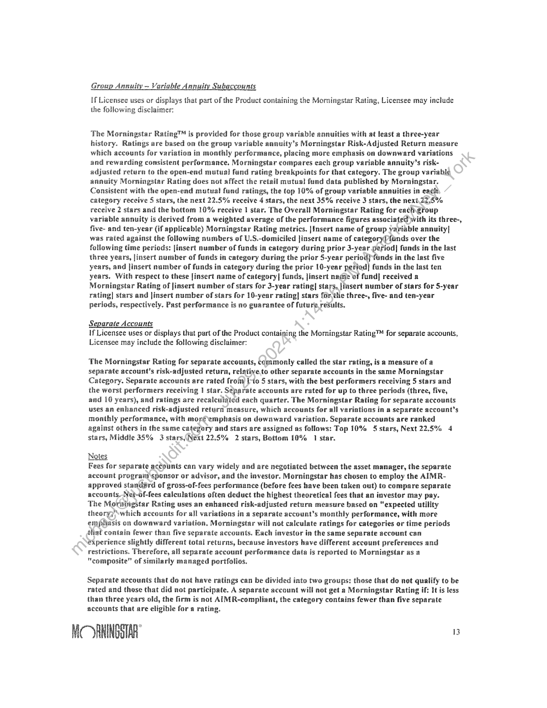
```  
```col-md
Group Annuity ~ Variable Annuity Subaccounts  
Hf Licensee uses or displays that part of the Product containing the Morningstar Rating, Licensee may include
the folowing disclaimer:  
‘The Morningstar Rating™ is provided for these group variable annuities with at least a three-year
history. Ratings are based on the group variable aunuity’s Morningstar Risk-Adjusted Return measure
which accounts for variation in monthly performance, placing more emphasis on downward variations
and rewarding consistent performance. Morningstar compares each group variable annuity’s riskadjusted return to the open-end mutual fund rating breakpoints for that category. The group variable
annuity Morningstar Rating dees not affect the retail mutus! fund data published by Morningstar.
Consistent with the open-end mutual fund raiings, the top 10% of group variable annuities in each
category receive § stars, the next 22.5% receive 4 stars, the next 35% receive 3 stars, the next 27.5%
receive 2 stars and the bottom 10% receive | star, The Overall Morningstar Rating for each group
variable annuity is derived from a weighted average of the performance figures associated with its three-,
five- and ten-year (if applicable) Morningstar Rating metrics. |Insert name of group variable annuity|
was rated against the folowing numbers of U.S.-domiciled Jinsert name of categeryPfunds over the
following time periods: [insert number of funds in category during prior 3-year period] funds in the last
three years, insert number of funds in category during the prier 5-year period) Vunds in the last five
years, and Jinsert number of funds in category during the priar 10-year period] funds in the last ten
years. With respect to these [insert name of category| funds, jinsert name of fund] received a
Morningstar Rating of jinsert number of stars for 3-year rating| stars, |insert number of stars for 5-year
rating| stars and jinsert number of stars for 10-year rating| stars for the three-, five- and ten-year
periods, respectively. Past performance is no guarantee of future reSults.  
Separate Accounts
Hf Licensee uses or displays that part of the Product containing the Momingstar Rating™ for separate accounts,  
Licensee may include the folowing disclaimer:  
The Morningstar Rating for separate accounts, commonly called the star rating, is a measure of a
separate account's risk-adjusted return, relative to other separate accounts in the same Morningstar
Category. Separate accounts are rated frof) iia 5 stars, with the best performers receiving 5 stars and
the worst performers receiving | star. Separate accounts are rated for up to three periods (three, five,
and 10 years), and ratings are recalculated each quarter. The Morningstar Rating for separate accounts
uses an enhanced risk-adjusted return measure, which accounts for all varintions in a separate account’s
monthly performance, with mor@ emphasis on downward variation. Separate accounts are ranked
against others in the same category and stars are assigned as follows: Top 10% 45 stars, Next 22.5% 4
stars, Middle 35% 3 stars\ Next 22.5% 2 stars, Bottom 10% 1 star.  
Notes  
Fees for separate accounts can vary widely and are negotiated between the asset manager, the separate
account program sponsor or advisor, and the investor. Morningstar has chosen to employ the AIMRapproved stand@rd of gross-of-fees performance (before fees have been taken out) to compare separate
accounts, Net-of-fees calculations often deduct the highest theoretical fees that an investor may pay.
The Morsingstar Rating uses an enhanced risk-adjusted return measure based on “expected utility
theory7\which accounts for all variations in a separate account’s monthly performance, with more
emphasis on dowaward variation, Morningstar will not calculate ratings for categories er time periods
thaf contain fewer than five separate accounts. Each investor in the same separate account can
experience slightly different total returns, because investors have different account preferences and
restrictions. Therefore, all separate account performance data is reported to Morningstar as a
“composite” of similarly managed portfolios.  
Separate accounts thet de not have ratings can be divided into two groups: these that do net qualify to be
rated and these that did not participate. A separate account will aot get a Morningstar Rating if: It is less
than three years old, the firm is not AIMR-compliant, the category contains fewer than five separate
accounts that are eligible for a rating.  
MC )RNINGOTAR 3  
```
````
Notes:    
````col
```col-md
flexGrow=.5
===
> [!info] [Page 14](_attachments/images_3.6.4.2.3.1Morningstar_MOD_ProductLicenseAgreement_20140501.pdf_155444/page_14.png)
> 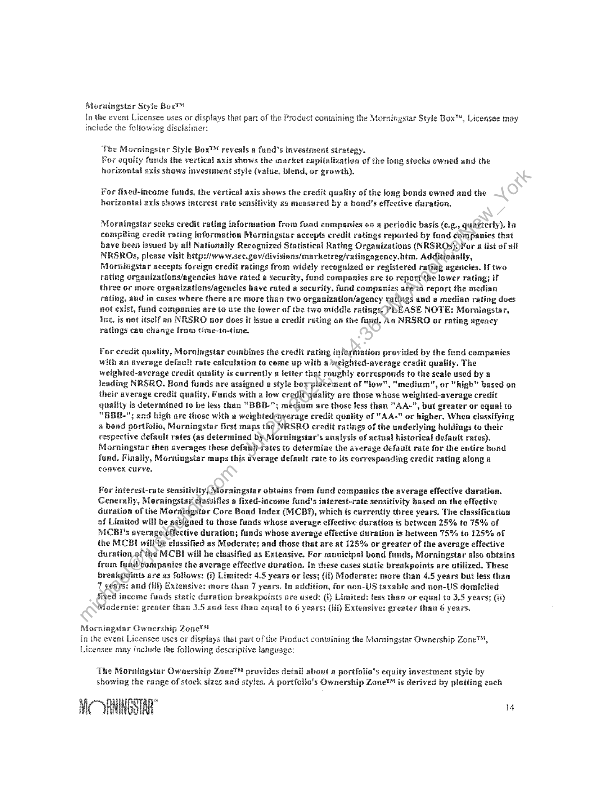
```  
```col-md
Morningstar Style Box™
In the event Licensee uses or displays that part of the Product containing the Morningstar Style Box™, Licensee may
include the following disclaimer:  
The Morningstar Style Box™ reveals a fund's investment strategy.
For equity funds the vertical axis shows the market capitalization of the long stocks owned and the
horizontal axis shows investment style (value, blend, or growth).  
For fixed-income funds, the vertical axis shows the credit quality of the long bonds owned and the
horizontal axis shows interest rate sensitivity as measured by a bond's effective duration.  
Morningstar secks credit rating information from fund companies on a periodic basis (c.g., quarterly). In
compiling credit rating information Morningstar accepts credit ratings reported by fund companies that
have been issued by all Nationally Recognized Statistical Rating Organizations (NRSROs))For a list of all
NRSROs, please visit http://www.sec.gov/divisions/marketreg/ratingsgency.htm. Additionally,
Morningstar accepts foreign credit ratings from widely recognized or registered rating agencies. If two
rating organizations/agencies have rated a security, fund companies are to report the lower rating; if
three or more organizations/agencies have rated a security, fund companies areto report the median
rating, and in cases where there are more than two organization/agency ratings and a median rating does
not exist, fund companies are to use the lower of the two middle ratings’ PLEASE NOTE: Morningstar,
Inc. is not itself an NRSRO ner does it issue a credit rating on the fund. An NRSRO or rating agency
ratings can change from time-to-time.  
For credit quality, Morningstar combines the credit rating information provided by the fund companies
with an average default rate calculation to come up with a weighted-average credit quality. The
weighted-average credit quality is currently a letter that roughly corresponds to the scale used by a
leading NRSRO. Bond funds are assigned a style bor placement of “low”, "medium", or "high" based on
their average credit quality. Funds with a low credit qdality are those whose weighted-average credit
quality is determined to be less than "BBB-"; medium are those less than “AA-", but greater or equal to
“BBB-"; and high are those with a weighted-nyerage credit quality of "AA-" or higher. When classifying
a bond portfolio, Morningstar first maps the NRSRO credié ratings of the underlying holdings to their
respective default rates (as determined by Morningstar's analysis of actual historical default rates).
Morningstar then averages these defailt-rates to determine the average default rate for the entire bond
fund. Finally, Morningstar maps this sverage default rate to its corresponding credit rating along a
convex curve.  
For interest-rate sensitivity, Moraingstar obtains from fund companies the average effective duration.
Generally, Morningstar classifies a fixed-income fund's interest-rate sensitivity based on the effective
duration of the Morningstar Core Bond Index (MCBD, which is currently three years. The classification
af Limited will be assigned to those funds whose average effective duration is between 25% to 75% of
MCBI's average effective duration; funds whose average effective duration is between 75% to 125% of
the MCBI will be classified as Moderate; and those that are at 125% or greater of the average effective
duration ofthe MCBI will be classified as Extensive. For municipal bond funds, Morningstar also obtains
from fund companies the average effective duration. In these cases static breakpoints are utilized. These
breakpoints are as follows: (2) Limited: 4.5 years or less; (3) Moderate: more than 4.5 years but less than
7 veays; and (HD Extensive: more than 7 years, In addition, for non-US taxable and non-US domiciled
fixed income funds static duration breakpoints sre used: (i) Limited: less than or equal to 3.5 years; GD}
Moderate: greater than 3.5 and less than equal to 6 years; (lil) Extensive: greater than 6 years.  
Morningstar Ownership Zonet
in the event Licensee uses or displays that part of the Product containing the Morningstar Ownership Zone™,
Licensee may include the following descriptive language:  
The Morningstar Ownership Zone™ provides detail about a portfolio’s equity investment style by
showing the range of stock sizes and styles. A portfolio's Ownership Zone™ is derived by plotting each  
Mk RNINGSTAR® 4  
```
````
Notes:    
````col
```col-md
flexGrow=.5
===
> [!info] [Page 15](_attachments/images_3.6.4.2.3.1Morningstar_MOD_ProductLicenseAgreement_20140501.pdf_155444/page_15.png)
> 
```  
```col-md
stock in the fund's portfolio within the proprietary Morningstar Style Box™'. The shaded ares represents
the center 75% ef the fund's assets, and it provides an intuitive visual representation of the area of the
market in which the fund invests. A “centroid” plot in the middle of the Ownership Zone represents the
weighted average of all the fund's heldings. A fund that is concentrated will have a small ownership zone
relative to the area of the style box, and breadly diversified fund will have an ownership zone that
stretches scross many sizes and style. Over a period of time, the shape and location of a fund's ownership
zone may vary.  
Morningstar Analyst Rating  
If Licensee uses or displays that part of the Product containing the Morningstar Analyst Rating, Licensee may
include the following disclaimer:  
The Morningstar Analyst Rating is not a credit or risk rating. It is a subjective evaluation performed by
the mutual fund analysts of Morningstar, Inc. Morningstar evaluates funds based on five key pillars,
which are process, performance, people, parent, and price. Morningstar's analysts use this five pillar
evaluation to identify funds they believe are more likely to outperform over  
the long term on a risk-adjusted basis. Analysts consider quantitative and qualitative factors in their
research, and the weighting of each pillar may vary. The Analyst Rating ultinately reflects the analyst's
overall assessment and is overseen by Morningstar's Analyst Rating Coniniittee. The approach serves not
as 8 formula but as a framewerk ta ensure consistency across Morningstar's  
global coverage universe.  
The Analyst Rating scale ranges from Gold to Negative, with Gold being the highest rating and Negative
being the lowest rating. A fund with a "Gold" rating distinguishes itself across the five pillars and has
garnered the analysts' highest level of conviction. A-fund with a 'Silver' rating has notable advantages
across several, but perhaps not all, of the five pillars-atrengths that give the analysts a high level of
conviction. A “Brenze"-rated fund has advantages that outweigh  
the disadvantages acrass the five pillars, with Sufficient level ef analyst conviction to warrant a positive
rating. A fund with » ‘Neutral rating isn'tseriously flawed across the five pillars, nor does it distinguish
itself very positively, A "Negative" rated fund is flawed in at least one if not more pillars  
and is considered an inferior offering to its peers. Analyst Ratings are reevaluated at least every 14
months.  
For move detailed information about Morningstar's Analyst Rating, including its methodology, please go
te  
http://corporate morningstar.com/us/documents/MethodologyDocuments/AnalystRatingforFundsMethod
ology.pét  
MORNINGSTAR Is  
```
````
Notes:  


![[_attachments/3.6.4.2.3.1 Morningstar_MOD_ProductLicenseAgreement_20140501.pdf]