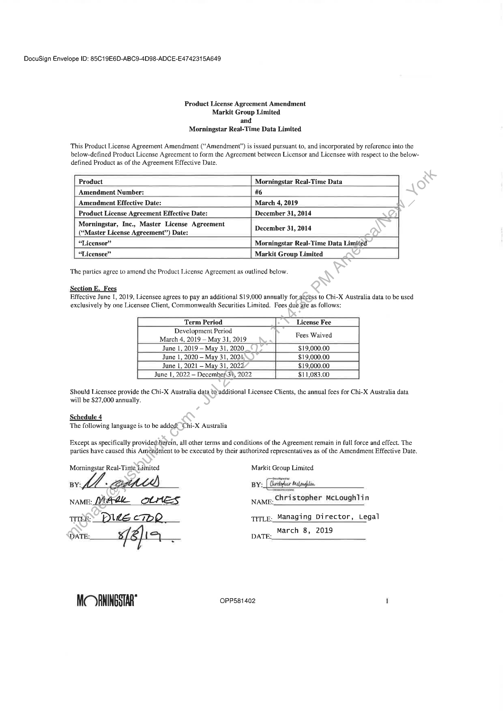

##### Product License Agreement Amendment]

  
````col
```col-md
flexGrow=.5
===
> [!info] [Page 1](_attachments/images_3.6.4.2.3.2Morningstar_MOD_ProductLicenseAgreement_20190308.pdf_155355/page_1.png)
> 
```  
```col-md
DocuSign Envelope ID: 85C19E6D-ABC9-4D98-ADCE-E4742315A649  
Product License Agreement Amendment
Markit Group Limited
and
Morningstar Real-Time Data Limited  
This Product License Agreement Amendment (“Amendment”) is issued pursuant to, and incorporated by reference into the
below-defined Product License Agreement to form the Agreement between Licensor and Licensee with respect to the belowdefined Product as of the Agreement Effective Date.  
Product Morningstar Real-Time Data
Amendment Number: #6  
Amendment Effective Date: March 4, 2019  
Product License Agreement Effective Date: December 31, 2014  
Morningstar, Inc., Master License Agreement
(“Master License Agreement”) Date: December 31, 2014  
| “Licensor” Morningstar Real-Time Data Limited
“Licensee” Markit Group Limited  
The parties agree to amend the Product License Agreement as outlined below.  
Section E. Fees
Effective June 1, 2019, Licensee agrees to pay an additional $19,000 annually for access to Chi-X Australia data to be used
exclusively by one Licensee Client, Commonwealth Securities Limited. Fees due afe as follows:  
Development Period A
June 1, 2021 —- May 31, 2022 $19,000.00  
Should Licensee provide the Chi-X Australia data to/additional Licensee Clients, the annual fees for Chi-X Australia data
will be $27,000 annually.  
Schedule 4
The following language is to be added: ‘Chi-X Australia  
Except as specifically providedherein, all other terms and conditions of the Agreement remain in full force and effect. The
parties have caused this Amendment to be executed by their authorized representatives as of the Amendment Effective Date.  
Morningstar Real-Time Limited Markit Group Limited
—_
BY: s BY: Ghaegur Melpaglive.
NAME: Vitra OLHES NAME: Christopher McLoughlin
TITLE: pide [a 7DE TITLE: Managing Director, Legal  
March 8, 2019
DATE: ¥ / & | l ho DATE:  
MC RNINGSTAR OPP581402 1  
```
````
Notes:  


![[_attachments/3.6.4.2.3.2 Morningstar_MOD_ProductLicenseAgreement_20190308.pdf]