##### Product License Agreement - Morningstar® Data]

  
````col
```col-md
flexGrow=.5
===
> [!info] [Page 1](_attachments/images_3.6.4.2.3.3Morningstar_MOD_ProductLicenseAgreement_20120901.pdf_155237/page_1.png)
> 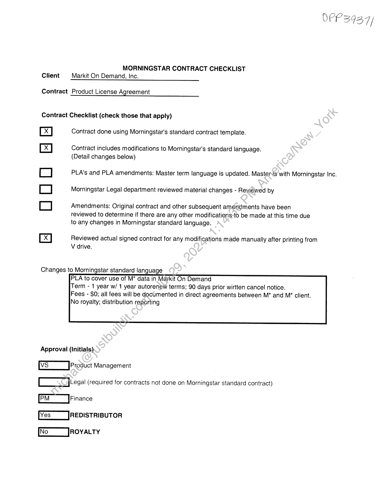
```  
```col-md
o°P3937/  
MORNINGSTAR CONTRACT CHECKLIST
Client Markit On Demand, Inc.  
Contract Product License Agreement  
Contract Checklist (check those that apply)  
Contract done using Morningstar's standard contract template.  
He  
Contract includes modifications to Morningstar's standard language.
(Detail changes below)  
PLA's and PLA amendments: Master term language is updated. Masters’ with Morningstar Inc.  
Morningstar Legal department reviewed material changes - Reviewed by  
OOO  
Amendments: Original contract and other subsequent amén¢ments have been
reviewed to determine if there are any other modifications-to be made at this time due
to any changes in Morningstar standard language.  
I  
Reviewed actual signed contract for any modifications made manually after printing from
V drive.  
Changes to Morningstar standard language  
PLA to cover use of M* data in Markit On Demand
Term - 1 year w/ 1 year autorenew terms; 90 days prior wirtten cancel notice.  
Fees - $0; all fees will be documented in direct agreements between M* and M* client.
No royalty; distribution reporting  
Approval (Initials)  
Product Management  
Co] Lesa (required for contracts not done on Morningstar standard contract)  
Finance
REDISTRIBUTOR  
ROYALTY  
```
````
Notes:    
````col
```col-md
flexGrow=.5
===
> [!info] [Page 2](_attachments/images_3.6.4.2.3.3Morningstar_MOD_ProductLicenseAgreement_20120901.pdf_155237/page_2.png)
> 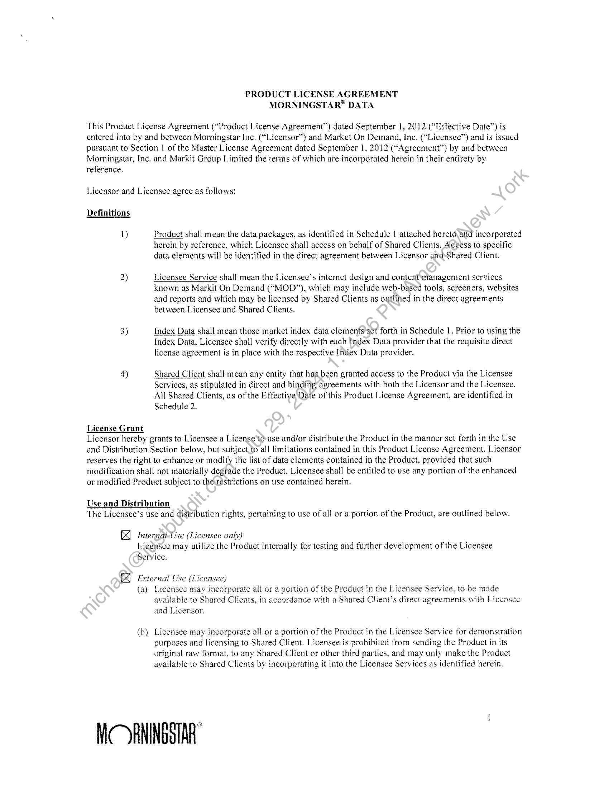
```  
```col-md
PRODUCT LICENSE AGREEMENT
MORNINGSTAR® DATA  
This Product License Agreement (“Product License Agreement”) dated September 1, 2012 (“Effective Date”) is
entered into by and between Morningstar Inc. (“Licensor”) and Market On Demand, Inc. (“Licensee”) and is issued
pursuant to Section | of the Master License Agreement dated September 1, 2012 (“Agreement”) by and between
Morningstar, Inc. and Markit Group Limited the terms of which are incorporated herein in their entirety by  
reference.  
Licensor and Licensee agree as follows:  
Definitions  
)  
2)  
4)  
License Grant
Licensor hereby grants to Licensee a License‘to-use and/or distribute the Product in the manner set forth in the Use
and Distribution Section below, but subject.to all limitations contained in this Product License Agreement. Licensor
reserves the right to enhance or modify the list of data elements contained in the Product, provided that such
modification shall not materially degrade the Product. Licensee shall be entitled to use any portion of the enhanced
or modified Product subject to the.restrictions on use contained herein.  
Product shall mean the data packages, as identified in Schedule | attached hereto and incorporated
herein by reference, which Licensee shall access on behalf of Shared Clients. A¢tess to specific
data elements will be identified in the direct agreement between Licensor andShared Client.  
Licensee Service shall mean the Licensee’s internet design and content management services
known as Markit On Demand (“MOD”), which may include web-based tools, screeners, websites
and reports and which may be licensed by Shared Clients as outlined in the direct agreements
between Licensee and Shared Clients.  
Index Data shall mean those market index data elements'set forth in Schedule I. Prior to using the
Index Data, Licensee shall verify directly with each Index Data provider that the requisite direct
license agreement is in place with the respective Index Data provider.  
Shared Client shall mean any entity that has been granted access to the Product via the Licensee
Services, as stipulated in direct and binding agreements with both the Licensor and the Licensee.
All Shared Clients, as of the Effective Date of this Product License Agreement, are identified in
Schedule 2.  
Use and Distribution
The Licensee’s use and distribution rights, pertaining to use of all or a portion of the Product, are outlined below.  
1] InternabUse (Licensee only)
LicenSee may utilize the Product internally for testing and further development of the Licensee
Service.  
[4 External Use (Licensee)  
(a)  
(b)  
Licensee may incorporate all or a portion of the Product in the Licensee Service, to be made
available to Shared Clients, in accordance with a Shared Client’s direct agreements with Licensee
and Licensor.  
Licensee may incorporate all! or a portion of the Product in the Licensee Service for demonstration
purposes and licensing to Shared Client. Licensee is prohibited from sending the Product in its
original raw format, to any Shared Client or other third parties, and may only make the Product
available to Shared Clients by incorporating it into the Licensee Services as identified herein.  
MORNINGSTAR  
```
````
Notes:    
````col
```col-md
flexGrow=.5
===
> [!info] [Page 3](_attachments/images_3.6.4.2.3.3Morningstar_MOD_ProductLicenseAgreement_20120901.pdf_155237/page_3.png)
> 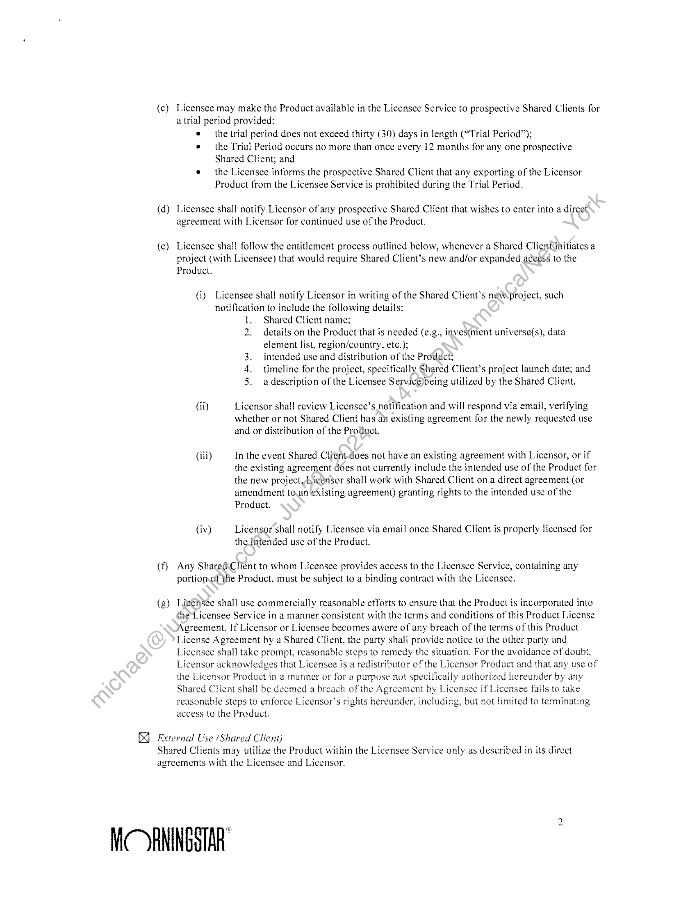
```  
```col-md
(c) Licensee may make the Product available in the Licensee Service to prospective Shared Clients for
a trial period provided:
e the trial period does not exceed thirty (30) days in length (“Trial Period”);
© the Trial Period occurs no more than once every 12 months for any one prospective
Shared Client; and
« the Licensee informs the prospective Shared Client that any exporting of the Licensor
Product from the Licensee Service is prohibited during the Trial Period.  
(d) Licensee shall notify Licensor of any prospective Shared Client that wishes to enter into a direct
agreement with Licensor for continued use of the Product.  
(e) Licensee shall follow the entitlement process outlined below, whenever a Shared Clientinitiates a
project (with Licensee) that would require Shared Client’s new and/or expanded acvess to the
Product.  
(i) Licensee shall notify Licensor in writing of the Shared Client’s new.project, such
notification to include the following details:
1. Shared Client name;
2. details on the Product that is needed (e.g., inves{ment universe(s), data
element list, region/country, etc.);
3. intended use and distribution of the Product;
4, timeline for the project, specifically Shared Client’s project launch date; and
5. adescription of the Licensee Service)being utilized by the Shared Client.  
(ii) Licensor shall review Licensee’s notification and will respond via email, verifying
whether or not Shared Client has an existing agreement for the newly requested use
and or distribution of the Product.  
(iii) In the event Shared Client-does not have an existing agreement with Licensor, or if
the existing agreement does not currently include the intended use of the Product for
the new project kicénsor shall work with Shared Client on a direct agreement (or
amendment to.an existing agreement) granting rights to the intended use of the
Product.  
(iv) Licensor shall notify Licensee via email once Shared Client is properly licensed for
the intended use of the Product.  
(f) Any Shared\Client to whom Licensee provides access to the Licensee Service, containing any
portionvof the Product, must be subject to a binding contract with the Licensee.  
(g) Livensee shall use commercially reasonable efforts to ensure that the Product is incorporated into
the*Licensee Service in a manner consistent with the terms and conditions of this Product License
Agreement. If Licensor or Licensee becomes aware of any breach of the terms of this Product
License Agreement by a Shared Client, the party shall provide notice to the other party and
Licensee shall take prompt, reasonable steps to remedy the situation. For the avoidance of doubt,
Licensor acknowledges that Licensee is a redistributor of the Licensor Product and that any use of
the Licensor Product in a manner or for a purpose not specifically autherized hereunder by any
Shared Client shall be deemed a breach of the Agreement by Licensee if Licensee fails to take
reasonabie steps to enforce Licensor’s rights hereunder, including, but not limited to terminating
access to the Product.  
& External Use (Shared Client)  
Shared Clients may utilize the Product within the Licensee Service only as described in its direct
agreements with the Licensee and Licensor.  
MORNINGSTAR  
```
````
Notes:    
````col
```col-md
flexGrow=.5
===
> [!info] [Page 4](_attachments/images_3.6.4.2.3.3Morningstar_MOD_ProductLicenseAgreement_20120901.pdf_155237/page_4.png)
> 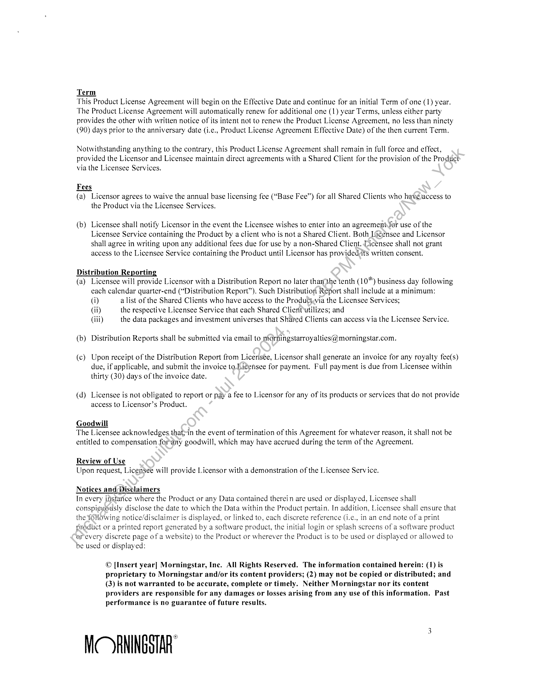
```  
```col-md
Term  
This Product License Agreement will begin on the Effective Date and continue for an initial Term of one (1) year.
The Product License Agreement will automatically renew for additional one (1) year Terms, unless either party
provides the other with written notice of its intent not to renew the Product License Agreement, no less than ninety
(90) days prior to the anniversary date (i.e., Product License Agreement Effective Date) of the then current Term.  
Notwithstanding anything to the contrary, this Product License Agreement shall remain in full force and effect,
provided the Licensor and Licensee maintain direct agreements with a Shared Client for the provision of the Prodtict
via the Licensee Services.  
Fees
(a) Licensor agrees to waive the annual base licensing fee (“Base Fee”) for all Shared Clients who have access to
the Product via the Licensee Services.  
(b) Licensee shall notify Licensor in the event the Licensee wishes to enter into an agreementJor use of the
Licensee Service containing the Product by a client who is not a Shared Client. Both Licensee and Licensor
shall agree in writing upon any additional fees due for use by a non-Shared Client. Licensee shall not grant
access to the Licensee Service containing the Product until Licensor has provideddts written consent.  
Distribution Reporting
(a) Licensee will provide Licensor with a Distribution Report no later tharthe tenth (10") business day following  
each calendar quarter-end (“Distribution Report”). Such Distribution Report shall include at a minimum:  
a) alist of the Shared Clients who have access to the Productvia the Licensee Services;  
(ii) the respective Licensee Service that each Shared Client utilizes; and  
(iii) the data packages and investment universes that Shared Clients can access via the Licensee Service.  
(b) Distribution Reports shall be submitted via email to morningstarroyalties@morningstar.com.  
(c) Upon receipt of the Distribution Report from Licensee, Licensor shall generate an invoice for any royalty fee(s)
due, if applicable, and submit the invoice to. Li¢enisee for payment. Full payment is due from Licensee within
thirty (30) days of the invoice date.  
{d) Licensee is not obligated to report or pay a fee to Licensor for any of its products or services that do not provide
access to Licensor’s Product.  
Goodwill
The Licensee acknowledges thatin the event of termination of this Agreement for whatever reason, it shall not be
entitled to compensation forany goodwill, which may have accrued during the term of the Agreement.  
Review of Use
Upon request, Licensee will provide Licensor with a demonstration of the Licensee Service.  
Notices and Disclaimers  
In every instance where the Product or any Data contained therein are used or displayed, Licensee shall!
conspicuéusly disclose the date to which the Data within the Product pertain. In addition, Licensee shall ensure that
the {ONowing notice/disclaimer is displayed, or linked to, each discrete reference (i.¢., in an end note of a print
product or a printed report generated by a software product, the initial login or splash screens of a software product
ePevery discrete page of a website) to the Product or wherever the Product is to be used or displayed or allowed to
be used or displayed:  
© [Insert year] Morningstar, Inc. All Rights Reserved. The information contained herein: (1) is
proprietary to Morningstar and/or its content providers; (2) may not be copied or distributed; and
(3) is not warranted to be accurate, complete or timely. Neither Morningstar nor its content
providers are responsible for any damages or losses arising from any use of this information. Past
performance is no guarantee of future results.  
MORNINGSTAR  
```
````
Notes:    
````col
```col-md
flexGrow=.5
===
> [!info] [Page 5](_attachments/images_3.6.4.2.3.3Morningstar_MOD_ProductLicenseAgreement_20120901.pdf_155237/page_5.png)
> 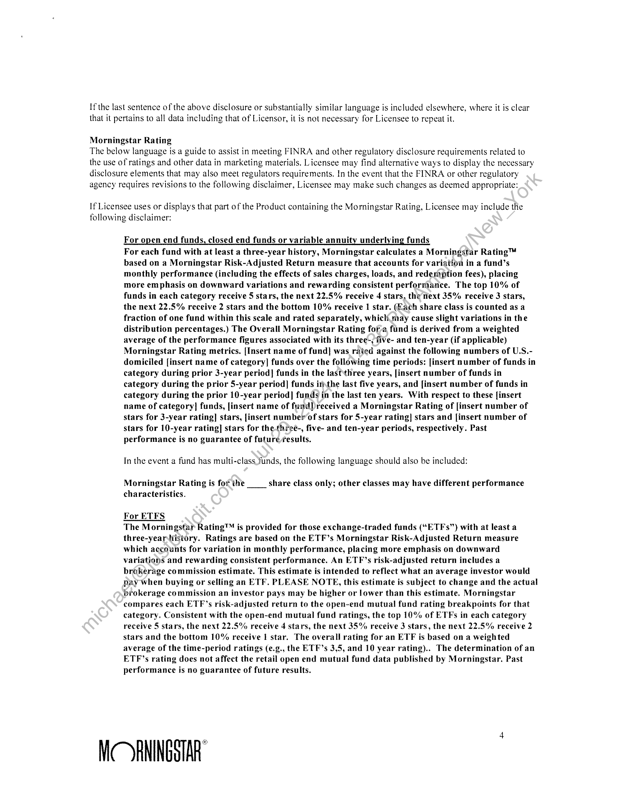
```  
```col-md
If the last sentence of the above disclosure or substantially similar language is included elsewhere, where it is clear
that it pertains to all data including that of Licensor, it is not necessary for Licensee to repeat it.  
Morningstar Rating  
The below language is a guide to assist in meeting FINRA and other regulatory disclosure requirements related to
the use of ratings and other data in marketing materials. Licensee may find alternative ways to display the necessary
disclosure elements that may also meet regulators requirements. In the event that the FINRA or other regulatory
agency requires revisions to the following disclaimer, Licensee may make such changes as deemed appropriate:  
If Licensee uses or displays that part of the Product containing the Morningstar Rating, Licensee may include the
following disclaimer:  
For open end funds, closed end funds or variable annuity underlying funds  
For each fund with at least a three-year history, Morningstar calculates a Morningstar Rating™
based on a Morningstar Risk-Adjusted Return measure that accounts for variation in a fund’s
monthly performance (including the effects of sales charges, loads, and redemption fees), placing
more emphasis on downward variations and rewarding consistent performance. The top 10% of
funds in each category receive 5 stars, the next 22.5% receive 4 stars, the next 35% receive 3 stars,
the next 22.5% receive 2 stars and the bottom 10% receive 1 star. (Each share class is counted as a
fraction of one fund within this scale and rated separately, which may cause slight variations in the
distribution percentages.) The Overall Morningstar Rating fora fund is derived from a weighted
average of the performance figures associated with its three-, five- and ten-year (if applicable)
Morningstar Rating metrics. [Insert name of fund] was rated against the following numbers of U.S.domiciled [insert name of category] funds over the following time periods: [insert number of funds in
category during prior 3-year period] funds in the lastthree years, [insert number of funds in
category during the prior 5-year period] funds irnthe last five years, and [insert number of funds in
category during the prior 10-year period] funds in the last ten years. With respect to these [insert
name of category] funds, [insert name of fund) received a Morningstar Rating of [insert number of
stars for 3-year rating] stars, [insert number of stars for 5-year rating] stars and [insert number of
stars for 10-year rating] stars for the-three-, five- and ten-year periods, respectively. Past
performance is no guarantee of future results.  
In the event a fund has multi-class funds, the following language should also be included:  
Morningstar Rating is for the share class only; other classes may have different performance
characteristics.  
For ETFS  
The Morningstar Rating™ is provided for those exchange-traded funds (“ETFs”) with at least a
three-yearntiistory. Ratings are based on the ETF’s Morningstar Risk-Adjusted Return measure
which accounts for variation in monthly performance, placing more emphasis on downward
variations and rewarding consistent performance. An ETF’s risk-adjusted return includes a
brokerage commission estimate. This estimate is intended to reflect what an average investor would
pay when buying or selling an ETF. PLEASE NOTE, this estimate is subject to change and the actual
brokerage commission an investor pays may be higher or lower than this estimate. Morningstar
compares each ETF’s risk-adjusted return to the open-end mutual fund rating breakpoints for that
category. Consistent with the open-end mutual fund ratings, the top 10% of ETFs in each category
receive 5 stars, the next 22.5% receive 4 stars, the next 35% receive 3 stars, the next 22.5% receive 2
stars and the bottom 10% receive I star. The overall rating for an ETF is based on a weighted
average of the time-period ratings (e.g., the ETF’s 3,5, and 10 year rating).  
 The determination of an
ETF’s rating does not affect the retail open end mutual fund data published by Morningstar. Past
performance is no guarantee of future results.  
MORNINGSTAR  
```
````
Notes:    
````col
```col-md
flexGrow=.5
===
> [!info] [Page 6](_attachments/images_3.6.4.2.3.3Morningstar_MOD_ProductLicenseAgreement_20120901.pdf_155237/page_6.png)
> 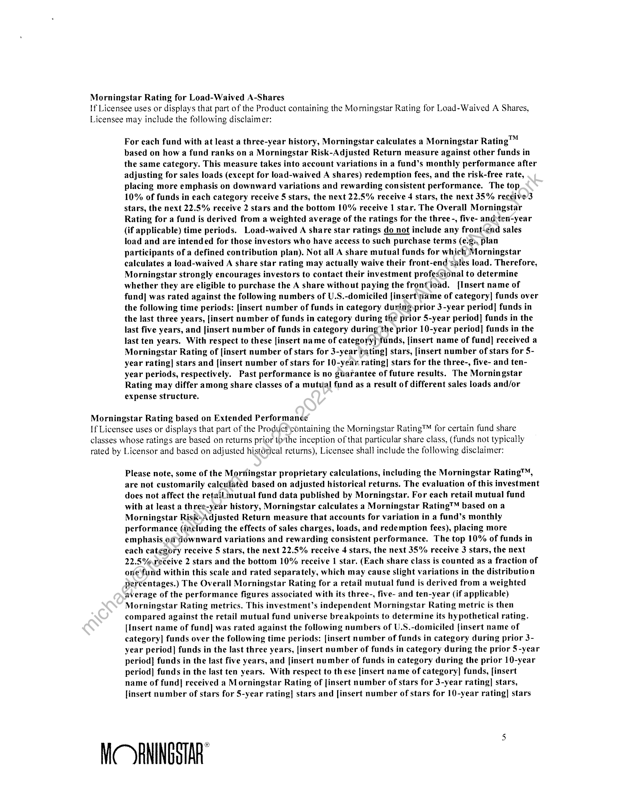
```  
```col-md
Morningstar Rating for Load-Waived A-Shares
If Licensee uses or displays that part of the Product containing the Morningstar Rating for Load-Waived A Shares,
Licensee may include the following disclaimer:  
For each fund with at least a three-year history, Morningstar calculates a Morningstar Rating™
based on how a fund ranks on a Morningstar Risk-Adjusted Return measure against other funds in
the same category. This measure takes into account variations in a fund’s monthly performance after
adjusting for sales loads (except for load-waived A shares) redemption fees, and the risk-free rate,
placing more emphasis on downward variations and rewarding consistent performance. The top
10% of funds in each category receive 5 stars, the next 22.5% receive 4 stars, the next 35% receive 3
stars, the next 22.5% receive 2 stars and the bottom 10% receive 1 star. The Overall Morningstar
Rating for a fund is derived from a weighted average of the ratings for the three -, five- and\ten-year
(if applicable) time periods. Load-waived A share star ratings do not include any front-end sales
load and are intended for those investors who have access to such purchase terms (e.g:, plan
participants of a defined contribution plan). Not all A share mutual funds for which Morningstar
calculates a load-waived A share star rating may actually waive their front-end sales load. Therefore,
Morningstar strongly encourages investors to contact their investment professional to determine
whether they are eligible to purchase the A share without paying the frontioad. {Insert name of
fund| was rated against the following numbers of U.S.-domiciled {insert ame of category] funds over
the following time periods: [insert number of funds in category during prior 3-year period] funds in
the last three years, {insert number of funds in category during the prior 5-year period] funds in the
last five years, and [insert number of funds in category during the prior 10-year period] funds in the
last ten years, With respect to these [insert name of category}jfunds, [insert name of fund] received a
Morningstar Rating of [insert number of stars for 3-year rating] stars, [insert number of stars for 5year rating] stars and {insert number of stars for 10-year rating] stars for the three-, five- and tenyear periods, respectively. Past performance is no guarantee of future results. The Morningstar
Rating may differ among share classes of a mutual fund as a result of different sales loads and/or
expense structure.  
Morningstar Rating based on Extended Performance  
If Licensee uses or displays that part of the Produc?\containing the Morningstar Rating™ for certain fund share
classes whose ratings are based on returns prior to’the inception of that particular share class, (funds not typically
rated by Licensor and based on adjusted histOrical returns), Licensee shall include the following disclaimer:  
Please note, some of the Morningstar proprietary calculations, including the Morningstar Rating™,
are not customarily caleulatéd based on adjusted historical returns. The evaluation of this investment
does not affect the retail mutual fund data published by Morningstar. For each retail mutual fund
with at least a three-year history, Morningstar calculates a Morningstar Rating™ based on a
Morningstar Risk-Adjusted Return measure that accounts for variation in a fund’s monthly
performance (including the effects of sales charges, loads, and redemption fees), placing more
emphasis oj downward variations and rewarding consistent performance. The top 10% of funds in
each category receive 5 stars, the next 22.5% receive 4 stars, the next 35% receive 3 stars, the next
22.5Ysreceive 2 stars and the bottom 10% receive 1 star. (Each share class is counted as a fraction of
one fund within this scale and rated separately, which may cause slight variations in the distribution
percentages.) The Overall Morningstar Rating for a retail mutual fund is derived from a weighted
average of the performance figures associated with its three-, five- and ten-year (if applicable)
Morningstar Rating metrics. This investment’s independent Morningstar Rating metric is then
compared against the retail mutual fund universe breakpoints to determine its hypothetical rating.
[Insert name of fund] was rated against the folowing numbers of U.S.-domiciled [insert name of
category] funds over the following time periods: [insert number of funds in category during prior 3year period] funds in the last three years, [insert number of funds in category during the prior 5-year
period] funds in the last five years, and [insert number of funds in category during the prior 10-year
period] funds in the last ten years. With respect to these {insert name of category] funds, {insert
name of fund] received a Morningstar Rating of [insert number of stars for 3-year rating] stars,
[insert number of stars for 5-year rating] stars and [insert number of stars for 10-year rating] stars  
MORNINGSTAR”  
```
````
Notes:    
````col
```col-md
flexGrow=.5
===
> [!info] [Page 7](_attachments/images_3.6.4.2.3.3Morningstar_MOD_ProductLicenseAgreement_20120901.pdf_155237/page_7.png)
> 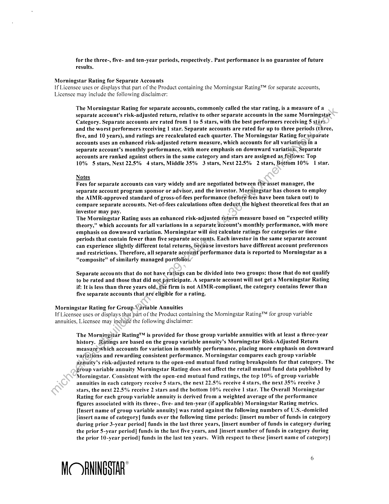
```  
```col-md
for the three-, five- and ten-year periods, respectively. Past performance is no guarantee of future
results.  
Morningstar Rating for Separate Accounts
If Licensee uses or displays that part of the Product containing the Morningstar Rating™ for separate accounts,
Licensee may include the following disclaimer:  
The Morningstar Rating for separate accounts, commonly called the star rating, is a measure of a
separate account's risk-adjusted return, relative to other separate accounts in the same Morningstar
Category. Separate accounts are rated from | to 5 stars, with the best performers receiving 5 stars
and the worst performers receiving 1 star. Separate accounts are rated for up to three periods (three,
five, and 10 years), and ratings are recalculated each quarter. The Morningstar Rating for separate
accounts uses an enhanced risk-adjusted return measure, which accounts for all variations in a
separate account’s monthly performance, with more emphasis on downward variation, Separate
accounts are ranked against others in the same category and stars are assigned as fellows: Top  
10% Sstars, Next 22.5% 4 stars, Middle 35% 3 stars, Next 22.5% 2 stars, Bottom 10% 1 star.  
Notes  
Fees for separate accounts can vary widely and are negotiated between the-asset manager, the
separate account program sponsor or advisor, and the investor. Morningstar has chosen to employ
the AIMR-approved standard of gross-of-fees performance (before fees have been taken out) to
compare separate accounts. Net-of-fees calculations often deduct the highest theoretical fees that an
investor may pay.  
The Morningstar Rating uses an enhanced risk-adjusted return measure based on "expected utility
theory," which accounts for all variations in a separate account’s monthly performance, with more
emphasis on downward variation. Morningstar will mot calculate ratings for categories or time
periods that contain fewer than five separate accounts, Each investor in the same separate account
can experience slightly different total returns, because investors have different account preferences
and restrictions. Therefore, all separate account performance data is reported to Morningstar as a
"composite" of similarly managed portfolios:  
Separate accounts that do not have ratings can be divided into two groups: those that do not qualify
to be rated and those that did not participate. A separate account will not get a Morningstar Rating
if: It is less than three years old, the firm is not AIMR-compliant, the category contains fewer than
five separate accounts that are eligible for a rating.  
Morningstar Rating for Group-Variable Annuities
If Licensee uses or displays that part of the Product containing the Morningstar Rating™ for group variable
annuities, Licensee may inghude the following disclaimer:  
The Morningstar Rating™ is provided for those group variable annuities with at least a three-year
history. Ratings are based on the group variable annuity’s Morningstar Risk-Adjusted Return
measure Which accounts for variation in monthly performance, placing more emphasis on downward
variations and rewarding consistent performance. Morningstar compares each group variable
abnuity’s risk-adjusted return te the open-end mutual fund rating breakpoints for that category. The
group variable annuity Morningstar Rating does not affect the retail mutual fund data published by
Morningstar. Consistent with the open-end mutual fund ratings, the top 10% of group variable
annuities in each category receive 5 stars, the next 22.5% receive 4 stars, the next 35% receive 3
stars, the next 22.5% receive 2 stars and the bottom 10% receive 1 star. The Overall Morningstar
Rating for each group variable annuity is derived from a weighted average of the performance
figures associated with its three-, five- and ten-year (if applicable) Morningstar Rating metrics.
{Insert name of group variable annuity| was rated against the following numbers of U.S.-domiciled
[insert name of category] funds over the following time periods: [insert number of funds in category
during prior 3-year period] funds in the last three years, [insert number of funds in category during
the prior 5-year period] funds in the last five years, and [insert number of funds in category during
the prior 10-year period] funds in the last ten years. With respect to these {insert name of category]  
MORNINGSTAR”  
```
````
Notes:    
````col
```col-md
flexGrow=.5
===
> [!info] [Page 8](_attachments/images_3.6.4.2.3.3Morningstar_MOD_ProductLicenseAgreement_20120901.pdf_155237/page_8.png)
> 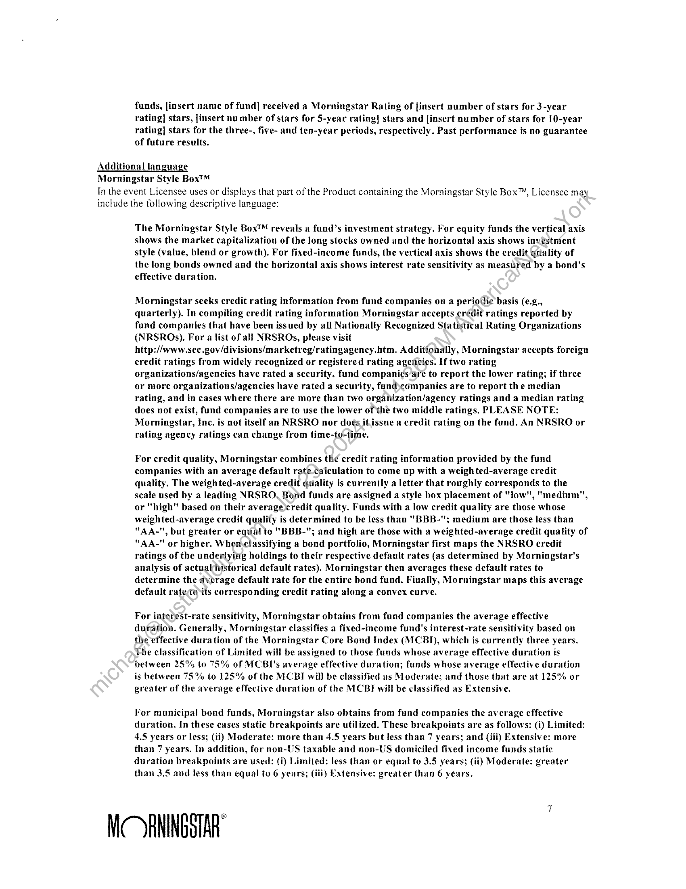
```  
```col-md
funds, {insert name of fund] received a Morningstar Rating of [insert number of stars for 3-year
rating] stars, [insert number of stars for 5-year rating] stars and [insert number of stars for 10-year
rating] stars for the three-, five- and ten-year periods, respectively. Past performance is no guarantee
of future results.  
Additional language  
Morningstar Style Box™  
In the event Licensee uses or displays that part of the Product containing the Morningstar Style Box™, Licensee may
include the following descriptive language:  
The Morningstar Style Box™ reveals a fund’s investment strategy. For equity funds the vertical axis
shows the market capitalization of the long stocks owned and the horizontal axis shows investment
style (value, blend or growth). For fixed-income funds, the vertical axis shows the credit quality of
the long bonds owned and the horizontal axis shows interest rate sensitivity as measured by a bond’s
effective duration.  
Morningstar seeks credit rating information from fund companies on a periodic basis (e.g.,
quarterly). In compiling credit rating information Morningstar accepts crédit ratings reported by
fund companies that have been issued by all Nationally Recognized Statistical Rating Organizations
(NRSROs). For a list of all NRSROs, please visit
http://www.sec.gov/divisions/marketreg/ratingagency.htm. Additionally, Morningstar accepts foreign
credit ratings from widely recognized or registered rating agencies. If two rating
organizations/agencies have rated a security, fund companies are to report the lower rating; if three
or more organizations/agencies have rated a security, fund)companies are to report the median
rating, and in cases where there are more than two organization/agency ratings and a median rating
does not exist, fund companies are to use the lower of the two middle ratings. PLEASE NOTE:
Morningstar, Inc. is not itself an NRSRO nor doés it.issue a credit rating on the fund. An NRSRO or
rating agency ratings can change from time-to-time.  
For credit quality, Morningstar combines the credit rating information provided by the fund
companies with an average default rate caiculation to come up with a weighted-average credit
quality. The weighted-average credit quality is currently a letter that roughly corresponds to the
scale used by a leading NRSRO, Bond funds are assigned a style box placement of "low", "medium",
or "high" based on their average \credit quality. Funds with a low credit quality are those whose
weighted-average credit quality is determined to be less than "BBB-"; medium are those less than
"AA-", but greater or equal to "BBB-"; and high are those with a weighted-average credit quality of
"AA-" or higher. Whenclassifying a bond portfolio, Morningstar first maps the NRSRO credit
ratings of the underlying holdings to their respective default rates (as determined by Morningstar's
analysis of actual historical default rates). Morningstar then averages these default rates to
determine the average default rate for the entire bond fund. Finally, Morningstar maps this average
default rate(to‘its corresponding credit rating along a convex curve.  
For interest-rate sensitivity, Morningstar obtains from fund companies the average effective
duration. Generally, Morningstar classifies a fixed-income fund's interest-rate sensitivity based on
the effective duration of the Morningstar Core Bond Index (MCBJ), which is currently three years.
‘Fhe classification of Limited will be assigned to those funds whose average effective duration is
between 25% to 75% of MCBI's average effective duration; funds whose average effective duration
is between 75% to 125% of the MCBI will be classified as Moderate; and those that are at 125% or
greater of the average effective duration of the MCBI will be classified as Extensive.  
For municipal bond funds, Morningstar also obtains from fund companies the average effective
duration. In these cases static breakpoints are utilized. These breakpoints are as follows: (i) Limited:
4.5 years or less; (ii) Moderate: more than 4.5 years but less than 7 years; and (iii) Extensive: more
than 7 years. In addition, for non-US taxable and non-US domiciled fixed income funds static
duration breakpoints are used: (i) Limited: less than or equal te 3.5 years; (ii) Moderate: greater
than 3,5 and less than equal to 6 years; (iii) Extensive: greater than 6 years.  
MCRNINGSTAR®  
```
````
Notes:    
````col
```col-md
flexGrow=.5
===
> [!info] [Page 9](_attachments/images_3.6.4.2.3.3Morningstar_MOD_ProductLicenseAgreement_20120901.pdf_155237/page_9.png)
> 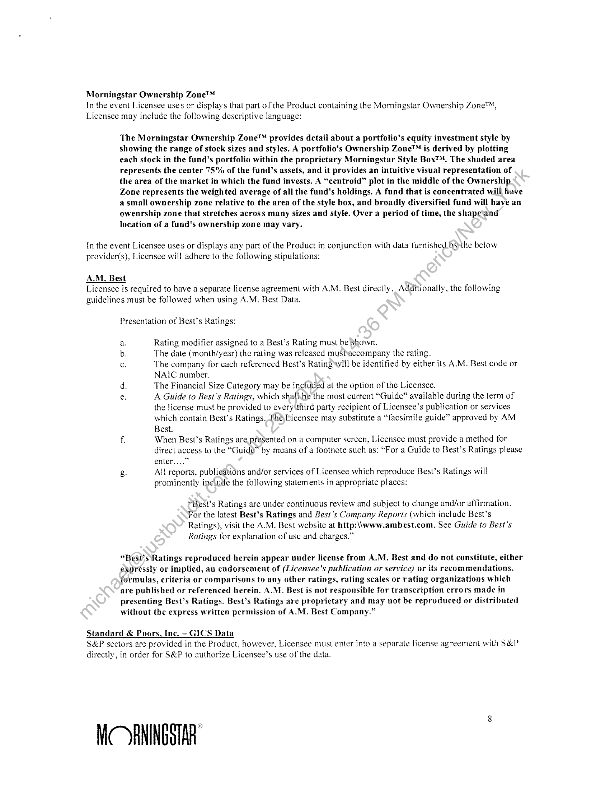
```  
```col-md
Morningstar Ownership Zone™
In the event Licensee uses or displays that part of the Product containing the Morningstar Ownership Zone™,
Licensee may include the following descriptive language:  
The Morningstar Ownership Zone™ provides detail about a portfolio’s equity investment style by
showing the range of stock sizes and styles. A portfolio's Ownership Zone™ is derived by plotting
each stock in the fund's portfolio within the proprietary Morningstar Style Box™. The shaded area
represents the center 75% of the fund’s assets, and it provides an intuitive visual representation of
the area of the market in which the fund invests. A “centroid” plot in the middle of the Ownership.
Zone represents the weighted average of all the fund's holdings. A fund that is concentrated will have
a small ownership zone relative to the area of the style box, and broadly diversified fund will have an
owenrship zone that stretches across many sizes and style. Over a period of time, the shape\and
location of a fund's ownership zone may vary.  
In the event Licensee uses or displays any part of the Product in conjunction with data furnished.by-the below
provider(s), Licensee will adhere to the following stipulations:  
A.M. Best
Licensee is required to have a separate license agreement with A.M. Best directly. Additionally, the following
guidelines must be followed when using A.M. Best Data.  
Presentation of Best’s Ratings:  
a. Rating modifier assigned to a Best’s Rating must be Shown.The date (month/year) the rating was released mustaccompany the rating.
c. The company for each referenced Best’s Rating will be identified by either its A.M. Best code or
NAIC number.
d. The Financial Size Category may be included at the option of the Licensee.
e. A Guide to Best's Ratings, which shallbe'the most current “Guide” available during the term of  
the license must be provided to every third party recipient of Licensee’s publication or services
which contain Best’s Ratings. Thébicensee may substitute a “facsimile guide” approved by AM  
Best.  
f. When Best’s Ratings are presented on a computer screen, Licensee must provide a method for
direct access to the “Guide” by means of a footnote such as: “For a Guide to Best’s Ratings please
enter.  ”  
g. All reports, publicatidns and/or services of Licensee which reproduce Best’s Ratings will  
prominently include the following statements in appropriate places:  
“Best’s Ratings are under continuous review and subject to change and/or affirmation.
For the latest Best’s Ratings and Best's Company Reports (which include Best’s
Ratings), visit the A.M. Best website at http:\\www.ambest.com, See Guide to Best's
Ratings for explanation of use and charges.”  
“Best's Ratings reproduced herein appear under license from A.M. Best and do not constitute, either
expressly or implied, an endorsement of (Licensee's publication or service) or its recommendations,
formulas, criteria or comparisons to any other ratings, rating scales or rating organizations which
are published or referenced herein. A.M. Best is not responsible for transcription errors made in
presenting Best’s Ratings. Best’s Ratings are proprietary and may not be reproduced or distributed
without the express written permission of A.M. Best Company.”  
Standard & Poors, Inc. — GICS Data  
S&P sectors are provided in the Product, however, Licensee must enter into a separate license agreement with S&P
directly, in order for S&P to authorize Licensee’s use of the data.  
MCRNINGSTAR®  
```
````
Notes:    
````col
```col-md
flexGrow=.5
===
> [!info] [Page 10](_attachments/images_3.6.4.2.3.3Morningstar_MOD_ProductLicenseAgreement_20120901.pdf_155237/page_10.png)
> 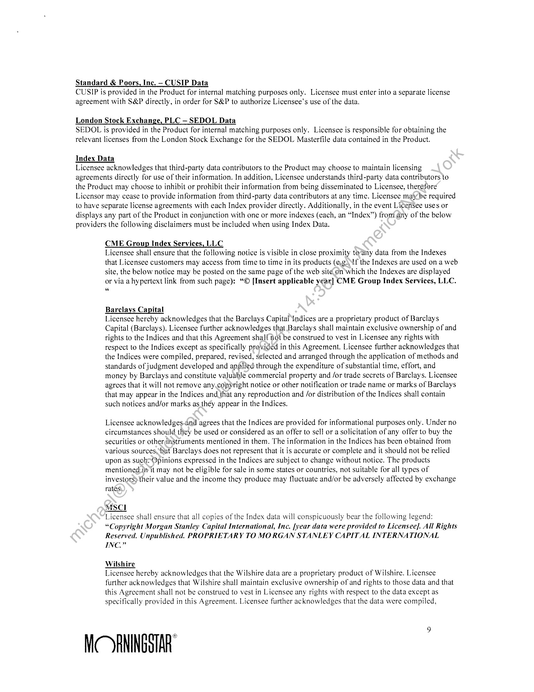
```  
```col-md
Standard & Poors, Inc. - CUSIP Data
CUSIP is provided in the Product for internal matching purposes only. Licensee must enter into a separate license
agreement with S&P directly, in order for S&P to authorize Licensee’s use of the data.  
London Stock Exchange, PLC — SEDOL Data
SEDOL is provided in the Product for internal matching purposes only. Licensee is responsible for obtaining the  
relevant licenses from the London Stock Exchange for the SEDOL Masterfile data contained in the Product.  
Index Data  
Licensee acknowledges that third-party data contributors to the Product may choose to maintain licensing
agreements directly for use of their information. In addition, Licensee understands third-party data contributors to
the Product may choose to inhibit or prohibit their information from being disseminated to Licensee, therefore
Licensor may cease to provide information from third-party data contributors at any time. Licensee may be required
to have separate license agreements with each Index provider directly. Additionally, in the event Licensee uses or
displays any part of the Product in conjunction with one or more indexes (each, an “Index”) from any of the below
providers the following disclaimers must be included when using Index Data.  
CME Group Index Services, LLC
Licensee shall ensure that the following notice is visible in close proximity te’any data from the Indexes  
that Licensee customers may access from time to time in its products (e.g. Nf the Indexes are used on a web
site, the below notice may be posted on the same page of the web sité on which the Indexes are displayed
or via a hypertext link from such page): “© [Insert applicable year] CME Group Index Services, LLC.  
“  
Barclays Capital
Licensee hereby acknowledges that the Barclays Capital Indices are a proprietary product of Barclays  
Capital (Barclays). Licensee further acknowledges that Barclays shall maintain exclusive ownership of and
rights to the Indices and that this Agreement shall Bot be construed to vest in Licensee any rights with
respect to the Indices except as specifically provided in this Agreement. Licensee further acknowledges that
the Indices were compiled, prepared, revised, selected and arranged through the application of methods and
standards of judgment developed and applied through the expenditure of substantial time, effort, and
money by Barclays and constitute valuable commercial property and /or trade secrets of Barclays. Licensee
agrees that it will not remove any.copyright notice or other notification or trade name or marks of Barclays
that may appear in the Indices and that any reproduction and /or distribution of the Indices shall contain
such notices and/or marks as théy appear in the Indices.  
Licensee acknowledges-and agrees that the Indices are provided for informational purposes only. Under no
circumstances should they be used or considered as an offer to sell or a solicitation of any offer to buy the
securities or otherdnstruments mentioned in them. The information in the Indices has been obtained from
various sources, but Barclays does not represent that it is accurate or complete and it should not be relied
upon as such>@pinions expressed in the Indices are subject to change without notice. The products
mentioned iy it may not be eligible for sale in some states or countries, not suitable for all types of
investors) their value and the income they produce may fluctuate and/or be adversely affected by exchange
rates,  
MSCI  
Licensee shall ensure that all copies of the Index data will conspicuously bear the following legend:
“Copyright Morgan Stanley Capital International, Inc. {year data were provided to Licensee}. All Rights
Reserved. Unpublished. PROPRIETARY TO MORGAN STANLEY CAPITAL INTERNATIONAL
INC.”  
Wilshire  
Licensee hereby acknowledges that the Wilshire data are a proprietary product of Wilshire. Licensee
further acknowledges that Wilshire shall maintain exclusive ownership of and rights to those data and that
this Agreement shall not be construed to vest in Licensee any rights with respect to the data except as
specifically provided in this Agreement. Licensee further acknowledges that the data were compiled,  
MORNINGSTAR  
```
````
Notes:    
````col
```col-md
flexGrow=.5
===
> [!info] [Page 11](_attachments/images_3.6.4.2.3.3Morningstar_MOD_ProductLicenseAgreement_20120901.pdf_155237/page_11.png)
> 
```  
```col-md
prepared, revised, selected and arranged through the application of methods and standards of judgment
developed and applied through the expenditure of substantial time and effort, and money by Wilshire and
constitute valuable commercial property and/or trade secrets of Wilshire. Licensee agrees that it will not
remove any copyright notice or other notification or trade name or marks of Wilshire that may appear in the
data and that any reproduction and/or distribution of the data shall contain such notices and/or marks as
they appear in the data.  
Licensee acknowledges and agrees that the data are provided for informational purposes only. Under no
circumstances should it be used or considered as an offer to sell or a solicitation of any offer to buy the
securities or other instruments mentioned in it. The information in the data has been obtained from various
sources, but Wilshire does not represent that it is accurate or complete and it should not be relied upon’as
such. Opinions expressed in the data are subject to change without notice. The products mentioned in it
may not be eligible for sale in some states or countries, nor suitable for all types of investors; their value
and the income they produce may fluctuate and/or be adversely affected by exchange rates,  
Support
Licensor will assign a Client Manager to provide Licensee with support as needed, MondayAhrough Friday,  
excluding nationally recognized and market holidays.  
Licensor Marks  
Morningstar® (for both print and web-based materials)
Morningstar Style Box™  
Morningstar Rating™  
Direct Competitors
Listed below are the Direct Competitors, per Section I(d)(iv) of the Master License Agreement:  
Financial Engines Advisors, LLC  
Thomson Reuters and its subsidiaries  
Standard and Poor's, a division of The McGraw-Hill Caimpanies, Inc.
Value Line, Inc.  
Hedge Fund Research  
Hedgefund.net/Channel Capital Group  
Barclay Hedge  
Hedge Fund Intelligence
Bloomberg,  
CASA/CISDM  
Credit Suisse/Tremont
Cogent Hedge  
EurekaHedge  
HedgeCo.net  
Hedge Fund Directoriesnet
Informa Investment Solutions
Interactive Data.Corporation
Dow Jones €\Company and its affiliates  
eVestmentAtiance
The parties have each signed, or caused their authorized representatives to sign, this binding Product License  
Agreement on the date first set forth above.  
Licensor: Licensee:  
Morpirgsta In Markit ‘Int ey,
By: VW By: AV,
uUkR  
Name: Name: Catherivg Alea
vide Dereotmes of Fouenre rie Clubel Head - Mwlat im Dow wl  
MORNINGSTAR’ .  
```
````
Notes:    
````col
```col-md
flexGrow=.5
===
> [!info] [Page 12](_attachments/images_3.6.4.2.3.3Morningstar_MOD_ProductLicenseAgreement_20120901.pdf_155237/page_12.png)
> 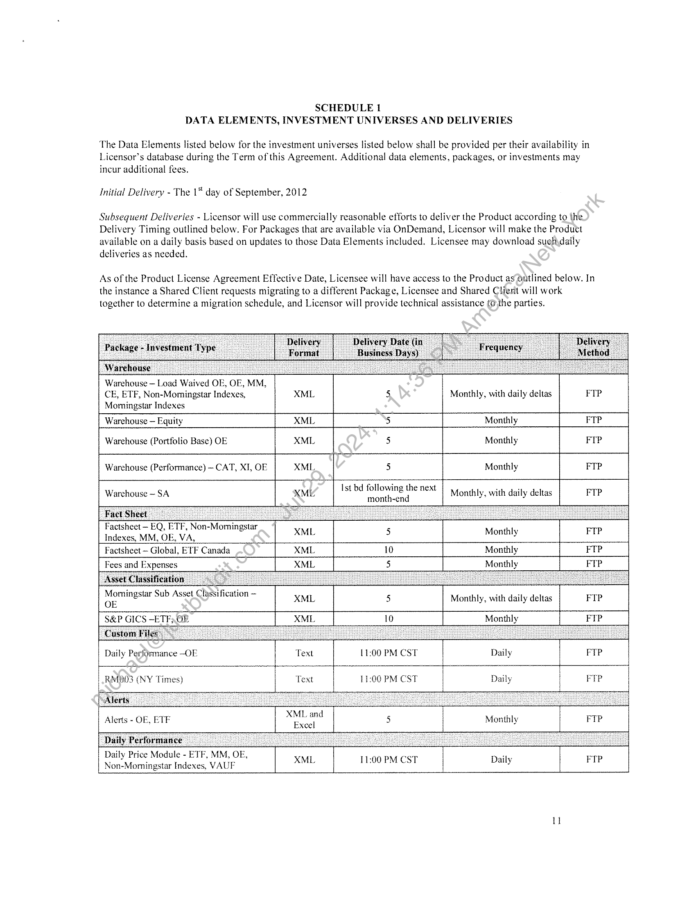
```  
```col-md
SCHEDULE 1
DATA ELEMENTS, INVESTMENT UNIVERSES AND DELIVERIES  
The Data Elements listed below for the investment universes listed below shall be provided per their availability in
Licensor’s database during the Term of this Agreement. Additional data elements, packages, or investments may
incur additional fees.  
Initial Delivery - The 1* day of September, 2012  
Subsequent Deliveries - Licensor will use commercially reasonable efforts to deliver the Product according to the
Delivery Timing outlined below. For Packages that are available via OnDemand, Licensor will make the Product
available on a daily basis based on updates to those Data Elements included. Licensee may download suehdaily
deliveries as needed.  
As of the Product License Agreement Effective Date, Licensee will have access to the Product as outlined below. In
the instance a Shared Client requests migrating to a different Package, Licensee and Shared Client will work
together to determine a migration schedule, and Licensor will provide technical assistance {@,the parties.  
Warehouse — Load Waived OE, OE, MM,  
CE, ETF, Non-Morningstar Indexes, XML 5 Monthly, with daily deitas FTP
Morningstar Indexes  
Warehouse — Equity XML 5 Monthly FTP
Warehouse (Portfolio Base) OE XML il 5 Monthly FIP
Warehouse (Performance) — CAT, XI, OE XML 5 Monthly FTP  
Ist bd following the next
month-end  
Warehouse ~ SA XME Monthly, with daily deltas FTP  
Factsheet — EQ, ETF, Non-Morningstar  
Indexes, MM, OE, VA, XML 5 Monthly FIP
Factsheet — Global, ETF Canada XML 10 Monthly FTP
Fees and Expenses XML 5 Monthly FIP  
ssific:
pommesar Sub Asset © XML 5 Monthly, with daily deltas FIP
S&P GICS -ETF. OR XML 10 Monthly FTP
Daily Performance ~-OE Text 11:00 PM CST Daily FTP
RM003 (NY Times) Text 11:00 PM CST Daily FTP  
Daily Price Module - ETF, MM, OE,  
Non-Morningstar Indexes, VAUF XML 11:00 PM CST Daily FTP  
ll  
```
````
Notes:    
````col
```col-md
flexGrow=.5
===
> [!info] [Page 13](_attachments/images_3.6.4.2.3.3Morningstar_MOD_ProductLicenseAgreement_20120901.pdf_155237/page_13.png)
> 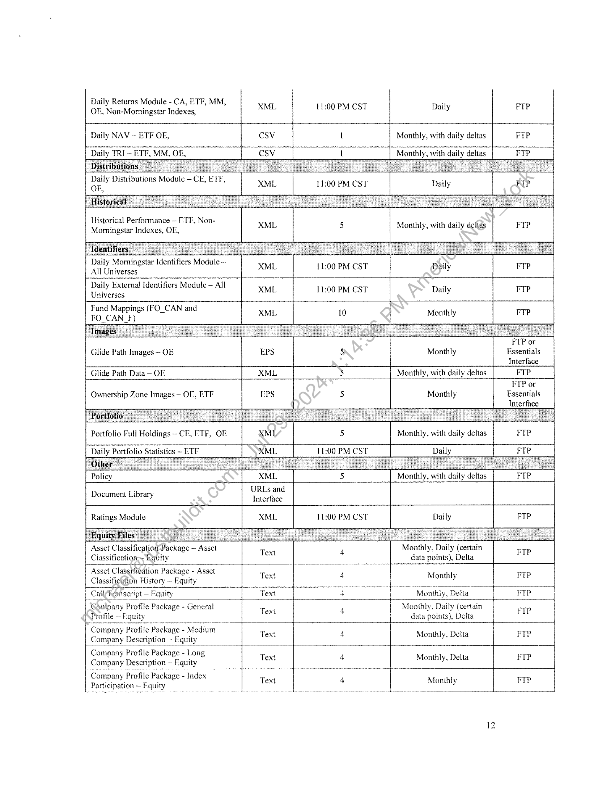
```  
```col-md
Daily Returns Module - CA, ETF, MM,  
OE, Non-Morningstar Indexes, XML 11:00 PM CST Daily FTP
Daily NAV ~ ETF OE, CSV if Monthly, with daily deltas FTP
Daily TRI~ ETF, MM, OF, CSV Li Monthly, with daily deltas FIP  
Daily Distributions Module — CE, ETF,
OE,  
XML  
11:00 PM CST  
Daily  
FTP  
Historical Performance ~ ETF, NonMorningstar Indexes, OE,  
XML  
Monthly, with daily deltas  
FIP  
Daily Morningstar Identifiers Module ~  
FO_CAN_F)  
All Universes XML 11:00 PM CST Daily FIP
Daily External Identifiers Module — All XML 11:00 PM CST Daily FTP
Universes  
Fund Mappings (FO_CAN and XML 10 Monthly FTP  
Glide Path Images ~ OE  
EPS  
Monthly  
FTP or
Essentials
Interface  
Glide Path Data - OE  
XML  
Monthly, with daily deltas |  
FTP  
Ownership Zone Images ~ OE, ETF  
EPS  
Monthly  
FTP or
Essentials
Interface  
Portfolio Full Holdings ~ CE, ETF, OE  
XML  
Monthly, with daily deltas  
FTP  
ics ~ ETF  
Daily Portfolio Stati:  
XML  
Daily  
FTP  
Policy XML B) Monthly, with daily deltas FTP
Document Library URES and
Ratings Module XML Daily FTP  
Asset Classification Package ~ Asset  
Monthly, Daily (certain  
Participation — Equity  
Classification— Pguity Text 4 data points), Delta FIP
Asset Classification Package - Asset .  
Classification History — Equity Text 4 | Monthly PIP
Cali(Transcript ~ Equity Text 4 Monthly, Delta FTP
Gonipariy Profile Package - General Text 4 Monthly, Daily (certain FTP
Profile ~ Equity data points), Delta  
: - an
Company Profile Package - Medium Text 4 Monthly, Delta FTP
Company Description — Equity
Company Profile Package - Long Text 4 Monthly, Delta FTP
Company Description ~ Equity
Company Profile Package - Index Text 4 Monthly FTP  
```
````
Notes:    
````col
```col-md
flexGrow=.5
===
> [!info] [Page 14](_attachments/images_3.6.4.2.3.3Morningstar_MOD_ProductLicenseAgreement_20120901.pdf_155237/page_14.png)
> 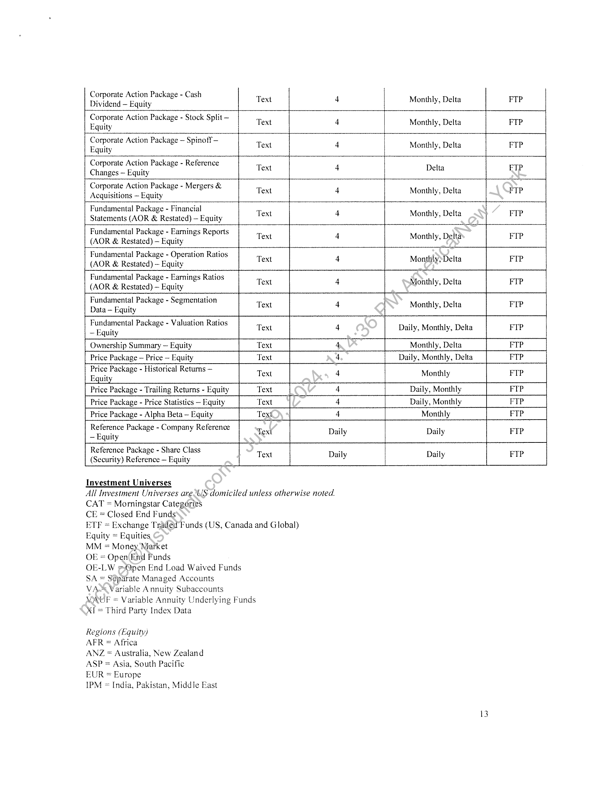
```  
```col-md
Corporate Action Package - Cash  
(Security) Reference — Equity  
Dividend - Equity Text 4 Monthly, Delta FTP
Corporate Action Package - Stock Split — Text 4 Monthly, Delta FTP
Equity id  
Corporate Action Package ~ Spinoff— .  
Equity Text 4 Monthly, Delta FTP
Corporate Action Package - Reference Text 4 Delta ETP
Changes — Equity  
Corporate Action Package - Mergers & Text 4 Monthly. Delta rTP
Acquisitions — Equity a  
Fundamental Package - Financial  
Statements (AOR & Restated) — Equity Text 4 Monthly, Delta FIP
Fundamental Package - Earnings Reports  
(AOR & Restated) ~ Equity Text 4 Monthly, Delta FIP
Fundamental Package - Operation Ratios  
(AOR & Restated) ~ Equity Text 4 Monthily)Delta FIP
Fundamental Package - Earnings Ratios  
(AOR & Restated) ~ Equity Text 4 Monthly, Delta FIP
Fundamental Package - Segmentation Text 4 Monthly, Delta FIP
Data ~ Equity ys  
Fundamental Package - Valuation Ratios Text 4 Daily, Monthly, Delta FTP
~ Equity ° ys Ys  
Ownership Summary ~ Equity Text 4 Monthly, Delta FTP
Price Package ~ Price — Equity Text 4 Daily, Monthly, Delta FTP
Price Package - Historical Returns — Text 4 Month! FTP
Equity y  
Price Package - Trailing Returns - Equity Text 4 Daily, Monthly FTP
Price Package - Price Statistics ~ Equity Text 4 Daily, Monthly FIP
Price Package - Alpha Beta - Equity Text 4 Monthly FTP
Reference Package - Company Reference Text Dail Daily FIP
— Equity y  
Reference Package - Share Class Text Daily Daily FTP  
Investment Universes  
All Investment Universes arecUS domiciled unless otherwise noted.  
CAT = Morningstar Categéries
CE = Closed End Funds  
ETF = Exchange Traded Funds (US, Canada and Global)  
Equity = Equities
MM = Money Market
OE = Open(End Funds  
OE-LW =OQpen End Load Waived Funds  
SA = Separate Managed Accounts
VAS Variable Annuity Subaccounts  
VAUF = Variable Annuity Underlying Funds  
XI = Third Party Index Data  
Regions (Equity)  
AFR = Africa  
ANZ = Australia, New Zealand
ASP = Asia, South Pacific  
EUR = Europe  
IPM = India, Pakistan, Middle East  
```
````
Notes:    
````col
```col-md
flexGrow=.5
===
> [!info] [Page 15](_attachments/images_3.6.4.2.3.3Morningstar_MOD_ProductLicenseAgreement_20120901.pdf_155237/page_15.png)
> 
```  
```col-md
LTA = Latin America
NRA = North America
UKI = United Kingdom, Ireland  
Data Elements  
See Consent Form for detailed list of Data Elements that may be utilized by Licensee, on behalf of Shared Client.  
Data Warehouse (Third Party Index)
SECID  
Index Name  
Inception Date  
Total Return 1-, 3-,6-Mth, YTD, 1-, 3-, 5-, 10, 15-  
Yr, SI  
Calendar Year (10 Years) Return
Standard Deviation 3-, 5-, 10-Yr
Sharpe Ratio 3-, 5-. 10-Yr Year
Portfolio Date  
Total Number of Stocks  
Total Number of Bonds  
Total Number of Holdings
%Cash  
%US Stocks  
%Non-US Stocks  
%US Bonds  
%Non-US Bonds  
%Other  
“Preferred  
%Convertible  
Equity Style Box  
%Equity Large Value  
%Equity Large Blend  
%Equity Large Growth
%Equity Mid Value  
%Equity Mid Blend  
%Equity Mid Growth  
%Equity Small Value  
%Equity Small Blend  
%Equity Small Growth
%Giant  
Large  
%Medium  
%Small  
%Micro  
P/E Ratio  
P/B Ratio  
P/S Ratio  
P/C Ratio  
Services Economy %
Manufacturing Economy %
Software%  
Hardware%  
Media%  
Telecommunications
Healthcare’  
Consurfier Services%
Busifiess Services%  
Financial Services%
Consumer Goods%  
Industrial Materials%
Energy%  
Utilities%  
Super Region % Americas
Super Region % Greater Europe
Super Region % Greater Asia
% US  
% Canada  
% Central and Latin America-Emerging
% United Kingdom  
% Western Europe Euro  
% Western Europe-Non Euro ex UK
% Central and Eastern Europe
% Africa Developed  
14  
```
````
Notes:    
````col
```col-md
flexGrow=.5
===
> [!info] [Page 16](_attachments/images_3.6.4.2.3.3Morningstar_MOD_ProductLicenseAgreement_20120901.pdf_155237/page_16.png)
> 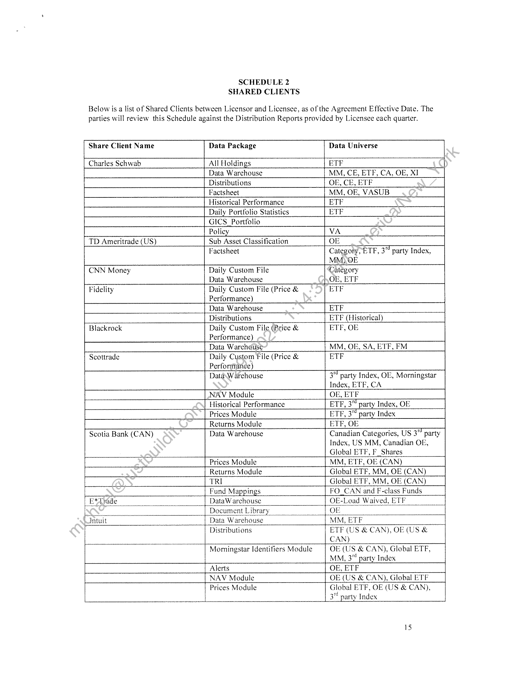
```  
```col-md
SCHEDULE 2
SHARED CLIENTS  
Below is a list of Shared Clients between Licensor and Licensee, as of the Agreement Effective Date. The  
parties will review this Schedule against the Distribution Reports provid  
led by Licensee each quarter.  
Share Client Name  
Data Package  
Data Universe  
Charles Schwab All Holdings ETF
Data Warehouse MM, CE, ETF, CA, OE, XJ
Distributions OE, CE, ETF
Factsheet MM, OF, VASUB
Historical Performance ETF
Daily Portfolio Statistics ETF
GICS Portfolio
Policy VA
TD Ameritrade (US) Sub Asset Classification OE
Factsheet Categoty, ETF, 3" party Index,
MM, OE
CNN Money Daily Custom File Category
Data Warehouse d OE, ETF
Fidelity Daily Custom File (Price & ETF
Performance)
Data Warehouse ETF
Distributions ETF (Historical)
Blackrock Daily Custom File (Price & ETF, OE
Performance)
Data Warehouse MM, OE, SA, ETF, FM
Scottrade Daily Custom File (Price & ETF
Perforrfianee)
Data\W arehouse 38 arty Index, OE, Morningstar
Index, ETF, CA
NAV Module OE, ETF
Historical Performance ETF, 3” party Index, OE
Prices Module ETF, 30 party Index
Returns Module ETF, OE
Scotia Bank (CAN) Data Warehouse Canadian Categories, US 3 party  
Index, US MM, Canadian OF,
Global ETF, F_ Shares  
Prices Module  
MM, ETF, OE (CAN)  
Returns Module  
Global ETF, MM, OE (CAN)  
TRI Global ETF, MM, OE (CAN)
Fund Mappings FO_CAN and F-class Funds
DataW arehouse OE-Load Waived, ETF  
Document Library  
ree
edntuit  
Data Warehouse  
MM, ETF  
Distributions  
ETF (US & CAN), OE (US &  
CAN)  
Morningstar Identifiers Module  
OE (US & CAN), Global ETF,
MM, 3“ party Index  
Alerts  
OE, ETF  
NAV Module  
OE (US & CAN), Global ETF  
Prices Module  
Global ETF, OE (US & CAN),
3 party Index  
15  
```
````
Notes:    
````col
```col-md
flexGrow=.5
===
> [!info] [Page 17](_attachments/images_3.6.4.2.3.3Morningstar_MOD_ProductLicenseAgreement_20120901.pdf_155237/page_17.png)
> 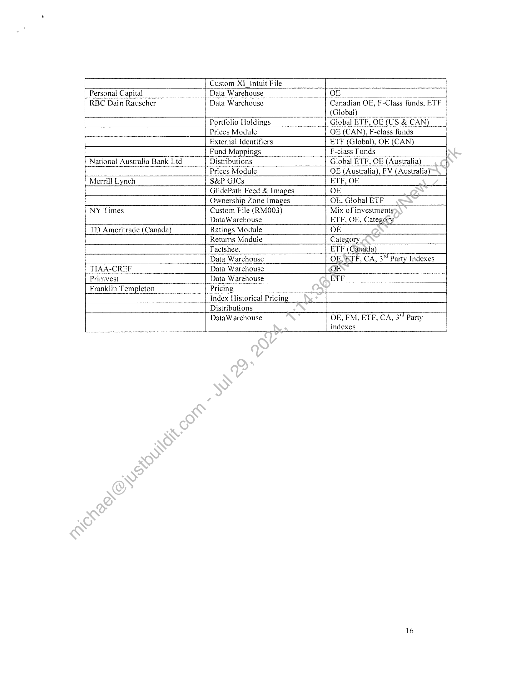
```  
```col-md
Custom XI_ Intuit File  
Personal Capital  
Data Warehouse  
OE  
RBC Dain Rauscher  
Data Warehouse  
Canadian OE, F-Class funds, ETF  
Portfolio Holdings  
| (Global)  
Global ETF, OE (US & CAN)  
Prices Module  
OE (CAN), F-class funds  
External Identifiers  
ETF (Global), OE (CAN)  
Fund Mappings  
F-class Funds  
National Australia Bank Ltd Distributions Global ETF, OE (Australia) mal
Prices Module OE (Australia), FV (Australia)
Merrill Lynch S&P GICs ETF, OE
GlidePath Feed & Images OE
Ownership Zone Images OE, Global ETF
NY Times Custom File (RM003) Mix of investments
DataW arehouse ETF, OE, Category
TD Ameritrade (Canada) Ratings Module OE
Returns Module Category.
Factsheet ETF (Canada)
Data Warehouse OES BTF, CA, 3 Party Indexes
TIAA-CREF Data Warehouse OE
Primvest Data Warehouse ETF
Franklin Templeton Pricing. ue
Index Historical Pricing
Distributions
DataW arehouse OF, FM, ETF, CA, 3" Party  
indexes  
16  
```
````
Notes:  


![[_attachments/3.6.4.2.3.3 Morningstar_MOD_ProductLicenseAgreement_20120901.pdf]