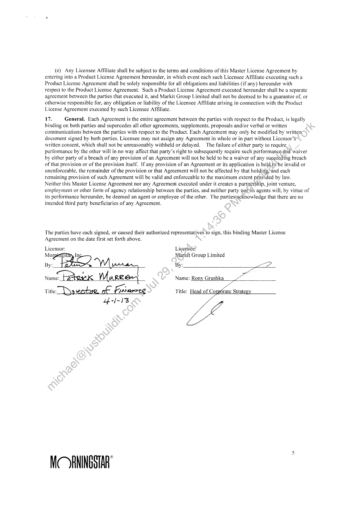

##### Morningstar, Inc. Master License Agreement]

  
````col
```col-md
flexGrow=.5
===
> [!info] [Page 1](_attachments/images_3.6.4.2.3.4Morningstar_MGL_MasterAgreement_20120901.pdf_155346/page_1.png)
> 
```  
```col-md
MORNINGSTAR CONTRACT CHECKLIST  
Client Markit Group Limited
Contract Master License Agreement  
Contract Checklist (check those that apply)  
Contract done using Morningstar's standard contract template.  
Xx Contract includes modifications to Morningstar's standard language.
(Detail changes below)  
Morningstar Legal department reviewed material changes - Reviewed by Allen Bliss  
OO  
Amendments: Original contract and other subsequent amendments have beén
reviewed to determine if there are any other modifications to be made at this time due
to any changes in Morningstar standard language.  
|  
Reviewed actual signed contract for any modifications made manuaily after printing from
V drive.  
Changes to Morningstar standard language
Section 1(b), second sentence - Removed "ina Prominent location".
Section 1(c), last sentence - Added “allowable by law":  
Section 1(d) - Revised 3rd sentence and added riew sentence thereafter, "Further Licensee is  
shall contain these limitations as well".  
that will survive expiration/termination.  
days reasonable Notice, from time td time but no More than once annually, to inspect and audit
during Licensee's normal businéss hours the relevant records of Licensee and/or its agents to
ensure Licensee’s compliance with the terms of this Agreement  
to claims associated with a Party’s willful misconduct or gross negligence. or indemnification
Obligations under Section 11."  
Licensee and.its affiliates, and their respective successors.  "  
Licensee will, at its expense, indemnify, and defend Licensor and its affiliates.  "  
Section 13 - Deleted last sentence.
Section 16 - Added new Section 16 to address Affiliated Parties.  
Approval (initials)  
Product Management  
Legal (required for contracts not done on Morningstar standard contract)
[PM JFinance  
[es—_ ]REDISTRIBUTOR  
[No ]ROYALTY  
PLA's and PLA amendments: Master term language is updated. Master is with Morningstar Inc.  
responsible for enforcing the Licensee Client Agreement detailed above in Paragraph 1(c), which
Section 2 - Cancel notice changed to 90.days. Added references to sections 16 and 17, as sections  
Section 4 - Revised to read, "Licerisor reserves the right, at its expense and upon at least thirty (30)  
Section 10 - Revised 2nd sentence to read, "The aforementioned limitation of liability will not apply  
Section 11(a) - Revised first sentence to read, “Licensor will, at its expense, indemnify, and defend  
Section 1:i(b) - Revised first sentence to read, "Subject to the limitations contained at Section 10,  
```
````
Notes:    
````col
```col-md
flexGrow=.5
===
> [!info] [Page 2](_attachments/images_3.6.4.2.3.4Morningstar_MGL_MasterAgreement_20120901.pdf_155346/page_2.png)
> 
```  
```col-md
MORNINGSTAR, INC. MASTER LICENSE AGREEMENT  
L. License.  
(a) Grant of License: Effective this 1" day of September 2012, Morningstar, Inc. (“Licensor”) grants to Markit
Group Limited (“Licensee”) an English-only, non-exclusive, non-transferable license to: (1) use and/or distribute the
Licensor products and/or services (collectively, the “Product™) described in one or more Product License Agreements
that may be executed by Licensor and Licensee from time to time, solely for the purpose, and solely in the manner, set
forth herein and in each such Product License Agreement; and (2) use and/or distribute solely in conjunction with the
Product those trademarks, service marks and related intellectual property (collectively, “Licensor Marks”) identified
in applicable Product License Agreement. Each Product License Agreement is incorporated by reference into this
Morningstar, Inc., Master License Agreement (“Master License Agreement”) to form the “Agreement” between the
parties with respect to the Product described therein. In the event that the terms of a Product License Agreement
conflict with those of this Master License Agreement, the terms of the Product License Agreement will control but
only with respect to the Product to which that Product License Agreement specifically relates. No other licenses or
rights to the Product other than those specifically set forth herein are granted to Licensee.  
(b) Attribution and Use: Licensee will clearly reference Licensor as the provider of the Produ¢t-in all Licensee
advertising and marketing materials and public communications referencing the Product. If Licerisee displays all or a
portion of any Product, Licensee will include the appropriate disclaimer(s) as more particularly described in the
applicable Product License Agreement, and ensure that any disclaimer(s) already included inthe Product are not
removed.  
(c) Third Party Distribution/Licensee Client Agreements: Licensee shall notdisclose, distribute or otherwise
make any Product available to third parties, except as expressly provided in the.applicable Agreement (as defined
above) or except under those terms and conditions that Licensor explicitly approves in advance in writing. In the
event that Licensce is authorized to distribute the Product to any third party; lsicensee shall ensure that the contract by
which such distribution is effected contains a disclaimer of all warranties with respect to the Product and a provision
that explicitly excepts Licensor from all liability allowable by law.  
(d) License Limitations: The Product, any portion thereofand any Licensor Marks may be used by Licensee
only for the purpose and only in the manner specifically set forth.in the applicable Agreement. Any use of the Product
or the Licensor Marks in a manner or for a purpose other than_that specifically authorized therein is a material breach
of that Agreement. Licensee is responsible for taking all commercially reasonable actions to ensure that its employees
and agents to whom it furnishes the Product or Licensor)Marks or over whom it exercises control comply with these
limitations. Further Licensee is responsible for enforcing the Licensee Client Agreement detailed above in Paragraph
i(c), which shall contain these limitations as well) Licensee shall immediately notify Licensor of any unauthorized
use, copying, disclosure or distribution of any Product or Licensor Marks of which Licensee becomes aware.  
Licensee agrees to cooperate and provide.reasonable assistance to Licensor, at Licensor’s reasonable expense, in
connection with preventing and stopping any unauthorized use, copying, disclosure or distribution of the Product or
the Licensor Marks. Except as otherwise explicitly provided in any applicable Agreement, Licensee may not: (i)
sublicense, publish, transmit, transfer, sell, reproduce, distribute, display, alter or in any way exploit any Product or
Licensor Marks; (ii) combine, (mix or integrate the Product or Licensor Marks with the similar products or marks of
any other suppliers in a manner in which attribution is unclear; (iii) use or actively market any Product or Licensor
Marks outside of the territories of the United States; (iv) distribute any Product or any portion thereof to any of the
Direct Competitors seCforth in the applicable Product License Agreement; or (v) charge a licensing fee or similar fee
for providing any portion of the Product or any output from it to any third party.  
(ce) Advertising/Promotional Procedures: Licensee will not use the Product, the Licensor Marks, any
derivation ofthe name “Morningstar” or any other Licensor intellectual property licensed for use under any
Agreement in any advertising or marketing materials or issue any public communication related to that Agreement
without first submitting the materials/communication for Licensor’s review. Licensee is not required to wait for
Ligénsor approval before proceeding with its publication, production or other dissemination, However, Licensee must
folfow all terms and conditions governing Product use found within the applicable Agreement. Additionally, Licensee
shall not be required to submit for Licensor review any updated versions of materials previously reviewed and
approved by Licensor for the Product in question, provided that the update is only with respect to data and not
otherwise materially different from the original submission. Licensor may send Licensee written notification of
Licensee’s required revisions to the materials if Licensor, in its reasonable judgment, determines that Licensee's use
of any Licensor intellectual property in those materials violates an Agreement or any Licensor usage guidelines, as
may be referenced in the applicable Product License Agreement. Following such written notification, Licensee must
comply with any requested changes to the extent that such changes are consonant with the terms of the applicable  
MORNINGSTAR”  
```
````
Notes:    
````col
```col-md
flexGrow=.5
===
> [!info] [Page 3](_attachments/images_3.6.4.2.3.4Morningstar_MGL_MasterAgreement_20120901.pdf_155346/page_3.png)
> 
```  
```col-md
Agreement prior to publishing, producing or disseminating any materials not currently printed, or in the case of
electronic dissemination, within a reasonable time period following notification. Licensor will not be held liable for
advertising, promotion, or other related costs incurred by Licensee, in the event of requested revisions to the materials
by Licensor. Lack of compliance with this submission process on a repeated basis or in a flagrant manner is grounds
for immediate termination of the applicable Agreement.  
2. Term. This Master License Agreement will begin on the effective date set forth above and continue for an
Initial Term of three (3) years. The Master License Agreement will automatically renew for additional one (1) year
Renewal Terms, unless at least ninety (90) days prior to the anniversary date of the then-current term, either party
provides the other with written notice of non-renewal, provided, however that such termination will not be effective
until the expiration date of all Product License Agreements executed under this Master License Agreement. The,term
of each Agreement will be set forth in the applicable Product License Agreement. In the event an Agreement expires
or terminates for any reason, Licensee will immediately cease to use the Product and any Licensor Marks provided
thereunder, and destroy all copies of the Product (in any form or media) within Licensee’s possession, custody or
control. Notwithstanding the foregoing, Licensee may retain, for archival purposes, electronic and/or,paper copies of
all Licensee materials already produced prior to that expiration/termination containing all or part of the, Product
(“Licensee Materials”). The provisions of Sections 2, 3, 4, 6, 8. 9, 10, 11, 12, 13 14, 16 and 17 of this Master License
Agreement will survive any expiration or termination of an Agreement; provided, however, that the provisions of
Section 4 shall only survive for one hundred twenty (120) days after the date of expiration/termination.  
3. Fees and Payment. Licensee will pay Licensor the amount(s) set forth in the applicable Product License
Agreement to license the Product. Except as set forth in the applicable Product License\Agreement, the fees to license
a particular Product for an additional term of that Product License Agreement will beat Licensor’s standard rates for
that Product as of the commencement date of that additional term. Full payments due within thirty (30) days of the
invoice date. Overdue accounts are charged at a rate of one and one-half percent (1.5%) per month or the maximum
allowed by law, whichever is less. In the event any such overdue accountsremain unpaid for thirty (30) days or more,
Licensor shall also have the right to withhold future deliveries of, or prohibit future access to, the Product until such
accounts plus any applicable interest charges are paid in full. Nothing.in this Section 3 shall restrict or limit Licensor’s
ability to pursue other remedies or to terminate this Agreement as _set forth herein. Licensee is responsible for all
delivery fees, taxes and like charges arising in connection withjor relating to this Agreement, except for taxes on
Licensor's net income. Unless otherwise directed by Licensor Licensee shall be invoiced for all such fees, taxes and
charges and shall pay those monies directly to Licensor for-Licensor’s further handling with the appropriate taxing
authorities.  
4, Inspections and Audits. Licensor reserves the right, at its expense and upon at least thirty (30) days
reasonable notice, from time to time but no more-than once annually, to inspect and audit during Licensee’s normal
business hours the relevant records of Licensee and/or its agents to ensure Licensee’s compliance with the terms of
this Agreement.  
5. Delivery. Delivery of the-Product will be made in the time and manner set forth in applicable Product
License Agreement. Licensee agrees to deliver to Licensor the information, if any, set forth in the applicable Product
License Agreement in accordance with the schedule contained therein to enable Licensor to perform hereunder.  
6. Ownership. Licensor retains all right, title and interest in the Product, as well as in any enhancements,
modifications or derivative works thereof, and in any Licensor intellectual property used in conjunction with the
Product or otherwisé.provided by Licensor under this Agreement, including. but not limited to, the Licensor Marks.
No work performed hereunder by Licensor or its agents shall be deemed “work for hire,” as such term is defined as 17
U.S.C. § 10 l,onbehalf of Licensee or any other party. Furthermore, Licensee shall not, at any time, contest or assist
any other pdrty'in contesting the rights of Licensor in the Product or any other Licensor intellectual property provided
hereunder!  
7 Service Support. Licensor will provide such product or other support for the Product as is set forth in the
applicable Product License Agreement. Licensor will make commercially reasonable efforts to ensure that the Product
is free of viruses and damaging or disabling code, errors or other defects and will make commercially reasonable
efforts to correct any such errors or defects in the Product that are brought to its attention within a reasonable amount
of time.  
8. Representations and Warranties. Licensor represents and warrants that it has the right to grant Licensee a
license to use the Product and Licensor Marks as provided herein. In addition. each party represents and warrants that
this Agreement is binding on it and that its execution and delivery of this Agreement does not violate any prior
obligation or agreement to which it is currently bound.  
MORNINGSTAR”  
```
````
Notes:    
````col
```col-md
flexGrow=.5
===
> [!info] [Page 4](_attachments/images_3.6.4.2.3.4Morningstar_MGL_MasterAgreement_20120901.pdf_155346/page_4.png)
> 
```  
```col-md
9. Disclaimer of Warranties. Licensor does not guarantee the accuracy, integrity, completeness or timeliness
of the Product. The Product is provided “as is” with all faults and the entire risk as to satisfactory quality,
performance, accuracy and effort is with Licensee, Except as set forth in Section 8, Licensor and its content providers
disclaim all other warranties or conditions, express or implied, including, but not limited to, absence of viruses and
damaging or disabling code, the implied warranties or conditions of merchantability, fitness for a particular purpose,
and accuracy of informational content, any implied warranties arising from course of dealing or course of
performance, and any warranties, representations or covenants that (i) use or access to the Product or any portion of it
will be uninterrupted or error-free, or (ii) that defects in the Product or any portion of it will be correctable or
corrected, or (iii) that the Product or any portion of it is compatible with any particular computer software or platform.
These disclaimers are in addition to any disclaimers contained in the applicable Product License Agreement.  
10. Limitations of Liability. Except as otherwise explicitly provided herein and except for Licensee’s payment
obligations hereunder for fees, taxes and related charges, neither party’s aggregate liability for any actual damages
arising under or in any way relating to all Agreements entered into hereunder, the Product or any other Ligensor
services provided hereunder whether arising in contract, tort or any other legal theory shall exceed thesgreater of (i)
one million dollars ($1,000,000) or (ii) the total fees and costs paid or payable by Licensee to Licensox under this
Agreement for the one (1) year period prior to the date on which such damages first arose in connéction with this
Agreement. The aforementioned limitation of liability will not apply to claims associated with,a. party's willful
misconduct or gross negligence or indemnification obligations under Section 11. Notwithstanding any other provision
in any Agreement to the contrary, neither party will be liable for the consequential, punitive, special, incidental,
indirect, exemplary, collateral, special or other, similar forms of damages, including, ‘hut not limited to, loss of
income, profit or savings, of any party, including any third party, regardless of the,form of action or the theory of
recovery, even if such party has been advised of the possibility of such damages. “Each party has a duty to mitigate
damages that would otherwise be recoverable hereunder by taking appropriate‘and reasonable actions to reduce or
limit the amount of such damages.  
I. Indemnification.  
(a) By Licensor: Licensor will, at its expense, indemnify and defend Licensee and its affiliates, and their
respective successors and assigns, and their respective directors/Officers and employees, from and against any and all
claims, demands, suits, action and any and all damages. losses,iabilities, taxes, penalties, fines, charges, costs and
expenses (including reasonable attorneys’ fees) arising from or relating to a third party claim that the Product or
Licensor Marks infringe that party's U.S. patent, U.Sotrademark or copyright or misappropriate that party’s trade
secret or other intellectual property right; provided, however, that Licensor shall have no obligation to pay the costs
(including reasonable attorney’s fees) associated with any such third party claim or any damages or other losses,
liabilities, taxes, penalties, fines, charges, costs,or expenses arising therefrom or related thereto, to the extent that that
third party claim could have been avoided had Licensee not used the Product in a manner not specifically authorized
under this Agreement.  
If such a third party claim is made prappears likely to be made, Licensor, in its sole discretion, may elect: (i) to
procure for Licensee the right to’continue to use the Product; (ii) to replace, at Licensor’s cost, the Product, or any
portion thereof, with a substitute product that functions substantially in accordance with the Product’s specifications;
(iii) to modify the Product so that it does not infringe or misappropriate, provided that the Product, as modified,
continues to perform substantially in accordance with the applicable specifications; or (iv) to terminate this Agreement
and to pay to License¢a‘refund of any prepaid fees paid under this Agreement for the period in which the problem
occurred through ‘the remaining portion of the Initial Term or current Renewal Term, as the case may be. This Section
11 (a) sets forth Licénsor’s entire obligation to Licensee with respect to any claim to infringement or
misappropriation.  
(bi -By Licensee: Subject to the limitations contained at Section 10, Licensee will, at its expense indemnify and
defend bicensor and its affiliates, and their respective successors and assigns, and their respective directors, officers
and employees, from and against any and all claims, demands, suits, action and any and all damages, losses, liabilities,
taxes, penalties, fines, charges, costs and expenses (including reasonable attorneys’ fees) arising from or relating to
Licensee’s use of the Product or any other Licensor intellectual property provided hereunder in a manner not explicitly
licensed hereunder or in a manner not consistent with the use restrictions and requirements provided hereunder.  
(c) Conditions to Indemnification: Each party’s obligation to indemnify and defend the other hereunder will
be contingent on the party seeking indemnification (the “Indemnified Party”): (i) promptly notifying the other party
(the “Indemnifying Party”) in writing of the claim; (ii) allowing the Indemnifying Party to control, and reasonably  
MORNINGSTAR”  
```
````
Notes:    
````col
```col-md
flexGrow=.5
===
> [!info] [Page 5](_attachments/images_3.6.4.2.3.4Morningstar_MGL_MasterAgreement_20120901.pdf_155346/page_5.png)
> 
```  
```col-md
cooperating with Indemnifying Party in, the defense thereof and any related settlement negotiations: and (iii) in no
event, agreeing to, or authorizing settlement of, any such claim without Indemnifying Party’s prior written agreement.  
12, Breach. Each party will have thirty (30) days from the date of receiving written notice of breach to cure it;
provided, however, that the cure period for Licensee’s failure to make timely payment hereunder will be seven (7)
days from receipt of written notice of breach. [fa breach is not cured within the applicable cure period, the nonbreaching party may terminate this Agreement on written notice to the other. Notwithstanding any provision in this
Agreement to the contrary, Licensor may immediately terminate this Agreement and will be entitled to seek injunctive
relief, without notice or the necessity of bond, in the event of any Licensee breach with respect to the ownership, use,
copying, distribution, confidentiality of the Product or other Licensor intellectual property. Notwithstanding any
provision of this Agreement to the contrary, each party will be entitled to seek injunctive relief, without notice or the
necessity of bond, in the event of any breach, or threatened breach, by the other party of Section 14 hereof  
13. Governing Law. For the purpose of this Agreement all products or services provided by Licensor.are
deemed provided in the State of Illinois. This Agreement will be governed by the laws of the State of Illinois, without
regard to its conflict-of-law provisions.  
14. Confidentiality. The parties acknowledge that in the course of their dealings hereunder,(cach has or may
acquire information about the other, its business activities and operations, its technical information and its trade
secrets, all of which, including the terms of this Agreement, are proprietary and confidential(the “Confidential
Information”). Each party hereby agrees that: (a) all Confidential Information will rem@inithe exclusive property of
its owner: (b) such party will maintain, and will use prudent methods to cause its employees and agents to maintain,
the confidentiality and secrecy of the other’s Confidential Information and to not copy, publish, disclose or otherwise
use (other than pursuant to the terms hereof) the other’s Confidential InformationSand (c) such party will return or
destroy all copies of the other’s Confidential Information upon request of theother party. Notwithstanding the
foregoing, Confidential Information shall not include any information to the extent it: (i) is or becomes a part of the
public domain through no act or omission on the part of the receiving party, (ii) is disclosed to third parties by the
disclosing party without restriction on such third parties; (iii) is in the receiving party’s possession, without actual or
constructive knowledge of an obligation of confidentiality with respect thereto, at or prior to the time of disclosure
under this Agreement; (iv) is independently developed by the-reeéiving party without reference to the disclosing
party’s Confidential Information; (v) is released from confidential treatment by written consent of the disclosing party:
or (vi) is required by governmental or regulatory agency, orby court order to be disclosed.  
15. Notices. All notices, requests and other communications under an Agreement will be in writing and
delivered in person, or sent by certified mail, return réceipt requested, overnight courier service, or by facsimile (but
not by e-mail) to the address or facsimile numbe?,set forth in the applicable Product License Agreement, or to such
other addresses or numbers as the parties may.stipulate from time to time. Unless otherwise provided, notice will be
effective on the date it is officially recorded as delivered by return receipt or equivalent or by facsimile confirmation
date.  
16. Affiliated Parties.  
(a) “Licensor A ffiliate(s)”)shall mean any other Person directly or indirectly (i) Controlling, (ii) Controlled by,
or (ii) under common Contd! with Morningstar, Inc. “Control” as used herein shall mean an ownership or voting
interest of fifty (50) per¢ent or more, the right to fifty (50) percent or more of the profits or earnings of an entity, or
the right to control the-policy decisions of an entity.  
(b) “Licensee. fiiliate(s)” shall mean, with respect to any Person directly or indirectly (i) Controlling, (ii)
Controlled by er (ii) under common Control with Markit Group Limited. “Control” as used herein shall mean an
ownership,ot Voting interest of fifty (50) percent or more, the right to fifty (50) percent or more of the profits or
earnings? an entity, or the right to control the policy decisions of an entity.  
yey “Person” shall mean shall mean any corporation, limited liability company, limited liability partnership,
partnership, firm, stock company, trust or other organization.  
(d) Any Licensor Affiliate shall be subject to the terms and conditions of this Master License Agreement by
entering into a Product License Agreement hereunder, in which event each such Licensor Affiliate executing such a
Product License Agreement shall be solely responsible for all obligations and liabilities (if any) hereunder with
respect to the Product License Agreement. Such a Product License Agreement executed hereunder shall be a separate
agreement between the parties that executed it, and Morningstar, Inc. shall not be deemed to be a guarantor of, or
otherwise responsible for, any obligation or liability of the Licensor Affiliate arising in connection with the Product
License Agreement executed by such Licensor Affiliate.  
MORNINGSTAR”  
```
````
Notes:    
````col
```col-md
flexGrow=.5
===
> [!info] [Page 6](_attachments/images_3.6.4.2.3.4Morningstar_MGL_MasterAgreement_20120901.pdf_155346/page_6.png)
> 
```  
```col-md
(e} Any Licensee Affiliate shall be subject to the terms and conditions of this Master License Agreement by
entering into a Product License Agreement hereunder, in which event each such Licensee Affiliate executing such a
Product License Agreement shall be solely responsible for all obligations and liabilities (if any) hereunder with
respect to the Product License Agreement. Such a Product License Agreement executed hereunder shall be a separate
agreement between the parties that executed it, and Markit Group Limited shall not be deemed to be a guarantor of, or
otherwise responsible for, any obligation or liability of the Licensee Affiliate arising in connection with the Product
License Agreement executed by such Licensee Affiliate.  
17, General. Each Agreement is the entire agreement between the parties with respect to the Product, is legally
binding on both parties and supercedes all other agreements, supplements, proposals and/or verbal or written
communications between the parties with respect to the Product. Each Agreement may only be modified by written
document signed by both parties. Licensee may not assign any Agreement in whole or in part without Licensor’s
written consent, which shall not be unreasonably withheld or delayed. The failure of either party to require
performance by the other will in no way affect that party’s right to subsequently require such performance-and waiver
by either party of a breach of any provision of an Agreement will not be held to be a waiver of any suegedding breach
of that provision or of the provision itself. If any provision of an Agreement or its application is held.to’be invalid or
unenforceable, the remainder of the provision or that Agreement will not be affected by that holding,-and each
remaining provision of such Agreement will be valid and enforceable to the maximum extent provided by law.
Neither this Master License Agreement nor any Agreement executed under it creates a partnership, joint venture,
employment or other form of agency relationship between the parties, and neither party merits agents will. by virtue of
its performance hereunder, be deemed an agent or employee of the other. The parties\acknowledge that there are no
intended third party beneficiaries of any Agreement.  
The parties have each signed, or caused their authorized representatives to sign, this binding Master License
Agreement on the date first set forth above.  
Licensor: Licensée?  
ells Xe) Markit Group Limited  
By: atta By: aoe
‘ aa  
Name, Eee Maree Name: Rony Grushka  
Title pwede. of Fpsensce Title: Head of Corporate Strategy  
L£-1-13  
MORNINGSTAR  
```
````
Notes:  


![[_attachments/3.6.4.2.3.4 Morningstar_MGL_MasterAgreement_20120901.pdf]