##### Index Data Redistribution Agreement]

  
````col
```col-md
flexGrow=.5
===
> [!info] [Page 1](_attachments/images_3.6.4.2.4.1ICE_MGL_BofAIndexDataRedistributionAgreement_20211102.pdf_155158/page_1.png)
> 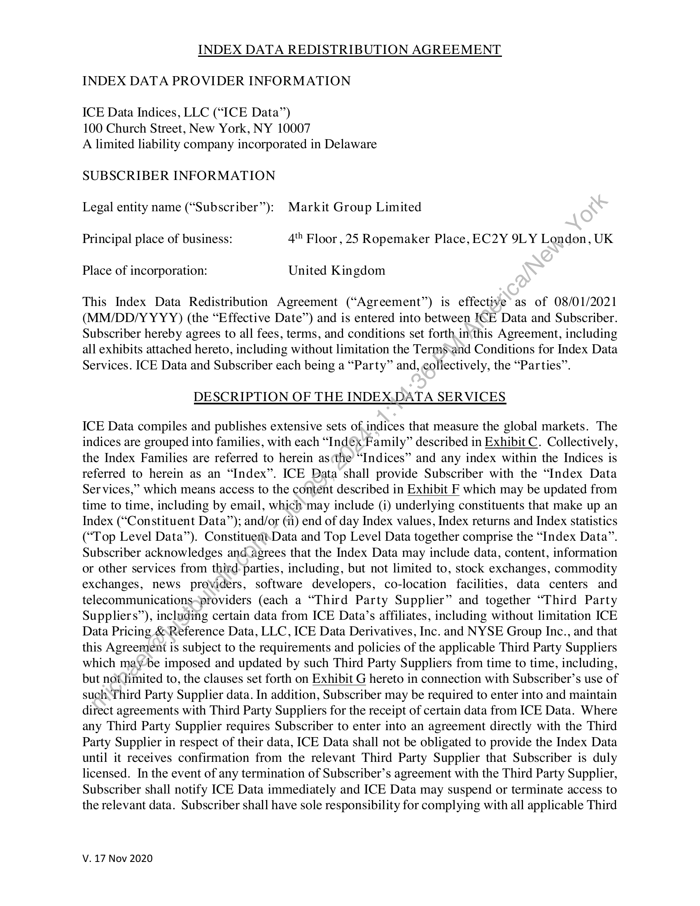
```  
```col-md
INDEX DATA REDISTRIBUTION AGREEMENT
INDEX DATA PROVIDER INFORMATION  
ICE Data Indices, LLC (“ICE Data’’)
100 Church Street, New York, NY 10007
A limited liability company incorporated in Delaware  
SUBSCRIBER INFORMATION  
Legal entity name (“Subscriber”): Markit Group Limited  
Principal place of business: 4" Floor , 25 Ropemaker Place, EC2Y 9LY London, UK
Place of incorporation: United Kingdom  
This Index Data Redistribution Agreement (“Agreement”) is effective’ as of 08/01/2021
(MM/DD/YYYY) (the “Effective Date”) and is entered into between IGE Data and Subscriber.
Subscriber hereby agrees to all fees, terms, and conditions set forth inthis Agreement, including
all exhibits attached hereto, including without limitation the Terms‘and Conditions for Index Data
Services. ICE Data and Subscriber each being a “Party” and, collectively, the “Parties”.  
DESCRIPTION OF THE INDEX,DATA SERVICES  
ICE Data compiles and publishes extensive sets of.indices that measure the global markets. The
indices are grouped into families, with each “Index’Family” described in Exhibit C. Collectively,
the Index Families are referred to herein as:the’ “Indices” and any index within the Indices is
referred to herein as an “Index”. ICE Data shall provide Subscriber with the “Index Data
Services,” which means access to the content described in Exhibit F which may be updated from
time to time, including by email, which*may include (i) underlying constituents that make up an
Index (“Constituent Data”); and/or (ii) end of day Index values, Index returns and Index statistics
(“Top Level Data”). Constituent-Data and Top Level Data together comprise the “Index Data”.
Subscriber acknowledges and.agrees that the Index Data may include data, content, information
or other services from third-parties, including, but not limited to, stock exchanges, commodity
exchanges, news providers, software developers, co-location facilities, data centers and
telecommunications~providers (each a “Third Party Supplier” and together “Third Party
Suppliers’), including certain data from ICE Data’s affiliates, including without limitation ICE
Data Pricing & Reference Data, LLC, ICE Data Derivatives, Inc. and NYSE Group Inc., and that
this Agreement is subject to the requirements and policies of the applicable Third Party Suppliers
which maybe imposed and updated by such Third Party Suppliers from time to time, including,
but not limited to, the clauses set forth on Exhibit G hereto in connection with Subscriber’s use of
such-Third Party Supplier data. In addition, Subscriber may be required to enter into and maintain
direct agreements with Third Party Suppliers for the receipt of certain data from ICE Data. Where
any Third Party Supplier requires Subscriber to enter into an agreement directly with the Third
Party Supplier in respect of their data, ICE Data shall not be obligated to provide the Index Data
until it receives confirmation from the relevant Third Party Supplier that Subscriber is duly
licensed. In the event of any termination of Subscriber’s agreement with the Third Party Supplier,
Subscriber shall notify ICE Data immediately and ICE Data may suspend or terminate access to
the relevant data. Subscriber shall have sole responsibility for complying with all applicable Third  
V. 17 Nov 2020  
```
````
Notes:    
````col
```col-md
flexGrow=.5
===
> [!info] [Page 2](_attachments/images_3.6.4.2.4.1ICE_MGL_BofAIndexDataRedistributionAgreement_20211102.pdf_155158/page_2.png)
> 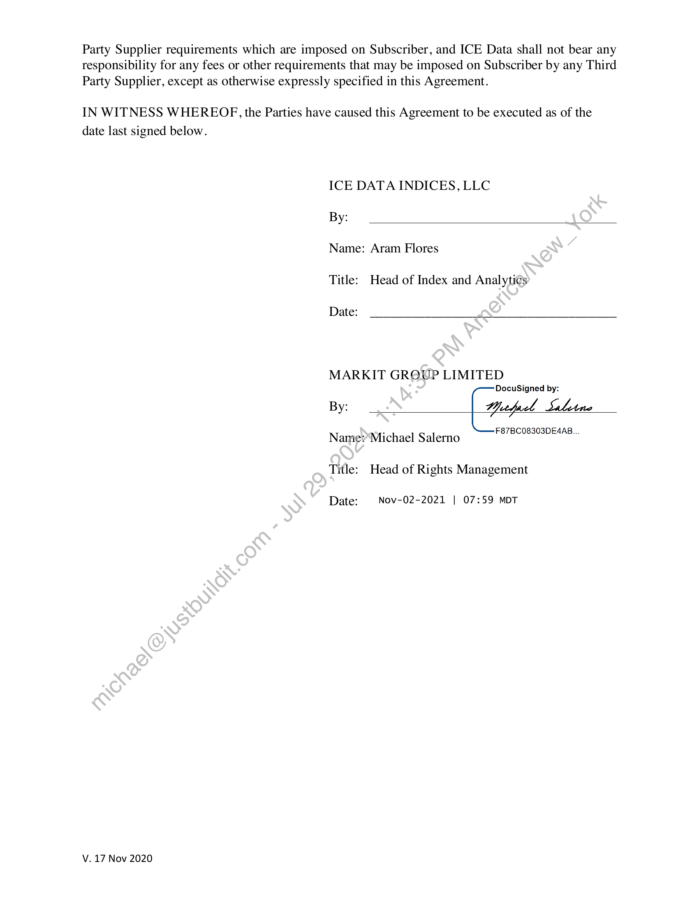
```  
```col-md
Party Supplier requirements which are imposed on Subscriber, and ICE Data shall not bear any
responsibility for any fees or other requirements that may be imposed on Subscriber by any Third
Party Supplier, except as otherwise expressly specified in this Agreement.  
IN WITNESS WHEREOF, the Parties have caused this Agreement to be executed as of the
date last signed below.  
ICE DATA INDICES, LLC  
By:  
Name: Aram Flores
Title: Head of Index and Analytics  
Date:  
MARKIT GROUP LIMITED  
DocuSigned by:  
F87BC08303DE4AB.    
Name?’ Michael Salerno
Title: Head of Rights Management  
Date: Nov-02-2021 | 07:59 MDT  
V. 17 Nov 2020  
```
````
Notes:    
````col
```col-md
flexGrow=.5
===
> [!info] [Page 3](_attachments/images_3.6.4.2.4.1ICE_MGL_BofAIndexDataRedistributionAgreement_20211102.pdf_155158/page_3.png)
> 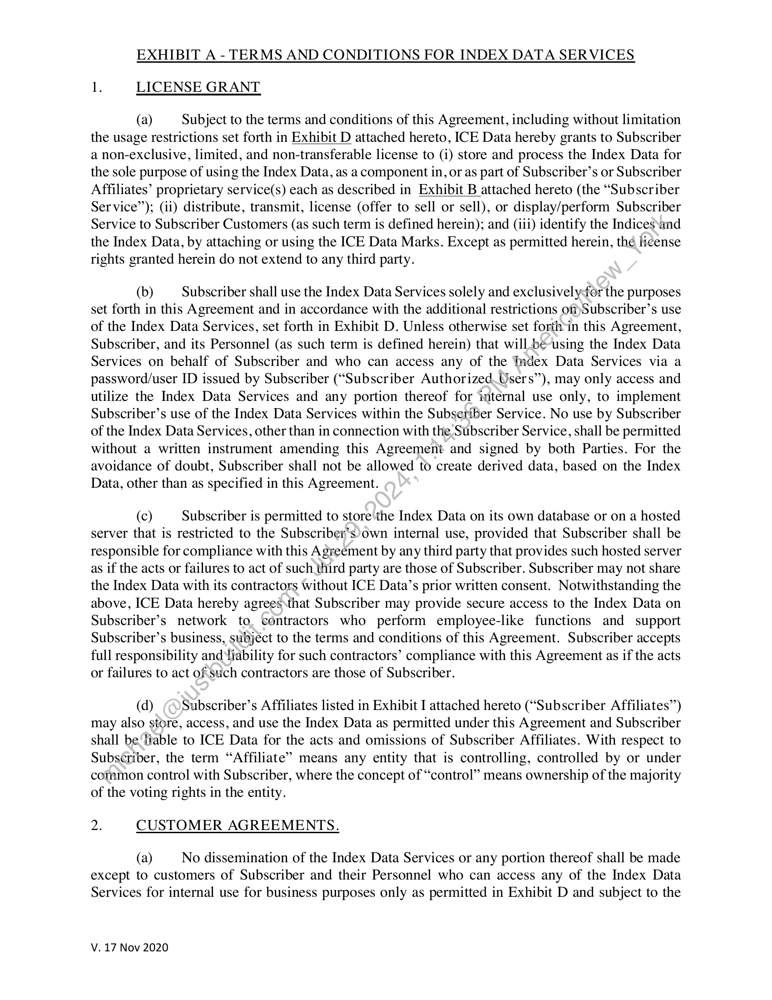
```  
```col-md
EXHIBIT A - TERMS AND CONDITIONS FOR INDEX DATA SERVICES
1. LICENSE GRANT  
(a) Subject to the terms and conditions of this Agreement, including without limitation
the usage restrictions set forth in Exhibit D attached hereto, ICE Data hereby grants to Subscriber
a non-exclusive, limited, and non-transferable license to (i) store and process the Index Data for
the sole purpose of using the Index Data, as a component in, or as part of Subscriber’s or Subscriber
Affiliates’ proprietary service(s) each as described in Exhibit B attached hereto (the “Subscriber
Service”); (ii) distribute, transmit, license (offer to sell or sell), or display/perform Subscriber
Service to Subscriber Customers (as such term is defined herein); and (iii) identify the Indices\and
the Index Data, by attaching or using the ICE Data Marks. Except as permitted herein, thé license
rights granted herein do not extend to any third party.  
(b) Subscriber shall use the Index Data Services solely and exclusivelyfor the purposes
set forth in this Agreement and in accordance with the additional restrictions on)Subscriber’s use
of the Index Data Services, set forth in Exhibit D. Unless otherwise set forth-in this Agreement,
Subscriber, and its Personnel (as such term is defined herein) that will.bé-using the Index Data
Services on behalf of Subscriber and who can access any of the Index Data Services via a
password/user ID issued by Subscriber (“Subscriber Authorized.Users”), may only access and
utilize the Index Data Services and any portion thereof for internal use only, to implement
Subscriber’s use of the Index Data Services within the Subscriber Service. No use by Subscriber
of the Index Data Services, other than in connection with the Subscriber Service, shall be permitted
without a written instrument amending this Agreement and signed by both Parties. For the
avoidance of doubt, Subscriber shall not be allowed to create derived data, based on the Index
Data, other than as specified in this Agreement.  
(c) Subscriber is permitted to store\the Index Data on its own database or on a hosted
server that is restricted to the Subscriber*s)own internal use, provided that Subscriber shall be
responsible for compliance with this Agreement by any third party that provides such hosted server
as if the acts or failures to act of such third party are those of Subscriber. Subscriber may not share
the Index Data with its contractors without ICE Data’s prior written consent. Notwithstanding the
above, ICE Data hereby agreessthat Subscriber may provide secure access to the Index Data on
Subscriber’s network to, contractors who perform employee-like functions and support
Subscriber’s business, subject to the terms and conditions of this Agreement. Subscriber accepts
full responsibility and ‘liability for such contractors’ compliance with this Agreement as if the acts
or failures to act of such contractors are those of Subscriber.  
(d) Subscriber’s Affiliates listed in Exhibit I attached hereto (“Subscriber Affiliates”)
may also store, access, and use the Index Data as permitted under this Agreement and Subscriber
shall be‘liable to ICE Data for the acts and omissions of Subscriber Affiliates. With respect to
Subscriber, the term “Affiliate” means any entity that is controlling, controlled by or under
common control with Subscriber, where the concept of “control” means ownership of the majority
of the voting rights in the entity.  
2. CUSTOMER AGREEMENTS.
(a) No dissemination of the Index Data Services or any portion thereof shall be made  
except to customers of Subscriber and their Personnel who can access any of the Index Data
Services for internal use for business purposes only as permitted in Exhibit D and subject to the  
V. 17 Nov 2020  
```
````
Notes:    
````col
```col-md
flexGrow=.5
===
> [!info] [Page 4](_attachments/images_3.6.4.2.4.1ICE_MGL_BofAIndexDataRedistributionAgreement_20211102.pdf_155158/page_4.png)
> 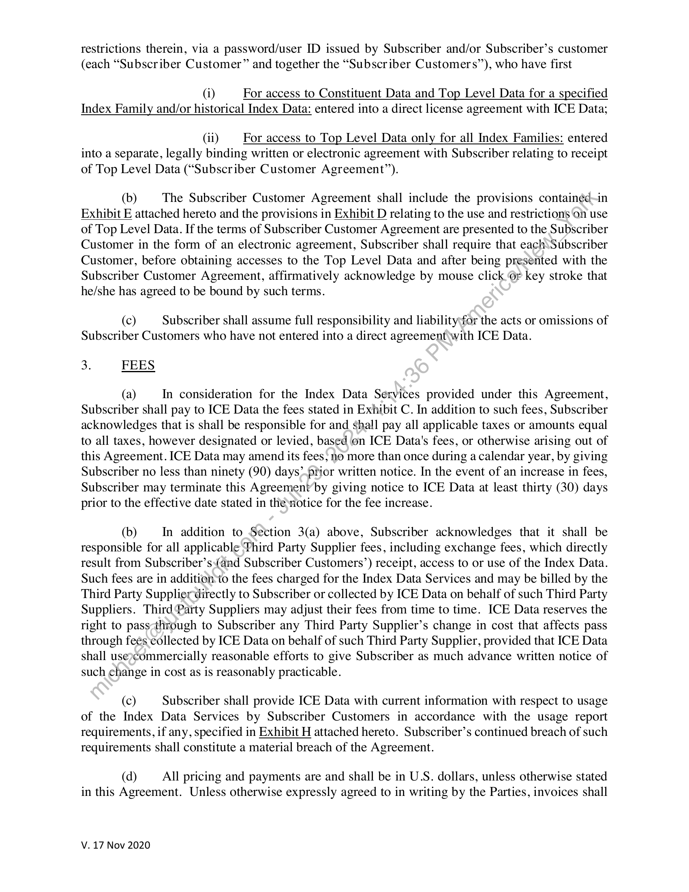
```  
```col-md
restrictions therein, via a password/user ID issued by Subscriber and/or Subscriber’s customer
(each “Subscriber Customer” and together the “Subscriber Customers”), who have first  
(i) For access to Constituent Data and Top Level Data for a specified
Index Family and/or historical Index Data: entered into a direct license agreement with ICE Data;  
(ii) For access to Top Level Data only for all Index Families: entered
into a separate, legally binding written or electronic agreement with Subscriber relating to receipt
of Top Level Data (“Subscriber Customer Agreement”).  
(b) The Subscriber Customer Agreement shall include the provisions containéd~in
Exhibit E attached hereto and the provisions in Exhibit D relating to the use and restrictions ‘on use
of Top Level Data. If the terms of Subscriber Customer Agreement are presented to the Subscriber
Customer in the form of an electronic agreement, Subscriber shall require that each‘Subscriber
Customer, before obtaining accesses to the Top Level Data and after being presented with the
Subscriber Customer Agreement, affirmatively acknowledge by mouse click.Gr key stroke that
he/she has agreed to be bound by such terms.  
(c) Subscriber shall assume full responsibility and liabilityfor the acts or omissions of
Subscriber Customers who have not entered into a direct agreement \with ICE Data.  
3. FEES  
(a) In consideration for the Index Data Services provided under this Agreement,
Subscriber shall pay to ICE Data the fees stated in Exhibit C. In addition to such fees, Subscriber
acknowledges that is shall be responsible for and shall pay all applicable taxes or amounts equal
to all taxes, however designated or levied, based ‘on ICE Data's fees, or otherwise arising out of
this Agreement. ICE Data may amend its fees, no more than once during a calendar year, by giving
Subscriber no less than ninety (90) days?’.prior written notice. In the event of an increase in fees,
Subscriber may terminate this Agreement’by giving notice to ICE Data at least thirty (30) days
prior to the effective date stated in theotice for the fee increase.  
(b) In addition to Section 3(a) above, Subscriber acknowledges that it shall be
responsible for all applicable Third Party Supplier fees, including exchange fees, which directly
result from Subscriber’s(and Subscriber Customers’) receipt, access to or use of the Index Data.
Such fees are in addition*to the fees charged for the Index Data Services and may be billed by the
Third Party Supplierdirectly to Subscriber or collected by ICE Data on behalf of such Third Party
Suppliers. Third Party Suppliers may adjust their fees from time to time. ICE Data reserves the
right to pass-through to Subscriber any Third Party Supplier’s change in cost that affects pass
through fees ‘collected by ICE Data on behalf of such Third Party Supplier, provided that ICE Data
shall use9commercially reasonable efforts to give Subscriber as much advance written notice of
such change in cost as is reasonably practicable.  
(c) Subscriber shall provide ICE Data with current information with respect to usage
of the Index Data Services by Subscriber Customers in accordance with the usage report
requirements, if any, specified in Exhibit H attached hereto. Subscriber’s continued breach of such
requirements shall constitute a material breach of the Agreement.  
(d) All pricing and payments are and shall be in U.S. dollars, unless otherwise stated
in this Agreement. Unless otherwise expressly agreed to in writing by the Parties, invoices shall  
V. 17 Nov 2020  
```
````
Notes:    
````col
```col-md
flexGrow=.5
===
> [!info] [Page 5](_attachments/images_3.6.4.2.4.1ICE_MGL_BofAIndexDataRedistributionAgreement_20211102.pdf_155158/page_5.png)
> 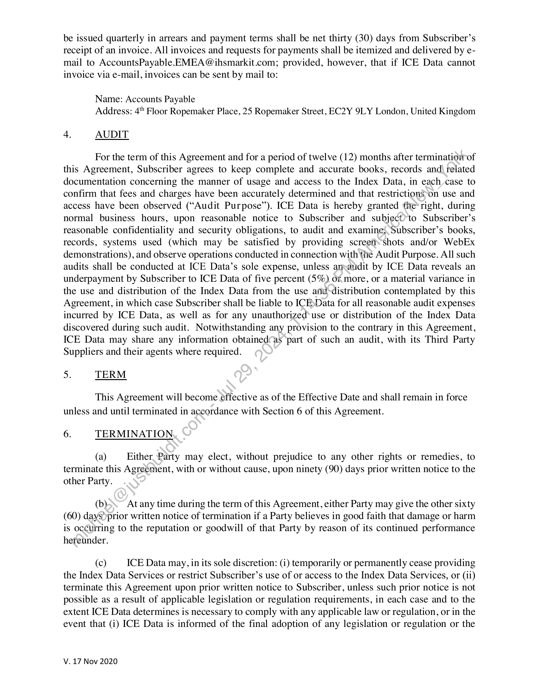
```  
```col-md
be issued quarterly in arrears and payment terms shall be net thirty (30) days from Subscriber’s
receipt of an invoice. All invoices and requests for payments shall be itemized and delivered by email to AccountsPayable. EMEA @ihsmarkit.com; provided, however, that if ICE Data cannot
invoice via e-mail, invoices can be sent by mail to:  
Name: Accounts Payable
Address: 4" Floor Ropemaker Place, 25 Ropemaker Street, EC2Y 9LY London, United Kingdom  
4. AUDIT  
For the term of this Agreement and for a period of twelve (12) months after terminatiomof
this Agreement, Subscriber agrees to keep complete and accurate books, records and\ related
documentation concerning the manner of usage and access to the Index Data, in each case to
confirm that fees and charges have been accurately determined and that restrictions~on use and
access have been observed (“Audit Purpose”). ICE Data is hereby granted the*right, during
normal business hours, upon reasonable notice to Subscriber and subject?to Subscriber’s
reasonable confidentiality and security obligations, to audit and examine} Subscriber’s books,
records, systems used (which may be satisfied by providing screenshots and/or WebEx
demonstrations), and observe operations conducted in connection with the Audit Purpose. All such
audits shall be conducted at ICE Data’s sole expense, unless ansandit by ICE Data reveals an
underpayment by Subscriber to ICE Data of five percent (5%) of more, or a material variance in
the use and distribution of the Index Data from the use and~distribution contemplated by this
Agreement, in which case Subscriber shall be liable to ICE)Data for all reasonable audit expenses
incurred by ICE Data, as well as for any unauthorized*use or distribution of the Index Data
discovered during such audit. Notwithstanding any provision to the contrary in this Agreement,
ICE Data may share any information obtained‘as ‘part of such an audit, with its Third Party
Suppliers and their agents where required.  
5. TERM  
This Agreement will become effective as of the Effective Date and shall remain in force
unless and until terminated in accordance with Section 6 of this Agreement.  
6. TERMINATION  
(a) Either Party may elect, without prejudice to any other rights or remedies, to
terminate this Agreement, with or without cause, upon ninety (90) days prior written notice to the
other Party.  
(b) At any time during the term of this Agreement, either Party may give the other sixty
(60) days’)prior written notice of termination if a Party believes in good faith that damage or harm
is occurring to the reputation or goodwill of that Party by reason of its continued performance
hereunder.  
(c) ICE Data may, in its sole discretion: (i) temporarily or permanently cease providing
the Index Data Services or restrict Subscriber’s use of or access to the Index Data Services, or (ii)
terminate this Agreement upon prior written notice to Subscriber, unless such prior notice is not
possible as a result of applicable legislation or regulation requirements, in each case and to the
extent ICE Data determines is necessary to comply with any applicable law or regulation, or in the
event that (i) ICE Data is informed of the final adoption of any legislation or regulation or the  
V. 17 Nov 2020  
```
````
Notes:    
````col
```col-md
flexGrow=.5
===
> [!info] [Page 6](_attachments/images_3.6.4.2.4.1ICE_MGL_BofAIndexDataRedistributionAgreement_20211102.pdf_155158/page_6.png)
> 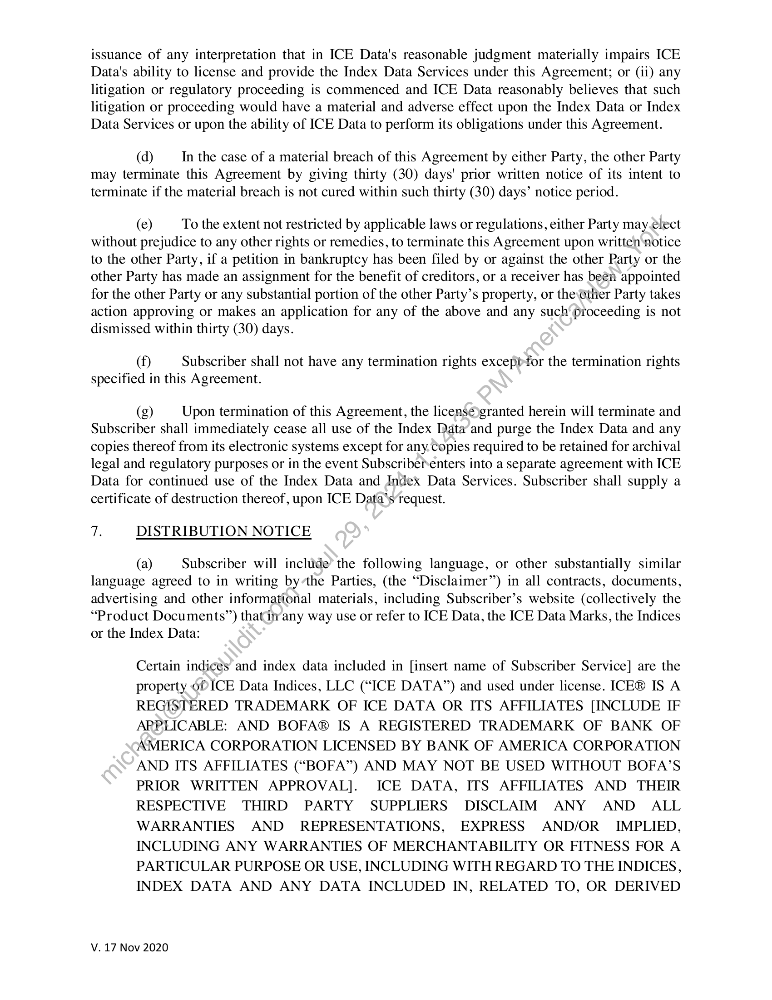
```  
```col-md
issuance of any interpretation that in ICE Data's reasonable judgment materially impairs ICE
Data's ability to license and provide the Index Data Services under this Agreement; or (ii) any
litigation or regulatory proceeding is commenced and ICE Data reasonably believes that such
litigation or proceeding would have a material and adverse effect upon the Index Data or Index
Data Services or upon the ability of ICE Data to perform its obligations under this Agreement.  
(d) In the case of a material breach of this Agreement by either Party, the other Party
may terminate this Agreement by giving thirty (30) days' prior written notice of its intent to
terminate if the material breach is not cured within such thirty (30) days’ notice period.  
(e) To the extent not restricted by applicable laws or regulations, either Party may élect
without prejudice to any other rights or remedies, to terminate this Agreement upon written notice
to the other Party, if a petition in bankruptcy has been filed by or against the other Party or the
other Party has made an assignment for the benefit of creditors, or a receiver has been appointed
for the other Party or any substantial portion of the other Party’s property, or the Other Party takes
action approving or makes an application for any of the above and any such’ proceeding is not
dismissed within thirty (30) days.  
(f) Subscriber shall not have any termination rights exceppfor the termination rights
specified in this Agreement.  
(g) Upon termination of this Agreement, the licensé)granted herein will terminate and
Subscriber shall immediately cease all use of the Index Data and purge the Index Data and any
copies thereof from its electronic systems except for any. Copies required to be retained for archival
legal and regulatory purposes or in the event Subscriber-enters into a separate agreement with ICE
Data for continued use of the Index Data and Index Data Services. Subscriber shall supply a
certificate of destruction thereof, upon ICE Data’s‘request.  
7. DISTRIBUTION NOTICE  
(a) Subscriber will include’ the following language, or other substantially similar
language agreed to in writing by’the Parties, (the “Disclaimer”) in all contracts, documents,
advertising and other informational materials, including Subscriber’s website (collectively the
“Product Documents”) thatin any way use or refer to ICE Data, the ICE Data Marks, the Indices
or the Index Data:  
Certain indices and index data included in [insert name of Subscriber Service] are the
property oP ICE Data Indices, LLC (“ICE DATA”) and used under license. ICE® IS A
REGISTERED TRADEMARK OF ICE DATA OR ITS AFFILIATES [INCLUDE IF
ARPLICABLE: AND BOFA® IS A REGISTERED TRADEMARK OF BANK OF
AMERICA CORPORATION LICENSED BY BANK OF AMERICA CORPORATION
AND ITS AFFILIATES (“BOFA”) AND MAY NOT BE USED WITHOUT BOFA’S
PRIOR WRITTEN APPROVAL]. ICE DATA, ITS AFFILIATES AND THEIR
RESPECTIVE THIRD PARTY SUPPLIERS DISCLAIM ANY AND ALL
WARRANTIES AND REPRESENTATIONS, EXPRESS AND/OR_ IMPLIED,
INCLUDING ANY WARRANTIES OF MERCHANTABILITY OR FITNESS FOR A
PARTICULAR PURPOSE OR USE, INCLUDING WITH REGARD TO THE INDICES,
INDEX DATA AND ANY DATA INCLUDED IN, RELATED TO, OR DERIVED  
V. 17 Nov 2020  
```
````
Notes:    
````col
```col-md
flexGrow=.5
===
> [!info] [Page 7](_attachments/images_3.6.4.2.4.1ICE_MGL_BofAIndexDataRedistributionAgreement_20211102.pdf_155158/page_7.png)
> 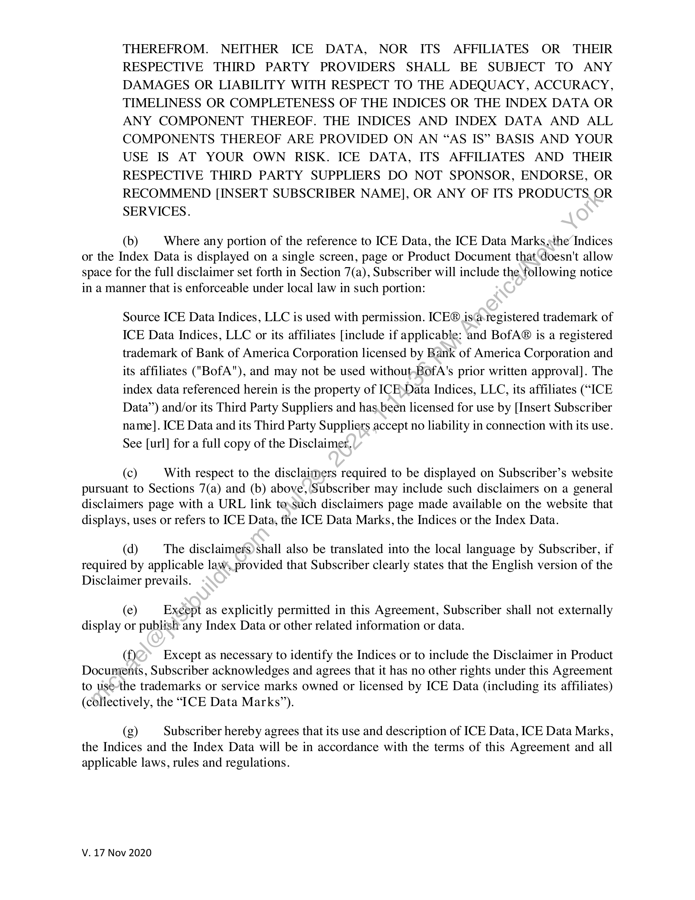
```  
```col-md
THEREFROM. NEITHER ICE DATA, NOR ITS AFFILIATES OR THEIR
RESPECTIVE THIRD PARTY PROVIDERS SHALL BE SUBJECT TO ANY
DAMAGES OR LIABILITY WITH RESPECT TO THE ADEQUACY, ACCURACY,
TIMELINESS OR COMPLETENESS OF THE INDICES OR THE INDEX DATA OR
ANY COMPONENT THEREOF. THE INDICES AND INDEX DATA AND ALL
COMPONENTS THEREOF ARE PROVIDED ON AN “AS IS” BASIS AND YOUR
USE IS AT YOUR OWN RISK. ICE DATA, ITS AFFILIATES AND THEIR
RESPECTIVE THIRD PARTY SUPPLIERS DO NOT SPONSOR, ENDORSE, OR
RECOMMEND [INSERT SUBSCRIBER NAME], OR ANY OF ITS PRODUCTS _ OR
SERVICES.  
(b) Where any portion of the reference to ICE Data, the ICE Data Marks the Indices
or the Index Data is displayed on a single screen, page or Product Document that doesn't allow
space for the full disclaimer set forth in Section 7(a), Subscriber will include the following notice
in a manner that is enforceable under local law in such portion:  
Source ICE Data Indices, LLC is used with permission. ICE® is@tegistered trademark of
ICE Data Indices, LLC or its affiliates [include if applicable: and BofA® is a registered
trademark of Bank of America Corporation licensed by Bank of America Corporation and
its affiliates ("BofA"), and may not be used without-BofA's prior written approval]. The
index data referenced herein is the property of ICE\Data Indices, LLC, its affiliates (“ICE
Data”) and/or its Third Party Suppliers and hasbeen licensed for use by [Insert Subscriber
name]. ICE Data and its Third Party Suppliers accept no liability in connection with its use.
See [url] for a full copy of the Disclaimer.  
(c) With respect to the disclaimers required to be displayed on Subscriber’s website
pursuant to Sections 7(a) and (b) above, Subscriber may include such disclaimers on a general
disclaimers page with a URL link tossuch disclaimers page made available on the website that
displays, uses or refers to ICE Data, the ICE Data Marks, the Indices or the Index Data.  
(d) The disclaimers) shall also be translated into the local language by Subscriber, if
required by applicable law, provided that Subscriber clearly states that the English version of the
Disclaimer prevails.  
(e) Except as explicitly permitted in this Agreement, Subscriber shall not externally
display or publish any Index Data or other related information or data.  
f) Except as necessary to identify the Indices or to include the Disclaimer in Product
Documents, Subscriber acknowledges and agrees that it has no other rights under this Agreement
to use-the trademarks or service marks owned or licensed by ICE Data (including its affiliates)
(collectively, the “ICE Data Marks”).  
(g) Subscriber hereby agrees that its use and description of ICE Data, ICE Data Marks,  
the Indices and the Index Data will be in accordance with the terms of this Agreement and all
applicable laws, rules and regulations.  
V. 17 Nov 2020  
```
````
Notes:    
````col
```col-md
flexGrow=.5
===
> [!info] [Page 8](_attachments/images_3.6.4.2.4.1ICE_MGL_BofAIndexDataRedistributionAgreement_20211102.pdf_155158/page_8.png)
> 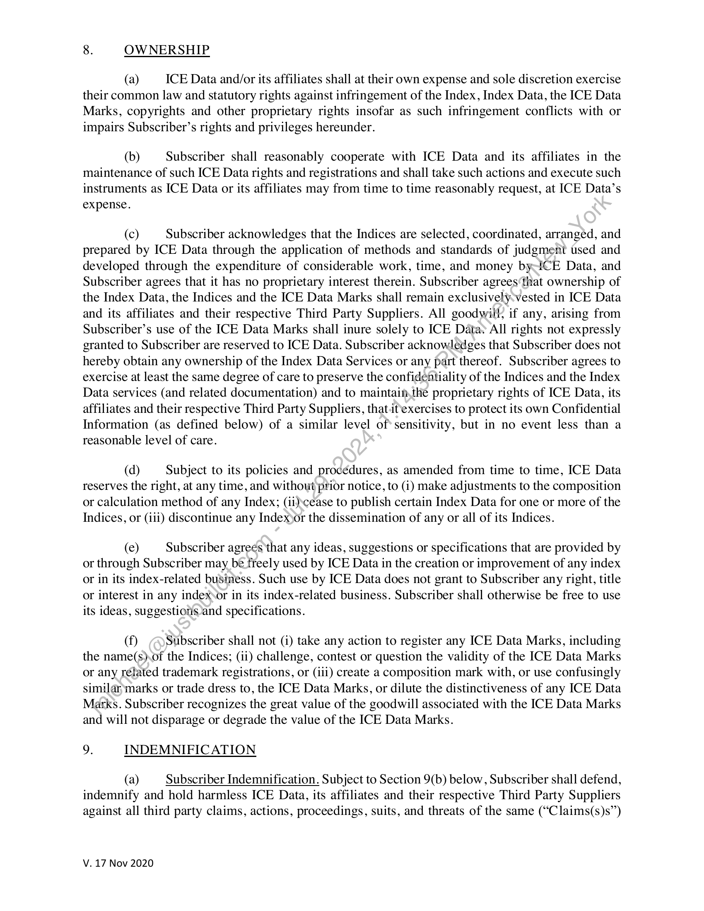
```  
```col-md
8. OWNERSHIP  
(a) ICE Data and/or its affiliates shall at their own expense and sole discretion exercise
their common law and statutory rights against infringement of the Index, Index Data, the ICE Data
Marks, copyrights and other proprietary rights insofar as such infringement conflicts with or
impairs Subscriber’s rights and privileges hereunder.  
(b) Subscriber shall reasonably cooperate with ICE Data and its affiliates in the
maintenance of such ICE Data rights and registrations and shall take such actions and execute such
instruments as ICE Data or its affiliates may from time to time reasonably request, at ICE Data’s
expense.  
(c) Subscriber acknowledges that the Indices are selected, coordinated, arranged, and
prepared by ICE Data through the application of methods and standards of judgment used and
developed through the expenditure of considerable work, time, and money by-ICE Data, and
Subscriber agrees that it has no proprietary interest therein. Subscriber agrees‘that ownership of
the Index Data, the Indices and the ICE Data Marks shall remain exclusively-vested in ICE Data
and its affiliates and their respective Third Party Suppliers. All goodwill, if any, arising from
Subscriber’s use of the ICE Data Marks shall inure solely to ICE Data? All rights not expressly
granted to Subscriber are reserved to ICE Data. Subscriber acknowledges that Subscriber does not
hereby obtain any ownership of the Index Data Services or any part thereof. Subscriber agrees to
exercise at least the same degree of care to preserve the confidentiality of the Indices and the Index
Data services (and related documentation) and to maintain,the proprietary rights of ICE Data, its
affiliates and their respective Third Party Suppliers, that.it'exercises to protect its own Confidential
Information (as defined below) of a similar level of* sensitivity, but in no event less than a
reasonable level of care.  
(d) Subject to its policies and procedures, as amended from time to time, ICE Data
reserves the right, at any time, and without prior notice, to (i) make adjustments to the composition
or calculation method of any Index; (ii)cease to publish certain Index Data for one or more of the
Indices, or (iii) discontinue any Index)or the dissemination of any or all of its Indices.  
(e) Subscriber agrees that any ideas, suggestions or specifications that are provided by
or through Subscriber may be freely used by ICE Data in the creation or improvement of any index
or in its index-related business. Such use by ICE Data does not grant to Subscriber any right, title
or interest in any indexsor in its index-related business. Subscriber shall otherwise be free to use
its ideas, suggestions and specifications.  
(f) Subscriber shall not (i) take any action to register any ICE Data Marks, including
the name(s).of the Indices; (ii) challenge, contest or question the validity of the ICE Data Marks
or any related trademark registrations, or (iii) create a composition mark with, or use confusingly
similar marks or trade dress to, the ICE Data Marks, or dilute the distinctiveness of any ICE Data
Marks. Subscriber recognizes the great value of the goodwill associated with the ICE Data Marks
and will not disparage or degrade the value of the ICE Data Marks.  
9. INDEMNIFICATION  
(a) Subscriber Indemnification. Subject to Section 9(b) below, Subscriber shall defend,
indemnify and hold harmless ICE Data, its affiliates and their respective Third Party Suppliers
against all third party claims, actions, proceedings, suits, and threats of the same (“Claims(s)s”)  
V. 17 Nov 2020  
```
````
Notes:    
````col
```col-md
flexGrow=.5
===
> [!info] [Page 9](_attachments/images_3.6.4.2.4.1ICE_MGL_BofAIndexDataRedistributionAgreement_20211102.pdf_155158/page_9.png)
> 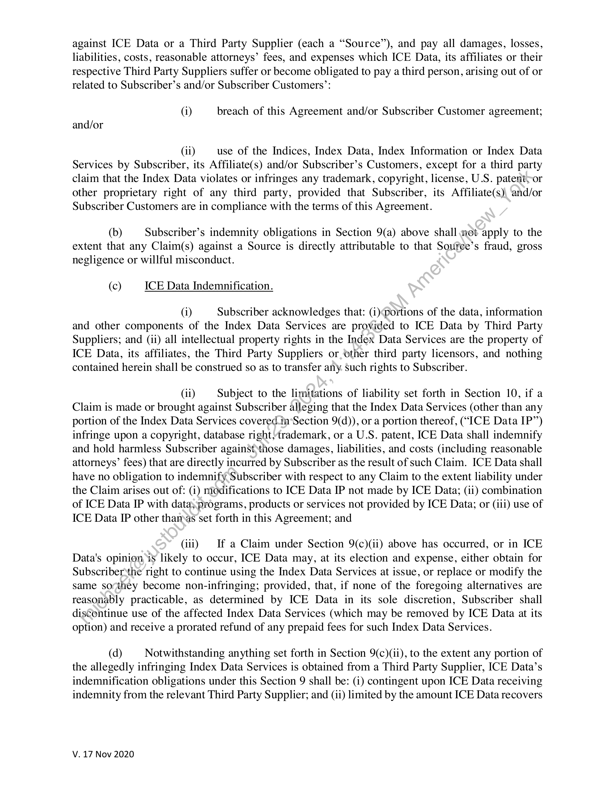
```  
```col-md
against ICE Data or a Third Party Supplier (each a “Source”), and pay all damages, losses,
liabilities, costs, reasonable attorneys’ fees, and expenses which ICE Data, its affiliates or their
respective Third Party Suppliers suffer or become obligated to pay a third person, arising out of or
related to Subscriber’s and/or Subscriber Customers’:  
(i) breach of this Agreement and/or Subscriber Customer agreement;
and/or  
(ii) use of the Indices, Index Data, Index Information or Index Data
Services by Subscriber, its Affiliate(s) and/or Subscriber’s Customers, except for a third party
claim that the Index Data violates or infringes any trademark, copyright, license, U.S. patent>or
other proprietary right of any third party, provided that Subscriber, its Affiliate(s) ‘and/or
Subscriber Customers are in compliance with the terms of this Agreement.  
(b) Subscriber’s indemnity obligations in Section 9(a) above shall met apply to the
extent that any Claim(s) against a Source is directly attributable to that Souree’s fraud, gross
negligence or willful misconduct.  
(c) ICE Data Indemnification.  
(i) Subscriber acknowledges that: (i)portions of the data, information
and other components of the Index Data Services are provided to ICE Data by Third Party
Suppliers; and (ii) all intellectual property rights in the Index Data Services are the property of
ICE Data, its affiliates, the Third Party Suppliers or, other third party licensors, and nothing
contained herein shall be construed so as to transfer any. such rights to Subscriber.  
(ii) Subject to the limitations of liability set forth in Section 10, if a
Claim is made or brought against Subscriber alleging that the Index Data Services (other than any
portion of the Index Data Services covered. in’Section 9(d)), or a portion thereof, (“ICE Data IP”)
infringe upon a copyright, database right,trademark, or a U.S. patent, ICE Data shall indemnify
and hold harmless Subscriber againstthose damages, liabilities, and costs (including reasonable
attorneys’ fees) that are directly incurred by Subscriber as the result of such Claim. ICE Data shall
have no obligation to indemnify Subscriber with respect to any Claim to the extent liability under
the Claim arises out of: (i) modifications to ICE Data IP not made by ICE Data; (ii) combination
of ICE Data IP with data;:programs, products or services not provided by ICE Data; or (iii) use of
ICE Data IP other thansas set forth in this Agreement; and  
(iii) If a Claim under Section 9(c)(ii) above has occurred, or in ICE
Data's opinion, is likely to occur, ICE Data may, at its election and expense, either obtain for
Subscriber‘the right to continue using the Index Data Services at issue, or replace or modify the
same sovthey become non-infringing; provided, that, if none of the foregoing alternatives are
reasonably practicable, as determined by ICE Data in its sole discretion, Subscriber shall
discontinue use of the affected Index Data Services (which may be removed by ICE Data at its
option) and receive a prorated refund of any prepaid fees for such Index Data Services.  
(d) Notwithstanding anything set forth in Section 9(c)(ii), to the extent any portion of
the allegedly infringing Index Data Services is obtained from a Third Party Supplier, ICE Data’s
indemnification obligations under this Section 9 shall be: (i) contingent upon ICE Data receiving
indemnity from the relevant Third Party Supplier; and (ii) limited by the amount ICE Data recovers  
V. 17 Nov 2020  
```
````
Notes:    
````col
```col-md
flexGrow=.5
===
> [!info] [Page 10](_attachments/images_3.6.4.2.4.1ICE_MGL_BofAIndexDataRedistributionAgreement_20211102.pdf_155158/page_10.png)
> 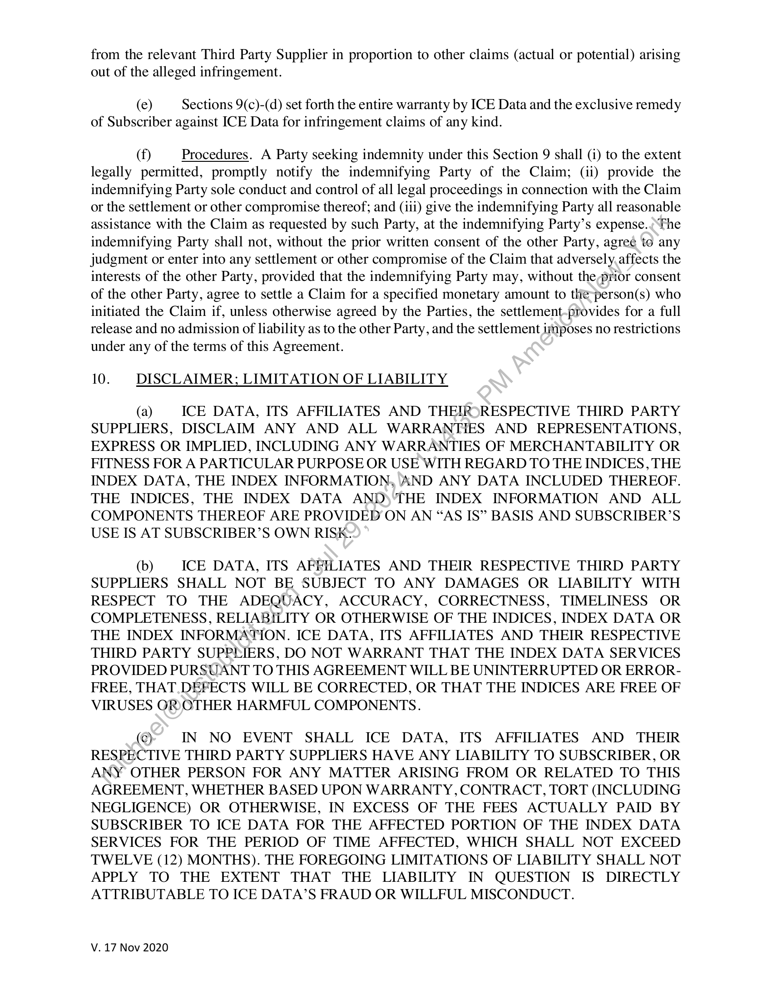
```  
```col-md
from the relevant Third Party Supplier in proportion to other claims (actual or potential) arising
out of the alleged infringement.  
(e) Sections 9(c)-(d) set forth the entire warranty by ICE Data and the exclusive remedy
of Subscriber against ICE Data for infringement claims of any kind.  
(f) Procedures. A Party seeking indemnity under this Section 9 shall (i) to the extent
legally permitted, promptly notify the indemnifying Party of the Claim; (ii) provide the
indemnifying Party sole conduct and control of all legal proceedings in connection with the Claim
or the settlement or other compromise thereof; and (iii) give the indemnifying Party all reasonable
assistance with the Claim as requested by such Party, at the indemnifying Party’s expense. The
indemnifying Party shall not, without the prior written consent of the other Party, agree to any
judgment or enter into any settlement or other compromise of the Claim that adversely, affects the
interests of the other Party, provided that the indemnifying Party may, without the,prior consent
of the other Party, agree to settle a Claim for a specified monetary amount to the-person(s) who
initiated the Claim if, unless otherwise agreed by the Parties, the settlement-provides for a full
release and no admission of liability as to the other Party, and the settlement imposes no restrictions
under any of the terms of this Agreement.  
10. DISCLAIMER; LIMITATION OF LIABILITY  
(a) ICE DATA, ITS AFFILIATES AND THEIRORESPECTIVE THIRD PARTY
SUPPLIERS, DISCLAIM ANY AND ALL WARRANTIES AND REPRESENTATIONS,
EXPRESS OR IMPLIED, INCLUDING ANY WARRANTIES OF MERCHANTABILITY OR
FITNESS FOR A PARTICULAR PURPOSE OR USE WITH REGARD TO THE INDICES, THE
INDEX DATA, THE INDEX INFORMATION, AND ANY DATA INCLUDED THEREOF.
THE INDICES, THE INDEX DATA AND)’THE INDEX INFORMATION AND ALL
COMPONENTS THEREOF ARE PROVIDED ON AN “AS IS” BASIS AND SUBSCRIBER’S
USE IS AT SUBSCRIBER’S OWN RISK:>  
(b) ICE DATA, ITS AFFILIATES AND THEIR RESPECTIVE THIRD PARTY
SUPPLIERS SHALL NOT BE SUBJECT TO ANY DAMAGES OR LIABILITY WITH
RESPECT TO THE ADEQUACY, ACCURACY, CORRECTNESS, TIMELINESS OR
COMPLETENESS, RELIABILITY OR OTHERWISE OF THE INDICES, INDEX DATA OR
THE INDEX INFORMATION. ICE DATA, ITS AFFILIATES AND THEIR RESPECTIVE
THIRD PARTY SUPPLIERS, DO NOT WARRANT THAT THE INDEX DATA SERVICES
PROVIDED PURSUANT TO THIS AGREEMENT WILL BE UNINTERRUPTED OR ERRORFREE, THAT.DEFECTS WILL BE CORRECTED, OR THAT THE INDICES ARE FREE OF
VIRUSES GRXOTHER HARMFUL COMPONENTS.  
(e) IN NO EVENT SHALL ICE DATA, ITS AFFILIATES AND THEIR
RESPECTIVE THIRD PARTY SUPPLIERS HAVE ANY LIABILITY TO SUBSCRIBER, OR
ANY OTHER PERSON FOR ANY MATTER ARISING FROM OR RELATED TO THIS
AGREEMENT, WHETHER BASED UPON WARRANTY, CONTRACT, TORT (INCLUDING
NEGLIGENCE) OR OTHERWISE, IN EXCESS OF THE FEES ACTUALLY PAID BY
SUBSCRIBER TO ICE DATA FOR THE AFFECTED PORTION OF THE INDEX DATA
SERVICES FOR THE PERIOD OF TIME AFFECTED, WHICH SHALL NOT EXCEED
TWELVE (12) MONTHS). THE FOREGOING LIMITATIONS OF LIABILITY SHALL NOT
APPLY TO THE EXTENT THAT THE LIABILITY IN QUESTION IS DIRECTLY
ATTRIBUTABLE TO ICE DATA’S FRAUD OR WILLFUL MISCONDUCT.  
V. 17 Nov 2020  
```
````
Notes:    
````col
```col-md
flexGrow=.5
===
> [!info] [Page 11](_attachments/images_3.6.4.2.4.1ICE_MGL_BofAIndexDataRedistributionAgreement_20211102.pdf_155158/page_11.png)
> 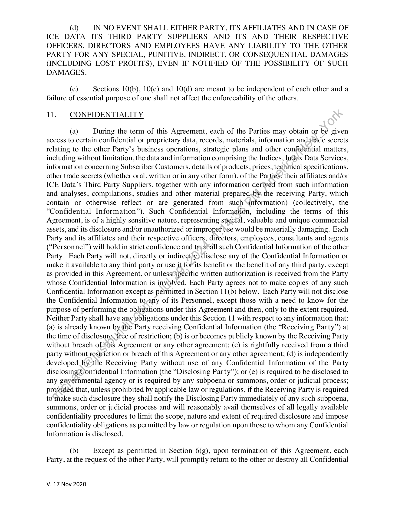
```  
```col-md
(d) IN NO EVENT SHALL EITHER PARTY, ITS AFFILIATES AND IN CASE OF
ICE DATA ITS THIRD PARTY SUPPLIERS AND ITS AND THEIR RESPECTIVE
OFFICERS, DIRECTORS AND EMPLOYEES HAVE ANY LIABILITY TO THE OTHER
PARTY FOR ANY SPECIAL, PUNITIVE, INDIRECT, OR CONSEQUENTIAL DAMAGES
(INCLUDING LOST PROFITS), EVEN IF NOTIFIED OF THE POSSIBILITY OF SUCH
DAMAGES.  
(e) Sections 10(b), 10(c) and 10(d) are meant to be independent of each other and a
failure of essential purpose of one shall not affect the enforceability of the others.  
11. CONFIDENTIALITY  
(a) During the term of this Agreement, each of the Parties may obtain or be given
access to certain confidential or proprietary data, records, materials, information and-trade secrets
relating to the other Party’s business operations, strategic plans and other confidential matters,
including without limitation, the data and information comprising the Indices, Index Data Services,
information concerning Subscriber Customers, details of products, prices, techiical specifications,
other trade secrets (whether oral, written or in any other form), of the Parties; their affiliates and/or
ICE Data’s Third Party Suppliers, together with any information derived from such information
and analyses, compilations, studies and other material prepared.by. the receiving Party, which
contain or otherwise reflect or are generated from such information) (collectively, the
“Confidential Information”). Such Confidential Information, including the terms of this
Agreement, is of a highly sensitive nature, representing special, valuable and unique commercial
assets, and its disclosure and/or unauthorized or improper tse would be materially damaging. Each
Party and its affiliates and their respective officers, directors, employees, consultants and agents
(“Personnel”) will hold in strict confidence and trust‘all such Confidential Information of the other
Party. Each Party will not, directly or indirectly) disclose any of the Confidential Information or
make it available to any third party or use it forits benefit or the benefit of any third party, except
as provided in this Agreement, or unless‘Specific written authorization is received from the Party
whose Confidential Information is involved. Each Party agrees not to make copies of any such
Confidential Information except as permitted in Section 11(b) below. Each Party will not disclose
the Confidential Information to,any of its Personnel, except those with a need to know for the
purpose of performing the obligations under this Agreement and then, only to the extent required.
Neither Party shall have any obligations under this Section 11 with respect to any information that:
(a) is already known by the Party receiving Confidential Information (the “Receiving Party”) at
the time of disclosure, free of restriction; (b) is or becomes publicly known by the Receiving Party
without breach of this Agreement or any other agreement; (c) is rightfully received from a third
party without restriction or breach of this Agreement or any other agreement; (d) is independently
developed bythe Receiving Party without use of any Confidential Information of the Party
disclosingConfidential Information (the “Disclosing Party”); or (e) is required to be disclosed to
any governmental agency or is required by any subpoena or summons, order or judicial process;
provided that, unless prohibited by applicable law or regulations, if the Receiving Party is required
to:make such disclosure they shall notify the Disclosing Party immediately of any such subpoena,
summons, order or judicial process and will reasonably avail themselves of all legally available
confidentiality procedures to limit the scope, nature and extent of required disclosure and impose
confidentiality obligations as permitted by law or regulation upon those to whom any Confidential
Information is disclosed.  
(b) Except as permitted in Section 6(g), upon termination of this Agreement, each
Party, at the request of the other Party, will promptly return to the other or destroy all Confidential  
V. 17 Nov 2020  
```
````
Notes:    
````col
```col-md
flexGrow=.5
===
> [!info] [Page 12](_attachments/images_3.6.4.2.4.1ICE_MGL_BofAIndexDataRedistributionAgreement_20211102.pdf_155158/page_12.png)
> 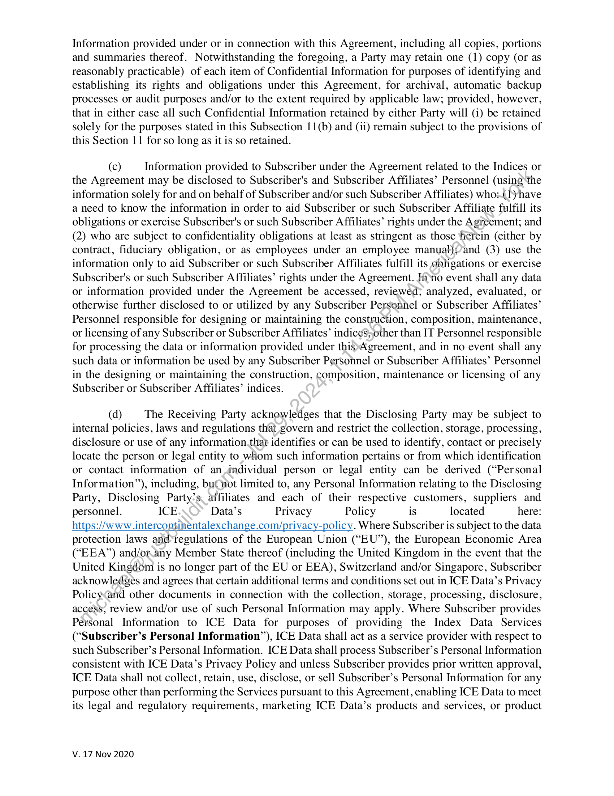
```  
```col-md
Information provided under or in connection with this Agreement, including all copies, portions
and summaries thereof. Notwithstanding the foregoing, a Party may retain one (1) copy (or as
reasonably practicable) of each item of Confidential Information for purposes of identifying and
establishing its rights and obligations under this Agreement, for archival, automatic backup
processes or audit purposes and/or to the extent required by applicable law; provided, however,
that in either case all such Confidential Information retained by either Party will (i) be retained
solely for the purposes stated in this Subsection 11(b) and (ii) remain subject to the provisions of
this Section 11 for so long as it is so retained.  
(c) Information provided to Subscriber under the Agreement related to the Indices or
the Agreement may be disclosed to Subscriber's and Subscriber Affiliates’ Personnel (using the
information solely for and on behalf of Subscriber and/or such Subscriber Affiliates) who:(1yhave
a need to know the information in order to aid Subscriber or such Subscriber Affiliate fulfill its
obligations or exercise Subscriber's or such Subscriber Affiliates’ rights under the Agreement; and
(2) who are subject to confidentiality obligations at least as stringent as those ‘herein (either by
contract, fiduciary obligation, or as employees under an employee manual)s/and (3) use the
information only to aid Subscriber or such Subscriber Affiliates fulfill its obligations or exercise
Subscriber's or such Subscriber Affiliates’ rights under the Agreement. In’no event shall any data
or information provided under the Agreement be accessed, reviewed; analyzed, evaluated, or
otherwise further disclosed to or utilized by any Subscriber Personnel or Subscriber Affiliates’
Personnel responsible for designing or maintaining the construction, composition, maintenance,
or licensing of any Subscriber or Subscriber Affiliates’ indices;other than IT Personnel responsible
for processing the data or information provided under this»Agreement, and in no event shall any
such data or information be used by any Subscriber Personnel or Subscriber Affiliates’ Personnel
in the designing or maintaining the construction, composition, maintenance or licensing of any
Subscriber or Subscriber Affiliates’ indices.  
(d) The Receiving Party acknowledges that the Disclosing Party may be subject to
internal policies, laws and regulations that govern and restrict the collection, storage, processing,
disclosure or use of any information.that identifies or can be used to identify, contact or precisely
locate the person or legal entity to whom such information pertains or from which identification
or contact information of an individual person or legal entity can be derived (“Personal
Information”), including, buf not limited to, any Personal Information relating to the Disclosing
Party, Disclosing Party’s affiliates and each of their respective customers, suppliers and
personnel. ICE Data’s Privacy Policy is located here:
https://www .intercontinentalexchange.com/privacy-policy. Where Subscriber is subject to the data
protection laws and*regulations of the European Union (“EU”), the European Economic Area
(“EEA”) and/or.any Member State thereof (including the United Kingdom in the event that the
United Kingdom is no longer part of the EU or EEA), Switzerland and/or Singapore, Subscriber
acknowledges and agrees that certain additional terms and conditions set out in ICE Data’s Privacy
Policyvand other documents in connection with the collection, storage, processing, disclosure,
access, review and/or use of such Personal Information may apply. Where Subscriber provides
Personal Information to ICE Data for purposes of providing the Index Data Services
(“Subscriber’s Personal Information”), ICE Data shall act as a service provider with respect to
such Subscriber’s Personal Information. ICE Data shall process Subscriber’s Personal Information
consistent with ICE Data’s Privacy Policy and unless Subscriber provides prior written approval,
ICE Data shall not collect, retain, use, disclose, or sell Subscriber’s Personal Information for any
purpose other than performing the Services pursuant to this Agreement, enabling ICE Data to meet
its legal and regulatory requirements, marketing ICE Data’s products and services, or product  
V. 17 Nov 2020  
```
````
Notes:    
````col
```col-md
flexGrow=.5
===
> [!info] [Page 13](_attachments/images_3.6.4.2.4.1ICE_MGL_BofAIndexDataRedistributionAgreement_20211102.pdf_155158/page_13.png)
> 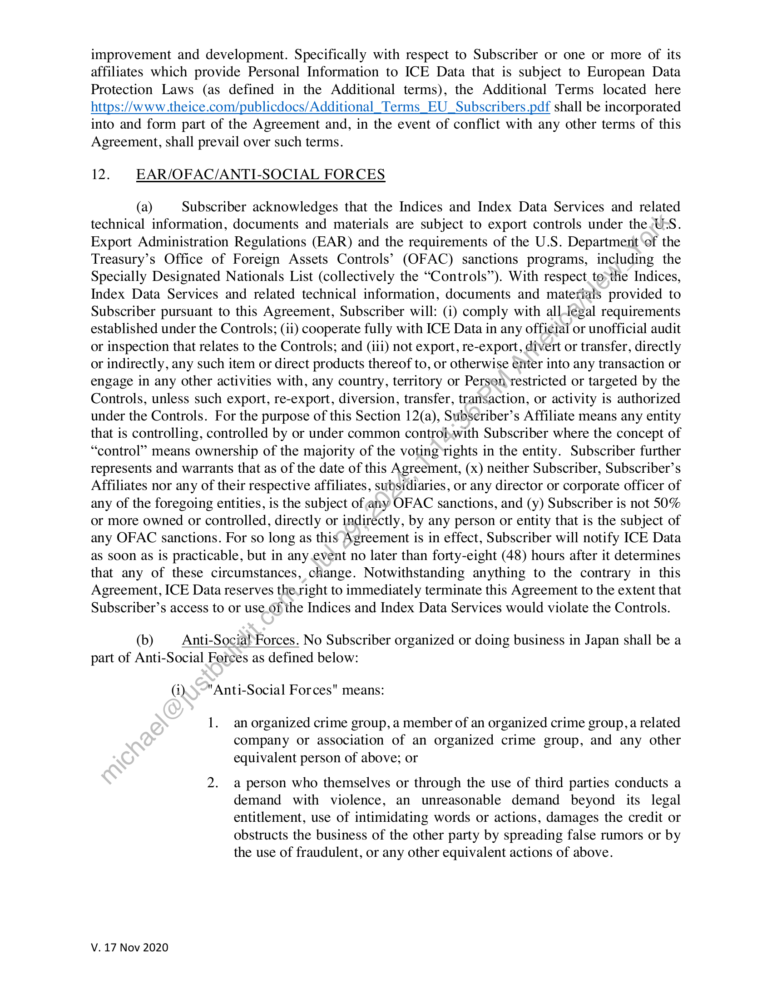
```  
```col-md
improvement and development. Specifically with respect to Subscriber or one or more of its
affiliates which provide Personal Information to ICE Data that is subject to European Data
Protection Laws (as defined in the Additional terms), the Additional Terms located here
https://www.theice.com/publicdocs/Additional_Terms EU_Subscribers.pdf shall be incorporated
into and form part of the Agreement and, in the event of conflict with any other terms of this
Agreement, shall prevail over such terms.  
12. EAR/OFAC/ANTI-SOCIAL FORCES  
(a) Subscriber acknowledges that the Indices and Index Data Services and related
technical information, documents and materials are subject to export controls under the,U:S.
Export Administration Regulations (EAR) and the requirements of the U.S. Department‘of the
Treasury’s Office of Foreign Assets Controls’ (OFAC) sanctions programs, including the
Specially Designated Nationals List (collectively the “Controls”). With respect tothe Indices,
Index Data Services and related technical information, documents and materials provided to
Subscriber pursuant to this Agreement, Subscriber will: (i) comply with all-legal requirements
established under the Controls; (ii) cooperate fully with ICE Data in any official or unofficial audit
or inspection that relates to the Controls; and (iii) not export, re-export, divert or transfer, directly
or indirectly, any such item or direct products thereof to, or otherwise enter into any transaction or
engage in any other activities with, any country, territory or Person ‘restricted or targeted by the
Controls, unless such export, re-export, diversion, transfer, transaction, or activity is authorized
under the Controls. For the purpose of this Section 12(a), Subseriber’s Affiliate means any entity
that is controlling, controlled by or under common controhwith Subscriber where the concept of
“control” means ownership of the majority of the voting rights in the entity. Subscriber further
represents and warrants that as of the date of this Agreement, (x) neither Subscriber, Subscriber’s
Affiliates nor any of their respective affiliates, subsidiaries, or any director or corporate officer of
any of the foregoing entities, is the subject of any OFAC sanctions, and (y) Subscriber is not 50%
or more owned or controlled, directly or indirectly, by any person or entity that is the subject of
any OFAC sanctions. For so long as this Agreement is in effect, Subscriber will notify ICE Data
as soon as is practicable, but in any event no later than forty-eight (48) hours after it determines
that any of these circumstances, change. Notwithstanding anything to the contrary in this
Agreement, ICE Data reserves the.right to immediately terminate this Agreement to the extent that
Subscriber’s access to or use.of the Indices and Index Data Services would violate the Controls.  
(b) Anti-Social’Forces. No Subscriber organized or doing business in Japan shall be a
part of Anti-Social Forces as defined below:  
(i) )~"Anti-Social Forces" means:  
1. an organized crime group, a member of an organized crime group, a related
company or association of an organized crime group, and any other
equivalent person of above; or  
2. a person who themselves or through the use of third parties conducts a
demand with violence, an unreasonable demand beyond its legal
entitlement, use of intimidating words or actions, damages the credit or
obstructs the business of the other party by spreading false rumors or by
the use of fraudulent, or any other equivalent actions of above.  
V. 17 Nov 2020  
```
````
Notes:    
````col
```col-md
flexGrow=.5
===
> [!info] [Page 14](_attachments/images_3.6.4.2.4.1ICE_MGL_BofAIndexDataRedistributionAgreement_20211102.pdf_155158/page_14.png)
> 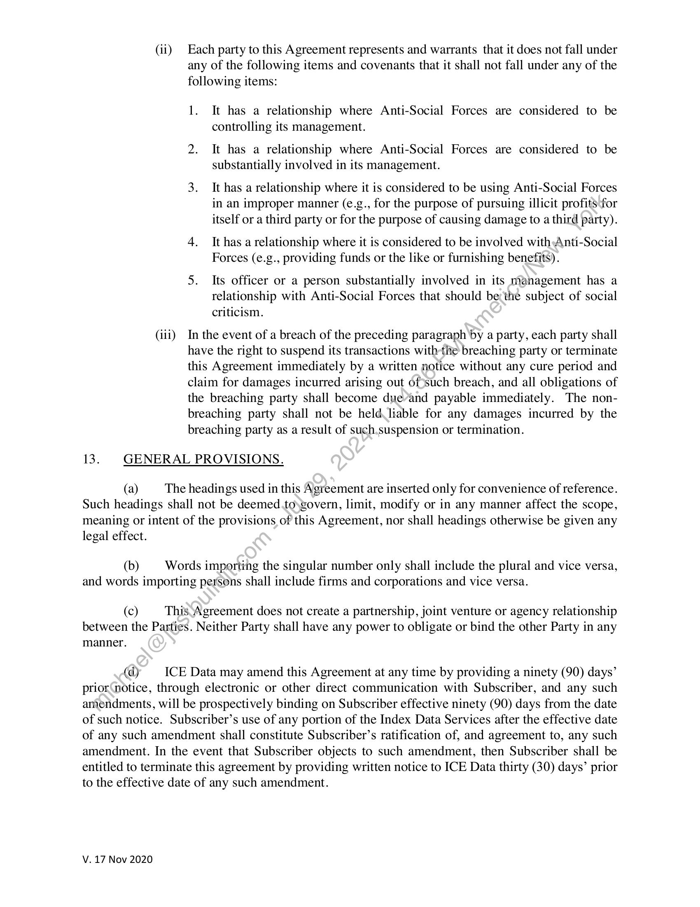
```  
```col-md
(ii) Each party to this Agreement represents and warrants that it does not fall under
any of the following items and covenants that it shall not fall under any of the
following items:  
1. It has a relationship where Anti-Social Forces are considered to be
controlling its management.  
2. It has a relationship where Anti-Social Forces are considered to be
substantially involved in its management.  
3. It has a relationship where it is considered to be using Anti-Social Forces
in an improper manner (e.g., for the purpose of pursuing illicit profits for
itself or a third party or for the purpose of causing damage to a third party).  
4. It has a relationship where it is considered to be involved with Anti-Social
Forces (e.g., providing funds or the like or furnishing benefits).  
5. Its officer or a person substantially involved in its management has a
relationship with Anti-Social Forces that should becthe subject of social
criticism.  
(iii) In the event of a breach of the preceding paragraph by a party, each party shall
have the right to suspend its transactions with-the breaching party or terminate
this Agreement immediately by a written notice without any cure period and
claim for damages incurred arising out of such breach, and all obligations of
the breaching party shall become duevand payable immediately. The nonbreaching party shall not be held liable for any damages incurred by the
breaching party as a result of such.suspension or termination.  
13. GENERAL PROVISIONS.  
(a) The headings used in this Agreement are inserted only for convenience of reference.
Such headings shall not be deemed .to\govern, limit, modify or in any manner affect the scope,
meaning or intent of the provisions of this Agreement, nor shall headings otherwise be given any
legal effect.  
(b) Words importing the singular number only shall include the plural and vice versa,
and words importing persons shall include firms and corporations and vice versa.  
(c) This Agreement does not create a partnership, joint venture or agency relationship
between the Parties. Neither Party shall have any power to obligate or bind the other Party in any
manner.  
(dy ICE Data may amend this Agreement at any time by providing a ninety (90) days’
prior‘notice, through electronic or other direct communication with Subscriber, and any such
amendments, will be prospectively binding on Subscriber effective ninety (90) days from the date
of such notice. Subscriber’s use of any portion of the Index Data Services after the effective date
of any such amendment shall constitute Subscriber’s ratification of, and agreement to, any such
amendment. In the event that Subscriber objects to such amendment, then Subscriber shall be
entitled to terminate this agreement by providing written notice to ICE Data thirty (30) days’ prior
to the effective date of any such amendment.  
V. 17 Nov 2020  
```
````
Notes:    
````col
```col-md
flexGrow=.5
===
> [!info] [Page 15](_attachments/images_3.6.4.2.4.1ICE_MGL_BofAIndexDataRedistributionAgreement_20211102.pdf_155158/page_15.png)
> 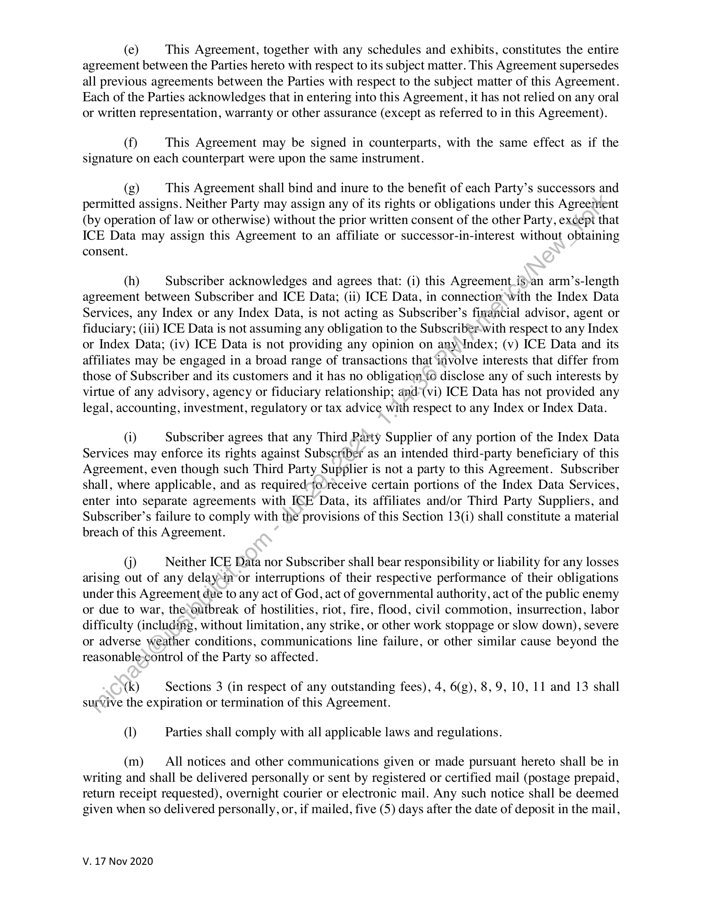
```  
```col-md
(e) This Agreement, together with any schedules and exhibits, constitutes the entire
agreement between the Parties hereto with respect to its subject matter. This Agreement supersedes
all previous agreements between the Parties with respect to the subject matter of this Agreement.
Each of the Parties acknowledges that in entering into this Agreement, it has not relied on any oral
or written representation, warranty or other assurance (except as referred to in this Agreement).  
(f) This Agreement may be signed in counterparts, with the same effect as if the
signature on each counterpart were upon the same instrument.  
(g) This Agreement shall bind and inure to the benefit of each Party’s successors and
permitted assigns. Neither Party may assign any of its rights or obligations under this Agreement
(by operation of law or otherwise) without the prior written consent of the other Party, except that
ICE Data may assign this Agreement to an affiliate or successor-in-interest without obtaining
consent.  
(h) Subscriber acknowledges and agrees that: (1) this Agreement_isyan arm’s-length
agreement between Subscriber and ICE Data; (ii) ICE Data, in connection with the Index Data
Services, any Index or any Index Data, is not acting as Subscriber’s financial advisor, agent or
fiduciary; (iii) ICE Data is not assuming any obligation to the Subscriber-with respect to any Index
or Index Data; (iv) ICE Data is not providing any opinion on any“Index; (v) ICE Data and its
affiliates may be engaged in a broad range of transactions that involve interests that differ from
those of Subscriber and its customers and it has no obligation to disclose any of such interests by
virtue of any advisory, agency or fiduciary relationship; and°(vi) ICE Data has not provided any
legal, accounting, investment, regulatory or tax advice with respect to any Index or Index Data.  
(i) Subscriber agrees that any Third Party Supplier of any portion of the Index Data
Services may enforce its rights against Subscriber as an intended third-party beneficiary of this
Agreement, even though such Third Party Supplier is not a party to this Agreement. Subscriber
shall, where applicable, and as required-to-receive certain portions of the Index Data Services,
enter into separate agreements with IGE Data, its affiliates and/or Third Party Suppliers, and
Subscriber’s failure to comply with the provisions of this Section 13(i) shall constitute a material
breach of this Agreement.  
Gj) Neither ICE Data nor Subscriber shall bear responsibility or liability for any losses
arising out of any delay©in’or interruptions of their respective performance of their obligations
under this Agreement due to any act of God, act of governmental authority, act of the public enemy
or due to war, theeoutbreak of hostilities, riot, fire, flood, civil commotion, insurrection, labor
difficulty (including, without limitation, any strike, or other work stoppage or slow down), severe
or adverse weather conditions, communications line failure, or other similar cause beyond the
reasonable-control of the Party so affected.  
(k) Sections 3 (in respect of any outstanding fees), 4, 6(g), 8,9, 10, 11 and 13 shall
survive the expiration or termination of this Agreement.  
(60) Parties shall comply with all applicable laws and regulations.
(m) All notices and other communications given or made pursuant hereto shall be in
writing and shall be delivered personally or sent by registered or certified mail (postage prepaid,  
return receipt requested), overnight courier or electronic mail. Any such notice shall be deemed
given when so delivered personally, or, if mailed, five (5) days after the date of deposit in the mail,  
V. 17 Nov 2020  
```
````
Notes:    
````col
```col-md
flexGrow=.5
===
> [!info] [Page 16](_attachments/images_3.6.4.2.4.1ICE_MGL_BofAIndexDataRedistributionAgreement_20211102.pdf_155158/page_16.png)
> 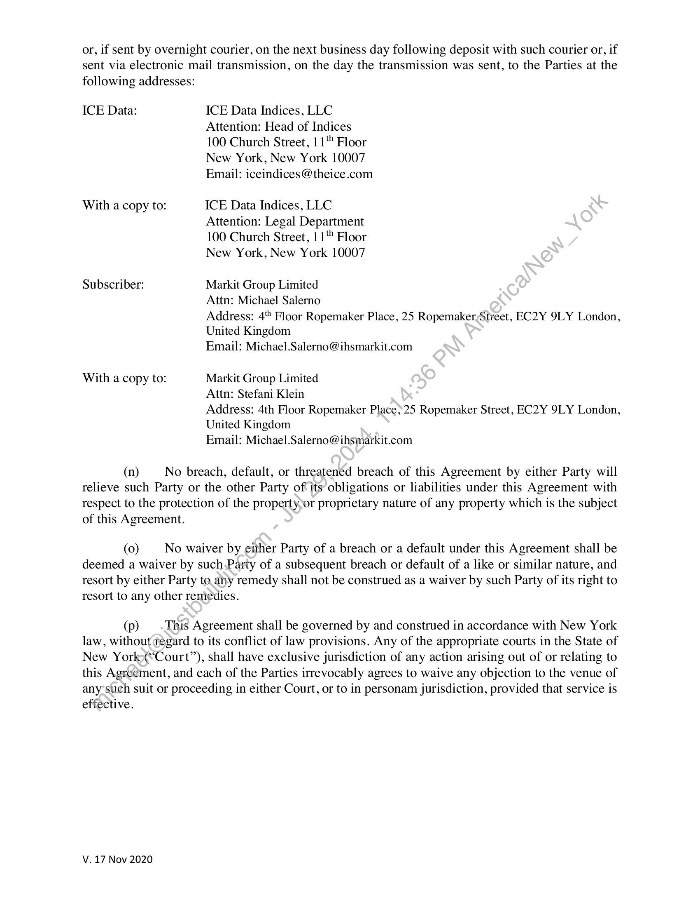
```  
```col-md
or, if sent by overnight courier, on the next business day following deposit with such courier or, if
sent via electronic mail transmission, on the day the transmission was sent, to the Parties at the
following addresses:  
ICE Data: ICE Data Indices, LLC
Attention: Head of Indices
100 Church Street, 11" Floor
New York, New York 10007
Email: iceindices@theice.com  
With a copy to: ICE Data Indices, LLC
Attention: Legal Department
100 Church Street, 11" Floor
New York, New York 10007  
Subscriber: Markit Group Limited
Attn: Michael Salerno
Address: 4" Floor Ropemaker Place, 25 Ropemaker,Street, EC2Y 9LY London,
United Kingdom
Email: Michael.Salerno@ihsmarkit.com  
With a copy to: Markit Group Limited
Attn: Stefani Klein
Address: 4th Floor Ropemaker Place;>25 Ropemaker Street, EC2Y 9LY London,
United Kingdom
Email: Michael.Salerno@ihsmarkit.com  
(n) No breach, default, or threatened breach of this Agreement by either Party will
relieve such Party or the other Party of its obligations or liabilities under this Agreement with
respect to the protection of the property‘or proprietary nature of any property which is the subject
of this Agreement.  
(0) No waiver by either Party of a breach or a default under this Agreement shall be
deemed a waiver by such.Party of a subsequent breach or default of a like or similar nature, and
resort by either Party to. any remedy shall not be construed as a waiver by such Party of its right to
resort to any other remedies.  
(p) This Agreement shall be governed by and construed in accordance with New York
law, without regard to its conflict of law provisions. Any of the appropriate courts in the State of
New York(“Court”), shall have exclusive jurisdiction of any action arising out of or relating to
this Agreement, and each of the Parties irrevocably agrees to waive any objection to the venue of
any’such suit or proceeding in either Court, or to in personam jurisdiction, provided that service is
effective.  
V. 17 Nov 2020  
```
````
Notes:    
````col
```col-md
flexGrow=.5
===
> [!info] [Page 17](_attachments/images_3.6.4.2.4.1ICE_MGL_BofAIndexDataRedistributionAgreement_20211102.pdf_155158/page_17.png)
> 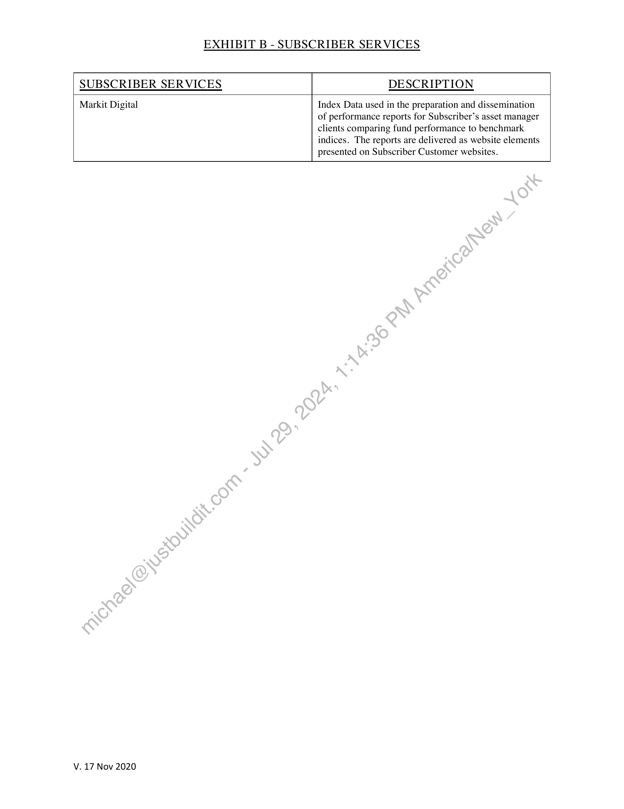
```  
```col-md
EXHIBIT B - SUBSCRIBER SERVICES  
SUBSCRIBER SERVICES  
DESCRIPTION  
Markit Digital  
Index Data used in the preparation and dissemination
of performance reports for Subscriber’s asset manager
clients comparing fund performance to benchmark
indices. The reports are delivered as website elements
presented on Subscriber Customer websites.  
V. 17 Nov 2020  
```
````
Notes:    
````col
```col-md
flexGrow=.5
===
> [!info] [Page 18](_attachments/images_3.6.4.2.4.1ICE_MGL_BofAIndexDataRedistributionAgreement_20211102.pdf_155158/page_18.png)
> 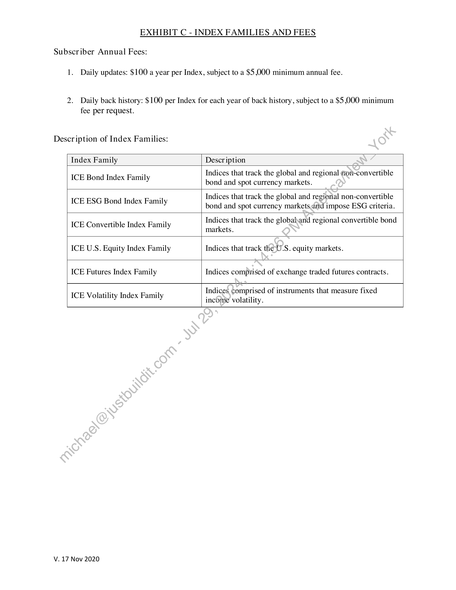
```  
```col-md
EXHIBIT C - INDEX FAMILIES AND FEES  
Subscriber Annual Fees:  
1. Daily updates: $100 a year per Index, subject to a $5,000 minimum annual fee.  
2. Daily back history: $100 per Index for each year of back history, subject to a $5,000 minimum  
fee per request.  
Description of Index Families:  
Index Family  
Description  
ICE Bond Index Family  
Indices that track the global and regional tion-convertible
bond and spot currency markets.  
ICE ESG Bond Index Family  
Indices that track the global and regional non-convertible
bond and spot currency marketsand impose ESG criteria.  
ICE Convertible Index Family  
Indices that track the globahand regional convertible bond
markets.  
ICE U.S. Equity Index Family  
Indices that track the-U.S. equity markets.  
ICE Futures Index Family  
Indices comprised of exchange traded futures contracts.  
ICE Volatility Index Family  
Indices comprised of instruments that measure fixed
income volatility.  
V. 17 Nov 2020  
```
````
Notes:    
````col
```col-md
flexGrow=.5
===
> [!info] [Page 19](_attachments/images_3.6.4.2.4.1ICE_MGL_BofAIndexDataRedistributionAgreement_20211102.pdf_155158/page_19.png)
> 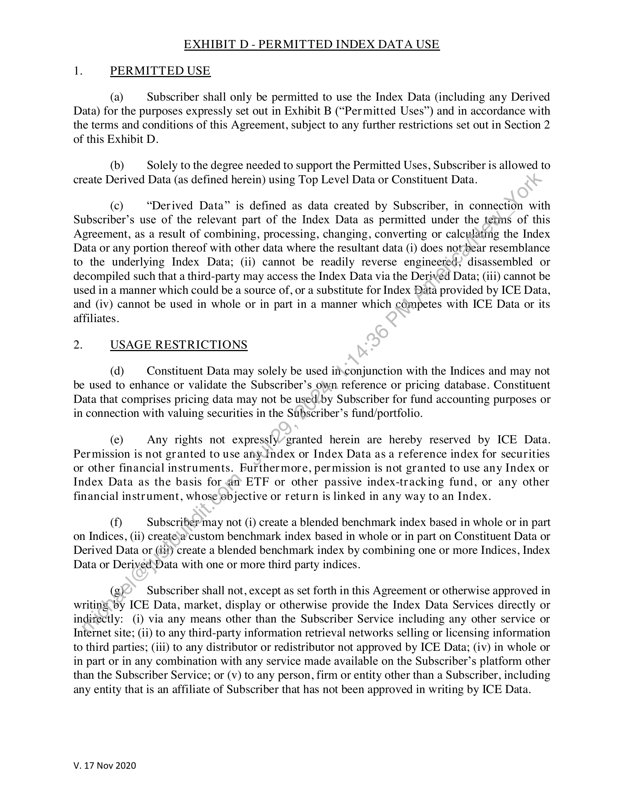
```  
```col-md
EXHIBIT D - PERMITTED INDEX DATA USE
1. PERMITTED USE  
(a) Subscriber shall only be permitted to use the Index Data (including any Derived
Data) for the purposes expressly set out in Exhibit B (“Permitted Uses”) and in accordance with
the terms and conditions of this Agreement, subject to any further restrictions set out in Section 2
of this Exhibit D.  
(b) Solely to the degree needed to support the Permitted Uses, Subscriber is allowed to
create Derived Data (as defined herein) using Top Level Data or Constituent Data.  
(c) “Derived Data” is defined as data created by Subscriber, in connection with
Subscriber’s use of the relevant part of the Index Data as permitted under the tetms of this
Agreement, as a result of combining, processing, changing, converting or calculating the Index
Data or any portion thereof with other data where the resultant data (i) does not-bear resemblance
to the underlying Index Data; (ii) cannot be readily reverse engineered, disassembled or
decompiled such that a third-party may access the Index Data via the Derived Data; (iii) cannot be
used in a manner which could be a source of, or a substitute for Index Data provided by ICE Data,
and (iv) cannot be used in whole or in part in a manner which competes with ICE Data or its
affiliates.  
2. USAGE RESTRICTIONS  
(d) Constituent Data may solely be used imconjunction with the Indices and may not
be used to enhance or validate the Subscriber’s own reference or pricing database. Constituent
Data that comprises pricing data may not be used. by Subscriber for fund accounting purposes or
in connection with valuing securities in the Subscriber’s fund/portfolio.  
(e) Any rights not expressly/granted herein are hereby reserved by ICE Data.
Permission is not granted to use anyIndex or Index Data as a reference index for securities
or other financial instruments. Furthermore, permission is not granted to use any Index or
Index Data as the basis for an’ ETF or other passive index-tracking fund, or any other
financial instrument, whose objective or return is linked in any way to an Index.  
(f) Subscriber may not (i) create a blended benchmark index based in whole or in part
on Indices, (ii) create}a’custom benchmark index based in whole or in part on Constituent Data or
Derived Data or (ii1) create a blended benchmark index by combining one or more Indices, Index
Data or DerivedData with one or more third party indices.  
(g) Subscriber shall not, except as set forth in this Agreement or otherwise approved in
writing by ICE Data, market, display or otherwise provide the Index Data Services directly or
indirectly: (i) via any means other than the Subscriber Service including any other service or
Internet site; (ii) to any third-party information retrieval networks selling or licensing information
to third parties; (iii) to any distributor or redistributor not approved by ICE Data; (iv) in whole or
in part or in any combination with any service made available on the Subscriber’s platform other
than the Subscriber Service; or (v) to any person, firm or entity other than a Subscriber, including
any entity that is an affiliate of Subscriber that has not been approved in writing by ICE Data.  
V. 17 Nov 2020  
```
````
Notes:    
````col
```col-md
flexGrow=.5
===
> [!info] [Page 20](_attachments/images_3.6.4.2.4.1ICE_MGL_BofAIndexDataRedistributionAgreement_20211102.pdf_155158/page_20.png)
> 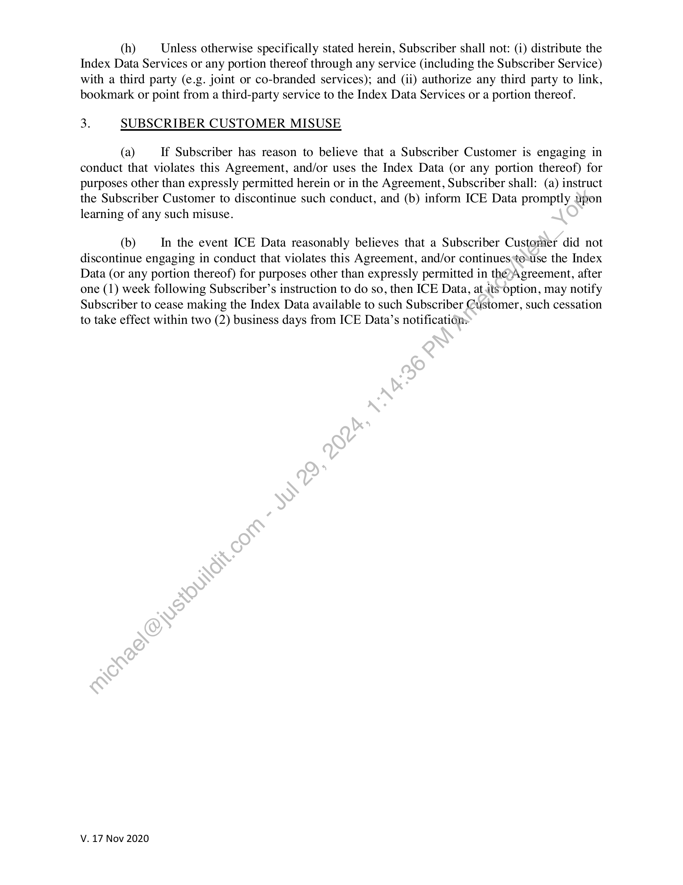
```  
```col-md
(h) Unless otherwise specifically stated herein, Subscriber shall not: (i) distribute the
Index Data Services or any portion thereof through any service (including the Subscriber Service)
with a third party (e.g. joint or co-branded services); and (ii) authorize any third party to link,
bookmark or point from a third-party service to the Index Data Services or a portion thereof.  
3. SUBSCRIBER CUSTOMER MISUSE  
(a) If Subscriber has reason to believe that a Subscriber Customer is engaging in
conduct that violates this Agreement, and/or uses the Index Data (or any portion thereof) for
purposes other than expressly permitted herein or in the Agreement, Subscriber shall: (a) instruct
the Subscriber Customer to discontinue such conduct, and (b) inform ICE Data promptly upon
learning of any such misuse.  
(b) In the event ICE Data reasonably believes that a Subscriber Customer did not
discontinue engaging in conduct that violates this Agreement, and/or continues to“use the Index
Data (or any portion thereof) for purposes other than expressly permitted in the?Agreement, after
one (1) week following Subscriber’s instruction to do so, then ICE Data, at its-option, may notify
Subscriber to cease making the Index Data available to such Subscriber Customer, such cessation
to take effect within two (2) business days from ICE Data’s notification:  
V. 17 Nov 2020  
```
````
Notes:    
````col
```col-md
flexGrow=.5
===
> [!info] [Page 21](_attachments/images_3.6.4.2.4.1ICE_MGL_BofAIndexDataRedistributionAgreement_20211102.pdf_155158/page_21.png)
> 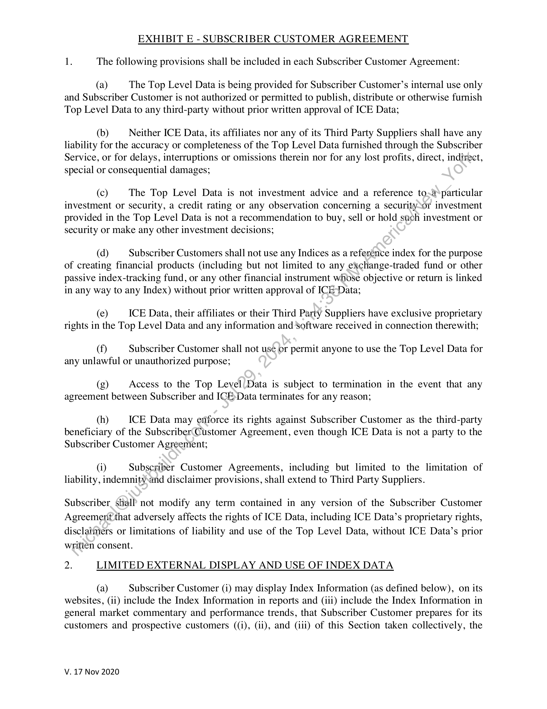
```  
```col-md
EXHIBIT E - SUBSCRIBER CUSTOMER AGREEMENT
1. The following provisions shall be included in each Subscriber Customer Agreement:  
(a) The Top Level Data is being provided for Subscriber Customer’s internal use only
and Subscriber Customer is not authorized or permitted to publish, distribute or otherwise furnish
Top Level Data to any third-party without prior written approval of ICE Data;  
(b) Neither ICE Data, its affiliates nor any of its Third Party Suppliers shall have any
liability for the accuracy or completeness of the Top Level Data furnished through the Subscriber
Service, or for delays, interruptions or omissions therein nor for any lost profits, direct, indirect,
special or consequential damages;  
(c) The Top Level Data is not investment advice and a reference to-a‘particular
investment or security, a credit rating or any observation concerning a securityor investment
provided in the Top Level Data is not a recommendation to buy, sell or hold such investment or
security or make any other investment decisions;  
(d) Subscriber Customers shall not use any Indices as a reference index for the purpose
of creating financial products (including but not limited to any exchange-traded fund or other
passive index-tracking fund, or any other financial instrument whose objective or return is linked
in any way to any Index) without prior written approval of ICE-Data;  
(e) ICE Data, their affiliates or their Third Party Suppliers have exclusive proprietary
rights in the Top Level Data and any information and ‘software received in connection therewith;  
(f) Subscriber Customer shall not use or permit anyone to use the Top Level Data for
any unlawful or unauthorized purpose;  
(g) Access to the Top Level|Data is subject to termination in the event that any
agreement between Subscriber and ICE,Data terminates for any reason;  
(h) ICE Data may enforce its rights against Subscriber Customer as the third-party
beneficiary of the Subscriber Customer Agreement, even though ICE Data is not a party to the
Subscriber Customer Agreement;  
(i) Subscriber Customer Agreements, including but limited to the limitation of
liability, indemnityand disclaimer provisions, shall extend to Third Party Suppliers.  
Subscriber, shall’ not modify any term contained in any version of the Subscriber Customer
Agreementit that adversely affects the rights of ICE Data, including ICE Data’s proprietary rights,
disclaimers or limitations of liability and use of the Top Level Data, without ICE Data’s prior
written consent.  
2. LIMITED EXTERNAL DISPLAY AND USE OF INDEX DATA
(a) Subscriber Customer (i) may display Index Information (as defined below), on its
websites, (ii) include the Index Information in reports and (iii) include the Index Information in  
general market commentary and performance trends, that Subscriber Customer prepares for its
customers and prospective customers ((i), (ii), and (iii) of this Section taken collectively, the  
V. 17 Nov 2020  
```
````
Notes:    
````col
```col-md
flexGrow=.5
===
> [!info] [Page 22](_attachments/images_3.6.4.2.4.1ICE_MGL_BofAIndexDataRedistributionAgreement_20211102.pdf_155158/page_22.png)
> 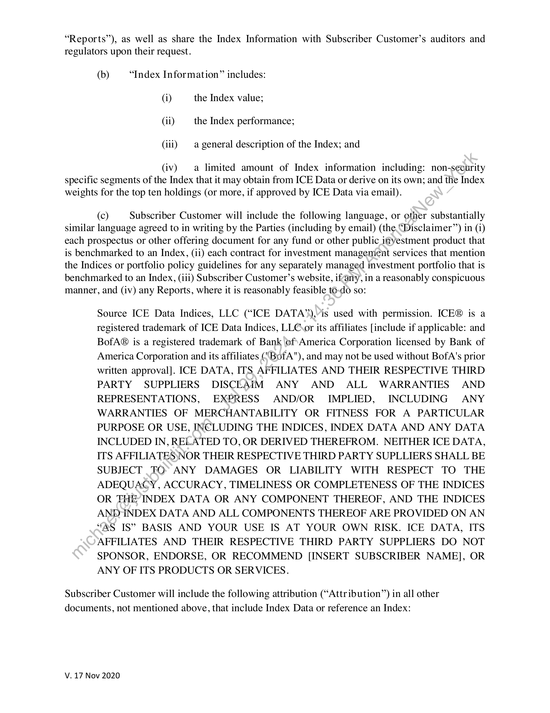
```  
```col-md
“Reports”), as well as share the Index Information with Subscriber Customer’s auditors and
regulators upon their request.  
(b) “Index Information” includes:
(i) the Index value;
(ii) the Index performance;
(iii) a general description of the Index; and  
(iv) a limited amount of Index information including: non-security
specific segments of the Index that it may obtain from ICE Data or derive on its own; and the Index
weights for the top ten holdings (or more, if approved by ICE Data via email).  
(c) Subscriber Customer will include the following language, or other substantially
similar language agreed to in writing by the Parties (including by email) (the “Disclaimer”) in (i)
each prospectus or other offering document for any fund or other public ifyestment product that
is benchmarked to an Index, (ii) each contract for investment managenient services that mention
the Indices or portfolio policy guidelines for any separately managed investment portfolio that is
benchmarked to an Index, (iii) Subscriber Customer’s website, ifany, in a reasonably conspicuous
manner, and (iv) any Reports, where it is reasonably feasible to-do so:  
Source ICE Data Indices, LLC (“ICE DATA”),vis used with permission. ICE® is a
registered trademark of ICE Data Indices, LLC\or its affiliates [include if applicable: and
BofA® is a registered trademark of Bank of America Corporation licensed by Bank of
America Corporation and its affiliates (‘BofA"), and may not be used without BofA's prior
written approval]. ICE DATA, ITS AFFILIATES AND THEIR RESPECTIVE THIRD
PARTY SUPPLIERS DISCLAIM ANY AND ALL WARRANTIES AND
REPRESENTATIONS, EXPRESS AND/OR IMPLIED, INCLUDING ANY
WARRANTIES OF MERCHANTABILITY OR FITNESS FOR A PARTICULAR
PURPOSE OR USE, INCLUDING THE INDICES, INDEX DATA AND ANY DATA
INCLUDED IN, RELATED TO, OR DERIVED THEREFROM. NEITHER ICE DATA,
ITS AFFILIATES;NOR THEIR RESPECTIVE THIRD PARTY SUPLLIERS SHALL BE
SUBJECT TO’ ANY DAMAGES OR LIABILITY WITH RESPECT TO THE
ADEQUACY, ACCURACY, TIMELINESS OR COMPLETENESS OF THE INDICES
OR THE INDEX DATA OR ANY COMPONENT THEREOF, AND THE INDICES
AND INDEX DATA AND ALL COMPONENTS THEREOF ARE PROVIDED ON AN
“AS IS” BASIS AND YOUR USE IS AT YOUR OWN RISK. ICE DATA, ITS
AFFILIATES AND THEIR RESPECTIVE THIRD PARTY SUPPLIERS DO NOT
SPONSOR, ENDORSE, OR RECOMMEND [INSERT SUBSCRIBER NAME], OR
ANY OF ITS PRODUCTS OR SERVICES.  
Subscriber Customer will include the following attribution (“Attribution”) in all other
documents, not mentioned above, that include Index Data or reference an Index:  
V. 17 Nov 2020  
```
````
Notes:    
````col
```col-md
flexGrow=.5
===
> [!info] [Page 23](_attachments/images_3.6.4.2.4.1ICE_MGL_BofAIndexDataRedistributionAgreement_20211102.pdf_155158/page_23.png)
> 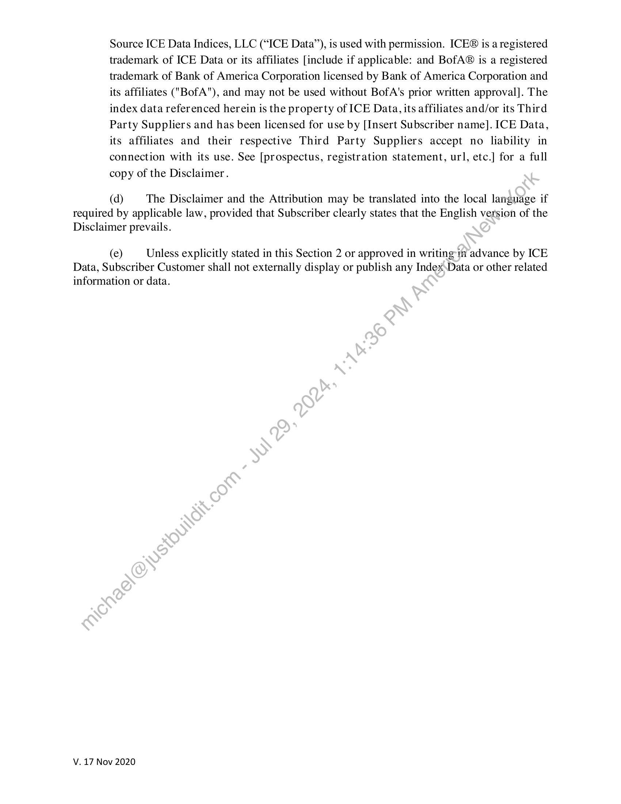
```  
```col-md
Source ICE Data Indices, LLC (“ICE Data”), is used with permission. ICE® is a registered
trademark of ICE Data or its affiliates [include if applicable: and BofA® is a registered
trademark of Bank of America Corporation licensed by Bank of America Corporation and
its affiliates ("BofA"), and may not be used without BofA's prior written approval]. The
index data referenced herein is the property of ICE Data, its affiliates and/or its Third
Party Suppliers and has been licensed for use by [Insert Subscriber name]. ICE Data,
its affiliates and their respective Third Party Suppliers accept no liability in
connection with its use. See [prospectus, registration statement, url, etc.] for a full
copy of the Disclaimer.  
(d) The Disclaimer and the Attribution may be translated into the local language if
required by applicable law, provided that Subscriber clearly states that the English version of the
Disclaimer prevails.  
(e) Unless explicitly stated in this Section 2 or approved in writing in advance by ICE  
Data, Subscriber Customer shall not externally display or publish any Index Data or other related
information or data.  
V. 17 Nov 2020  
```
````
Notes:    
````col
```col-md
flexGrow=.5
===
> [!info] [Page 24](_attachments/images_3.6.4.2.4.1ICE_MGL_BofAIndexDataRedistributionAgreement_20211102.pdf_155158/page_24.png)
> 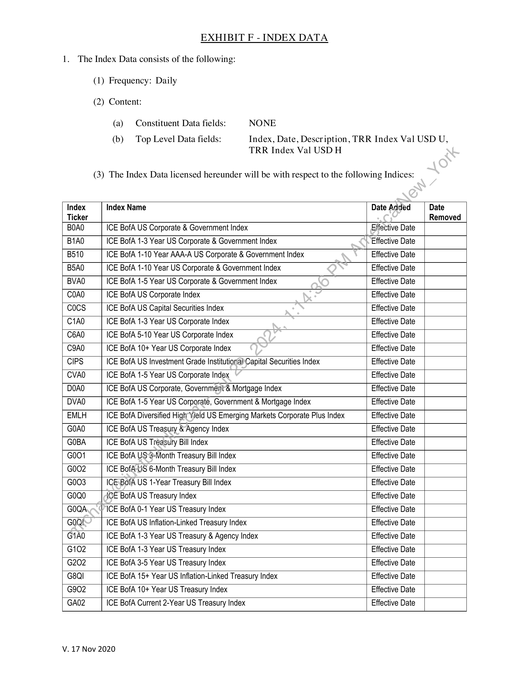
```  
```col-md
EXHIBIT F - INDEX DATA  
1. The Index Data consists of the following:  
(1) Frequency: Daily  
(2) Content:  
(a) Constituent Data fields: NONE  
(b) Top Level Data fields:  
TRR Index Val USD H  
(3) The Index Data licensed hereunder will be with respect to the following Indices:  
Index, Date, Description, TRR Index Val USD U,  
Index Index Name Date Added Date
Ticker Removed
BOAO ICE BofA US Corporate & Government Index Effective Date
B1A0 ICE BofA 1-3 Year US Corporate & Government Index Effective Date
B510 ICE BofA 1-10 Year AAA-A US Corporate & Government Index Effective Date
B5A0 ICE BofA 1-10 Year US Corporate & Government Index Effective Date
BVAO ICE BofA 1-5 Year US Corporate & Government Index Effective Date
COAO ICE BofA US Corporate Index Effective Date
Cocs ICE BofA US Capital Securities Index Effective Date
C1A0 CE BofA 1-3 Year US Corporate Index Effective Date
C6A0 ICE BofA 5-10 Year US Corporate Index Effective Date
C9A0 ICE BofA 10+ Year US Corporate Index Effective Date
CIPS CE BofA US Investment Grade Institutional) Capital Securities Index Effective Date
CVAO ICE BofA 1-5 Year US Corporate Index Effective Date
DOAO ICE BofA US Corporate, Government’& Mortgage Index Effective Date
DVAO ICE BofA 1-5 Year US Corporate, Government & Mortgage Index Effective Date
EMLH CE BofA Diversified High Yield US Emerging Markets Corporate Plus Index Effective Date
GOAO ICE BofA US Treasury & Agency Index Effective Date
GOBA CE BofA US Treasury Bill Index Effective Date
G001 ICE BofA US3Month Treasury Bill Index Effective Date
G002 ICE BofA-US 6-Month Treasury Bill Index Effective Date
G003 ICEBofA US 1-Year Treasury Bill Index Effective Date
G0Q0 SE BofA US Treasury Index Effective Date
G0QA: ICE BofA 0-1 Year US Treasury Index Effective Date
Goa! ICE BofA US Inflation-Linked Treasury Index Effective Date
GtA0 CE BofA 1-3 Year US Treasury & Agency Index Effective Date
G102 CE BofA 1-3 Year US Treasury Index Effective Date
G202 CE BofA 3-5 Year US Treasury Index Effective Date
G8Ql ICE BofA 15+ Year US Inflation-Linked Treasury Index Effective Date
G902 ICE BofA 10+ Year US Treasury Index Effective Date
GA02 (CE BofA Current 2-Year US Treasury Index Effective Date  
V. 17 Nov 2020  
```
````
Notes:    
````col
```col-md
flexGrow=.5
===
> [!info] [Page 25](_attachments/images_3.6.4.2.4.1ICE_MGL_BofAIndexDataRedistributionAgreement_20211102.pdf_155158/page_25.png)
> 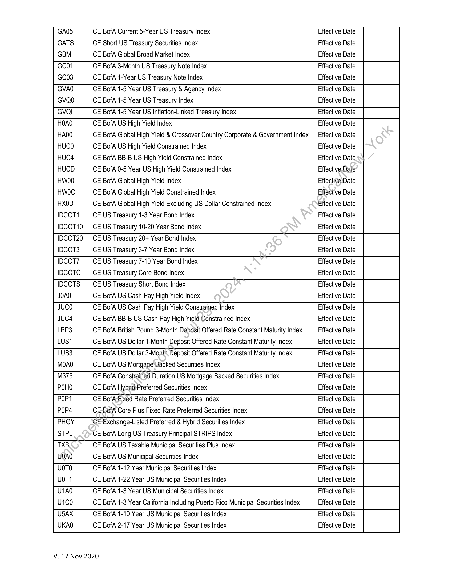
```  
```col-md
GA05 CE BofA Current 5-Year US Treasury Index Effective Date
GATS ICE Short US Treasury Securities Index Effective Date
GBMI ICE BofA Global Broad Market Index Effective Date
GC01 ICE BofA 3-Month US Treasury Note Index Effective Date
GC03 ICE BofA 1-Year US Treasury Note Index Effective Date
GVAO ICE BofA 1-5 Year US Treasury & Agency Index Effective Date
GVQ0 ICE BofA 1-5 Year US Treasury Index Effective Date
GVQI CE BofA 1-5 Year US Inflation-Linked Treasury Index Effective Date
HOAO ICE BofA US High Yield Index Effective Date
HA0O ICE BofA Global High Yield & Crossover Country Corporate & Government Index | Effective Date
HUCO ICE BofA US High Yield Constrained Index Effective Date
HUC4 ICE BofA BB-B US High Yield Constrained Index Effective Date
HUCD ICE BofA 0-5 Year US High Yield Constrained Index Effective Date
HW00 ICE BofA Global High Yield Index Effective Date
HWO0C ICE BofA Global High Yield Constrained Index Effective Date
HX0D ICE BofA Global High Yield Excluding US Dollar Constrained Index Effective Date
IDCOT1 ICE US Treasury 1-3 Year Bond Index Effective Date
IDCOT10 | ICE US Treasury 10-20 Year Bond Index Effective Date
IDCOT20 | ICE US Treasury 20+ Year Bond Index Effective Date
IDCOT3 | ICE US Treasury 3-7 Year Bond Index Effective Date
IDCOT7 | ICE US Treasury 7-10 Year Bond Index Effective Date
IDCOTC | ICE US Treasury Core Bond Index Effective Date
IDCOTS | ICE US Treasury Short Bond Index Effective Date
JOAO ICE BofA US Cash Pay High Yield Index Effective Date
JUCO ICE BofA US Cash Pay High Yield Constrained Index Effective Date
JUC4 ICE BofA BB-B US Cash Pay High Yield Constrained Index Effective Date
LBP3 CE BofA British Pound 3-Month Deposit Offered Rate Constant Maturity Index Effective Date
LUS1 ICE BofA US Dollar 1-Month Deposit Offered Rate Constant Maturity Index Effective Date
LUS3 ICE BofA US Dollar 3-Month, Deposit Offered Rate Constant Maturity Index Effective Date
MOAO ICE BofA US Mortgage ‘Backed Securities Index Effective Date
M375 ICE BofA Constrained Duration US Mortgage Backed Securities Index Effective Date
POHO ICE BofA Hybrid)Preferred Securities Index Effective Date
POP1 ICE BofA-Fixed Rate Preferred Securities Index Effective Date
POP4 CE-BofA Core Plus Fixed Rate Preferred Securities Index Effective Date
PHGY ICE Exchange-Listed Preferred & Hybrid Securities Index Effective Date
STPL ICE BofA Long US Treasury Principal STRIPS Index Effective Date
TXBL ICE BofA US Taxable Municipal Securities Plus Index Effective Date
UOAO ICE BofA US Municipal Securities Index Effective Date
UOTO CE BofA 1-12 Year Municipal Securities Index Effective Date
U0T1 ICE BofA 1-22 Year US Municipal Securities Index Effective Date
U1A0 ICE BofA 1-3 Year US Municipal Securities Index Effective Date
U1C0 ICE BofA 1-3 Year California Including Puerto Rico Municipal Securities Index Effective Date
U5AX ICE BofA 1-10 Year US Municipal Securities Index Effective Date
UKAO ICE BofA 2-17 Year US Municipal Securities Index Effective Date  
V. 17 Nov 2020  
```
````
Notes:    
````col
```col-md
flexGrow=.5
===
> [!info] [Page 26](_attachments/images_3.6.4.2.4.1ICE_MGL_BofAIndexDataRedistributionAgreement_20211102.pdf_155158/page_26.png)
> 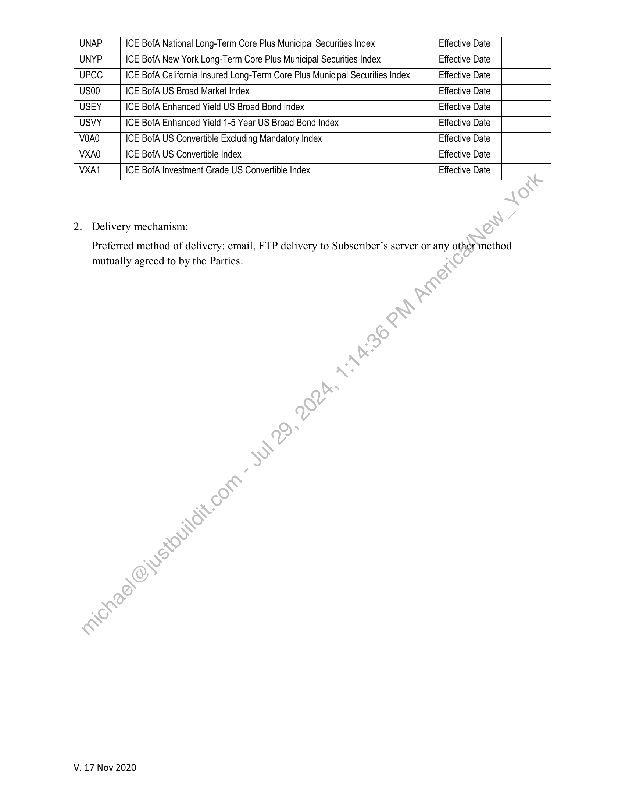
```  
```col-md
UNAP ICE BofA National Long-Term Core Plus Municipal Securities Index Effective Date
UNYP ICE BofA New York Long-Term Core Plus Municipal Securities Index Effective Date
UPCC ICE BofA California Insured Long-Term Core Plus Municipal Securities Index Effective Date
US00 ICE BofA US Broad Market Index Effective Date
USEY ICE BofA Enhanced Yield US Broad Bond Index Effective Date
USVY ICE BofA Enhanced Yield 1-5 Year US Broad Bond Index Effective Date
VOAO CE BofA US Convertible Excluding Mandatory Index Effective Date
VXA0 ICE BofA US Convertible Index Effective Date
VXA1 CE BofA Investment Grade US Convertible Index Effective Date  
2. Delivery mechanism:
Preferred method of delivery: email, FTP delivery to Subscriber’s server or any other method
mutually agreed to by the Parties.  
V. 17 Nov 2020  
```
````
Notes:    
````col
```col-md
flexGrow=.5
===
> [!info] [Page 27](_attachments/images_3.6.4.2.4.1ICE_MGL_BofAIndexDataRedistributionAgreement_20211102.pdf_155158/page_27.png)
> 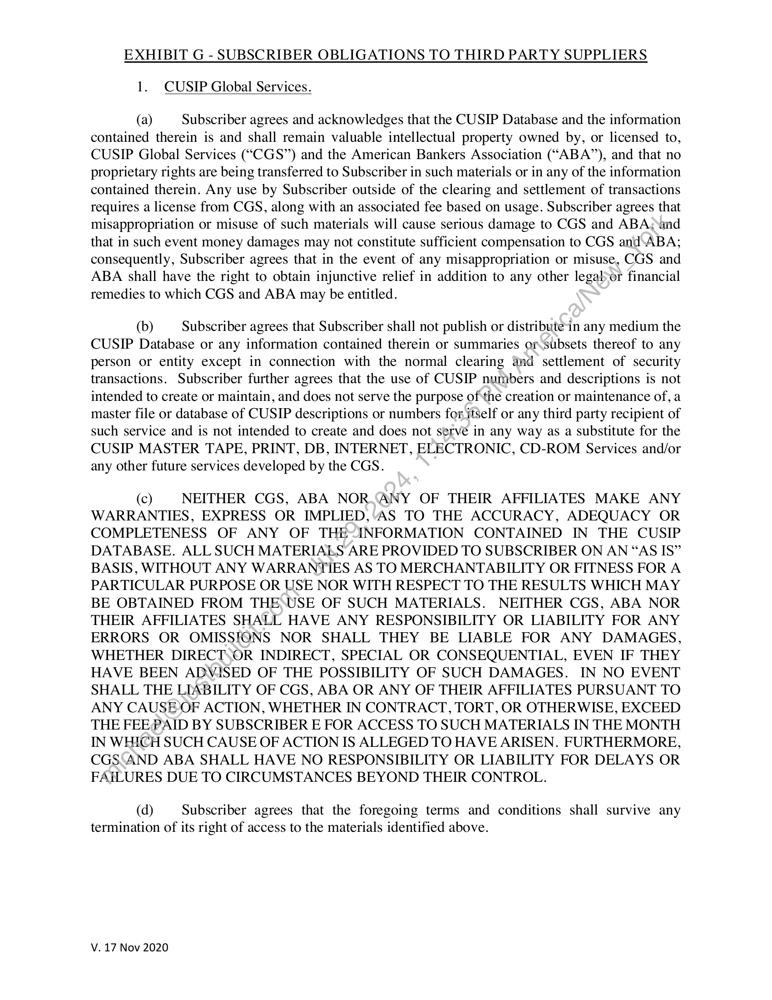
```  
```col-md
EXHIBIT G - SUBSCRIBER OBLIGATIONS TO THIRD PARTY SUPPLIERS  
1. CUSIP Global Services.  
(a) Subscriber agrees and acknowledges that the CUSIP Database and the information
contained therein is and shall remain valuable intellectual property owned by, or licensed to,
CUSIP Global Services (“CGS”) and the American Bankers Association (“ABA”), and that no
proprietary rights are being transferred to Subscriber in such materials or in any of the information
contained therein. Any use by Subscriber outside of the clearing and settlement of transactions
requires a license from CGS, along with an associated fee based on usage. Subscriber agrees that
misappropriation or misuse of such materials will cause serious damage to CGS and ABAs\and
that in such event money damages may not constitute sufficient compensation to CGS and\ABA;
consequently, Subscriber agrees that in the event of any misappropriation or misuse, CGS and
ABA shall have the right to obtain injunctive relief in addition to any other legat>or financial
remedies to which CGS and ABA may be entitled.  
(b) Subscriber agrees that Subscriber shall not publish or distribute-in any medium the
CUSIP Database or any information contained therein or summaries orsubsets thereof to any
person or entity except in connection with the normal clearing and settlement of security
transactions. Subscriber further agrees that the use of CUSIP numbers and descriptions is not
intended to create or maintain, and does not serve the purpose of the creation or maintenance of, a
master file or database of CUSIP descriptions or numbers fox itself or any third party recipient of
such service and is not intended to create and does not serve in any way as a substitute for the
CUSIP MASTER TAPE, PRINT, DB, INTERNET, ELECTRONIC, CD-ROM Services and/or
any other future services developed by the CGS.  
(c) NEITHER CGS, ABA NOR\ANY OF THEIR AFFILIATES MAKE ANY
WARRANTIES, EXPRESS OR IMPLIED,'AS TO THE ACCURACY, ADEQUACY OR
COMPLETENESS OF ANY OF THE~INFORMATION CONTAINED IN THE CUSIP
DATABASE. ALL SUCH MATERIALS ARE PROVIDED TO SUBSCRIBER ON AN “AS IS”
BASIS, WITHOUT ANY WARRANTIES AS TO MERCHANTABILITY OR FITNESS FOR A
PARTICULAR PURPOSE OR USE NOR WITH RESPECT TO THE RESULTS WHICH MAY
BE OBTAINED FROM THESUSE OF SUCH MATERIALS. NEITHER CGS, ABA NOR
THEIR AFFILIATES SHALL HAVE ANY RESPONSIBILITY OR LIABILITY FOR ANY
ERRORS OR OMISSIONS NOR SHALL THEY BE LIABLE FOR ANY DAMAGES,
WHETHER DIRECTSOR INDIRECT, SPECIAL OR CONSEQUENTIAL, EVEN IF THEY
HAVE BEEN ADVISED OF THE POSSIBILITY OF SUCH DAMAGES. IN NO EVENT
SHALL THE LIABILITY OF CGS, ABA OR ANY OF THEIR AFFILIATES PURSUANT TO
ANY CAUSE/OF ACTION, WHETHER IN CONTRACT, TORT, OR OTHERWISE, EXCEED
THE FEEPAID BY SUBSCRIBER E FOR ACCESS TO SUCH MATERIALS IN THE MONTH
IN WHICH SUCH CAUSE OF ACTION IS ALLEGED TO HAVE ARISEN. FURTHERMORE,
CGS\AND ABA SHALL HAVE NO RESPONSIBILITY OR LIABILITY FOR DELAYS OR
FAILURES DUE TO CIRCUMSTANCES BEYOND THEIR CONTROL.  
(d) Subscriber agrees that the foregoing terms and conditions shall survive any
termination of its right of access to the materials identified above.  
V. 17 Nov 2020  
```
````
Notes:    
````col
```col-md
flexGrow=.5
===
> [!info] [Page 28](_attachments/images_3.6.4.2.4.1ICE_MGL_BofAIndexDataRedistributionAgreement_20211102.pdf_155158/page_28.png)
> 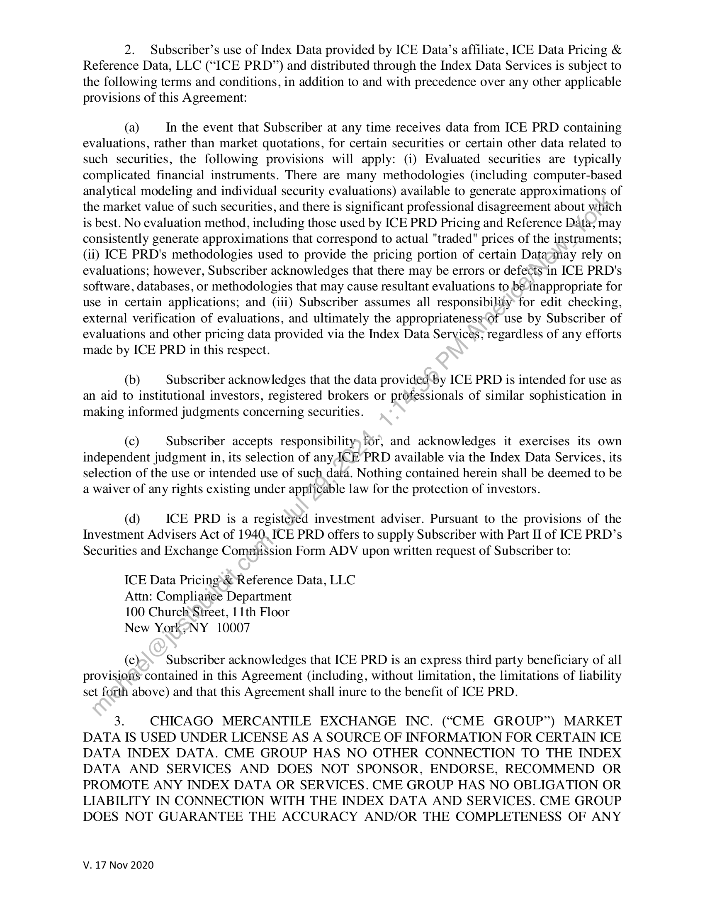
```  
```col-md
2. Subscriber’s use of Index Data provided by ICE Data’s affiliate, ICE Data Pricing &
Reference Data, LLC (“ICE PRD”) and distributed through the Index Data Services is subject to
the following terms and conditions, in addition to and with precedence over any other applicable
provisions of this Agreement:  
(a) In the event that Subscriber at any time receives data from ICE PRD containing
evaluations, rather than market quotations, for certain securities or certain other data related to
such securities, the following provisions will apply: (i) Evaluated securities are typically
complicated financial instruments. There are many methodologies (including computer-based
analytical modeling and individual security evaluations) available to generate approximations of
the market value of such securities, and there is significant professional disagreement about which
is best. No evaluation method, including those used by ICE PRD Pricing and Reference Data; may
consistently generate approximations that correspond to actual "traded" prices of the instruments;
(ii) ICE PRD's methodologies used to provide the pricing portion of certain Datasmay rely on
evaluations; however, Subscriber acknowledges that there may be errors or defects in ICE PRD's
software, databases, or methodologies that may cause resultant evaluations to be-inappropriate for
use in certain applications; and (iii) Subscriber assumes all responsibility for edit checking,
external verification of evaluations, and ultimately the appropriateness“of use by Subscriber of
evaluations and other pricing data provided via the Index Data Services; regardless of any efforts
made by ICE PRD in this respect.  
(b) Subscriber acknowledges that the data provided-by ICE PRD is intended for use as
an aid to institutional investors, registered brokers or professionals of similar sophistication in
making informed judgments concerning securities.  
(c) Subscriber accepts responsibility) for, and acknowledges it exercises its own
independent judgment in, its selection of any ICE PRD available via the Index Data Services, its
selection of the use or intended use of such data. Nothing contained herein shall be deemed to be
a waiver of any rights existing under applicable law for the protection of investors.  
(d) ICE PRD is a registered investment adviser. Pursuant to the provisions of the
Investment Advisers Act of 1940, ICE PRD offers to supply Subscriber with Part II of ICE PRD’s
Securities and Exchange Commission Form ADV upon written request of Subscriber to:  
ICE Data Pricing*& Reference Data, LLC
Attn: Compliance Department  
100 Church Sireet, 1 1th Floor  
New YorkyNY 10007  
(e) Subscriber acknowledges that ICE PRD is an express third party beneficiary of all
provisions contained in this Agreement (including, without limitation, the limitations of liability
set forth above) and that this Agreement shall inure to the benefit of ICE PRD.  
3. CHICAGO MERCANTILE EXCHANGE INC. (“CME GROUP”) MARKET
DATA IS USED UNDER LICENSE AS A SOURCE OF INFORMATION FOR CERTAIN ICE
DATA INDEX DATA. CME GROUP HAS NO OTHER CONNECTION TO THE INDEX
DATA AND SERVICES AND DOES NOT SPONSOR, ENDORSE, RECOMMEND OR
PROMOTE ANY INDEX DATA OR SERVICES. CME GROUP HAS NO OBLIGATION OR
LIABILITY IN CONNECTION WITH THE INDEX DATA AND SERVICES. CME GROUP
DOES NOT GUARANTEE THE ACCURACY AND/OR THE COMPLETENESS OF ANY  
V. 17 Nov 2020  
```
````
Notes:    
````col
```col-md
flexGrow=.5
===
> [!info] [Page 29](_attachments/images_3.6.4.2.4.1ICE_MGL_BofAIndexDataRedistributionAgreement_20211102.pdf_155158/page_29.png)
> 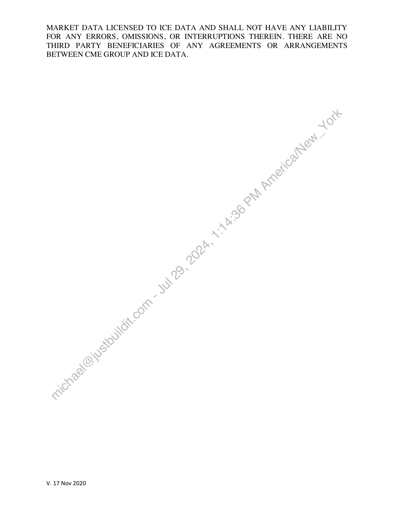
```  
```col-md
MARKET DATA LICENSED TO ICE DATA AND SHALL NOT HAVE ANY LIABILITY
FOR ANY ERRORS, OMISSIONS, OR INTERRUPTIONS THEREIN. THERE ARE NO
THIRD PARTY BENEFICIARIES OF ANY AGREEMENTS OR ARRANGEMENTS
BETWEEN CME GROUP AND ICE DATA.  
V. 17 Nov 2020  
```
````
Notes:    
````col
```col-md
flexGrow=.5
===
> [!info] [Page 30](_attachments/images_3.6.4.2.4.1ICE_MGL_BofAIndexDataRedistributionAgreement_20211102.pdf_155158/page_30.png)
> 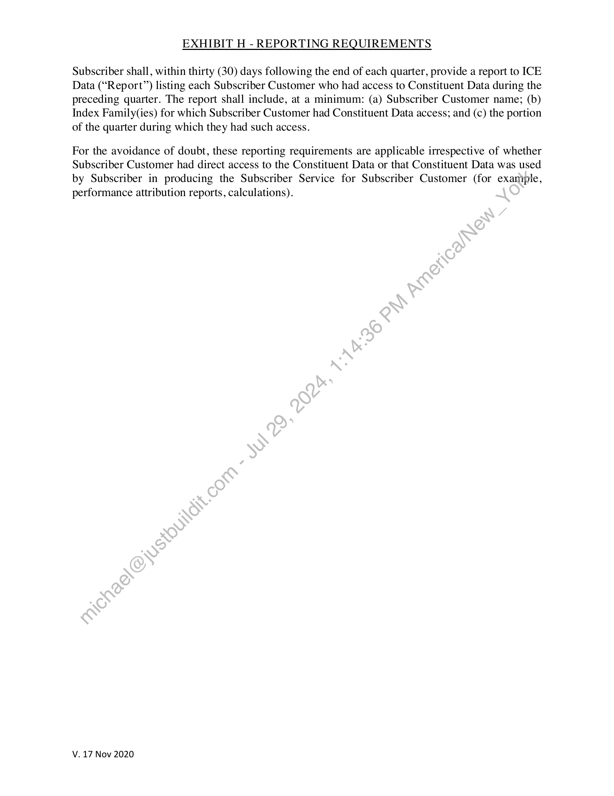
```  
```col-md
EXHIBIT H - REPORTING REQUIREMENTS  
Subscriber shall, within thirty (30) days following the end of each quarter, provide a report to ICE
Data (“Report’’) listing each Subscriber Customer who had access to Constituent Data during the
preceding quarter. The report shall include, at a minimum: (a) Subscriber Customer name; (b)
Index Family(ies) for which Subscriber Customer had Constituent Data access; and (c) the portion
of the quarter during which they had such access.  
For the avoidance of doubt, these reporting requirements are applicable irrespective of whether
Subscriber Customer had direct access to the Constituent Data or that Constituent Data was used
by Subscriber in producing the Subscriber Service for Subscriber Customer (for example,
performance attribution reports, calculations).  
V. 17 Nov 2020  
```
````
Notes:    
````col
```col-md
flexGrow=.5
===
> [!info] [Page 31](_attachments/images_3.6.4.2.4.1ICE_MGL_BofAIndexDataRedistributionAgreement_20211102.pdf_155158/page_31.png)
> 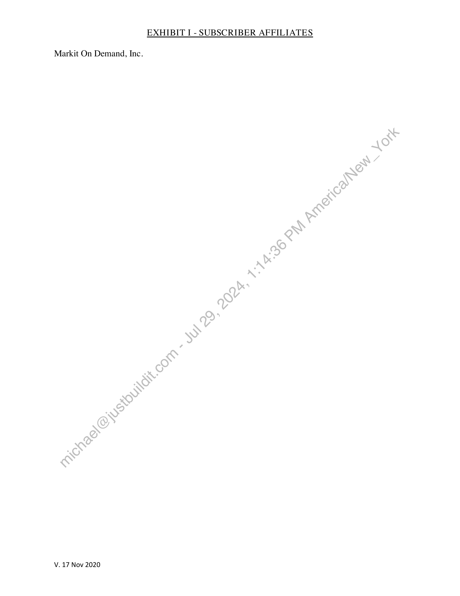
```  
```col-md
EXHIBIT I - SUBSCRIBER AFFILIATES  
Markit On Demand, Inc.  
V. 17 Nov 2020  
```
````
Notes:  


![[_attachments/3.6.4.2.4.1 ICE_MGL_BofA Index Data Redistribution Agreement_20211102.pdf]