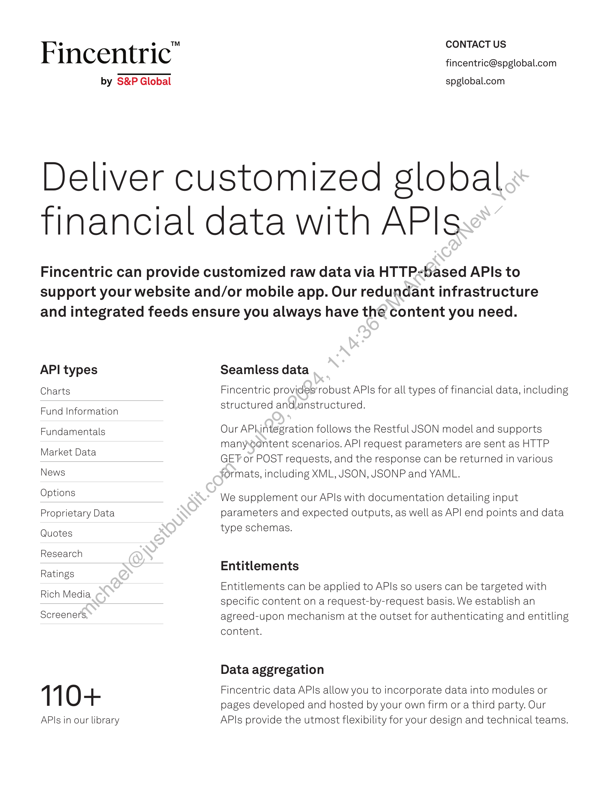
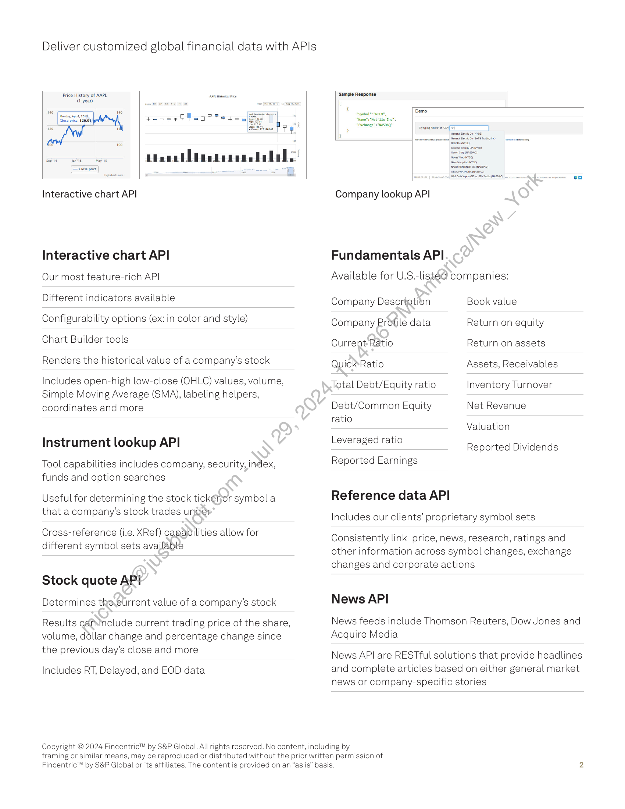

##### Fincentric API Documentation]

  
````col
```col-md
flexGrow=.5
===
> [!info] [Page 1](_attachments/images_Fincentric_API_Factsheet.pdf_153002/page_1.png)
> 
```  
```col-md
Fincentric"  
by S&P Global  
CONTACT US
fincentric@spglobal.com  
spglobal.com  
Deliver customized global
Tinancial data with APIs  
Fincentric can provide customized raw data via HTTP-based APIs to
support your website and/or mobile app. Our redundant infrastructure
and integrated feeds ensure you always have the content you need.  
API types
Charts  
Fund Information
Fundamentals
Market Data  
ews  
Options
Proprietary Data
Quotes  
Research  
Ratings  
Rich Media  
Screeners.  
110+  
APIs in our library  
Seamless data  
Fincentric provides’robust APIs for all types of financial data, including
structured and.unstructured.  
Our APhintegration follows the Restful JSON model and supports
manyontent scenarios. API request parameters are sent as HTTP
GET or POST requests, and the response can be returned in various
formats, including XML, JSON, JSONP and YAML.  
We supplement our APIs with documentation detailing input
parameters and expected outputs, as well as API end points and data
type schemas.  
Entitlements  
Entitlements can be applied to APIs so users can be targeted with
specific content on a request-by-request basis. We establish an
agreed-upon mechanism at the outset for authenticating and entitling
content.  
Data aggregation  
Fincentric data APIs allow you to incorporate data into modules or
pages developed and hosted by your own firm or a third party. Our
APIs provide the utmost flexibility for your design and technical teams.  
```
````
Notes:    
````col
```col-md
flexGrow=.5
===
> [!info] [Page 2](_attachments/images_Fincentric_API_Factsheet.pdf_153002/page_2.png)
> 
```  
```col-md
Deliver customized global financial data with APIs  
Price History of AAPL ‘ares ce
(1 year)  
tee ee OMe Mm eg  
thee dtneneee dada  
ra"  
nteractive chart API  
Interactive chart API  
Our most feature-rich API  
Different indicators available  
Configurability options (ex: in color and style)
Chart Builder tools  
Renders the historical value of a company’s stock  
Includes open-high low-close (OHLC) values, volume,
Simple Moving Average (SMA), labeling helpers,
coordinates and more  
Instrument lookup API  
Tool capabilities includes company, security, index,
funds and option searches  
Useful for determining the stock tickérjor symbol a
that a company’s stock trades under  
Cross-reference (i.e. XRef) capabilities allow for
different symbol sets available  
Stock quote API
Determines the.current value of a company’s stock  
Results cafinclude current trading price of the share,
volume, dollar change and percentage change since
the previous day’s close and more  
Includes RT, Delayed, and EOD data  
Company lookup API  
Fundamentals API  
Available for U.S.-listéd companies:  
Company Description Book value  
Company Profile data Return on equity
Current Ratio Return on assets
QuickRatio Assets, Receivables  
Total Debt/Equity ratio Inventory Turnover  
Debt/Common Equity Net Revenue  
ratio .
Valuation  
Li d rati
everaged ratlo Reported Dividends  
Reported Earnings  
Reference data API
Includes our clients’ proprietary symbol sets  
Consistently link price, news, research, ratings and
other information across symbol changes, exchange
changes and corporate actions  
News API  
News feeds include Thomson Reuters, Dow Jones and
Acquire Media  
News API are RESTful solutions that provide headlines
and complete articles based on either general market
news or company-specific stories  
Copyright © 2024 Fincentric™ by S&P Global. All rights reserved. No content, including by
framing or similar means, may be reproduced or distributed without the prior written permission of  
Fincentric™ by S&P Global or its affiliates. The content is provided on an “as is” basis.  
```
````
Notes:  
https://upload.wikimedia.org/wikipedia/commons/e/e8/Tesla_logo.png

https://www.google.com/url?sa=i&url=https%3A%2F%2Fwww.freepik.com%2Ffree-photos-vectors%2Flogo-png&psig=AOvVaw0gBHRgIFmfPlB_OaoVqPbv&ust=1730241484425000&source=images&cd=vfe&opi=89978449&ved=0CBEQjRxqFwoTCKCrmoCSsokDFQAAAAAdAAAAABAE


![[_attachments/1.2.1.1 Fincentric_API_Factsheet.pdf]