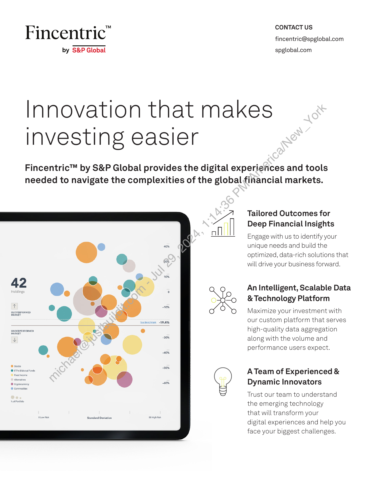
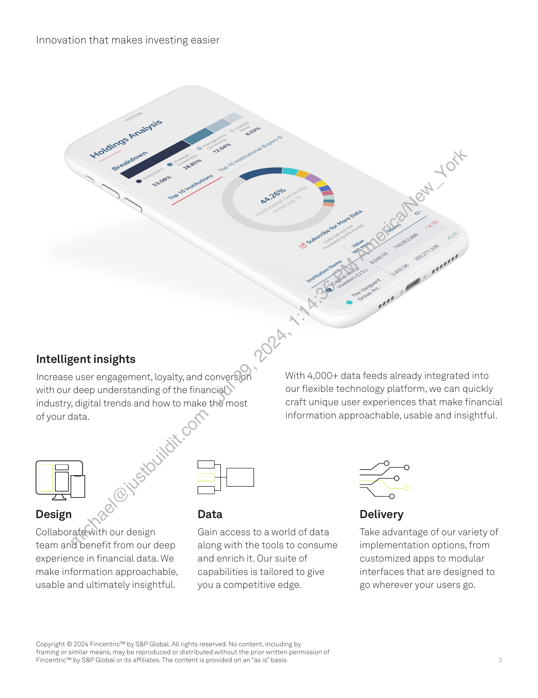

##### Fincentric™ by S&P Global: Innovation that Makes Investing Easier]

  
````col
```col-md
flexGrow=.5
===
> [!info] [Page 1](_attachments/images_Fincentric_Factsheet.pdf_153000/page_1.png)
> 
```  
```col-md
nN  
OUTPERFORMED
MARKET  
UNDERPERFORMED
MARKET  
F ° ° =™ CONTACT US
Incentric fincentric@spglobal.com
by S&P Global spglobal.com  
Innovation that makes
investing easier  
Fincentric™ by S&P Global provides the digital experierices and tools
needed to navigate the complexities of the global financial markets.  
A Tailored Outcomes for
ill Deep Financial Insights
ofl  
—— ___ Engage with us to identify your
unique needs and build the
optimized, data-rich solutions that
will drive your business forward.  
An Intelligent, Scalable Data
oxo &Technology Platform  
Maximize your investment with
our custom platform that serves
high-quality data aggregation
along with the volume and
performance users expect.  
ATeam of Experienced &
Dynamic Innovators  
Trust our team to understand
the emerging technology  
that will transform your  
digital experiences and help you
face your biggest challenges.  
OLow Riek econdard Devito 20 High Rok  
```
````
Notes:    
````col
```col-md
flexGrow=.5
===
> [!info] [Page 2](_attachments/images_Fincentric_Factsheet.pdf_153000/page_2.png)
> 
```  
```col-md
Innovation that makes investing easier  
Intelligent insights  
Increase user engagement, loyalty, and conversion
with our deep understanding of the financial
industry, digital trends and how to make thé most  
of your data.  
Design  
Collaboratewith our design
team and benefit from our deep
experience in financial data. We
make information approachable,
usable and ultimately insightful.  
Copyright © 2024 Fincentric™ by S&P Global. All  
With 4,000+ data feeds already integrated into
our flexible technology platform, we can quickly
craft unique user experiences that make financial  
information approachable, usable and insightful.  
Data  
Gain access to a world of data
along with the tools to consume
and enrich it. Our suite of
capabilities is tailored to give
you a competitive edge.  
rights reserved. No content, including by  
framing or similar means, may be reproduced or distributed without the prior written permission of
Fincentric™ by S&P Global or its affiliates. The content is provided on an “as is” basis.  
~~
x  
Delivery  
Take advantage of our variety of
implementation options, from
customized apps to modular
interfaces that are designed to
go wherever your users go.  
```
````
Notes:  


![[_attachments/1.2.1.10 Fincentric_Factsheet.pdf]