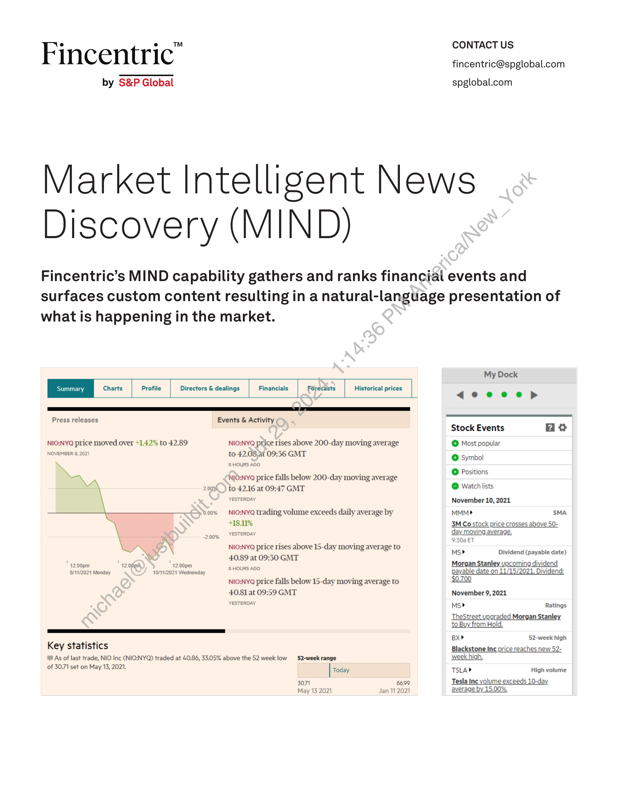
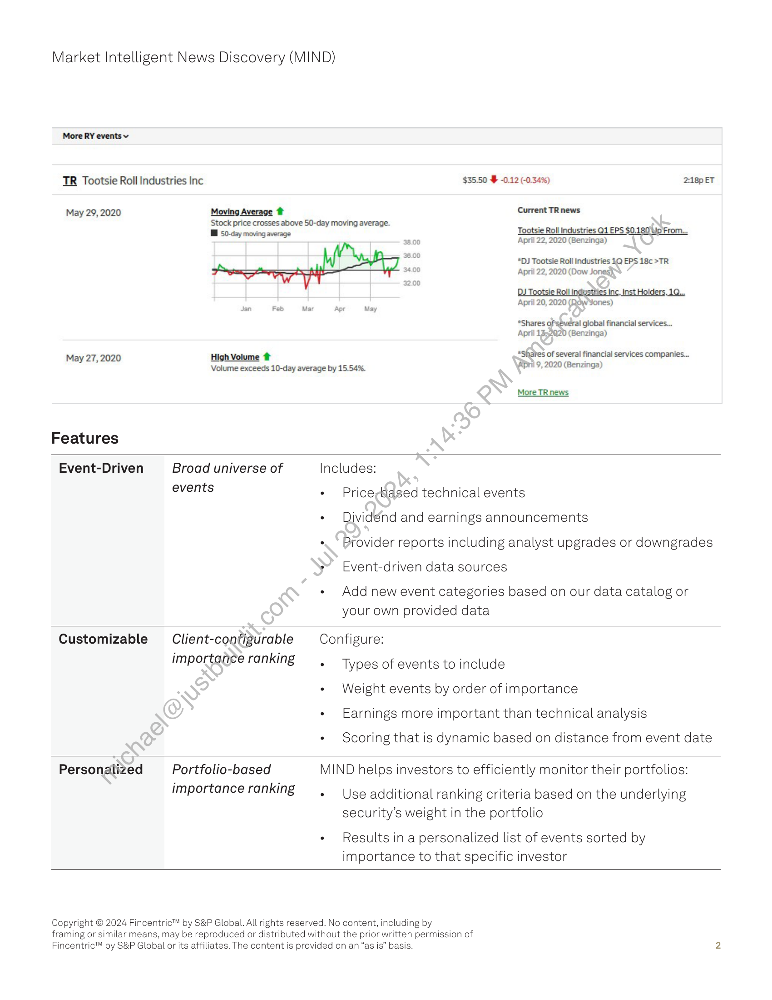

##### Market Intelligent News Discovery (MIND) by Fincentric™]

  
````col
```col-md
flexGrow=.5
===
> [!info] [Page 1](_attachments/images_Fincentric_MIND_Factsheet.pdf_152930/page_1.png)
> 
```  
```col-md
Fincentric"  
by S&P Global  
CONTACT US
fincentric@spglobal.com  
spglobal.com  
Market Intelligent News
Discovery (MIND  
Fincentric’s MIND capability gathers and ranks financial events and
surfaces custom content resulting in a natural-language presentation of
what is happening in the market.  
Charts Profile Directors & dealings Financials Forecasts Historical prices
Press releases Events & Activity  
NIO:NYQ price moved over +142% to 42.89  
NOVEMBER 8, 2021  
2.0036  
0.00%  
-2.00%  
" 42:00pm
8/11/2021 Monday  
f
12:00pm
10/11/2021 Wednesday  
1
12:0ffgrh,  
Key statistics  
™@ As of last trade, NIO Inc (NIO:NYQ) traded at 40.86, 33.05% above the 52 week low  
of 3071 set on May 13, 2021.  
NIO:NYQ price rises above 200-day moving average
to 42.08,at 09:36 GMT  
8 HOURS AGO  
NIO:NYQ price falls below 200-day moving average
to 42.16 at 09:47 GMT  
‘YESTERDAY  
NIO:NYQ trading volume exceeds daily average by
+18.11%  
‘YESTERDAY  
NIO:NYQ price rises above 15-day moving average to
40.89 at 09:30 GMT  
8 HOURS AGO  
NIO:NYQ price falls below 15-day moving average to
40.81 at 09:59 GMT  
YESTERDAY  
52-week range
Today  
3071 6699
May 13 2021 Jan 112021  
My Dock  
deeeop  
Stock Events a
© Most popular  
© Symbol  
© Positions  
© Watchlists  
November 10, 2021  
MMM> SMA  
3M Co stock price crosses above 50day moving average.  
9:30a ET
Ms> Dividend (payable date)
Morgan Stanley upcoming dividend
payable date on 11/15/2021, Dividend:
$0.700  
November 9, 2021  
Ms» Ratings  
TheStreet upgraded Morgan Stanley
to Buy from Hold.  
BX» 52-week high  
Blackstone Inc price reaches new 52week high,  
TSLAP  
Tesla Inc volume exceeds 10-day
average by 15.00%.  
High volume  
```
````
Notes:    
````col
```col-md
flexGrow=.5
===
> [!info] [Page 2](_attachments/images_Fincentric_MIND_Factsheet.pdf_152930/page_2.png)
> 
```  
```col-md
Market Intelligent News Discovery (MIND)  
More RY events v  
TR Tootsie Roll Industries Inc  
May 29, 2020  
May 27, 2020  
Features  
Moving Average #  
$35.50  -0.12 (-0.34%) 2:18p ET  
Current TR news  
Stock price crosses above 50-day moving average.  
Wl 50-day moving average  
High Volume #  
Volume exceeds 10-day average by 15.54%.  
Apr  
Tootsie Roll Industries Q1 EPS $0.180 Up From.  
April 22, 2020 (Benzinga)  
*DJ Tootsie Roll industries 1Q EPS 18c >TR
April 22, 2020 (Dow Jones),  
DJ Tootsie Roll Indpstties Inc, Inst Holders, 10.  
April 20, 2020 (Row ones)  
*Shares of's@veral global financial services.  
April 1352920 (Benzinga)  
*Shates of several financial services companies.  
APril 9, 2020 (Benzinga)  
More TRnews  
Event-Driven  
Broad universe of
events  
Includes:  
Price;based technical events.  
Dividénd and earnings announcements  
Provider reports including analyst upgrades or downgrades
Event-driven data sources  
Add new event categories based on our data catalog or
your own provided data  
Customizable  
Client-configurable
importance ranking  
Configure:  
Types of events to include
Weight events by order of importance
Earnings more important than technical analysis  
Scoring that is dynamic based on distance from event date  
Personalized  
Portfolio-based
importance ranking  
MIND helps investors to efficiently monitor their portfolios:  
Use additional ranking criteria based on the underlying
security’s weight in the portfolio  
Results in a personalized list of events sorted by
importance to that specific investor  
Copyright © 2024 Fincentric™ by S&P Global. All  
rights reserved. No content, including by  
framing or similar means, may be reproduced or distributed without the prior written permission of
Fincentric™ by S&P Global or its affiliates. The content is provided on an “as is” basis.  
```
````
Notes:  


![[_attachments/1.2.1.11 Fincentric_MIND_Factsheet.pdf]