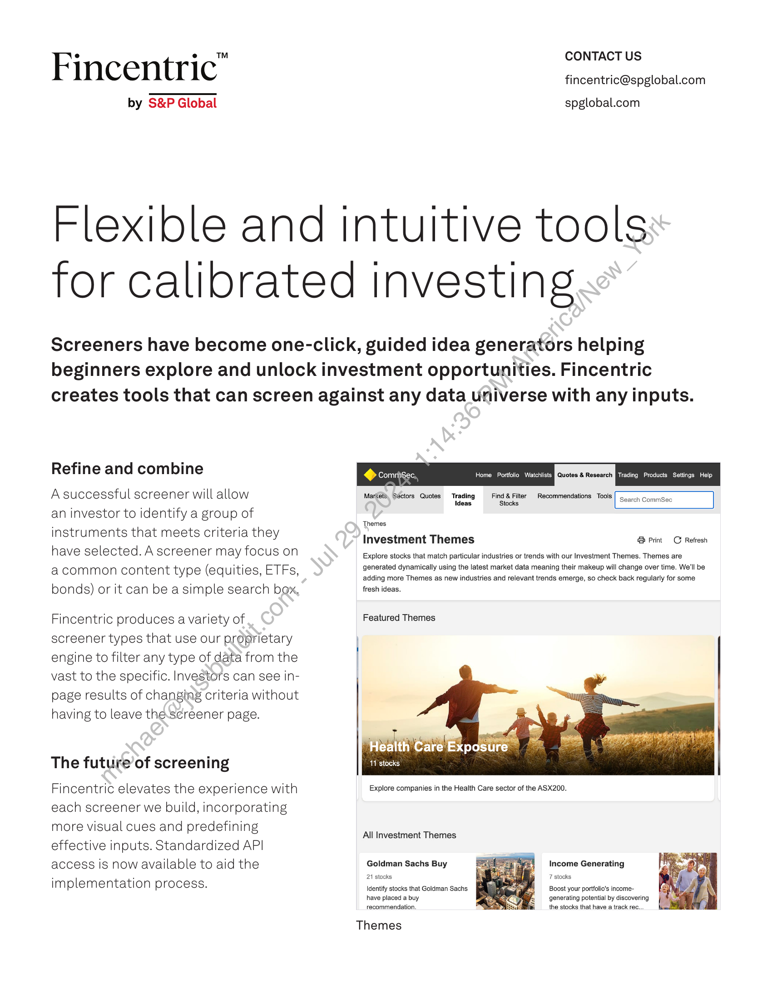
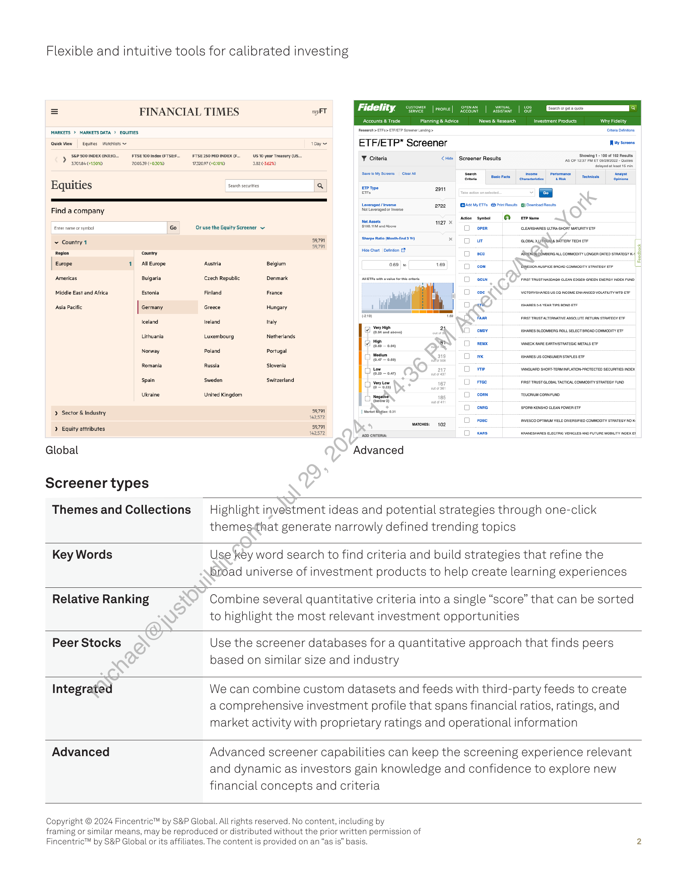

##### Fincentric™ by S&P Global: Flexible and Intuitive Tools for Calibrated Investing]

  
````col
```col-md
flexGrow=.5
===
> [!info] [Page 1](_attachments/images_Fincentric_Screener_Factsheet.pdf_153011/page_1.png)
> 
```  
```col-md
CONTACT US  
Fincentric" fincentric@spglobal.com  
by S&P Global spglobal.com  
Flexible and intuitive tools
for calibrated investing  
Screeners have become one-click, guided idea generators helping
beginners explore and unlock investment opportunities. Fincentric
creates tools that can screen against any data Universe with any inputs.  
Refine and combine  
ComriiSec, Home Portfolio Watchlists [OTSSe CeCe Trading Products Settings Help
A successful screener will allow Mar(@ie, Séctors Quotes Trading Find & Filter Recommendations Tools [ s.   
n Gommocs
Ideas Stocks
an investor to identify a group of. . Themes
instruments that meets criteria they Investment Themes arin Retesh
n ave sele cted . A screener may focus on Explore stocks that match particular industries or trends with our Investment Themes. Themes are
acommon content type (eq U iti es ETEs. generated dynamically using the latest market data meaning their makeup will change over time. We'll be: , , adding more Themes as new industries and relevant trends emerge, so check back regularly for some
bonds) or it can be a simple search box, fresh ideas.
Fincentric produces a variety of Featured Themes  
screener types that use our proprietary
engine to filter any type of data from the
vast to the specific. Investors can see inpage results of changing criteria without
having to leave the.screener page.  
ealth Care’ Exposure
The future of screening 11 stocks  
Fincentric elevates the experience with Explore companies in the Health Care sector of the ASX200.
each screener we build, incorporating
more visual cues and predefining
effective inputs. Standardized API
access is now available to aid the Goldman Sachs Buy
implementation process. oe  
All Investment Themes  
Income Generating
7 stocks
Identify stocks that Goldman Sachs  
have placed a buy
recommendation.  
Boost your portfolio's incomegenerating potential by discovering
the stocks that have a track rec.  
Themes  
```
````
Notes:    
````col
```col-md
flexGrow=.5
===
> [!info] [Page 2](_attachments/images_Fincentric_Screener_Factsheet.pdf_153011/page_2.png)
> 
```  
```col-md
Flexible and intuitive tools for calibrated investing  
= FINANCIAL TIMES ny FT Fidelity  
Accounts & Trade Planning & Advice News & Research Investment Products Why Fidetty
MARKETS > MARKETSDATA > EQUITIES esearch ETFe> EIFIET Sener Lanéng> citer Dtntons
*
Quick View | Equities Watchlists + 1D ETF/ETP* Screener Wy Screens
 SSPSOOINDEK RIO. FISENCOIGOXGFTSER., FTSEZSOMDINDEX GUS 70 yur TeAUTY US. Y citeria is GGG soe timing 10 of 10 ests
370186 (+150 700539 (+030% “732097 10:09 382¢562% Haier ree
SaretMy Sowers | Char se sauerace | gone | Prominent
Search securities
Equities " Q ere an BE
Leveraged versa 2722 GAAIMYETEs Put Ress Doub Rests
Find a company NotLoreregedor verse
‘Action Symbol © cP NameNat acute 1127 x
Enter name or symbol Go Or use the Equity Screener ~ Crass oper CLEARSHARES ULTRASHORT MATURITY ETE
~ Country 4 oa Sharpe Ratio Moninend3¥2) x Ow LoeaL side aATrERY TECH ETE |
Region Country eet cetoton EP OD sco BieonGobwoena mu commoorry LONGER DATED STRATEGY ©
Europe _| 60Gses cub Capon 069 | 169 OD cow DgeKonAUshice novo ComMODIY STAATERY ETF ca
Americas Bulgaria Czech Republic Denmark teres wa ea OD ecw ner TAUSTHALOAG® CLEAN E9OED ONEENENENGY NOEXURO
Middle East and Africa, Estonia Finland France F | 1 | DO eve VeTORVSHARES US EO INCOME ENHANCED VOLATILITY WTD ETE
Asia Pcie Germany reece Hungery 1 will 4 J Ope smeared aso
—
sceland ireland Ital (219 ae |PRST TRUSTALTERNATIVE ABSOLUTE RETURN STRATEGY ETE
Icelan rela raly 7
[exe.  , a2 VO" eww "ARES pLDOASERE RCL SELES RROAD COMMON ETF
Lithuania Luxembourg Netherlands Norw: Poland Portugal
fay | OM oy oO ™« ISHARES US CONSUNER STAPLES ETF
Romania Russia Slovenia Spain Sweden Switzerland | wie O ree fRgtTRUSTQLOBAL TACTICAL COMMODITY STRATEQY FUND
tery Ukraine United Kingdom Ch wai (1 corn TEUCRIUN CORNFLID
ea) 0 cnre SPOR KENSHO CLEAN POWER ETF
> Sector & Industry peal 4 martin: 0.34 u2s72
wwenes: 102 0 rove InVESCO OPTIVLM VLD DNERSIFIED COMMODITY STRATEGY NOK
> Equity attributes 59771 u2572 oo caren Oars ISVARESHARES ELECIRC VENCLES ANOFUTURE MOBILITY NDEX Et  
Global Advanced  
Screener types  
Themes and Collections — Highlight investment ideas and potential strategies through one-click
hemes-that generate narrowly defined trending topics  
Key Words Use key word search to find criteria and build strategies that refine the
road universe of investment products to help create learning experiences  
Relative Ranking Combine several quantitative criteria into a single “score” that can be sorted
o highlight the most relevant investment opportunities  
Peer Stocks Use the screener databases for a quantitative approach that finds peers
based on similar size and industry  
Integrated We can combine custom datasets and feeds with third-party feeds to create
a comprehensive investment profile that spans financial ratios, ratings, and
market activity with proprietary ratings and operational information  
Advanced Advanced screener capabilities can keep the screening experience relevant
and dynamic as investors gain knowledge and confidence to explore new
financial concepts and criteria  
Copyright © 2024 Fincentric™ by S&P Global. All rights reserved. No content, including by
framing or similar means, may be reproduced or distributed without the prior written permission of
Fincentric™ by S&P Global or its affiliates. The content is provided on an “as is” basis. 2  
```
````
Notes:  


![[_attachments/1.2.1.12 Fincentric_Screener_Factsheet.pdf]