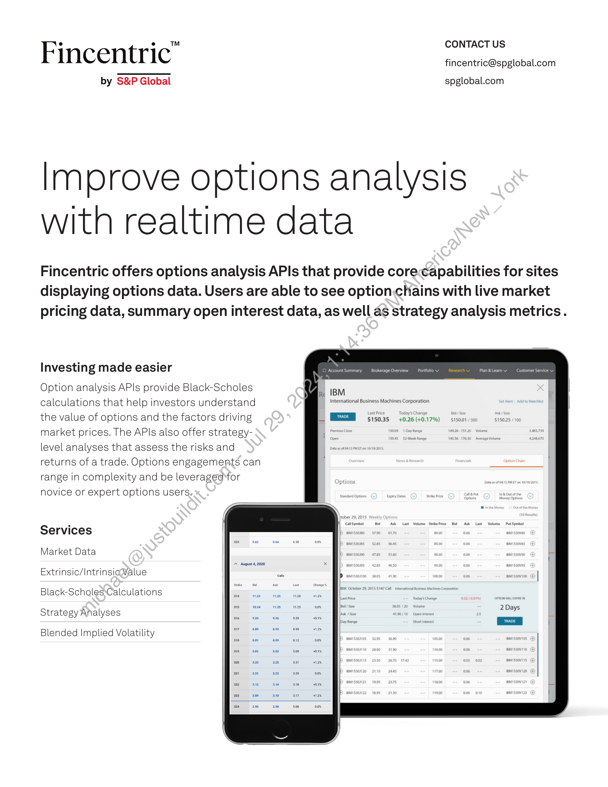

##### Fincentric Options Analysis APIs]

  
````col
```col-md
flexGrow=.5
===
> [!info] [Page 1](_attachments/images_Fincentric_OptionsAnalysis_Factsheet.pdf_153005/page_1.png)
> 
```  
```col-md
CONTACT US  
Fincentric" fincentric@spglobal.com  
by S&P Global spglobal.com  
Improve options analysis
with realtime data  
Fincentric offers options analysis APIs that provide corecapabilities for sites
displaying options data. Users are able to see option.chains with live market
pricing data, summary open interest data, as well as strategy analysis metrics.  
‘N
‘Account Summary Brokerage Overview Portfolio V
4  
rR. IBM  
International Business Machines Corporation  
Investing made easier  
Plan &Leam v Customer Service v  
Option analysis APIs provide Black-Scholes
calculations that help investors understand
the value of options and the factors driving
market prices. The APIs also offer strategylevel analyses that assess the risks and
returns of a trade. Options engagements can
range in complexity and be leveraged*for
novice or expert options users.  
ME is035 40.26 (40.17%) siso01 $150.25 / 10  
OAS 52Week Ran  
y
Services  
Market Data
Extrinsic/IntrinsioWalue
Black-ScholesCalculations
Strategy Analyses  
Blended Implied Volatility  
```
````
Notes:    
````col
```col-md
flexGrow=.5
===
> [!info] [Page 2](_attachments/images_Fincentric_OptionsAnalysis_Factsheet.pdf_153005/page_2.png)
> 
```  
```col-md
Improve options analysis with realtime data  
Tale bechosiotited ‘ me ay * i ~ ¢  
Watchlists
ne, Place an Order RY 74.21 USD Relves
Account Choose Symbol  
RY 081420 96 C  
Access-1  
ee so Typeot ade { stocks MMM 1.92ca0/0.00 2.44/38 2.63/10  
Position Held Expiry Date  
Strike Price Action Option Type Contracts  
Break
Watchlist wth along name 5 v Vv Put 1 98.57 98.6 2.68  
i a hq short  
Estimated Commissio 11.20 uso baa
stimated Cost/Proceeds of Transactions 2,491.20 USD  
he Access-1 As of 08 Aug 2020 M EDT. Some quotes may be delay Update tit == | 33?  
Change + LastBid/Sie > Last Ask/Size ¢ Volum High + Low ¢ Actions  
1.11 (41.03%) Buy! Sell | 1  
ews 0.02 (40.16%) 600 12574 500 4 $ Buy/Sell | 1  
Features
Market data Data feed*agnostic. Return full and filterable option chains with live
quote data. Users can quickly filter by expiration date and see summary
openNnterest statistics.
Extrinsic/intrinsic value Breaks down the option price into time value and how profitable the  
option would be if it were exercised today. We can also show the in-themoneyness of the option contract.  
Black-Scholes calculations Contract-level Black-Scholes calculations like implied volatility and
Greeks. We also provide a calculator where a user can adjust inputs,
to see how the option contact value could change over time or as the
underlying price changes.  
Strategy Analyses Strategy-level calculations including break even, max profit & loss, net
premium, net Greeks, probability of profit, and a P&L chart feature. These
analyses evaluate the potential risks and returns associated with a trade.  
Blended implied volatility This calculation quickly computes the implied volatility at any point
in time across strikes. It is similar to the VIX but can be applied to any
security with options.  
Copyright © 2024 Fincentric™ by S&P Global. All rights reserved. No content, including by
framing or similar means, may be reproduced or distributed without the prior written permission of
Fincentric™ by S&P Global or its affiliates. The content is provided on an “as is” basis.  
```
````
Notes:  


![[_attachments/1.2.1.13 Fincentric_OptionsAnalysis_Factsheet.pdf]