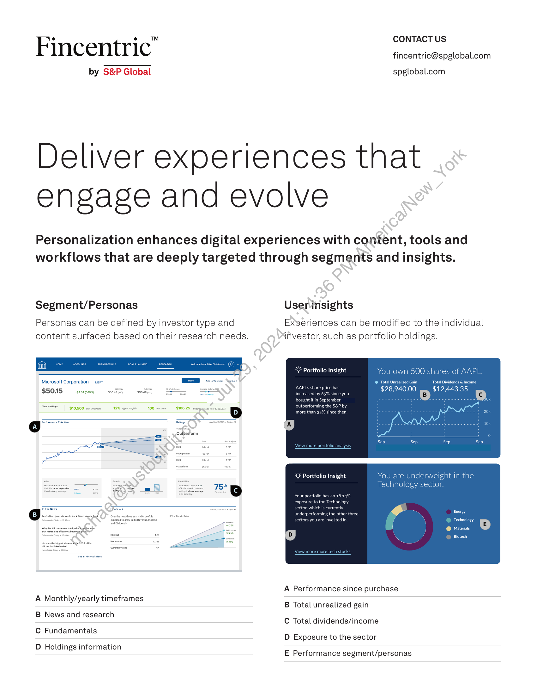
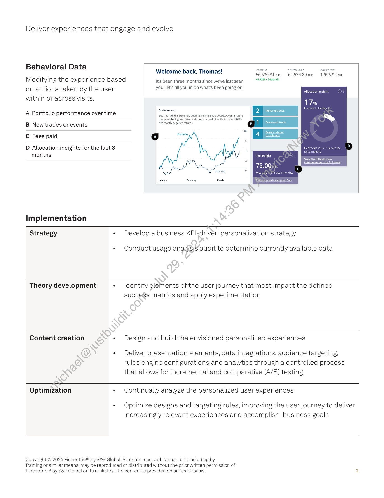

##### Personalized Digital Experiences: Engaging and Evolving User Journeys]

  
````col
```col-md
flexGrow=.5
===
> [!info] [Page 1](_attachments/images_Fincentric_Personalization_Factsheet.pdf_152946/page_1.png)
> 
```  
```col-md
CONTACT US  
Fincentr ic fincentric@spglobal.com  
by S&P Global spglobal.com  
Deliver experiences that
engage and evolve  
Personalization enhances digital experiences with content, tools and
workflows that are deeply targeted through segments and insights.  
Segment/Personas Userinsights
Personas can be defined by investor type and Experiences can be modified to the individual
content surfaced based on their research needs. investor, such as portfolio holdings.  
Y Portfolio Insight You own 500 shares of AAPL.  
Microsoft Corporation user k  
" @ Tot Gain Total Di &
$5015 sesso ssousvany —ssocoen v $28,940.00 iB $12,443.3  
$10,500 einer  
Y Portfolio Insight  
A Performance since purchase  
A Monthly/yearly timeframes . .
B Total unrealized gain  
B News and research
C Total dividends/income  
C Fundamentals
D Exposure to the sector  
D Holdings information
E Performance segment/personas  
```
````
Notes:    
````col
```col-md
flexGrow=.5
===
> [!info] [Page 2](_attachments/images_Fincentric_Personalization_Factsheet.pdf_152946/page_2.png)
> 
```  
```col-md
Deliver experiences that engage and evolve  
Behavioral Data  
Modifying the experience based
on actions taken by the user
within or across visits.  
A Portfolio performance over time  
B New trades or events  
C Fees paid  
Welcome back, Thomas!  
It's been three months since we've last seen
you, let's fill you in on what's been going on:  
Performance  
Your portfolio is currently beating the FTSE 100 by 3%, Account #3515
has seen the highest returns during this period while Account *7025
hhas mostly negative returns,  
a  
Net Worth  
66,530.81 eur
46.72% / 3-Month  
Portfolio Value  
B 1 Processed trade  
4 Sets related  
64,534.89 cur  
Buying Power  
1,995.92 eur  
Allocation insight  
7% :
x  
D Allocation insights for the last 3
months  
ta] Portfolio  
p 11% aver the  
Fee Insight  
January February March  
Implementation
Strategy * Develop a business KPl-drivén personalization strategy
* Conduct usage analysjs audit to determine currently available data
Theory development + Identify elements of the user journey that most impact the defined
succeSs metrics and apply experimentation
Content creation * Design and build the envisioned personalized experiences
- Deliver presentation elements, data integrations, audience targeting,
rules engine configurations and analytics through a controlled process
that allows for incremental and comparative (A/B) testing
Optimization + Continually analyze the personalized user experiences  
Optimize designs and targeting rules, improving the user journey to deliver
increasingly relevant experiences and accomplish business goals  
Copyright © 2024 Fincentric™ by S&P Global. All rights reserved. No content, including by
framing or similar means, may be reproduced or distributed without the prior written permission of
Fincentric™ by S&P Global or its affiliates. The content is provided on an “as is” basis.  
```
````
Notes:  


![[_attachments/1.2.1.14 Fincentric_Personalization_Factsheet.pdf]