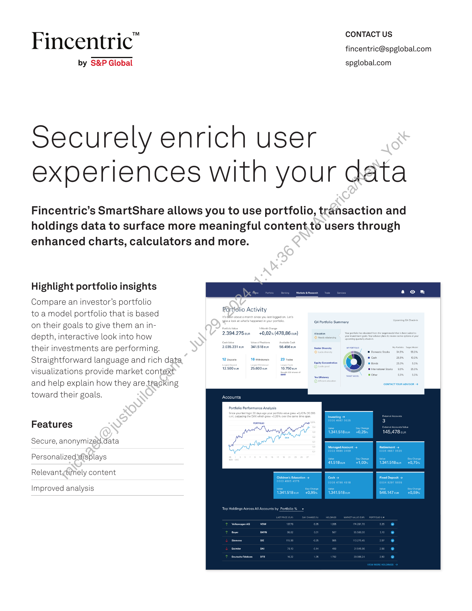
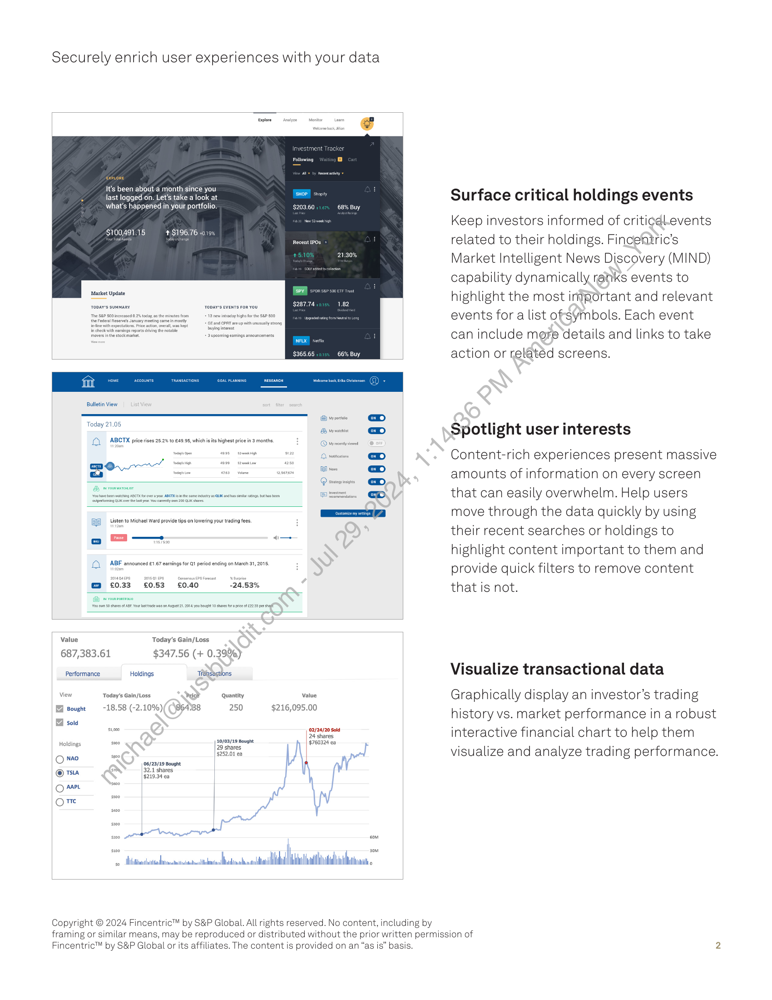

##### Fincentric: Securely Enrich User Experiences with Your Data]

  
````col
```col-md
flexGrow=.5
===
> [!info] [Page 1](_attachments/images_Fincentric_SmartShare_Factsheet.pdf_152938/page_1.png)
> 
```  
```col-md
CONTACT US  
Fincentric" fincentric@spglobal.com  
by S&P Global spglobal.com  
Securely enrich user
experiences with your data  
Fincentric’s SmartShare allows you to use portfolio, transaction and
holdings data to surface more meaningful content.to users through
enhanced charts, calculators and more.  
Highlight portfolio insights
Compare an investor’s portfolio  
to a model portfolio that is based
on their goals to give them an indepth, interactive look into how , /
their investments are performing. 2iaszstan i5tbun
Straightforward language and rich data Tomy | mann | Zn  
visualizations provide market context eee Bee ee
and help explain how they are tracking
toward their goals. Rowan  
Partfolio Activity  
2.394.275 un — +0,02% (478,86 eur)  
56.456 cur  
Portfolio Performance Analysis.  
Features  
Secure, anonymized.data
Personalizedidisplays
Relevantytimely content  
Improved analysis  
```
````
Notes:    
````col
```col-md
flexGrow=.5
===
> [!info] [Page 2](_attachments/images_Fincentric_SmartShare_Factsheet.pdf_152938/page_2.png)
> 
```  
```col-md
Securely enrich user experiences with your data  
It’s been about a month since you  
last logged on.  
Let's take a look at  
what's happened in your portfolio.  
$100,491.15  
Market Update  
4 $196.76 10.19%  
Recent IPOs  
Y  
$287.74  
$365.65 66% Buy  
Bulletin View  
Today 21.05  
CL) ABCTX pricerises 25.2% to £48.95, which sits highest price in 3 months  
cy  
oe  
Dp  
[—}  
Value  
687,383.61  
Today's Gain/Loss  
$347.56 (+ 0.39%)  
Performance  
Holdings  
‘Transactions  
View
Bought  
Sold  
Holdings
CQ Nao
@t1a
Ome
Ome  
Today's Gain/Loss  
-18,58 (-2.10%)  
. thie dt  
Price  
864.88  
Quantity
250  
10/03/19 Bought
29 shares
$252.01 ea  
Value  
$216,095.00  
02/24/20 Sold
24 shares
$760324 ea  
schon anol’  
Copyright © 2024 Fincentric™ by S&P Global. All
framing or similar means, may be reproduced or distributed without the prior written permission of  
Fincentric™ by S&P Global or its affiliates. The content is provided on an “as is” basis.  
rights reserved. No content, including by  
Surface critical holdings events  
Keep investors informed of criticdl.events
related to their holdings. Fincentric’s
Market Intelligent News Discovery (MIND)
capability dynamically ranks events to
highlight the most important and relevant
events for a list ofsymbols. Each event
can include mere details and links to take
action or related screens.  
Spotlight user interests  
Content-rich experiences present massive
amounts of information on every screen
that can easily overwhelm. Help users
move through the data quickly by using
their recent searches or holdings to
highlight content important to them and
provide quick filters to remove content
that is not.  
Visualize transactional data  
Graphically display an investor’s trading
history vs. market performance in a robust
interactive financial chart to help them
visualize and analyze trading performance.  
```
````
Notes:  


![[_attachments/1.2.1.15 Fincentric_SmartShare_Factsheet.pdf]