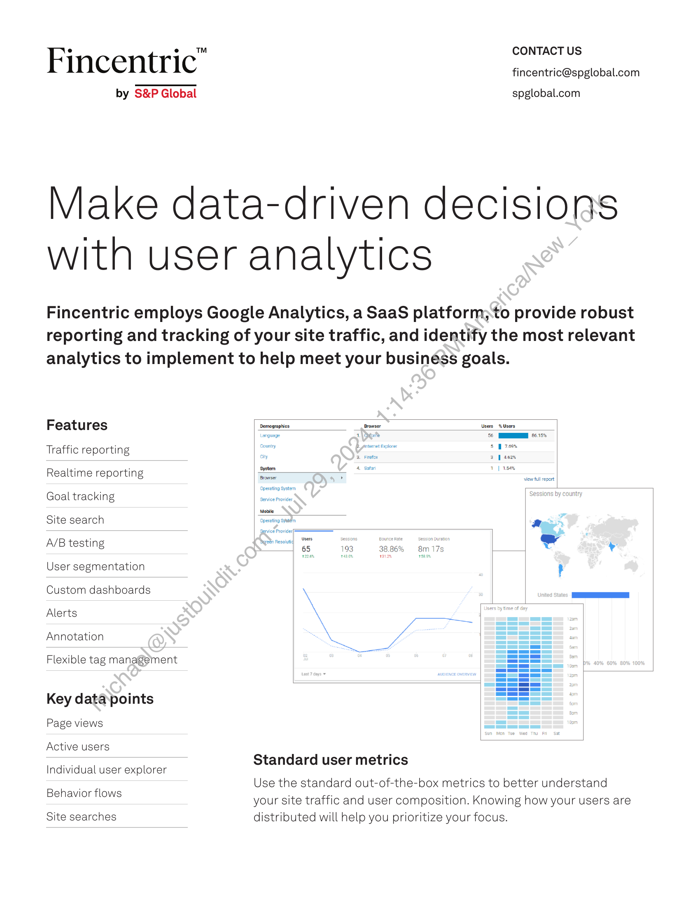
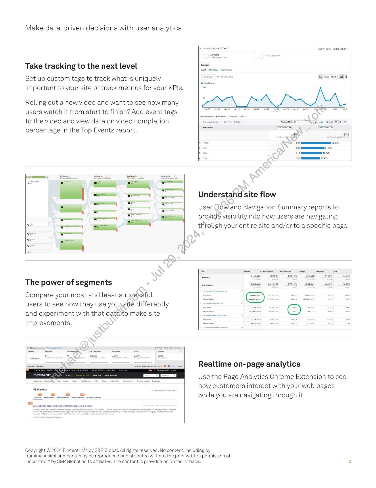

##### Fincentric User Analytics]

  
````col
```col-md
flexGrow=.5
===
> [!info] [Page 1](_attachments/images_Fincentric_User_Analytics_Factsheet.pdf_152928/page_1.png)
> 
```  
```col-md
Fincentric"  
by S&P Global  
CONTACT US
fincentric@spglobal.com  
spglobal.com  
Make data-driven decisions
with user analytics  
Fincentric employs Google Analytics, a SaaS platform;to provide robust
reporting and tracking of your site traffic, and identify the most relevant
analytics to implement to help meet your business goals.  
Features  
Traffic reporting
Realtime reporting
Goal tracking  
Site search  
A/B testing  
User segmentation
Custom dashboards
Alerts  
Annotation  
Flexible tag management  
Key datapoints
Page views
Active users  
ndividual user explorer  
Behavior flows  
Site searches  
Browser Users Users
56 MN 66.15%  
on er  
3 | sez  
1 | 156%
Browser , view full report
Operating System  
Sessions by country
Service Provider
Mobile  
~— a>  
Servicd Provider  
Yagetn Resolutic veers = ‘Bounce Rate es Duration e ;
65 93 38.86% 8m 17s . ¥  
Standard user metrics  
Use the standard out-of-the-box metrics to better understand
your site traffic and user composition. Knowing how your users are
distributed will help you prioritize your focus.  
```
````
Notes:    
````col
```col-md
flexGrow=.5
===
> [!info] [Page 2](_attachments/images_Fincentric_User_Analytics_Factsheet.pdf_152928/page_2.png)
> 
```  
```col-md
Make data-driven decisions with user analytics  
Take tracking to the next level  
Set up custom tags to track what is uniquely
important to your site or track metrics for your KPIs.  
Rolling out a new video and want to see how many
users watch it from start to finish? Add event tags
to the video and view data on video completion
percentage in the Top Events report.  
a  
8
!
3
i
i  
*  
o  
The power of segments  
Compare your most and least suceessful
users to see how they use yoursite differently
and experiment with that data)to make site
improvements.  
° 0:00:00 0.00% 0.00% 6985,  
AL Users  
ALL » EVENT CATEGORY Video Jun 9, 2020 - Jul 8, 2020  
allUsers  
Explorer  
Event Ste Usage Ecommerce  
Total6vente ~ |S. Selecta meric Bay) went | ton | (2)  
© Total vents  
q
g  
Understand site flow  
User Flow and Navigation Summary reports to
provide visibility into how users are navigating
through your entire site and/or to a specific page.  
ewvsee 1338,968 382,890 000126 212660 44.29% 18.67%  
10299872 2,379,706 ono1s9 1285094 33.79% 12.40%  
Realtime on-page analytics  
Use the Page Analytics Chrome Extension to see
how customers interact with your web pages
while you are navigating through it.  
Copyright © 2024 Fincentric™ by S&P Global. All rights reserved. No content, including by
framing or similar means, may be reproduced or distributed without the prior written permission of
Fincentric™ by S&P Global or its affiliates. The content is provided on an “as is” basis. 2  
```
````
Notes:  


![[_attachments/1.2.1.16 Fincentric_User_Analytics_Factsheet.pdf]