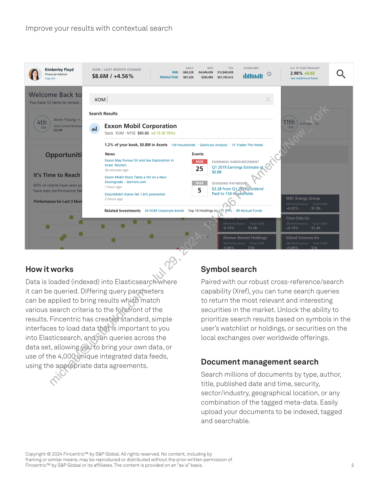

##### Fincentric: Search and Indexing for Contextual Insights]

  
````col
```col-md
flexGrow=.5
===
> [!info] [Page 1](_attachments/images_Fincentric_Search_Factsheet.pdf_152935/page_1.png)
> 
```  
```col-md
Fincentric’  
by S&P Global  
CONTACT US
fincentric@spglobal.com
spglobal.com  
Improve your results with
contextual search  
Fincentric’s search and indexing capability quickly andeasily returns
personalized results across documents and data with intuitive interfaces
and multiple layers of prioritization and customization.  
Find what you’re looking for  
Our search capability quickly indexes
and tags data, standardizing ingestion
and enabling customized search
queries for everything from screeners
and news to press releases and
securities listings.  
Search queries can be set to retukn
predictive (type-ahead) resultsyexact
matches or the most popular results.
Typo tolerance reduces-the burden
of accuracy for users;which can be
especially helpful for mobile users.  
Why Elasticsearch?  
Elasticsearch provides a Google-like
search capability with the ability to
customize results. It’s schema-less, and
easily accommodates structured and
unstructured data. This fault-tolerant
search technology is well supported
and widely adopted (Netflix, Mozilla,
Facebook, Cisco, Microsoft, Adobe,
Github, twilio, Workday).  
13.5K 11M 27ms  
Peak symbolsearch Averagedocument Average document
requests per minute requests per week search response time  
```
````
Notes:    
````col
```col-md
flexGrow=.5
===
> [!info] [Page 2](_attachments/images_Fincentric_Search_Factsheet.pdf_152935/page_2.png)
> 
```  
```col-md
Improve your results with contextual search  
=» Kimberley Floyd PUR URedmonirilcttner Daly mo YTD SCORECARD USS. 10 YEAR TREASURY
menial Advoor LD ae) ee ee © 2.98% +0.02 Q
(ene $8.6M / +4.56% PRODUCTION $81,326 sze3085 ss17esoi2 HLM II anaididonal nates  
xom |
Search Results  
Exxon Mobil Corporation
Stock XOM : NYSE $80.86 +0.15 (0.19%)  
1.2% of your book, $0.8M in Assets 134 Households  Gain/Loss Analysis | 15 Trades This Week  
News Events
Exxon May Pursue Oil and Gas Exploration in PME EARNINGS ANNOUNCEMENT  
Israel -Reuters \ .
34 minutes ago 25 % a Earnings Estimate at,  
Exxon Mobil Stock Takes a Hit on a New  
Downgrade -- Barrons.com MEI iviveno payment  
‘hour age 5 $3.28 from Q1 2699 Wvidend
ExxonMobil shares fall 1.6% premarket Paid to 134 Hoyseffolds  
2 hours ago  
Related Investments 24 XOM Corporate Bonds Top 10 Holdings ingJ51 BPs | 89 Mutual Funds  
How it works Symbol search  
Data is loaded (indexed) into Elasticsearch>where Paired with our robust cross-reference/search  
it can be queried. Differing query parameters capability (Xref), you can tune search queries
can be applied to bring results which match to return the most relevant and interesting
various search criteria to the fofefront of the securities in the market. Unlock the ability to
results. Fincentric has createdstandard, simple prioritize search results based on symbols in the
interfaces to load data thats important to you user’s watchlist or holdings, or securities on the
into Elasticsearch, and-run queries across the local exchanges over worldwide offerings.  
data set, allowing youto bring your own data, or
use of the 4,0002)nique integrated data feeds,
using the appropriate data agreements. Document management search
Search millions of documents by type, author,
title, published date and time, security,
sector/industry, geographical location, or any
combination of the tagged meta-data. Easily
upload your documents to be indexed, tagged
and searchable.  
Copyright © 2024 Fincentric™ by S&P Global. All rights reserved. No content, including by
framing or similar means, may be reproduced or distributed without the prior written permission of
Fincentric™ by S&P Global or its affiliates. The content is provided on an “as is” basis. 2  
```
````
Notes:  


![[_attachments/1.2.1.17 Fincentric_Search_Factsheet.pdf]