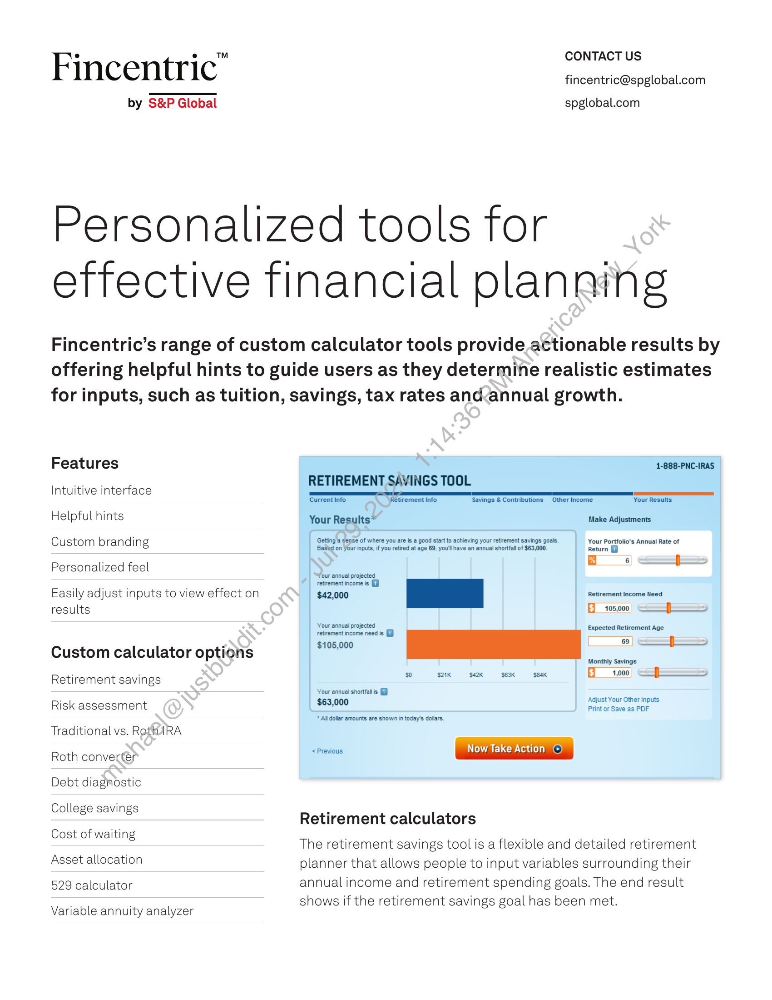
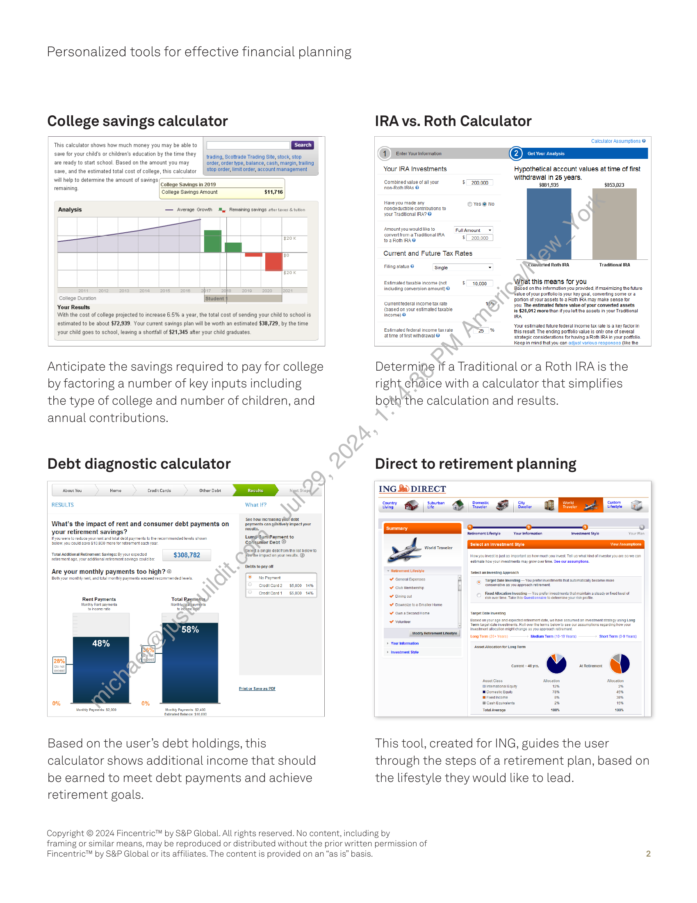

##### Fincentric™ Retirement and Financial Planning Tools]

  
````col
```col-md
flexGrow=.5
===
> [!info] [Page 1](_attachments/images_Fincentric_Calculators_Factsheet.pdf_152956/page_1.png)
> 
```  
```col-md
CONTACT US  
Fincentric" fincentric@spglobal.com  
by S&P Global spglobal.com  
Personalized tools for
effective financial planning  
Fincentric’s range of custom calculator tools provide actionable results by
offering helpful hints to guide users as they determine realistic estimates
for inputs, such as tuition, savings, tax rates and.annual growth.  
Features 1-888-PNC-IRAS  
cas RETIREMENT SAVINGS TOOL
Intuitive interface AE  
Current Info: Retirement Info Savings & Contributions Other Income Your Results
Helpful hints Your Results* Make Adjustments
Personalized feel
*Zour annual projected  
. . . . retirement income is (9
Easily adjust inputs to view effect on $42,000 | | Retirement Income Need
results ———  
Your annual projected Expected Retirement Age  
retirement income need is
Custom calculator options  
Monthly Savings  
E__ 1.000) <= f$—$—$—>  
Ey
Ly
FE
5
Fa
ie  
Retirement savings  
Your annual shorts 6Adjust Your Other Inputs:
Risk assessment SEIN Print or Save as POF  
* All dollar amounts are shown in today's dollars.
Traditional vs. Roth RA  
<Previous Now Take Action ©
Roth converter  
Debt diagnostic  
a  
College savings .
Retirement calculators  
Cost of waitin
6 The retirement savings tool is a flexible and detailed retirement  
Asset allocation planner that allows people to input variables surrounding their
529 calculator annual income and retirement spending goals. The end result  
- - shows if the retirement savings goal has been met.
Variable annuity analyzer  
```
````
Notes:    
````col
```col-md
flexGrow=.5
===
> [!info] [Page 2](_attachments/images_Fincentric_Calculators_Factsheet.pdf_152956/page_2.png)
> 
```  
```col-md
Personalized tools for effective financial planning  
College savings calculator  
This calculator shows how much money you may be able to | Search }
save for your childs or children's education by the time they | 2 4ing, Scottrade Trading Site, stock, stop
are ready to start school, Based on the amount you may order, order type, balance, cash, margin, trailing
save, and the estimated total cost of college, this calculator | St0p al it order, account management
will help to determine the amount of savings
‘ominin College Savings in 2019
3 College Savings Amount $14,716
Analysis — Average Growth My Remaining savings atter taxes & tution
¥
Fo
¥20
ma waa Cr Te CR
College Duration [Student
Your Results  
With the cost of college projected to increase 6.5% a year, the total cost of sending your child to school is
estimated to be about $72,939. Your current savings plan will be worth an estimated $38,729, by the time
your child goes to school, leaving a shorfall of $21,345 after your child graduates.  
Anticipate the savings required to pay for college
by factoring a number of key inputs including
the type of college and number of children, and
annual contributions.  
Debt diagnostic calculator  
RESULTS What If?  
About You Home Credit Carde  
. see now inereaoma bu ent
What's the impact of rent and consumer debt payments on ‘compantvelypect your
your retirement savings?  
you areto reduce yourrnt nde det pans the commended lvls sown
Delo you suisse st 920 mrs ortetesortoach oar  
focus.  
Lump SuthPayment to
Cohsunier Debt ©  
SGeidhtasinae dept rom me ist pelow to  
‘otal Addlional Rotromont Savings: 8) your expoctod Seethe impacion yourresuts. ©  
‘retirement age, your additional retirement savings could be: $308,782Debts to pay oft  
Are your monthly payments too high? ©
Both carmen and meni peymenis exceed recomnendedievls. © NoPayment
croaicars? $6000 14%  
Greaicara1 $5,000 14%  
Rent Payments ‘Total Raymants,
ent Fert seyments Nontygaibarrins|
feeame cate ‘ohare ts  
58%  
rin or Save os POE  
ony Payee $2,200 Ment Payers $2400,  
Based on the user’s debt holdings, this
calculator shows additional income that should
be earned to meet debt payments and achieve
retirement goals.  
IRA vs. Roth Calculator  
Calculator Assumptions @  
Hypothetical account values at time of first
withdrawal in 25 years.  
4 EnterYourinformaton  
Your IRA Investments  
‘Combined value ofall your 5” 200.000
‘Ron-Roth IRAs @  
Have you made any
‘ondeductile contributions to
your Traditional RA? @  
‘Amount youwould ike to
‘convert from a Traditional RA
toa Roh RAO  
FullAmount +  
{200,000 _]}  
Current and Future Tax Rates  
Fling statis © Single y Comdbrted Roth RA ‘rational RA
Estimated taxable income (nct $10,000 ‘What this means for you
including conversion amount) @ {Based on the information you provided, if maximizing the futuro
“alve of your porto is your key goal, converting some cr a
portion of your assets to 2 Rot IRA may make sense for
‘Gurrenttederal income tax rate & you. The estimated future value of your converted assets
(based on your estimated taxable ‘is $28,912 more than ifyou let the assets in your Traditional
income) © Tea
~ Your estimate tuture federal income tax rate is @ key factor in
Estimated federal income taxrate 2% this result. The encing portfolio value is only one of several
-attie of rst windrawal ©  
sirstegic considerstions for having Roth IRAin your portfolio.
Keep in mind thet you can adjust various responses (ike the  
Determine if a Traditional or a Roth IRA is the
right.chdice with a calculator that simplifies
both'the calculation and results.  
Direct to retirement planning  
ING &i) DIRECT
tots Tver
7 Reseed ere Stet anmesing pcnch  
Ore] Fxod Alocation vsti — You pear invosiments that maintain a slead or fod Ivo of  
Tiskavertme, Take is QuaaVontalt fo dleine your ak prot,  
“¥ Downs o 2 Smater Home  
oun aseconatiome Target Datemvestng  
—— ‘asec on ur age anc expacte reterrt cote, we Rave assumed an investment strategy using Long  
Aco Term iatet date nvestrers. Rol ov! the ers blowto see out assumptions regarding how
Ives loeston igh evango 6 ou apgreaehratemene  
seo
nc
mm .
oon Yume D
vote a
a © :  
This tool, created for ING, guides the user
through the steps of a retirement plan, based on
the lifestyle they would like to lead.  
Copyright © 2024 Fincentric™ by S&P Global. All rights reserved. No content, including by
framing or similar means, may be reproduced or distributed without the prior written permission of  
Fincentric™ by S&P Global or its affiliates. The content is provided on an “as is” basis.  
```
````
Notes:  


![[_attachments/1.2.1.18 Fincentric_Calculators_Factsheet.pdf]