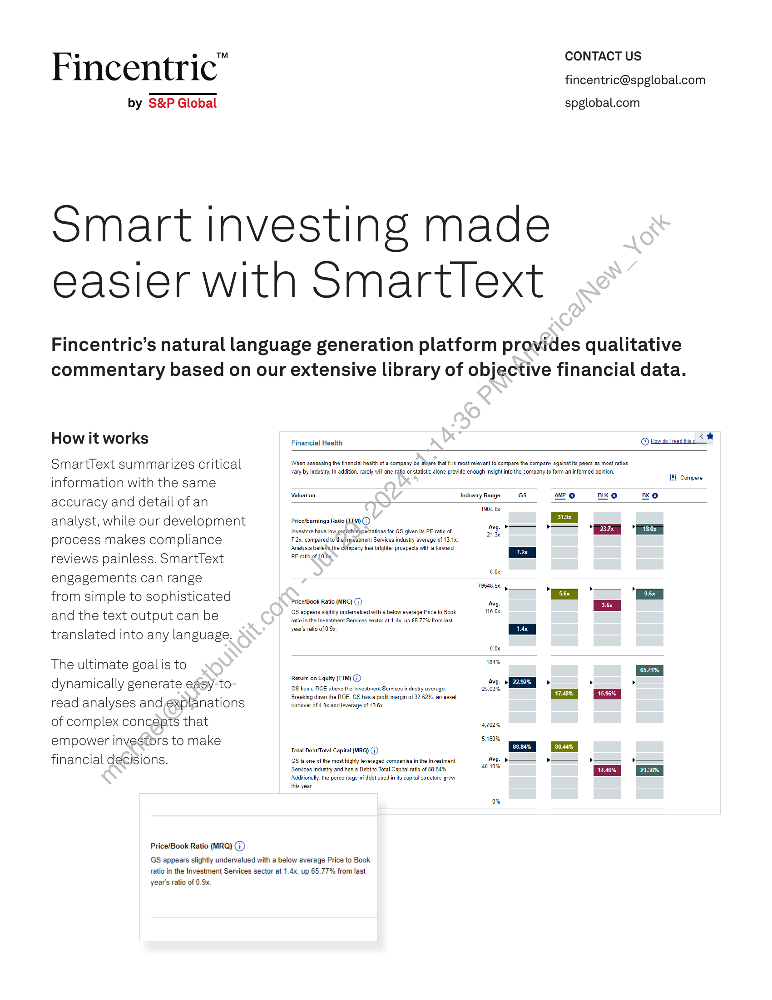
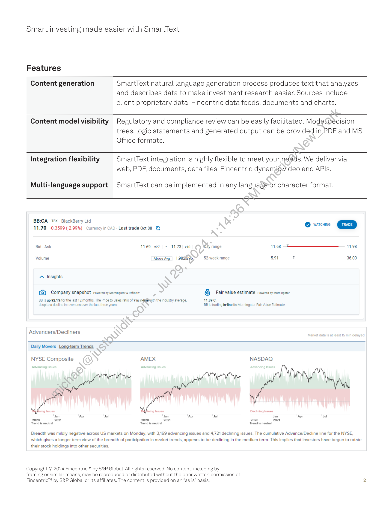

##### Fincentric™ by S&P Global]

  
````col
```col-md
flexGrow=.5
===
> [!info] [Page 1](_attachments/images_Fincentric_SmartText_Factsheet.pdf_152949/page_1.png)
> 
```  
```col-md
Fincentric"  
by S&P Global  
CONTACT US
fincentric@spglobal.com  
spglobal.com  
Smart investing made
easier with Smartlext  
Fincentric’s natural language generation platform provides qualitative
commentary based on our extensive library of objective financial data.  
How it works  
SmartText summarizes critical
information with the same
accuracy and detail of an
analyst, while our development
process makes compliance
reviews painless. SmartText
engagements can range  
from simple to sophisticated
and the text output can be
translated into any language.  
The ultimate goal is to
dynamically generate easy-toread analyses andexplanations
of complex concepts that
empower investors to make
financial decisions.  
Price/Book Ratio (MRQ) (1)  
Financial Health  
@ Howeninasticd <  
When assessing the finencial health of a company be alvare that itis most relevant to compare the company againstits peers as most ratios
vary by industry. In addition, rarely will one ratio or statistic alone provide enough insight into the company to form an informed opinion.  
IH Compare
Valuation Industry Range Gs ANP @ BK xO
72x, compared to the Inyestment Services industry average of 13.1x.
PE ratio of 10.0y. ia
vox
rs
PricelBook Ratio (MR) (7) hve. Ea
years rao ofS Ea
vox
ee  
Return on Equity (TTM) (7)  
GS has ROE above the Investment Services industry average.
Breaking down the ROE. GS has a profit margin of 32.62%, an asset,
‘ummover of 4.9x and leverage of 13.63.  
Avg.
25.99%  
4.792%
5.160%
Total DebtTotal Capital (MRQ) (7)
GS is one of the most highly leveraged companies in the Investment Avg. » > »
Services industry and has a Debt to Total Capital ratio of 88.84%. 46.1056 14.16%
Additionally, the percentage of debt used in ts capital structure grow
this year.
0%  
GS appears slightly undervalued with a below average Price to Book
ratio in the Investment Services sector at 1.4x, up 65.77% from last  
year’s ratio of 0.9x.  
```
````
Notes:    
````col
```col-md
flexGrow=.5
===
> [!info] [Page 2](_attachments/images_Fincentric_SmartText_Factsheet.pdf_152949/page_2.png)
> 
```  
```col-md
Smart investing made easier with SmartText  
Features  
Content generation  
SmartText natural language generation process produces text that analyzes  
and describes data to make investment research easier. Sources include
client proprietary data, Fincentric data feeds, documents and charts.  
Content model visibility  
Regulatory and compliance review can be easily facilitated. Modeldecision  
trees, logic statements and generated output can be provided in PDF and MS  
Office formats.  
Integration flexibility  
SmartText integration is highly flexible to meet your. needs. We deliver via  
web, PDF, documents, data files, Fincentric dynamigwvideo and APIs.  
Multi-language support  
SmartText can be implemented in any languagé-or character format.  
BB:CA TSX BlackBerry Ltd
11.70 -0.3599 (-2.99%) Currency in CAD - Last trade Oct 08 @  
Bid - Ask 11.69 x27, - 11.73 x10
Volume Above Avg 1,982/296
~ Insights  
[2] Company snapshot Powered by Morningstar & Refinitiv  
BB is up 92.1% for the last 12 months. The Price to Sales ratio of 7 is infig@with the industry average,
despite a decline in revenues over the last three years  
Advancers/Decliners  
@ warcuine  
Day range 11.68 = 11.98  
“  
52-week range 5.91 36.00  
6 Fair value estimate Powered by Morningstar  
11.896.
BB is trading in-line its Morningstar Fair Value Estimate.  
Daily Movers Long-term Trends  
NYSE Composite  
Jan ‘Apr Jul Jan ‘Apr
2020 2021 2020 2021  
Trend is neutral Trend is neutral  
NASDAQ  
Declining Issues  
Jul Jan Apr Jul
2020 2021
Trend is neutral  
Breadth was mildly negative across US markets on Monday, with 3,169 advancing issues and 4,721 declining issues. The cumulative Advance/Decline line for the NYSE,
which gives a longer term view of the breadth of participation in market trends, appears to be declining in the medium term. This implies that investors have begun to rotate  
their stock holdings into other securities.  
Copyright © 2024 Fincentric™ by S&P Global. All  
rights reserved. No content, including by  
framing or similar means, may be reproduced or distributed without the prior written permission of
Fincentric™ by S&P Global or its affiliates. The content is provided on an “as is” basis.  
```
````
Notes:  


![[_attachments/1.2.1.19 Fincentric_SmartText_Factsheet.pdf]