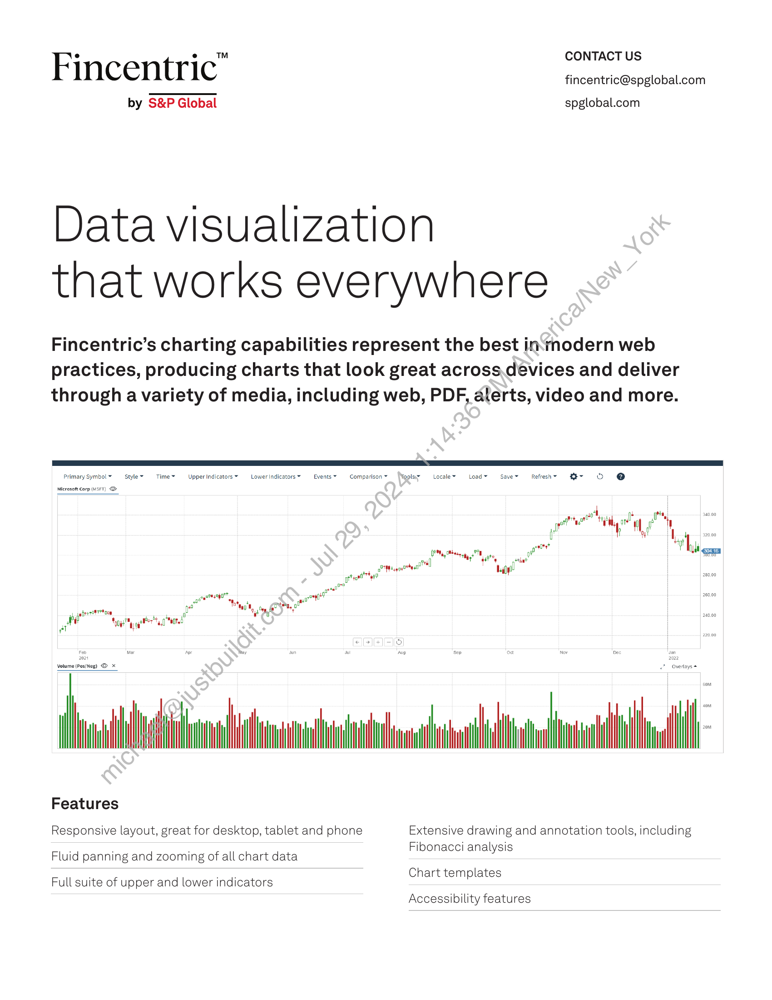
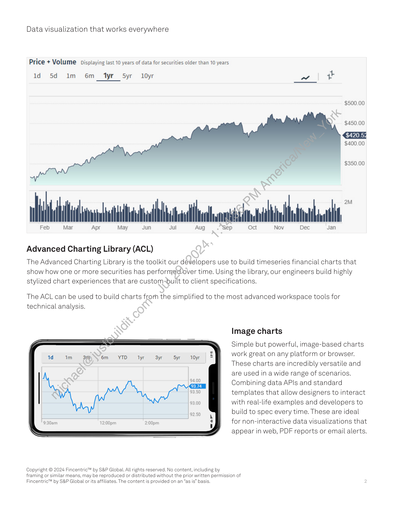

##### Fincentric Advanced Charting Library]

  
````col
```col-md
flexGrow=.5
===
> [!info] [Page 1](_attachments/images_Fincentric_Charting_Factsheet.pdf_152933/page_1.png)
> 
```  
```col-md
F ° ° =™ CONTACT US
Incentric fincentric@spglobal.com
by S&P Global spglobal.com  
Data visualization
that works everywhere  
Fincentric’s charting capabilities represent the best in‘tnodern web
practices, producing charts that look great across.devices and deliver
through a variety of media, including web, PDF, aterts, video and more.  
Upper Indicators*  Lowerindicators~  Events* © Comparisony Migglsy  Locale~ Load Savev Refreshy er O @  
4 bh
rte tt i m
we w “ry Hl f i
y i; ‘| 20.00
wr P ylt 5  
200.00  
2081? om  
fi
a
say etal atte  
ve  
Jolume (PosiNeg) © <7 Overlays =  
Features  
Responsive layout, great for desktop, tablet and phone Extensive drawing and annotation tools, including  
. . . Fibonacci analysis
Fluid panning and zooming of all chart data  
; oo Chart templates
Full suite of upper and lower indicators  
Accessibility features  
```
````
Notes:    
````col
```col-md
flexGrow=.5
===
> [!info] [Page 2](_attachments/images_Fincentric_Charting_Factsheet.pdf_152933/page_2.png)
> 
```  
```col-md
Data visualization that works everywhere  
Price + Volume Displaying last 10 years of data for securities older than 10 years  
ld 5d Im 6m tyr 5yr = 10yr aS yh  
$500.00  
$450.00  
$400.00  
+ $350.00  
Ww  
Feb  
Mar  
2M
iil. ontn dd
Api in Jul Aug Sep Oct Nov Dec Jan  
May Jui  
Advanced Charting Library (ACL)  
The Advanced Charting Library is the toolkit our developers use to build timeseries financial charts that
show how one or more securities has performedover time. Using the library, our engineers build highly
stylized chart experiences that are custom-built to client specifications.  
The ACL can be used to build charts from the simplified to the most advanced workspace tools for
technical analysis.  
Image charts  
Simple but powerful, image-based charts
work great on any platform or browser.
These charts are incredibly versatile and
are used in a wide range of scenarios.
Combining data APIs and standard
templates that allow designers to interact
with real-life examples and developers to
build to spec every time. These are ideal
for non-interactive data visualizations that
appear in web, PDF reports or email alerts.  
Copyright © 2024 Fincentric™ by S&P Global. All rights reserved. No content, including by
framing or similar means, may be reproduced or distributed without the prior written permission of
Fincentric™ by S&P Global or its affiliates. The content is provided on an “as is” basis.  
```
````
Notes:  


![[_attachments/1.2.1.2 Fincentric_Charting_Factsheet.pdf]