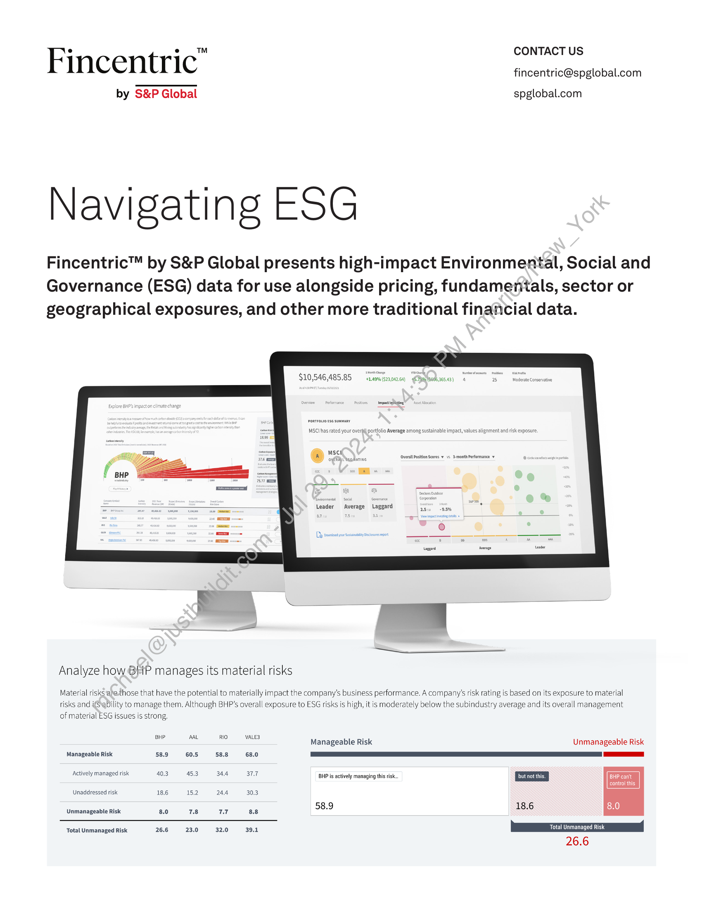
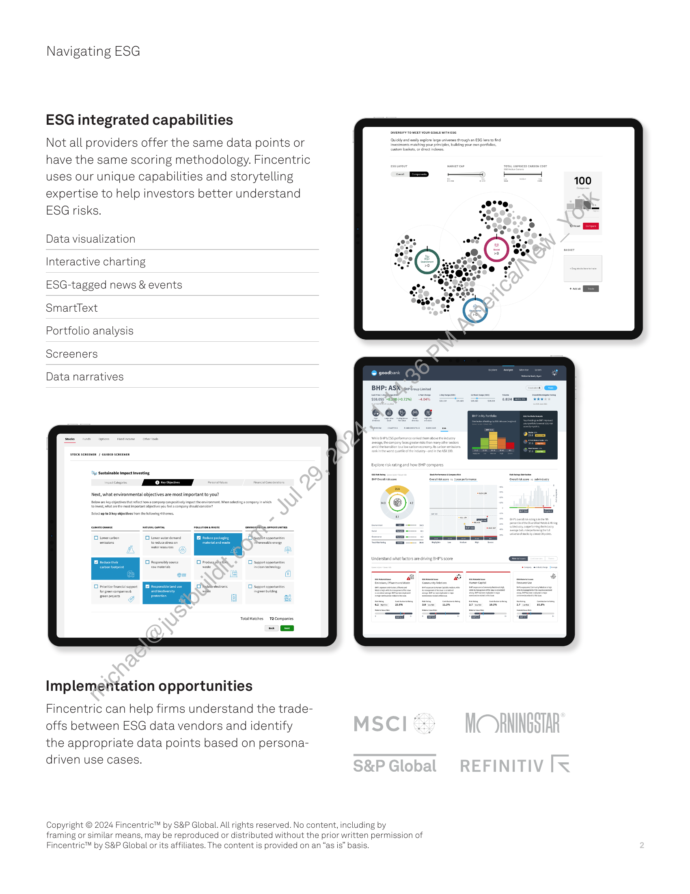

##### Fincentric™ by S&P Global: Navigating ESG]

  
````col
```col-md
flexGrow=.5
===
> [!info] [Page 1](_attachments/images_Fincentric_ESG_Factsheet.pdf_152925/page_1.png)
> 
```  
```col-md
Fincentric” CONTACT US  
fincentric@spglobal.com  
by S&P Global spglobal.com  
Navigating ESG  
Fincentric™ by S&P Global presents high-impact Environmental, Social and
Governance (ESG) data for use alongside pricing, fundamenials, sector or
geographical exposures, and other more traditional financial data.  
$10,546,485.85  
042.68) 6-Tpnhtee0b,365.43) 4 25 Moderate Conservative  
MSCI has rated your overgll portfolio Average among sustainable impact, values alignment and risk exposure.  
sci
ofA Need arin vera Position Scores ¥ vs month Performance  
Analyze how BHP manages its material risks  
Material risks ‘apethose that have the potential to materially impact the company’s business performance. A company’s risk rating is based on its exposure to material  
risks and ifS ability to manage them. Although BHP’s overall exposure to ESG risks is high, it is moderately below the subindustry average and its overall management
of material ESG issues is strong.  
BHP AAL RIO VALE3 . q
Manageable Risk Unmanageable Risk
Manageable Risk 58.9 60.5 588 68.0 a
Pac yim Seals 40.3 45.3 wa 17 BHP is actively managing this risk {but not this. | BHP cant
control this
Unaddressed risk 18.6 15.2 24.4 30.3
Unmanageable Risk etal ral ae as 58.9 18.6 8.0  
Total Unmanaged Risk 26.6 23.0 32.0 39.1 Total Unmanaged Risk  
```
````
Notes:    
````col
```col-md
flexGrow=.5
===
> [!info] [Page 2](_attachments/images_Fincentric_ESG_Factsheet.pdf_152925/page_2.png)
> 
```  
```col-md
Navigating ESG  
ESG integrated capabilities  
Not all providers offer the same data points or
have the same scoring methodology. Fincentric
uses our unique capabilities and storytelling
expertise to help investors better understand
ESG risks.  
Data visualization  
nteractive charting  
ESG-tagged news & events  
SmartText  
Portfolio analysis  
Screeners  
Data narratives  
Total Matches  
Implementation opportunities  
Fincentric can help firms understand the tradeoffs between ESG data vendors and identify
the appropriate data points based on personadriven use cases.  
@ seodbank  
Copyright © 2024 Fincentric™ by S&P Global. All rights reserved. No content, including by
framing or similar means, may be reproduced or distributed without the prior written permission of
Fincentric™ by S&P Global or its affiliates. The content is provided on an “as is” basis.  
```
````
Notes:  


![[_attachments/1.2.1.3 Fincentric_ESG_Factsheet.pdf]