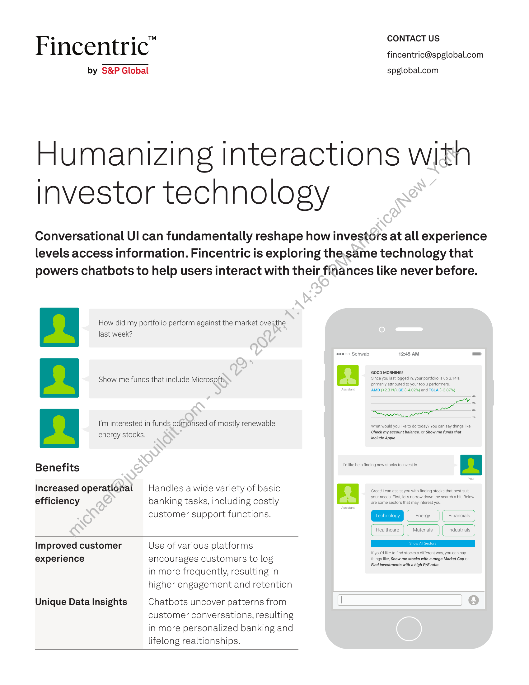
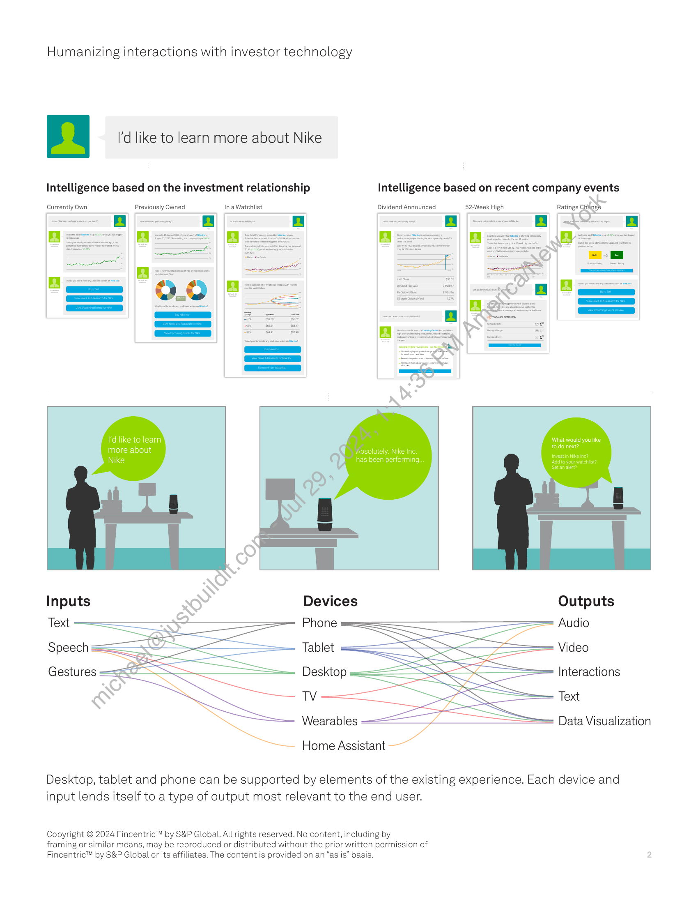

##### Humanizing Interactions with Investor Technology]

  
````col
```col-md
flexGrow=.5
===
> [!info] [Page 1](_attachments/images_Fincentric_Conversational_UI_Factsheet.pdf_152951/page_1.png)
> 
```  
```col-md
CONTACT US  
Fincentric" fincentric@spglobal.com  
by S&P Global spglobal.com  
Humanizing interactions with
investor technology  
Conversational UI can fundamentally reshape how investors at all experience
levels access information. Fincentric is exploring the same technology that
powers chatbots to help users interact with their finances like never before.  
How did my portfolio perform against the market over.the  
last week?
oo Schwab 12:45 AM =.
GOOD MORNING!
Show me funds that include Microsoft Since you last logged in, your portfolio is up 3.14%,primarily attributed to your top 3 performers,
Assi AMD (+2.31%), GE (+4.02%) and TSLA (+3.87%)
ome *
NN
I'm interested in funds comprised of mostly renewable Unita thpeloacbne Ss peoemeD ApS  
‘Check my account balance. or Show me funds that  
energy stocks. include Apple.  
Benefits se tkepeb fnangnay soasroimestn 2
Increased operational Handles a wide variety of basic S| Pete yeriViegee aa
efficiency banking tasks, including costly a
customer support functions. - (__eneray (Financials
Improved customer Use of various platforms a
experience encourages customers to log Girma ne eer  
Find investments with a high P/E ratio  
in more frequently, resulting in
higher engagement and retention  
Unique Data Insights Chatbots uncover patterns from
customer conversations, resulting
in more personalized banking and
lifelong realtionships.  
```
````
Notes:    
````col
```col-md
flexGrow=.5
===
> [!info] [Page 2](_attachments/images_Fincentric_Conversational_UI_Factsheet.pdf_152951/page_2.png)
> 
```  
```col-md
Humanizing interactions with investor technology  
I'd like to learn more about Nike  
Intelligence based on the investment relationship Intelligence based on recent company events  
Currently Own Previously Owned Ina Watchlist Dividend Announced 52-Week High Ratings cridos  
ke to learn
bout  
Devices Outputs
Phone Audio  
Tablet Video  
Interactions  
Desktop =
TV Text  
Wearables Data Visualization  
Home Assistant  
Desktop, tablet and phone can be supported by elements of the existing experience. Each device and
input lends itself to a type of output most relevant to the end user.  
Copyright © 2024 Fincentric™ by S&P Global. All rights reserved. No content, including by
framing or similar means, may be reproduced or distributed without the prior written permission of
Fincentric™ by S&P Global or its affiliates. The content is provided on an “as is” basis.  
```
````
Notes:  


![[_attachments/1.2.1.4 Fincentric_Conversational_UI_Factsheet.pdf]