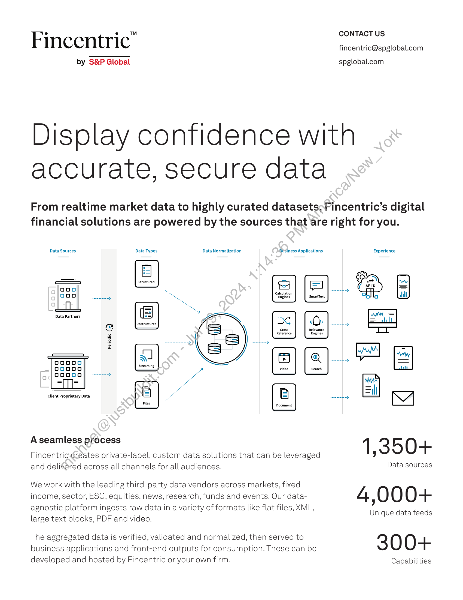
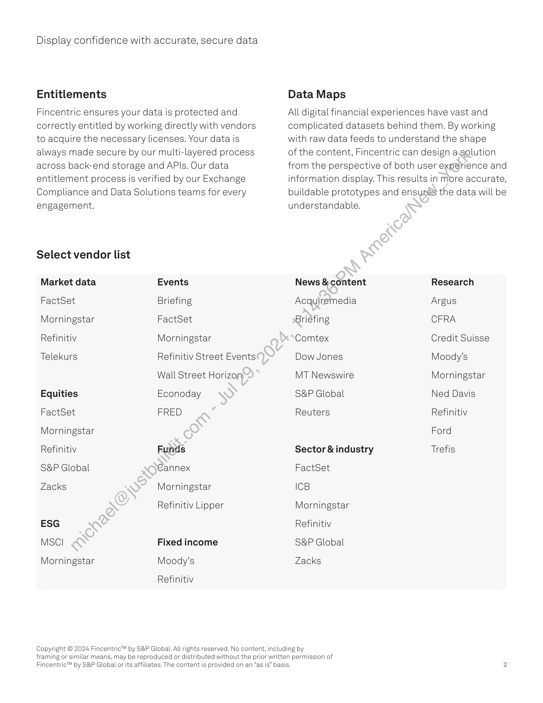

##### Fincentric: Display Confidence with Accurate, Secure Data]

  
````col
```col-md
flexGrow=.5
===
> [!info] [Page 1](_attachments/images_Fincentric_Data_Factsheet.pdf_152954/page_1.png)
> 
```  
```col-md
CONTACT US  
Fincentric" fincentric@spglobal.com  
by S&P Global spglobal.com  
Display confidence with
accurate, secure data  
From realtime market data to highly curated datasets; Fincentric’s digital
financial solutions are powered by the sources that are right for you.  
Data Sources Data Types Data Normalization Business Applications Experience  
Calculation
Engines ‘SmartText  
Data Partners  
Client Proprietary Data A a“ eB  
Files  
Aseamless ptocess 1 ; 3 5 O +  
Fincentric creates private-label, custom data solutions that can be leveraged
and delivered across all channels for all audiences. Data sources  
We work with the leading third-party data vendors across markets, fixed
income, sector, ESG, equities, news, research, funds and events. Our data- 4 ; O O O +
agnostic platform ingests raw data in a variety of formats like flat files, XML,  
; Unique data feeds
large text blocks, PDF and video.  
The aggregated data is verified, validated and normalized, then served to 3 O O +
business applications and front-end outputs for consumption. These can be
developed and hosted by Fincentric or your own firm. Capabilities  
```
````
Notes:    
````col
```col-md
flexGrow=.5
===
> [!info] [Page 2](_attachments/images_Fincentric_Data_Factsheet.pdf_152954/page_2.png)
> 
```  
```col-md
Display confidence with accurate, secure data  
Entitlements  
Fincentric ensures your data is protected and
correctly entitled by working directly with vendors
to acquire the necessary licenses. Your data is
always made secure by our multi-layered process
across back-end storage and APIs. Our data
entitlement process is verified by our Exchange
Compliance and Data Solutions teams for every
engagement.  
Select vendor list  
Data Maps  
All digital financial experiences have vast and
complicated datasets behind them. By working
with raw data feeds to understand the shape  
of the content, Fincentric can design a.solution
from the perspective of both user experience and
information display. This results in more accurate,
buildable prototypes and ensures the data will be
understandable.  
Market data Events
FactSet Briefing
Morningstar FactSet  
Refinitiv Morningstar
Telekurs Refinitiv Street Events
Wall Street Horizon
Equities Econoday
FactSet FRED
Morningstar
Refinitiv Funds
S&P Global €annex
Zacks Morningstar
Refinitiv Lipper
ESG
MSCl Fixed income
Morningstar Moody's
Refinitiv  
Copyright © 2024 Fincentric™ by S&P Global. All  
News & content Research
Acquiremedia Argus
Briéfing CFRA
Comtex Credit Suisse
Dow Jones Moody’s  
MT Newswire  
Morningstar  
S&P Global Ned Davis  
Reuters Refinitiv
Ford  
Sector &industry Trefis  
FactSet  
ICB  
Morningstar
Refinitiv
S&P Global
Zacks  
lrights reserved. No content, including by  
framing or similar means, may be reproduced or distributed without the prior written permission of
Fincentric™ by S&P Global or its affiliates. The content is provided on an “as is” basis.  
```
````
Notes:  


![[_attachments/1.2.1.5 Fincentric_Data_Factsheet.pdf]