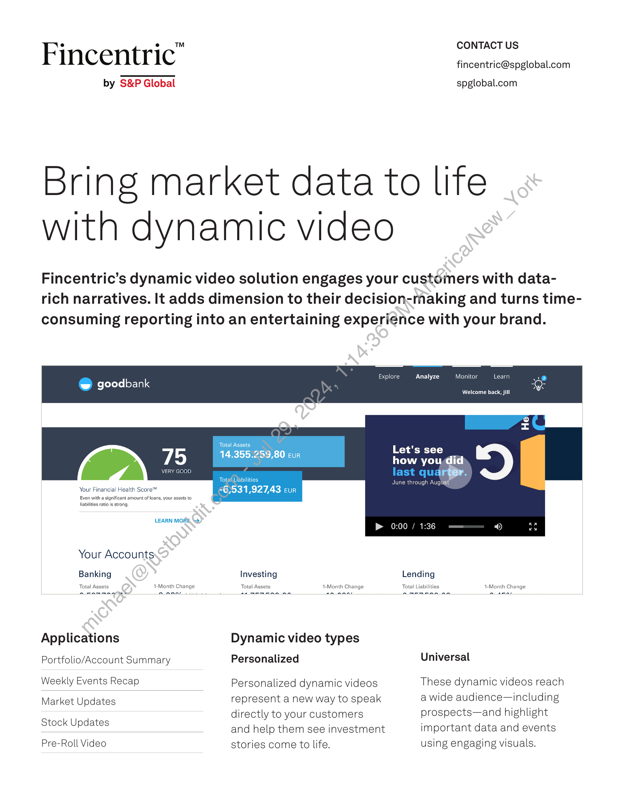

##### Fincentric™ Dynamic Video Solution]

  
````col
```col-md
flexGrow=.5
===
> [!info] [Page 1](_attachments/images_Fincentric_Dynamic_Video_Factsheet.pdf_152941/page_1.png)
> 
```  
```col-md
Fincentric"  
by S&P Global  
CONTACT US
fincentric@spglobal.com  
spglobal.com  
Bring market data to life  
with dynamic video  
Fincentric’s dynamic video solution engages your customers with datarich narratives. It adds dimension to their decision-making and turns timeconsuming reporting into an entertaining experience with your brand.  
@ goodbank  
Explore  
Analyze = Monitor ~—_—_Learn  
Welcome back, jill  
75  
VERY GOOD  
Your Financial Health Score™
Even with a significant amount of loans, your assets to
liabilities ratio is strong.  
LEARN MORE “>.  
Your Accounts  
Banking  
Total Assets 1-Month Change  
Applications
Portfolio/Account Summary
Weekly Events Recap
Market Updates  
Stock Updates  
Pre-Roll Video  
Total Assets  
14.355.259,80 eur  
Total Liabilities  
=6,531,927,43 eur  
Let's see
how youdid  
June through August  
& 0:00 / 1:36  
Investing  
Total Assets 1-Month Change  
Dynamic video types  
Personalized  
Personalized dynamic videos
represent a new way to speak
directly to your customers  
and help them see investment
stories come to life.  
Total Liabilities  
Lending  
1-Month Change  
Universal  
These dynamic videos reach
a wide audience—including
prospects—and highlight
important data and events
using engaging visuals.  
```
````
Notes:    
````col
```col-md
flexGrow=.5
===
> [!info] [Page 2](_attachments/images_Fincentric_Dynamic_Video_Factsheet.pdf_152941/page_2.png)
> 
```  
```col-md
Bring market data to life with dynamic video  
The market was  
Up 5.51%  
last quarter  
Most major indices finished Q1 up
4% or more.  
The S&P 500 finished the quarter below its 50 day
simple moving average.  
The market took a slight downturn at the beginning of August.  
Is8P500 50 Day SMA  
Mid-Week Top 5 Bullish Stocks  
FAAS  
Hasbro Inc  
Today's Change  
+],.47%  
Copyright © 2024 Fincentric™ by S&P Global. All rights reserved. No content, including by  
framing or similar means, may be reproduced or distributed without the prior written permission of  
Fincentric™ by S&P Global or its affiliates. The content is provided on an “as is” basis.  
Dynamic video example  
Generate fresh market update
videos throughout the day based
on the latest market data and
automatically post themto your
social media accountsor Markets
Overview page.  
A Market Summary dynamic
video walks\your customers
throughthe global market day.
The-mmajor indices would be
highlighted, as well as the three
(3) most important market-driving
news stories. The video would  
be updated four (4) times each
day to capture the most recent
market activity.  
Specifications
Video type: Universal
Estimated Video Length: 40 seconds  
Number of Videos Generated Each
Run:1  
Generation Frequency per Run: 4
time(s) per day, during market hours  
Generation Window per Run: 1 hour(s)  
```
````
Notes:  


![[_attachments/1.2.1.6 Fincentric_Dynamic_Video_Factsheet.pdf]