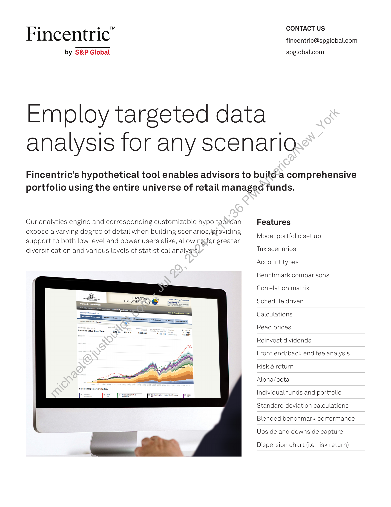
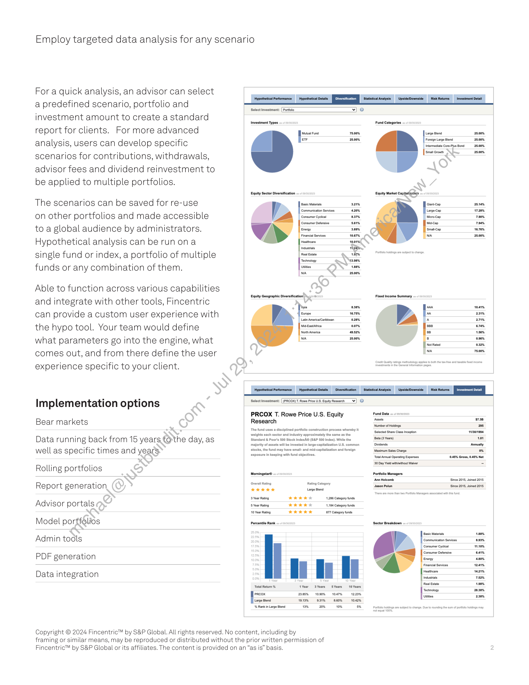

##### Fincentric Hypothetical Portfolio Analysis Tool]

  
````col
```col-md
flexGrow=.5
===
> [!info] [Page 1](_attachments/images_Fincentric_Hypo_Tool_Factsheet.pdf_153008/page_1.png)
> 
```  
```col-md
CONTACT US  
Fincentric" fincentric@spglobal.com  
by S&P Global spglobal.com  
Employ targeted data
analysis for any scenaria  
Fincentric’s hypothetical tool enables advisors to build-a comprehensive
portfolio using the entire universe of retail managed funds.  
Our analytics engine and corresponding customizable hypo toat’can Features
expose a varying degree of detail when building scenarios, eroviding
support to both low level and power users alike, allowing for greater
diversification and various levels of statistical analysis. Tax scenarios  
Model portfolio set up  
Account types  
Benchmark comparisons
Correlation matrix  
HYPOTHETIEN S @ = Schedule driven  
Calculations  
Read prices  
Reinvest dividends  
Front end/back end fee analysis
Risk & return  
Alpha/beta  
ndividual funds and portfolio
Standard deviation calculations
Blended benchmark performance  
Upside and downside capture  
Dispersion chart (i.e. risk return)  
```
````
Notes:    
````col
```col-md
flexGrow=.5
===
> [!info] [Page 2](_attachments/images_Fincentric_Hypo_Tool_Factsheet.pdf_153008/page_2.png)
> 
```  
```col-md
Employ targeted data analysis for any scenario  
For a quick analysis, an advisor can select
a predefined scenario, portfolio and
investment amount to create a standard
report for clients. For more advanced
analysis, users can develop specific
scenarios for contributions, withdrawals,
advisor fees and dividend reinvestment to
be applied to multiple portfolios.  
The scenarios can be saved for re-use  
on other portfolios and made accessible
to a global audience by administrators.
Hypothetical analysis can be runona
single fund or index, a portfolio of multiple
funds or any combination of them.  
Able to function across various capabilities
and integrate with other tools, Fincentric
can provide a custom user experience with
the hypo tool. Your team would define
what parameters go into the engine, what
comes out, and from there define the user
experience specific to your client.  
Implementation options
Bear markets  
Data running back from 15 years forthe day, as
well as specific times and years  
Rolling portfolios
Report generation
Advisor portals )
Model | portiglibs
Admin tools  
PDF generation  
Data integration  
Hypothetical Performance Hypothetical Details  
Select vesinent °
Investment Types
oe 200%  
Equity Sector Diversification  
Basle Materials 321%
Communication Services 420%
sumer eam  
Tecnology \Nv3.98%
nities 1.80%  
NA 25.00%  
Equity Geographic Diversification ipo  
20%
f- rope 16.75%
Latin Amerca/Carbbean 028%
Mid-Easvateca orm
North America 4952%
NA 25.00%  
‘Statistical Analysis Upside/Downside Risk Returns __ Investment Detall  
Fund Categories
Large Blond 25.00%  
Foreign Large Blend 25.00%  
IntrmediatoCore-Plus Bond 28.00%  
D Small Growth 25.00%  
Equity Market Capitalization
ia-cap 25.10%
Lange-Cap 720%
Microcap 70%  
Mis-cap 798%
‘Smal-Cap 1876%
NA 25.00%  
F ss  
858 orem,
86 150%
8 0.96%
Not Rates 03%
NA 75.00%  
Hypothetical Performance Hypothetical Detals Diversification Statistical Analysis Upside-Downside Rsk Returns  
Select Investment: [ (PRCOX) T. Rowe Price US. Equity Research ¥| QO  
PRCOX T. Rowe Price U.S. Equity
Research  
‘The fund uses a disciplined portfolio construction process whereby it
‘weights each sector and industry approximately the same as the
Standard & Poor's 500 St JoxA® (SAP 500 Index). While the
majority of assets will be invested in large-capitalization U.S. common
stocks, the fund may has |-and mid-capitalization and foreign
‘exposure in keeping with fund objectives.  
Morningstar®  
‘Overall Rating Rating Category  
wake Large Blend  
3 Year Rating Sohoiotel 1.286 Category funds  
5 Year Rating wk 1.184 Category funds  
10 Year Rating kk kt 87 Category funds  
Percentile Rank
Total Return % Year Years Sears 10 Years
PRCOX 2306% 10.90% 1047 12.29%
Large Blend 19.19% 931% — Beo% 10.42%
“4 Rank in Large Blond 13% 2% OH. om  
Copyright © 2024 Fincentric™ by S&P Global. All rights reserved. No content, including by
framing or similar means, may be reproduced or distributed without the prior written permission of
Fincentric™ by S&P Global or its affiliates. The content is provided on an “as is” basis.  
Fund Data »  
Assets $738
Number of Hoisngs 2s
Selected Share Clas Inception ‘10/1904
‘Bota (3 Years) 101
Dividends ‘Annually
Maximum Sales Charge o%
“otal Annual Operating Expenses 0.45% Gross, 0.45% Net
{30 Day eld witout Waiver =
Portfolio Managers  
‘Ann Holcomb ‘Since 2015, Joined 2015,
Jason Polun Since 2015, Joined 2015,  
6 Energy 420%
Financial Sevicos sam
Hoaticare 421%  
Industiats 782%
Real Estat 1.90%
‘Tectnology 238%
tities 230%  
Due to rounding he sian of prtote hoksngs may  
```
````
Notes:  


![[_attachments/1.2.1.7 Fincentric_Hypo_Tool_Factsheet.pdf]