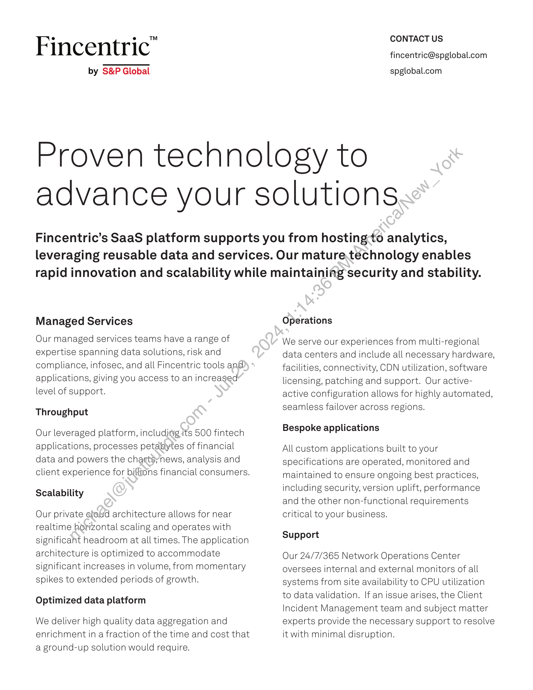

##### Fincentric: Proven Technology to Advance Your Solutions]

  
````col
```col-md
flexGrow=.5
===
> [!info] [Page 1](_attachments/images_Fincentric_Managed_Services_Factsheet.pdf_152944/page_1.png)
> 
```  
```col-md
Fincentric"  
by S&P Globa  
l  
CONTACT US
fincentric@spglobal.com  
spglobal.com  
Proven technology to
advance your solutions  
Fincentric’s SaaS platform supports you from hosting:to analytics,
leveraging reusable data and services. Our mature.technology enables
rapid innovation and scalability while maintaining security and stability.  
Managed Services  
Our managed services teams have a range of  
expertise spanning data s  
olutions, risk and  
compliance, infosec, and all Fincentric tools and
applications, giving you access to an increased  
level of support.
Throughput  
Our leveraged platform, in  
cludirig its 500 fintech  
applications, processes petalsytes of financial  
data and powers the char
client experience for biltio  
Scalability  
Our private efeud architec  
tSynews, analysis and
ns financial consumers.  
ture allows for near  
realtime horizontal scaling and operates with  
significant headroom ata
architecture is optimized  
significant increases in vo
spikes to extended period  
Optimized data platform  
We deliver high quality da
enrichment in a fraction o
a ground-up solution wou  
(times. The application
‘0 accommodate  
lume, from momentary
s of growth.  
a aggregation and
f the time and cost that
d require.  
Operations  
We serve our experiences from multi-regional
data centers and include all necessary hardware,
facilities, connectivity, CDN utilization, software
licensing, patching and support. Our activeactive configuration allows for highly automated,
seamless failover across regions.  
Bespoke applications  
All custom applications built to your
specifications are operated, monitored and
maintained to ensure ongoing best practices,
including security, version uplift, performance
and the other non-functional requirements
critical to your business.  
Support  
Our 24/7/3265 Network Operations Center
oversees internal and external monitors of all
systems from site availability to CPU utilization
to data validation. If an issue arises, the Client
Incident Management team and subject matter
experts provide the necessary support to resolve
it with minimal disruption.  
```
````
Notes:  


![[_attachments/1.2.1.8 Fincentric_Managed_Services_Factsheet.pdf]