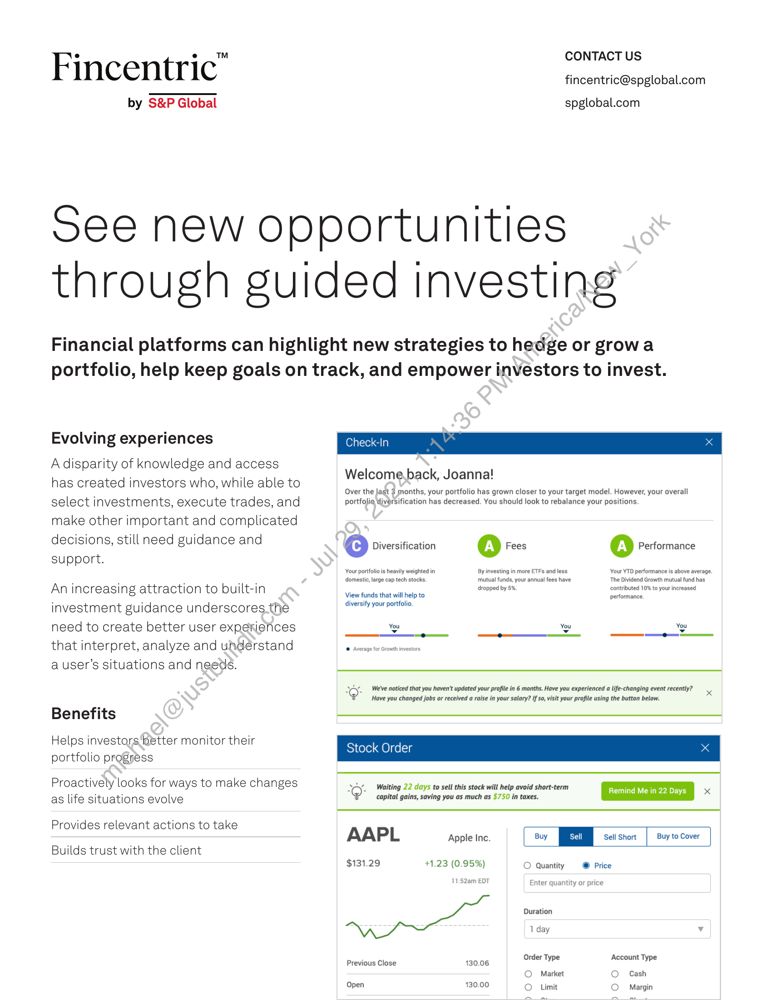
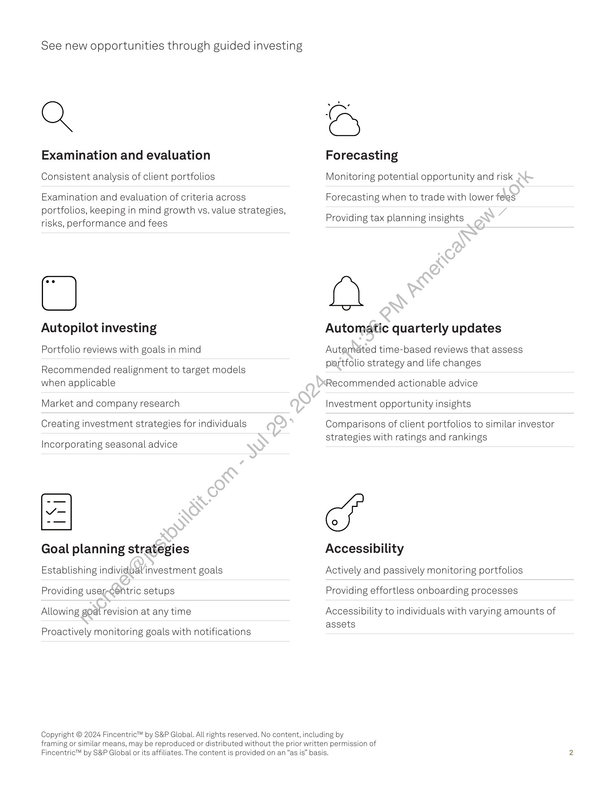

##### Fincentric™: See New Opportunities Through Guided Investing]

  
````col
```col-md
flexGrow=.5
===
> [!info] [Page 1](_attachments/images_Fincentric_Guided_Investing_Factsheet.pdf_153014/page_1.png)
> 
```  
```col-md
Fincentric’  
by S&P Global  
CONTACT US
fincentric@spglobal.com  
spglobal.com  
See new opportunities
through guided investing  
Financial platforms can highlight new strategies to hedge or growa
portfolio, help keep goals on track, and empower investors to invest.  
Evolving experiences  
A disparity of knowledge and access
has created investors who, while able to
select investments, execute trades, and
make other important and complicated
decisions, still need guidance and
support.  
An increasing attraction to built-in
investment guidance underscores the
need to create better user experiences
that interpret, analyze and uhdérstand
a user’s situations and needs.  
Benefits  
Helps investors better monitor their
portfolio progress  
Proactively looks for ways to make changes
as life situations evolve  
Provides relevant actions to take  
Builds trust with the client  
Check-In x  
Welcome,back, Joanna!  
Over the Jast 3 months, your portfolio has grown closer to your target model. However, your overall
portfojia diversification has decreased. You should look to rebalance your positions.  
Cc) Diversification A) Fees A) Performance  
Your portfolio is heavily weighted in By investing in more ETFs and less Your YTD performance is above average.
domestic, large cap tech stocks. mutual funds, your annual fees have The Dividend Growth mutual fund has  
dropped by 5%. contributed 10% to your increased
View funds that will help to performance  
diversify your portfolio.  
You You You
——_-~.—_—_ ————— ge  
© Average for Growth investors  
O- We've noticed that you haven't updated your profile in 6 months. Have you experienced a life-changing event recently? x
¥ Have you changed jobs or received a raise in your salary? If so, visit your profile using the button below.
Sto der x  
Waiting 22 days to sell this stock will help avoid short-term Remind Me in 22 Days [an
capital gains, saving you as much as $750 in taxes.  
AAPL Apple Inc. | Buy Sell Short Buy to Cover |  
$131.29 +1.23 (0.95%) O Quantity @ Price
11:52am EDT Enter quantity or price
Duration
1 day v
Previous Close 130.06 Order Type Account Type
O Market O Cash  
Open 130.00 O Limit O. Margin  
```
````
Notes:    
````col
```col-md
flexGrow=.5
===
> [!info] [Page 2](_attachments/images_Fincentric_Guided_Investing_Factsheet.pdf_153014/page_2.png)
> 
```  
```col-md
See new opportunities through guided investing  
Q  
Examination and evaluation
Consistent analysis of client portfolios  
Examination and evaluation of criteria across  
portfolios, keeping in mind growth vs. value strategies,  
risks, performance and fees  
C  
Autopilot investing
Portfolio reviews with goals in mind  
Recommended realignment to target models
when applicable  
Market and company research  
Creating investment strategies for individuals  
Incorporating seasonal advice  
Goal planning strategies
Establishing individualinvestment goals
Providing user-centric setups  
Allowing goat revision at any time  
Proactively monitoring goals with notifications  
Forecasting
Monitoring potential opportunity and risk  
Forecasting when to trade with lower fees  
Providing tax planning insights  
a  
Automatic quarterly updates  
Autamated time-based reviews that assess
portfolio strategy and life changes  
Recommended actionable advice
Investment opportunity insights  
Comparisons of client portfolios to similar investor
strategies with ratings and rankings  
Accessibility
Actively and passively monitoring portfolios
Providing effortless onboarding processes  
Accessibility to individuals with varying amounts of
assets  
Copyright © 2024 Fincentric™ by S&P Global. All rights reserved. No content, including by
framing or similar means, may be reproduced or distributed without the prior written permission of
Fincentric™ by S&P Global or its affiliates. The content is provided on an “as is” basis.  
```
````
Notes:  


![[_attachments/1.2.1.9 Fincentric_Guided_Investing_Factsheet.pdf]